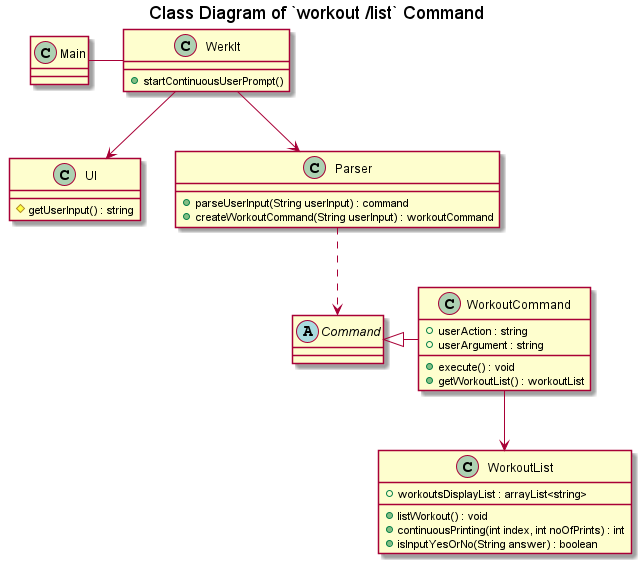
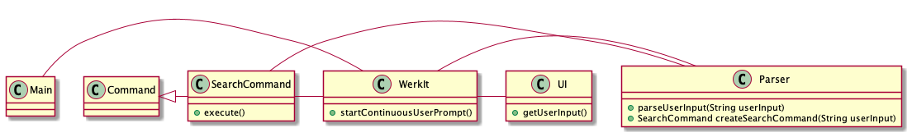

# WerkIt! Developer Guide

## Table of Contents
* [Acknowledgements](#acknowledgements)
* [Design](#design)
* [Implementation](#implementation)
* [Product Scope](#product-scope)
* [User Stories](#user-stories)
* [Non-Functional Requirements](#non-functional-requirements)
* [Glossary](#glossary)
* [Instructions for Manual Testing](#instructions-for-manual-testing)

## Acknowledgements
The following websites and codebases were referenced and adapted for our project:

* AddressBook-Level2 project ([Website](https://se-education.org/addressbook-level2/) | 
[GitHub](https://github.com/se-edu/addressbook-level2))
* Team Member Alan Low's individual project (iP) codebase ([GitHub](https://github.com/alanlowzies/ip))

## Setting Up your Development Environment
### Requirements
- [X] Java JDK version 11
- [X] An IDE of your choice, though IntelliJ IDEA is recommended as this project is developed
with this IDE.

> Note: IDE-related references in this developer guide IDE will be tailored for IntelliJ IDEA. 

### Setting Up
1. Fork the [WerkIt! GitHub repository](https://github.com/AY2122S2-CS2113T-T09-2/tp).
2. Clone your fork to your machine.
3. Set up your local repo in your IDE.
    - Ensure that the project in your IDE is configured to run on Java JDK version 11. 
    - A guide on setting your project to use JDK 11 in your IntelliJ IDEA IDE can be found 
[here](https://www.jetbrains.com/help/idea/sdk.html#set-up-jdk).
4. Run `Main.java`. If you have set up your environment correctly, you should see the following
output in your terminal: 
```
======================================================================
 __        __        _    ___ _   _ 
 \ \      / /__ _ __| | _|_ _| |_| |
  \ \ /\ / / _ \ '__| |/ /| || __| |
   \ V  V /  __/ |  |   < | || |_|_|
    \_/\_/ \___|_|  |_|\_\___|\__(_)
                                    
Welcome to WerkIt!, your personal exercise planner.
----------------------------------------------------------------------
Checking for required directory and files...
- The required data directory was not found. It will be created.
- The WerkIt! resource directory has been created in
  your terminal's current working directory.

- The exercise file was not found. It will be created.
- The exercise file 'exercises.txt' has been created in
  the WerkIt! resource directory.

- The workout file was not found. It will be created.
- The workout file 'workouts.txt' has been created in
  the WerkIt! resource directory.

- The plan file was not found. It will be created.
- The plan file 'plans.txt' has been created in
  the WerkIt! resource directory.

- The schedule file was not found. It will be created.
- The schedule file 'schedule.txt' has been
  created in the WerkIt! resource directory.

Loading saved file data...
- Exercises file	OK!
----------------------------------------------------------------------
Now then, what can I do for you today?
(Need help? Type 'help' for a guide!)
----------------------------------------------------------------------
>
```
5. Type `exit` to exit the program.

You are now ready to begin developing!

## Design 
### Overview

---

## Implementation
### Overview
* [Getting User Input Continuously](#getting-user-input-continuously)
* [Parsing User Input and Getting the Right Command](#parsing-user-input-and-getting-the-right-command)
* [Create New Workout](#create-new-workout)
* [Search](#search)
  * [Search for Exercise](#search-for-exercise)
  * [Search for Plan](#search-for-plan)

### Getting User Input Continuously
Once `WerkIt` has finished loading any saved file data on the user's system, it will call 
`WerkIt#startContinuousUserPrompt()`. This method will call on `UI#printUserInputPrompt()` to print a prompt message
to the terminal and `UI#getUserInput()` to wait and capture the user's input. The input will be captured with the aid 
of Java's built-in `Scanner` class.

Once the user has entered an input, `UI#getUserInput()` trims any preceding and trailing whitespaces before returning 
the user's input as a `String` object to `WerkIt#startContinuousUserPrompt()`. Then, 
`WerkIt#startContinuousUserPrompt()` calls `Parser#parseUserInput()` to parse the user's input and create a
an object that is a subclass of the `Command` class. If there is no issue with the formatting of the user's input,
this subclass-of-`Command` object is returned to `WerkIt#startContinuousUserPrompt()`.

> A detailed implementation of the parsing and creation of subclass-of-`Command` object process can be found in
'[Parsing User Input and Getting the Right Command](#parsing-user-input-and-getting-the-right-command)'.

Next, `WerkIt#startContinuousUserPrompt()` calls on the `execute()` method of the subclass-of-`Command` object to
perform the user's requested action. If the execution goes smoothly, this completes the user's inputted command.
This process is repeated until the user enters `exit`, which will terminate the loop, call `UI#printGoodbye()` to
print a goodbye message to the user, before handing control back to `Main#main` to end the program.

#### Design Considerations
* `WerkIt#startContinuousUserPompt()` has a boolean flag `isFirstPrompt`. This flag allows WerkIt to
print a different prompt each time the application starts up, before defaulting to a different prompt message
for subsequent prompts.
   * When the user starts the application, `isFirstPrompt` is set to `true` and thus, the prompt will be
  ```
  ----------------------------------------------------------------------
  Now then, what can I do for you today?
  (Need help? Type 'help' for a guide!)
  ----------------------------------------------------------------------
  >
  ```
  * Subsequent prompts in that app's session will be
  ```
  ----------------------------------------------------------------------
  What's next?
  ----------------------------------------------------------------------
  >
  ```

### Parsing User Input and Getting the Right Command
**_TODO_**: Explain how the app parses user input and determines which `Command` subclass object to instantiate.

### Create New Workout

In _WerkIt!_, a workout is defined as an exercise paired with a number that represents the number
of repetitions. For example, 20 repetitions of the Russian twist is considered a workout. 

### List Workout

</br>

When WerkIt is running, the `WerkIt` class will keep prompting the user to enter command through the
`WerkIt#startContinuousUserPrompt()` method. After the user has entered command, The `UI#getUserInput()` method in `UI`
class will catch the user input, and it will be sent to `Parser#parseUserInput(String userInput)` method to analyse the
user's command. If the user's command type is to list the workouts created, i.e. `workout /list`, the
`Parser#parseUserInput(String userInput)` method will parse the 'workout' base word and proceed to create workout related
command using `Parser#createWorkoutCommand(String userInput)` method. This method will further evaluate the
workout action, in this case, `/list` and call the constructor of `WorkoutCommand` class by passing relevant parameters related to the
WorkoutCommand constructor. If the workout action is null or incorrect, an InvalidCommandException will be thrown. Once the workout command is created,
this workout command is executed via the `WorkoutCommand#execute()` method. As it is executed, the method will check the 
type of action to be executed, in this case, list. It will then list the workouts created and stored in the workoutList using the `WorkoutList#listWorkout()` 
method which will call `WorkoutList#continuousPrinting(int index, int noOfPrints)` method to determine 
the number of workouts to be printed. The maximum number of workouts to be displayed at a time is 10 workouts. If there are more than 
10 workouts stored in the workoutList, it will prompt the user to enter 'yes' or 'no' to determine the continuation of the printings.
`isInputYesOrNo(String answer)` method is executed when user enter the answer for the continuation of printing. 
If the answer given by the user is neither 'yes' nor 'no', user will be prompt to enter their option again until they give the expected input. 
When 'yes' is entered, the printing will continue and `WorkoutList#continuousPrinting(int index, int noOfPrints)` method will be executed again.
Otherwise, `WorkoutList#listWorkout()` method will be terminated.

### Search

<br>

When WerkIt is running, the `WerkIt` class will keep prompting the user to enter command through the
`WerkIt#startContinuousUserPrompt()` method. After the user has entered command, The `UI#getUserInput()` method in `UI`
class will catch the user input, and it will be sent to `Parser#parseUserInput(String userInput)` method to analyse the
user's command. If the user's command type is search, i.e. `search <userAction> <keywords>`, the
`Parser#parseUserInput(String userInput)` method will parse the 'search' base word and proceed to create search related
command using `Parser#createSearchCommand(String userInput)` method. This method will further evaluate the
`<userAction>` and call the constructor of `SearchCommand` class by passing relevant parameters related to search to the
constructor. If the `<userAction>` is null or incorrect, an InvalidCommandException will be thrown. If the `<keywords>`
is not specified, an InvalidCommandException will be thrown.

#### Search for exercise
Format: `search /exercise <keywords>`

The `Parser#createSearchCommand(String userInput)` method will further evaluate the user input
`/exercise` and call the constructor of `SearchCommand` class by passing relevant parameters related to search exercise
to the constructor. The created `SearchCommand` object is returned by the `Parser#createSearchCommand(String userInput)`
method to `Parser#parseUserInput(String userInput)` method, and finally returned by
`Parser#parseUserInput(String userInput)` method to `WerkIt#startContinuousUserPrompt()` method. The search command will
be executed in `WerkIt#startContinuousUserPrompt()`. And based on the `<keywords>` specified by the user, the output
will either be a list of matching exercises or 'Sorry, no matching exercise found' if the user has entered the command
correctly.

#### Search for plan
Format: `search /plan <keywords>`

The `Parser#createSearchCommand(String userInput)` method will further evaluate the user input
`/plan` and call the constructor of `SearchCommand` class by passing relevant parameters to the constructor.
The created `SearchCommand` object is returned by the `Parser#createSearchCommand(String userInput)`
method to `Parser#parseUserInput(String userInput)` method, and finally returned by
`Parser#parseUserInput(String userInput)` method to `WerkIt#startContinuousUserPrompt()` method. The search command will
be executed in `WerkIt#startContinuousUserPrompt()`. And based on the `<keywords>` specified by the user, the output
will either be a list of matching names of plan or 'Sorry, no matching plan found' if the user has entered the command
correctly.

---

## Product Scope
### Target User Profile

{Describe the target user profile}

### Value Proposition

{Describe the value proposition: what problem does it solve?}

## User Stories

|Version| As a ... | I want to ... | So that I can ...|
|--------|----------|---------------|------------------|
| v1.0 | user | create a workout | keep track of how many repetitions I would like to do with an exercise |

## Non-Functional Requirements

{Give non-functional requirements}

## Glossary

* **Exercise** - A single 'unit' of exercise. A type of exercise.
    * e.g. push up, jumping jacks, sit-ups
* **Workout** - A single 'unit' of exercise with a number of repetitions associated with it.
    * e.g. push up (5 reps), jumping jacks (2 reps), sit-ups (7 reps)
* **Plan** - A set of workouts
    * Example:

  | Plan Name | Contains |
  | --- | --- |
  | Grow my Biceps | Barbell curls (3 reps), push ups (10 reps), deadlift (2 reps) |
  | Whole Body! | Crunches (10 reps), jumping jack (3 reps), lift ups (4 reps), pull ups (3 reps), planking (2 reps), leg cycle (2 reps)

* **Schedule** - Consists of Days 1 to 7. Users will add or modify a plan to that particular day
of their schedule. For instance, the user's daily schedule can look like this:

  | Day | Plan Name      |
  |----------------|---------------- |
  | Day 1 | Grow my Biceps |
  | Day 2 | Rest Day       |
  | Day 3 | Whole Body!    |
  | Day 4 | Leg Day        |
  | Day 5 | Grow my Biceps |
  | Day 6 | Whole Body!    |
  | Day 7 | Rest Day       |


## Instructions for manual testing

{Give instructions on how to do a manual product testing e.g., how to load sample data to be used for testing}