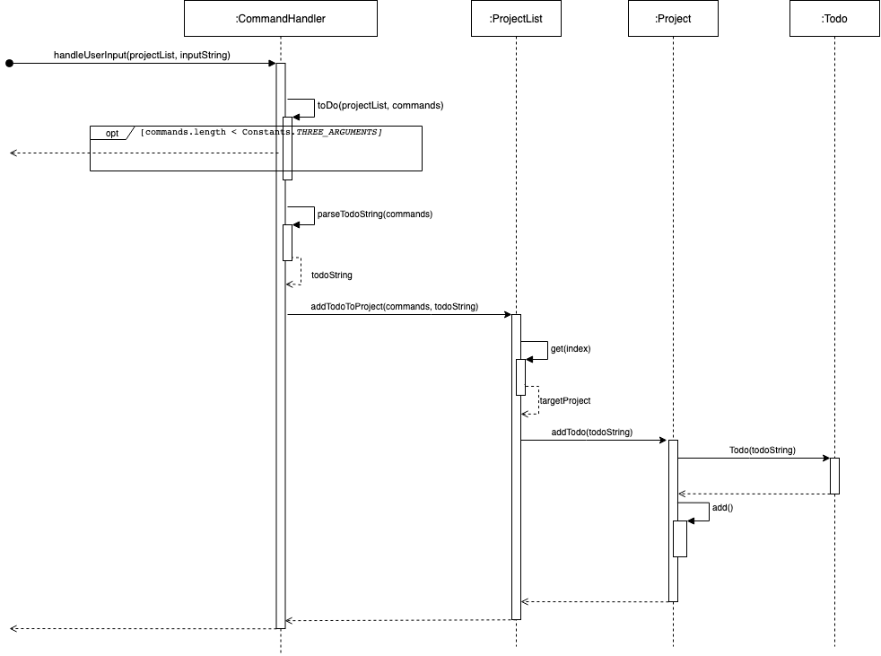
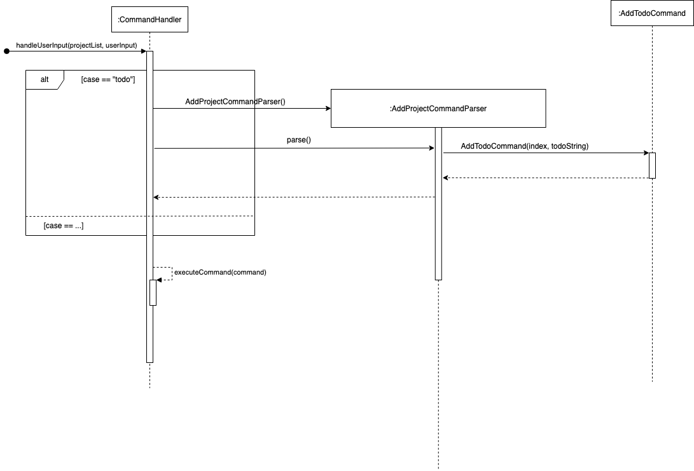

# Developer Guide

## Acknowledgements

{list here sources of all reused/adapted ideas, code, documentation, and third-party libraries -- include links to the original source as well}

## Design & implementation

### Implemented Features

#### Todo feature
  

**Step1.** When `CommandHandler` receives a user input starting with string “todo”, it will call `toDo()` function to parse the user input into the index of the target `Project` object and one description string.  

**Step2.** If the number of provided arguments is less than the required number, the `toDo()` function will throw an `IllegalCommand` exception and return.  

**Step3.** If no exception is thrown, two strings will be generated by parsing the user input and the `toDo()` function will pass the two arguments to `projectList` for creating and adding a `Todo` object to a `Project` object.  

**Step4.** When `projectList` receives the call, it will get the target `Project` object and pass the description string to it.  

**Step5.** The `Project` object will create a `Todo` object and add it to the `ArrayList<Todo>` in `Project` class.  

### Proposed Features

#### Parse Command Feature
  

The proposed parse command feature makes use of CommandParser and its subclasses, and Command and its subclasses.  
In the version 1.0 we simply used CommandHandler to parse user input for different commands, which may lead to violation of single responsibility principle. The proposed implementation will implement one command parser for each command (e.g. AddProjectCommand will have a paser named AddProjectCommandParser).  

Given below is an example usage scenario and how the command parser behaves at each step.

**Step 1.** The user inputs command. The command is retrieved by `handleUserInput()` in `CommandHandler`.  

**Step 2.** `handleUserInput()` will check command type and create a new `CommandParser` object and call `parse()` in `CommandParser`.  

**Step 3.** `CommandParser` will check if the input can be parsed into a valid command. If it fails, it will throw exceptions. After parsing the user’s input, `CommandParser` will create a new `Command` object and return it back to `CommandHandler`.  

**Step 4.** `CommandHandler` will call `executeCommand()` in its own class to execute the returned command.

## Product scope
### Target user profile

{Describe the target user profile}

### Value proposition

CSProjPlanner provides a project management and scheduling system geared toward Computer Science students and utilises a text UI interface. 
While providing CS students a convenient way to keep track and store all relevant information, links, and deadlines for their projects, 
the program also allows for faster searching and editing than a GUI design once the user is familiar with the commands—a concept CS students are far too familiar with.

## User Stories

| Version | As a ...                    | I want to ...                                             | So that I can ...                                                                 |
|---------|-----------------------------|-----------------------------------------------------------|-----------------------------------------------------------------------------------|
| v1.0    | new or experienced user     | add a task to the planner                                 | better organize my project                                                        |
| v1.0    | user with existing projects | delete a project from the planner                         | remove projects that are already completed                                        |
| v1.0    | user with existing projects | add a to-do to a project                                  | get a clear outline of what needs to be done                                      |
| v1.0    | student user                | add  a deadline for my project                            | keep track of due dates                                                           | 
| v1.0    | student user                | view the details (to-do list and deadlines) of my project | see what needs to be done and when to do it                                       |
| v1.0    | student user                | mark a to-do as done                                      | keep track of already completed tasks                                             |
| v1.0    | student user                | mark a to-do as not done                                  | fix mistakes of marking unfinished tasks                                          |
| v1.0    | new user                    | access a help command                                     | familiarize myself with using the planner                                         |
| v1.0    | student user                | exit the application                                      | close my planner when I am finished                                               |
| ------  |                             |                                                           |                                                                                   |
| v2.0    | student user                | add any web links/URLs                                    | keep track of relevant resources online                                           |
| v2.0    | student user                | have quick access to my project's Github repo             | best keep track of my project lifecycle                                           |
| v2.0    | student user                | list the programming languages/frameworks my project uses | know what languages/frameworks focus on and study                                 |
| v2.0    | student user                | check what needs to be done within 24 hours               | focus on the most time-sensitive tasks                                            |
| v2.0    | user with group projects    | assign tasks to members in a group                        | keep track of who is responsible for which part of the project                    |
| v2.0    | user with group projects    | add members to a project                                  | remember who my group members are                                                 |
| v2.0    | student user                | add a deadline to a to-do                                 | know the deadlines for each individual to-do                                      |
| v2.0    | student user                | view my to-dos in order of due date                       | so that I know what I may need to work on first                                   |
| v2.0    | student user                | save my project information in a file                     | keep a backup and also save my projects/schedules for the next time I use the app |

## Non-Functional Requirements

1. Should work on any mainstream OS as long as it has Java 11 or above installed.
2. user with above average typing speed for regular English text (i.e. not code, not system admin commands) should be able to accomplish most of the tasks faster using commands than using the mouse.

## Glossary

* *glossary item* - Definition

## Instructions for manual testing

{Give instructions on how to do a manual product testing e.g., how to load sample data to be used for testing}
