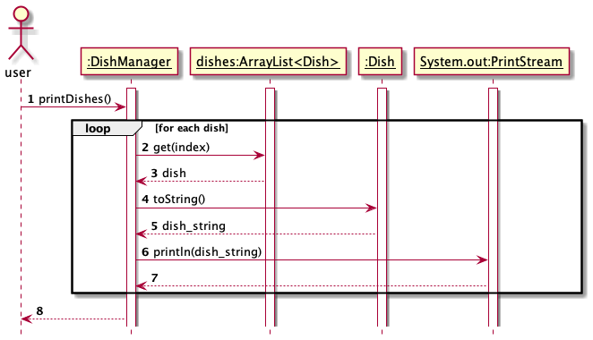

# Developer Guide

## Acknowledgements

{list here sources of all reused/adapted ideas, code, documentation, and third-party libraries -- include links to the original source as well}

## Design & implementation

{Describe the design and implementation of the product. Use UML diagrams and short code snippets where applicable.}
### Menu (dishes) Management

The management of menu is functioned by `DishManager`, which implements following methods:

- `void printDishes()` -- print all dishes and their menu index in current menu.
- `void addDish(Dish dish)` -- add a new dish.
- `void deleteDish(int menuIndex)` -- delete a dish using its menu index.
- `void setPrice(int menuIndex, double newPrice)` -- change the price of a dish using its menu index.
- `void setName(int menuIndex, String newName)` -- change the name of a dish using its menu index.

These functions are "delegated" to `ArrayLise<Dish>`, which is associated with `DishManager`.

For example, `printDishes()`, iterates through `dishes` and calls `get(int)` method (`setPrice(int, double)`, `setName(int, String)` also call `get(int)`):

`deleteDish(int)` calls `remove(int)`:

`addDish(Dish)` calls `add(Dish)`:

## Product scope
### Target user profile

{Describe the target user profile}

### Value proposition

{Describe the value proposition: what problem does it solve?}

## User Stories

|Version| As a ... | I want to ... | So that I can ...|
|--------|----------|---------------|------------------|
|v1.0|staff|modify the menu (add, delete, or modify dishes)|keep the menu up to date|
|v2.0|staff|store the menu|refer to the menu anytime|

## Non-Functional Requirements

{Give non-functional requirements}

## Glossary

* *glossary item* - Definition

## Instructions for manual testing

{Give instructions on how to do a manual product testing e.g., how to load sample data to be used for testing}
