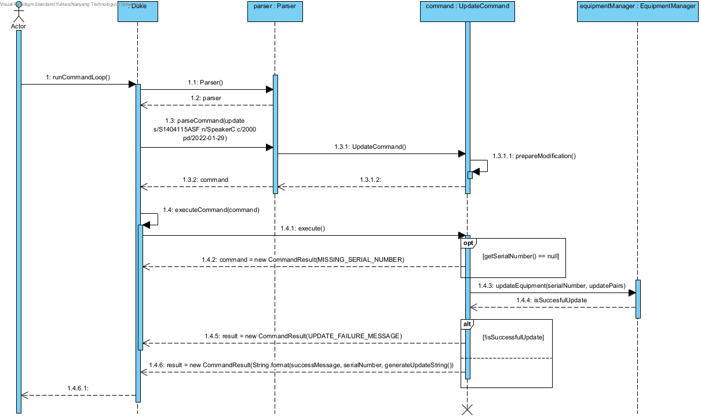

# Table of Content

- [Acknowledgements](#acknowledgements)
- [Design and Implementation](#design-and-implementation)
  - [Architecture](#architecture)
  - [Parser](#parser)
  - [Update feature](#update-feature)
  - [EquipmentManager](#equipmentmanager)
- [Product scope](#product-scope)
  - [Target user profile](#target-user-profile)
  - [Value proposition](#value-proposition)
- [User stories](#user-stories)
- [NonFunctional requirements](#nonfunctional-requirements)
- [Glossary](#glossary)
- [Instructions for manual testing](#instructions-for-manual-testing)

## Acknowledgements

{list here sources of all reused/adapted ideas, code, documentation, and third-party libraries -- include links to the original source as well}

Our project could not have been possible without the prior work of the following:

- [SE-EDU project team](https://se-education.org/docs/team.html) for their work on [AddressBook Level 3](https://github.com/se-edu/addressbook-level3), for which we referenced ideas as well as code snippets.
- Google's [GSON Java library](https://github.com/google/gson) for which we used to load and save our data files.
- Members of the [AY2122S2-CS2113-F10-2 team](https://github.com/nus-cs2113-AY2122S2) for pointing out the possibility of and requesting permission to make use of the above GSON library.  

--------------------------------------------------------------------------------------------------------------------
## **Design and Implementation**

This section describes some noteworthy details on how certain features are designed and implemented.

### Architecture

Our design draws significant inspiration from the implementation of AddressBook Level 3 (henceforth AddressBook). 
As the program was initially conceptualised to be a text-based command-line interface, heavy consideration was given
to the design and user interactions when it came to the text input to be parsed by the user. 
As such, we referenced AddressBook to segment the program into `Parser`, `Command` and `Equipment` classes.

**Main components of the architecture**

- `Duke` is the Main class and entry-point for the program. 
- `Parser` serves as the first filter to split raw text input and pass in arguments to the `Command` for further processing.
- `Command`, together with its various subclasses serve as specific implementations to pass the arguments taken in to the various methods of the `EquipmentManager` class.
- `EquipmentManager` keeps track of actual `Equipment` instances created by our program.
- `Storage` performs File I/O functions.

### Parser

`Parser` is the first filter for text inputs read to the user. 
As alluded to prior, one major consideration was to build it in a manner that can parse text input as effectively as possible. In considering text input, we divided the parsing into the following segments:

<code>commandWord [argumentType/`argumentValue`] [...]</code>

To dispatch <code>argumentType/\`argumentValue\`</code> strings to the correct `Command` class, the following logic is employed throughout `Parser` by `parseCommand`.

**1. Parse the correct Command Word**

`splitCommandTerm` splits the input string upon the first space. 
The first substring is used to decide which `Command` to dispatch while the second is used for its arguments.
In the case where a second substring is not required, as in the case of `help` and `list`, a null String is used.

**2. Split Arguments**

For simpler command words such as `delete` and `check`, only one pair of `argumentType` and <code>\`argumentValue\`</code> are required. 
As such, these will be passed in directly to their `Command` classes without a `argumentType` pair.

More complex command words such as `add` and `update` necessitated multiple arguments.
To implement this while ensuring that multi-word strings are acceptable input, `extractArguments` was implemented. 
Without specifically explaining the main regular expression ([details here](https://regex101.com/r/gwjHWD/3)), the approach sought to match `argumentType` and <code>\`argumentValue\`</code> pairs with a positive lookahead.
The final argument pair will then be extracted using a separate regex. 
Together, this ensured that all argument pairs can be effectively parsed and dispatched to each `Command` class.

Throughout the `Parser` implementation, exceptions were used to return `IncorrectCommand` classes that can be used to pass error messages to the user. These will be discussed in the following segments.

### Update feature

#### Current Design and Implementation

The update feature is facilitated by `UpdateCommand`. It extends `ModificationCommand` and implements the following operations:

* `UpdateCommand#generateUpdatePairs()` — Generates pairs of attributes and their update values.
* `VersionedAddressBook#generateUpdateString()` — Generates sString with details of the update executed.

Given below is an example usage scenario and how the update feature behaves at each step.

Step 1. The user adds an equipment to the system with the help of the `add` command. The added equipment has the following attributes shown below.

Step 2. The user executes `update s/S1404115ASF n/SpeakerC c/2000 pd/2022-01-29` to update equipment with serial number S1404115ASF. `Parser#parseCommand` is called from `Duke` to parse the user's input.

Step 3. The parser recognises that an `UpdateCommand` is required, and the UpdateCommand is prepared to return to `Duke`. In the constructor of `UpdateCommand`, `prepareModification` is called to set the values of the attributes to be updated. The other attributes are set to null by default.

Step 4. `UpdateCommand#execute` is run to process the update. If the serialNumber attribute is null, a `CommandResult` with a `MISSING_SERIAL_NUMBER` output string will be returned. Otherwise, `EquipmentManager#updateEquipment` is called.

Step 5. If the update was successful, a `CommandResult` with success message will be returned, else a `CommandResult` with `UPDATE_FAILURE_MESSAGE` will be returned. Upon successful update, the object should be updated with the new attributes as shown in the diagram below.

The *Sequence Diagram* below shows how the objects/classes interact with each other in the case of an update command being issued by the user.

Step 6. It is not shown in the sequence diagram but ultimately when the CommandResult is returned to `Duke`, the output of the `CommandResult` gets printed out and displayed to the user.

### EquipmentManager

The `EquipmentManager`, as the name suggests, manages all the equipment that the user has.
When initialised, it creates a HashMap called `equipmentList` which is used to save the equipment with their serial numbers as their keys.
The `EquipmentManager` has several methods which allow manipulation to said HashMap such as `addEquipment`, `checkEquipment`, `listEquipment`, `updateEquipment`, and `deleteEquipment`.
These methods are used during the execution of each of the `Command` class.
* `addEquipment` — Adds an `Equipment` to the `equipmentList`.
* `checkEquipment` — Returns the `Equipment` in `equipmentList` that has the given `itemName`.
* `listEquipment` — Returns an ArrayList of all the `Equipment` in `equipmentList`.
* `updateEquipment` — Updates the specified `Equipment` with the corresponding updates given in the ArrayList of pairs.
* `deleteEquipment` — Deletes the specified `Equipment`.

The `EquipmentManager` is implemented as the main storage unit of all the equipments during the execution of the program.

--------------------------------------------------------------------------------------------------------------------
## Product scope
### Target user profile

{Describe the target user profile}

### Value proposition

{Describe the value proposition: what problem does it solve?}

--------------------------------------------------------------------------------------------------------------------
## User Stories

|Version| As a ... | I want to ... | So that I can ...|
|--------|----------|---------------|------------------|
|v1.0|new user|see usage instructions|refer to them when I forget how to use the application|
|v2.0|user|find a to-do item by name|locate a to-do without having to go through the entire list|

--------------------------------------------------------------------------------------------------------------------
## NonFunctional Requirements

{Give non-functional requirements}

--------------------------------------------------------------------------------------------------------------------
## Glossary

* *glossary item* - Definition

--------------------------------------------------------------------------------------------------------------------
## Instructions for manual testing

{Give instructions on how to do a manual product testing e.g., how to load sample data to be used for testing}
