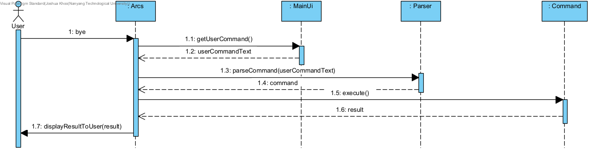

# Developer Guide

## Acknowledgements

{list here sources of all reused/adapted ideas, code, documentation, and third-party libraries -- include links to the original source as well}

## Design & implementation

{Describe the design and implementation of the product. Use UML diagrams and short code snippets where applicable.}

### Update patient information
Step 1:Patient inform the nurse of their change in personal information. Nurse will open up the Duke system and request to submit the change. Duke will call the Parser#etPatientInfo() to update the patient information. 

Step 2:
The parser will call the database storing patient information to update the change.

The flow is presented in the sequence diagram (will be included later after pull request is permitted):

### Exit program
Step 1: User type "bye" as input to exit the program. Duke will call Parser#getCommand()
to return the user command received.

Step 2: After checking the user command is "bye", Duke will
call Ui#sayGoodbye to print Goodbye message

The following sequence diagram shows how the exit operation works:

## Product scope
Use in all hospitals in Singapore
### Target user profile
Hospital admin staff

### Value proposition
IHospital is a desktop application meant for staff in hospitals. Its main purpose is to manage patients,
doctors, nurses, appointments and operation rooms data, and it’s optimised for use via a Command Line Interface (CLI).
If you can type fast, this application allows you to access relevant hospital information faster than traditional GUI applications.

## User Stories

| Version | As a ... | I want to ...                                     | So that I can ...                    |
|---------|----------|---------------------------------------------------|--------------------------------------|
| v1.0    | user     | add a new person (doctor/patient) into the system | record their information             |
| v1.0    | user     | delete an existing person                         | remove a person when he/she leaves   |
| v1.0    | user     | edit the information of a person                  | update information                   |
| v1.0    | user     | add an appointment                                | schedule an appointment for patients |

## Non-Functional Requirements

{Give non-functional requirements}

## Glossary

* *glossary item* - Definition

## Instructions for manual testing

{Give instructions on how to do a manual product testing e.g., how to load sample data to be used for testing}
