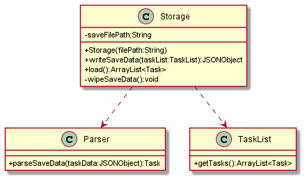
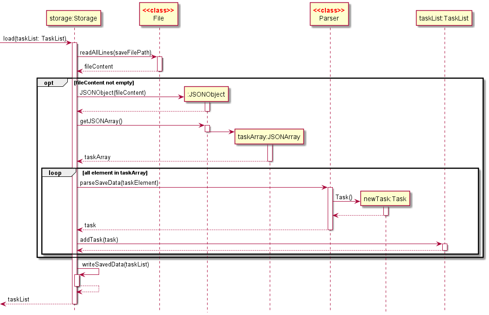
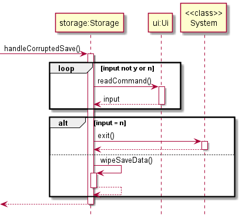

# Developer Guide

## Acknowledgements

{list here sources of all reused/adapted ideas, code, documentation, and third-party libraries -- include links to the original source as well}

## Design & implementation

### Study session implementation

The study session consists of 4 main components:

* Parser class
* StudyCommand class
* TimerLogic class
* Timer class

How `StudyCommand` class works:
* Accepts user inputs in the study session
* Facilitates interaction between Parser and TimerLogic

How `TimerLogic` class works:
* Manages the timer component when study session is launched
* Handles the logic for the timer (e.g. keeps track of state of Timer component)
* Calls made to Timer component methods are made through this method

How `Timer` class works:
* Inherits from `Thread` class
* Keeps track of time left when user calls for a timer
* Can be paused, resumed and stopped
* Prints to standard output the time remaining in regular intervals
* Thread is automatically interrupted when time runs out

#### `Timer` implementation

Sherpass’ implementation of the timer function in the study session is through the `Timer` class, which inherits 
from Java’s `Thread` class. When the timer is started by the user, the `Timer` class starts a thread which keeps 
track of time by sleeping for 1 second, then updating the time left, until the time left in the timer reaches 
zero, which then interrupts the thread. Starting the timer as a thread allows us to accept user commands like 
pause and stop for the timer through `StudyCommand` and `TimerLogic`, while `Timer` executes in the background and 
prints the time remaining at regular intervals.

Given below is an example usage scenario when the user enters the study timer, starts and stops the timer.

The diagram above depicts the process when user calls start and stop (in step 2 and 3 below). All the methods 
called by Timer are in parallel with other commands, since `Timer` is in a separate thread. For simplicity’s 
sake, parallel frames for the remainder of methods called by `Timer` are omitted.

Step 1. The user executes the `study` command and enters the study session through the `Parser` component, which 
executes the `StudyCommand`. `StudyCommand` then initialises an instance of `TimerLogic`, which handles the execution
and logic of user commands during the study session, while the `StudyCommand` accepts the user’s input when the 
user is in the study session.

Step 2. The user executes `start 1` command to start a 45 minute timer. The input goes through `StudyCommand`, 
where the Parser is called to parse the command. After parsing, `Parser` calls the method corresponding to 
the user’s command (`start`) in `TimerLogic`. `TimerLogic` then handles the logic and initialises an instance of
`Timer` (spawn a thread). `Timer` then automatically updates itself while waiting for the user to issue commands.

Step 3. The user executes the `stop` command to stop the timer. The same process is followed by using `Parser` to
parse the command in the study mode, which calls on the respective `callStopTimer` method in `TimerLogic`. Within the
`callStopTimer` method is a call to a method in `Timer` to stop the timer. Control goes back to the user for further 
commands.

#### Design considerations for the format of the save file

### Loading saved files

Class diagram of Storage:

(_Note: some methods and attributes of `TaskList`,`Ui` and `Parser` are omitted here_)

The storage component
- Can save the content of a `TaskList` to a file in JSON format
- Can load a JSON file to restore a previously saved `TaskList`
- Relies on the `Parser` class to understand the content of a JSON file
- Communicates with the user through the `Ui` class

The loading of a save file is done with the function

`Storage#load()` - Loads a saved JSON file and returns an ArrayList of task

The path of the JSON file is provided as a parameter in the constructor of `Storage` hence 
there is no need for any parameters in the `Storage#load()`. Since a save file will be created in the 
constructor of `Storage` if no such file exists, there should not be any issue with a missing save file.

The sequence diagram of `Storage#load()` is shown here:

In the event where the save file cannot be parsed by `JSONObject`, the function `Storage#handleCorruptedSave()`
will be invoked. The user will get to choose to create a new save file or exit the program for manual inspection.

The sequence diagram of `Storage#handleCorruptedSave()` is shown here:

#### Design considerations for the format of the save file
- JSON (current choice)
  - Pros: Easy to modify by hand if the user wants to
  - Pros: Easy to parse data
- XML
  - Pros:Reasonably easy for users to modify
  - Cons: Difficult to parse
- Text file with custom format
  - Pros: Might use less space (negligible)
  - Cons: Unintuitive for users to modify
## Product scope
### Target user profile

{Describe the target user profile}

### Value proposition

Sherpass aims to help students to tackle their individual hectic schedules by means of a planner.
Students can manage his/her time by adding their tasks into the application and get reminders
when the tasks are due for completion. Students can also use the study timers within the study session
to block out pockets of time for studying, so that they can better focus during study sessions.

## User Stories

|Version| As a ... | I want to ... | So that I can ...|
|--------|----------|---------------|------------------|
|v1.0|new user|see usage instructions|refer to them when I forget how to use the application|
|v2.0|user|find a to-do item by name|locate a to-do without having to go through the entire list|

## Non-Functional Requirements

{Give non-functional requirements}

## Glossary

* *glossary item* - Definition

## Instructions for manual testing

{Give instructions on how to do a manual product testing e.g., how to load sample data to be used for testing}
