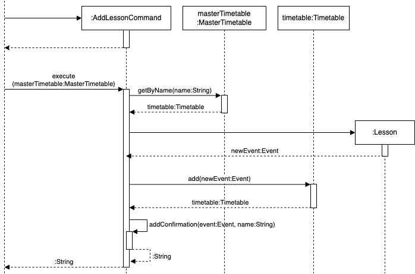
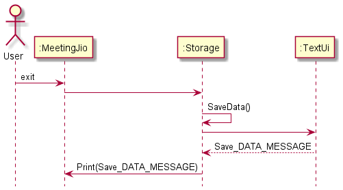
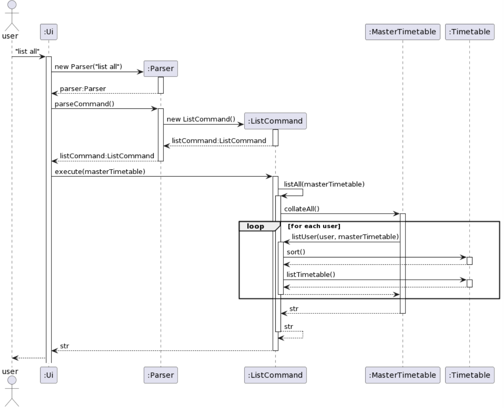
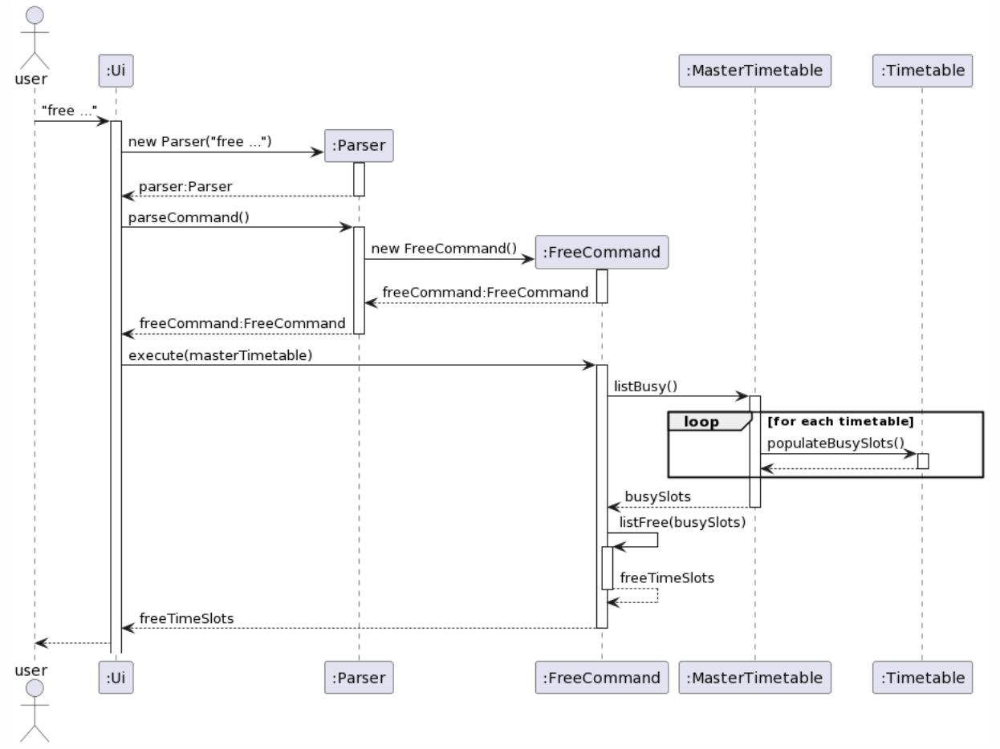
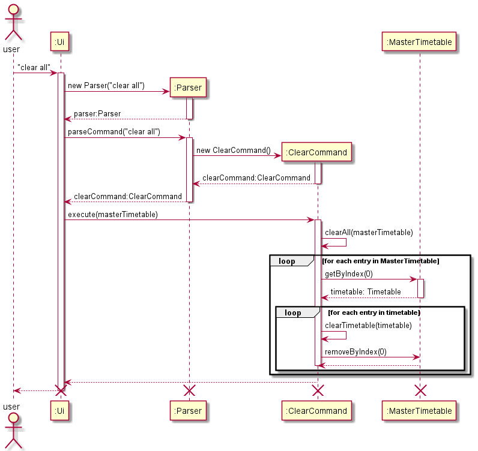

# Developer Guide

## Acknowledgements

{list here sources of all reused/adapted ideas, code, documentation, and third-party libraries -- include links to the original source as well}

# 1. Overview
MeetingJio is a program for **finding potential time slots for team meetings based on everyone’s availability**.

# 2. Design 

## 2.1 Architecture

{Describe the design and implementation of the product. Use UML diagrams and short code snippets where applicable.}

## 2.2 Events

## 2.3 Timetables

## 2.4 Commands

# 3. Implementation
This section describes some noteworthy details on how certain features are implemented.

## 3.1 Add Feature
`add_lesson` allows users to create a new lesson and add it to their own timetables

`add_meeting` allows users to create a new meeting and add it to all the existing timetables

The following sequence diagram shows how the `add_lesson` operation generally works.

The following sequence diagram shows how the `add_lesson` operation works in detail.

## 3.2 Data Saving Feature

The save mechanism is facilitated by Storage. It creates a text file in the local machine and writes all the elements 
in the MasterTimetable and Timetable to the text file in human-readable format.

Given below is the steps on how the save operation works.

Step 1: When the user exits the application. The Storage.SaveData will be initialized. 

Step 2: It will check for the existence of the data file. If the file is not found, it will create the file.
        Else do nothing.

Step 3: After creating the file, a for loop will be called to iterate through all elements in the MasterTimetable and Timetable list,
        and write them into the data file.

Step 4: A message will be shown to the user, informing him that the data has been saved successfully. For any exception
        encountered along the way, an error message will be displayed.

The following sequence diagram shows how the save operation works:

## 3.3 Listing Events Feature
The `list` command is a command that the user can input in order to list out the events he has in his timetable.

`list [user]` displays the timetable for the particular user.

`list all` displays the timetable for all users.

In essence, the `list all` command repeatedly calls `list [user]` for all users.

Before the timetable is listed out, it will also be sorted according to day and time for easy reading.

The following sequence diagram shows how the command `` is executed.

## 3.4 Finding Common Free Timeslots Feature
The `free` command is a command that the user can input in order to find timeslots where all users are free.

For greater customisation, `free [duration]` displays all common timeslots which has a duration longer than specified.

The searching algorithm works by marking the busy slots of each timetable first.
Timings that are not marked 'busy' are then identified as free time slots.

The following sequence diagram shows how the command `free` is executed.

## Product scope
### Target user profile

NUS Students who wish to meet as a group (be it for project meetings or to eat together)

### Value proposition

1. Allow a group of students to quickly identify a common time slot such that all of them are free to meet up

2. If no common time slot, allow students to see who is free at certain time slots

3. The longest time slot with the most number of available students should be suggested first, followed by either shorter time slots or time slots where lesser students are able to make it

## User Stories

| Version | As a ... | I want to ...                                | So that I can ...                                        |
|---------|----------|----------------------------------------------|----------------------------------------------------------|
| v1.0    |new user| see usage instructions                       | refer to them when I forget the command format           |
| v1.0    |user| add a lesson                                 | view my schedule easily                                  |
| v1.0    |user| delete a lesson                              | modify my schedule accordingly                           |
| v1.0    |user| view all the lessons i have in my timetable  | plan my activities accordingly                           |
| v1.0    |user| add the location paramter to my lesson       | plan my route in advance                                 |
| v1.0    |user| add a start time and end time to my lessons  | know what time a lesson starts and ends                  |
| v1.0    |user| clear all the lessons saved in the timetable | reset my timetable without the need to delete one by one |

## Non-Functional Requirements

{Give non-functional requirements}

## Glossary

* *glossary item* - Definition

## Instructions for manual testing

{Give instructions on how to do a manual product testing e.g., how to load sample data to be used for testing}

##Clear Command
The clear command is one of the commands the user can execute to clear the whole list. 

Here is the sequence when the command `clear` is executed.