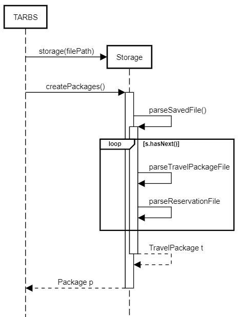
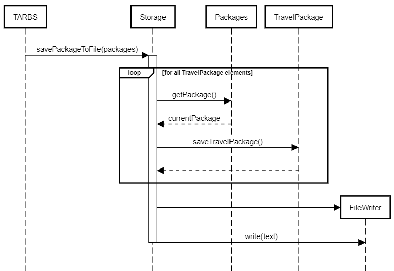

# Travel Agency Reservation Booking System (TARBS)
# Developer Guide

## Design & implementation
### Basic Class Diagram 

## Product scope
### Target user profile

- Studies in a non-IT field
- Usually works alone
- Working in a small travel agency that offers affordable budget travel packages to only some countries
- Handles many customers a day
- Is unfamiliar with using CLI apps

### Value proposition

- Travel agencies often have to manage multiple customers and their respective bookings or plans.
- For employees of the travel agencies to track and record customers’ booking of travel packages. 

## User Stories

|Version| As a ... | I want to ... | So that I can ...|
|--------|----------|---------------|------------------|
|v1.0|new user|Add reservation for a customer with basic information such as name, country etc. |Make a reservation|
|v1.0|new user|Print a list of all current and available travel packages |View all current travel packages and tell customers about our travel packages with one look|
|v1.0|new user|Remove an existing reservation|Remove information that we do not need anymore|
|v1.0|new user|Search for a specific travel package|Make recommendations to a customer based on their desired travel package requirements|
|v2.0|User ready to start using the app|Upload existing reservation data|Get started quickly|
|v2.0|User ready to start using the app|Make reservations based on custom input and edit them where necessary|Get familiar with inputting|
|v2.1|Expert user|Ascertain the error in my input based on the error messages from the application|Quickly troubleshoot any mistakes that would slow down my work|
|v2.1|Expert user|View all reservations currently under a specific travel package|Optimize that travel package according to user’s feedback|
|v2.1|Expert user|Sort all packages according to date, price or vacancies|Give better recommendations to customers|

## Non-Functional Requirements

### Performance Requirements
- Should work on any mainstream OS as long as it has Java 11 or above installed.

### Usability
- A user with above average typing speed for regular English text (i.e. not code, not system admin commands) should be able to accomplish most of the tasks faster using commands than using the mouse.
- Prompts and instructions must be in proper and concise sentences for ease of understanding.

## Glossary

* *glossary item* - Definition
* Packages - Travel Package within the agency's database
* Reservations - Reservation of travel package made by one customer through the app 

## Instructions for manual testing

{Give instructions on how to do a manual product testing e.g., how to load sample data to be used for testing}

### Summary of User Commands

| Command | Format Examples |
| ------- | --------------- |
|help|help   (prints details of all commands)|
|packages|packages   (prints details of all packages)|
|info|info {num} (num < number of available packages)   e.g. info 2 |
|all| all   Will prompt user to enter 1,2,3 to print out packages sorted by date, price or vacancies. 4 to return.|
|add|add {package_name},{ID},{startDate},{endDate},{hotel},{price},{country},{vacancies}    e.g. add Skiing Trip,1,23/2/2022,24/2/2022,hotelName,90.99,Singapore,20   adds a TravelPackage|
|delete|delete {num} (num < number of available packages)   e.g. delete 2   delete a TravelPackage|
|reserve|reserve {package_id},{contact_name},{contact_number},{number_pax}   e.g reserve 3,John,91234567,3|
|remove|remove {package_id},{contact_number}   e.g remove 1,8888888   remove an existing reservation|
|reservations|reservations {package_number}   eg. reservations 2   print all reservations for a given travelPackageID|
|addHotel|addHotel {hotel_id},{hotel_name},{country},{price},{package_id}   eg. addHotel 1,Hotel99,Singapore,100,1   Add a Hotel to the Itinerary|
|hotels|hotels {package_number}   eg. hotels 1   View all hotels offering this package|

### Test Case 1

New employees can enter `packages` to view all available packages by the agency.

Additionally, they can enter `info {package number}` to view more in-depth information about the package.

Employees can also input new reservations using `reserve {package_id},{contact_name},{contact_number},{number_pax}`

They can then view and verify reservations for that package using `reservation {package_number}`

## Feature - Help Command 
Aim: Displays a list of all available commands that the user can refer to as a guide

## Feature - Storage
#### Initialisation (Loading Data)
The sequence diagram that shows how `Storage` is created and the data is loaded from the saved files when the program is initialised is shown below:  

1. `TARBS` creates a Storage object with the relevant file name (`filePath`).
2. `TARBS` then calls the `createPackages()` method of the Storage class
3. `storage` will call the `parseSavedFile()` method, which initiates a while loop that iterates through the text file and processes the string data using the respective `parse` methods.
4. A new `TravelPackage` object is constructed with the relevant data.
5. A new `Packages` object is created using the `TravelPackage` object and returned back to `TARBS`.

#### Saving data
The sequence diagram that shows how `Storage` is used to save the current list of travel packages and reservations is shown below:  

1. `TARBS` calls the `savePackageToFile()` method of `storage`, passing in the `packages` object.
2. `storage` will then use a loop to iteratively retrieve the data in string format from the individual `TravelPackage` objects.
3. `storage` will create a new `FileWriter` object to write the string data into a text file.

## Feature - Parser
The sequence diagram shows an example of how a user input is parsed and returns a new `Command`.

For simplicity, `ByeCommand` is shown here:

