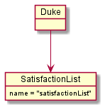
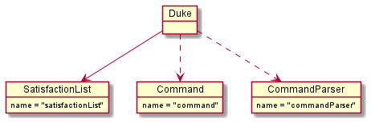
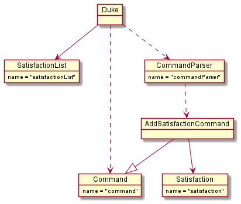
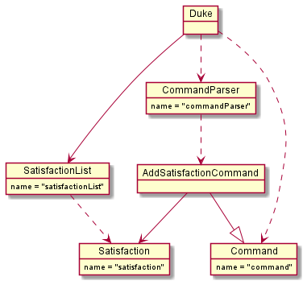
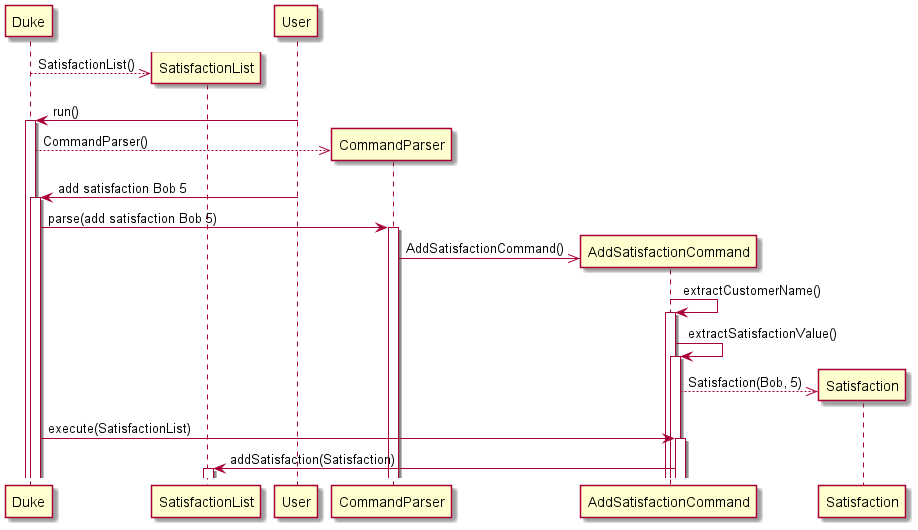

# Developer Guide

## Acknowledgements

{list here sources of all reused/adapted ideas, code, documentation, and third-party libraries -- include links to the original source as well}

## Design & implementation

{Describe the design and implementation of the product. Use UML diagrams and short code snippets where applicable.}

## Product scope
### Target user profile

{Describe the target user profile}

### Value proposition

{Describe the value proposition: what problem does it solve?}

## User Stories

|Version| As a ... | I want to ... | So that I can ...|
|--------|----------|---------------|------------------|
|v1.0|new user|see usage instructions|refer to them when I forget how to use the application|
|v2.0|user|find a to-do item by name|locate a to-do without having to go through the entire list|

## Non-Functional Requirements

{Give non-functional requirements}

## Glossary

* *glossary item* - Definition

## Instructions for manual testing

{Give instructions on how to do a manual product testing e.g., how to load sample data to be used for testing}

## Add Satisfaction

The mechanism for adding a customer satisfaction (represented by the Satisfaction class) is facilitated
by `AddSatisfactionCommand`. The constructor parses user input to create a `Satisfaction` object (which contains
attributes storing the customer's name and their satisfaction rating, represented as an integer from 1 to 5). 
`AddSatisfactionCommand` extends `Command` and contains an override of the `Command` class's execute method.
This execute method adds the `Satisfaction` object created from parsing user command into `satisfactionList`, the 
object of type `SatisfactionList` that stores the `Satisfaction` objects. Additionally, it implements the 
following operations:
* `AddSatisfactionCommand#extractCustomerName(String userInput)`: Extracts the customer's name (a string) from the 
   provided string of user input. 
* `AddSatisfactionCommand#extractSatisfactionValue(String userInput)`: Extracts the customer's satisfaction rating
  (an integer from 1 to 5) from the provided string of user input. 
* `AddSatisfactionCommand#getSatisfaction()`: Grabs the value of the `satisfaction` instance variable. 
* `AddSatisfactionCommand#setSatisfaction(Satisfaction satisfaction)`: Sets the `satisfaction` instance variable to the
   provided `Satisfaction` object.

Given below is an example usage scenario and how the mechanism for adding a satisfaction behaves at each step. 

Step 1. The user launches the application. In the `Duke` class, an empty instance of the `SatisfactionList` class, 
called `satisfactionList`, is created. 

Step 2. The user types the command `add satisfaction Bob 5`. In the `Duke` class, a `Command` object 
is created by invoking the `CommandParser` class's constructor on the user input. The details of this 
step are further described below.

Step 3. The `CommandParser` class replaces the `add satisfaction` in the user input with an empty string,
leaving just `Bob 5`. Then, the `AddSatisfactionCommand` class's constructor is invoked with `Bob 5`. 

Step 4. The `AddSatisfactionCommand` class's constructor parses `Bob 5`, extracting the customer name `Bob` using the
`AddSatisfactionCommand#extractCustomerName(String userInput)` method and extracting the customer satisfaction rating 
`5`using the `AddSatisfactionCommand#extractSatisfactionValue(String userInput)` method. The `AddSatisfactionCommand` 
class constructor then invokes the `Satisfaction` class's constructor to create a new `Satisfaction` object, passing in
customer name `Bob` and satisfaction rating `5`. 

Step 5. When the `AddSatisfactionCommand` object is executed in the `Duke` class, the `Satisfaction` object
created in the `AddSatisfactionCommand` class is added to `satisfactionList`. 

The following sequence diagram shows what would happen if the user typed `add satisfaction Bob 5`. 

PLEASE NOTE: Due to the limitation of PlantUML, the lengths of the activation bars may not be correct, and 
certain return values from method calls that could not be placed correctly were omitted. For example, the 
instantiation of objects of type `SatisfactionList`, `CommandParser`, `Command`, `AddSatisfactionCommand`, 
and `Satisfaction` should have return value arrows (representing the object that was instantiated) to the 
entity that created those instances, but those are not indicated in the diagram. Furthermore, for neatness, the 
`User` entity should be the left-most entity, but that could not be formatted properly in the diagram. 

