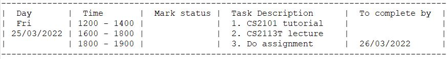

# Developer Guide

## Acknowledgements

{list here sources of all reused/adapted ideas, code, documentation, and third-party libraries -- include links to the original source as well}

##Architecture

## Design & implementation

### Study session implementation

The study session consists of 4 main components:

- Parser class
- StudyCommand class
- TimerLogic class
- Timer class

The `StudyCommand` component
- Accepts user inputs in the study session
- Facilitates interaction between Parser and TimerLogic

The `TimerLogic` component
- Manages the timer component when study session is launched
- Handles the logic for the timer (e.g. keeps track of state of Timer component)
- Calls made to Timer component methods are made through this method

The `Timer` component
- Inherits from `Thread` class
- Keeps track of time left when user calls for a timer
- Can be paused, resumed and stopped
- Prints to standard output the time remaining in regular intervals
- Thread is automatically interrupted when time runs out

#### `Timer` implementation

Sherpass’ implementation of the timer function in the study session is through the `Timer` class, which inherits 
from Java’s `Thread` class. When the timer is started by the user, the `Timer` class starts a thread which keeps 
track of time by sleeping for 1 second, then updating the time left, until the time left in the timer reaches 
zero, which then interrupts the thread. Starting the timer as a thread allows us to accept user commands like 
pause and stop for the timer through `StudyCommand` and `TimerLogic`, while `Timer` executes in the background and 
prints the time remaining at regular intervals.

Given below is an example usage scenario when the user enters the study timer, starts and stops the timer.

Step 1. The user executes the `study` command and enters the study session through the `Parser` component, which 
executes the `StudyCommand`. `StudyCommand` then initialises an instance of `TimerLogic`, which handles the execution
and logic of user commands during the study session, while the `StudyCommand` accepts the user’s input when the 
user is in the study session.

Sequence diagram for `Timer` when user starts and stops a timer:

The diagram above depicts the process when user calls start and stop (in step 2 and 3 below). All the methods
called by Timer are in parallel with other commands, since `Timer` is in a separate thread. For simplicity’s
sake, parallel frames for the remainder of methods called by `Timer` are omitted.

Step 2. The user executes `start 1` command to start a 45 minute timer. The input goes through `StudyCommand`, 
where the Parser is called to parse the command. After parsing, `Parser` calls the method corresponding to 
the user’s command (`start`) in `TimerLogic`. `TimerLogic` then handles the logic and initialises an instance of
`Timer` (spawn a thread). `Timer` then automatically updates itself while waiting for the user to issue commands.

Step 3. The user executes the `stop` command to stop the timer. The same process is followed by using `Parser` to
parse the command in the study mode, which calls on the respective `callStopTimer` method in `TimerLogic`. Within the
`callStopTimer` method is a call to a method in `Timer` to stop the timer. Control goes back to the user for further 
commands.

#### Design considerations for Timer class
- Current implementation: Create `Timer` from scratch, using the sleep function of threads to keep 
track of time
  - Pros: Same overhead of needing to track the time left of the timer
  - Pros: No need to follow Java’s `Timer` class syntax, which can be confusing at times
  - Pros: Implementation is simple and straight-forward
  - Cons: Have to manage how we interrupt the thread after stopping the timer
- Alternative: Using Java's `Timer` class
  - Pros: The way of keeping track of the time has already been implemented
  - Pros: Using a standard library usually makes the program less prone to various errors
  - Cons: Still have to implement a way to keep track of time for our purposes of pausing a timer, since the library 
  provided by Java has no way of pausing the timer, only stopping it.

### Timetable 

The **TimeTable** component prints the daily or weekly schedule that the user wishes to see. 

The functionalities of the timetable include:
- Prints a schedule specific to the date the user inputs 
- Prints the schedule for the week the user is at
- Prints the schedule of the day whenever the user starts up Sherpass.
- The timetable schedule is represented in a table form as shown below:

Note: The task number in the timetable as shown follows the index of a task
in the overall task list, i.e. the list containing all tasks added/edited. 
This allows a more intuitive approach towards adding/editing/deleting/marking/unmarking of tasks.

The **Timetable** is a class which interacts with the following components:
1. Parser
2. ShowCommand
3. TaskList

#### Parser Component

The **Parser** is a class which parses the inputs which the user enters. 
To activate the timetable, the user inputs commands that start with `show`
This creates a **ShowCommand** object which will execute its method, thereby printing the timetable.

#### ShowCommand Component

Depending on the user input that was parsed by **Parser**, **ShowCommand** will call the 
relative methods which prints the timetable.

#### TaskList Component

When the **ShowCommand** is being executed, it will retrieve a filtered list
of task by the date that is define in the **ShowCommand** from the **TaskList** component. 
The filtered list will represent the schedule that the user has on that date given. 
The list is assumed to be sorted previously when the user adds/edits a task.

Below is a sequence diagram of what happens 
as the user wishes to see the schedule (timetable) for 25th May 2022:

The sequence as shown above also happens in the same fashion as the user 
requests to see the schedule for any day or the week the user is at.

The timetable for the current day is also shown to user as the user starts up
the program.

#### Design considerations for Timetable class
- Current Implementation: Printing of timetable from scratch.
  - Pros: Easy to implement as timetable is generated based on request and input.
  - Pros: Adaptive as the timetable is only generated when needed and formatting is taken care of while generating it.
  - Cons: Significant time may be taken as timetable will have to be created from scratch. The delay may be extended if user has a lot of tasks.

- Alternative Implementation: Having a few templates, before choosing the suitable template and editing it if needed.
  - Pros: Reduces computation time
  - Cons: Increases memory usage

### Loading saved files

Class diagram of Storage:

(_Note: some methods and attributes of `TaskList`,`Ui` and `Parser` are omitted here_)

The storage component
- Can save the content of a `TaskList` to a file in JSON format
- Can load a JSON file to restore a previously saved `TaskList`
- Relies on the `Parser` class to understand the content of a JSON file
- Communicates with the user through the `Ui` class

The loading of a save file is done with the function

`Storage#load()` - Loads a saved JSON file and returns an ArrayList of task

The path of the JSON file is provided as a parameter in the constructor of `Storage` hence 
there is no need for any parameters in the `Storage#load()`. Since a save file will be created in the 
constructor of `Storage` if no such file exists, there should not be any issue with a missing save file.

The sequence diagram of `Storage#load()` is shown here:

In the event where the save file cannot be parsed by `JSONObject`, the function `Storage#handleCorruptedSave()`
will be invoked. The user will get to choose to create a new save file or exit the program for manual inspection.

The sequence diagram of `Storage#handleCorruptedSave()` is shown here:

#### Design considerations for the format of the save file
- JSON (current choice)
  - Pros: Easy to modify by hand if the user wants to
  - Pros: Easy to parse data
- XML
  - Pros:Reasonably easy for users to modify
  - Cons: Difficult to parse
- Text file with custom format
  - Pros: Might use less space (negligible)
  - Cons: Unintuitive for users to modify
## Product scope
### Target user profile

Students from CEG and SOC

### Value proposition

Sherpass aims to help students to tackle their individual hectic schedules by means of a planner.
Students can manage his/her time by adding their tasks into the application and get reminders
when the tasks are due for completion. Students can also use the study timers within the study session
to block out pockets of time for studying, so that they can better focus during study sessions.

## User Stories

| Version | As a ...  | I want to ...             | So that I can ...                                           |
|---------|-----------|---------------------------|-------------------------------------------------------------|
| v1.0    | new user  | see usage instructions    | refer to them when I forget how to use the application      |
| v2.0    | user      | find a to-do item by name | locate a to-do without having to go through the entire list |

## Non-Functional Requirements

{Give non-functional requirements}

## Glossary

* *glossary item* - Definition

## Instructions for manual testing

{Give instructions on how to do a manual product testing e.g., how to load sample data to be used for testing}
