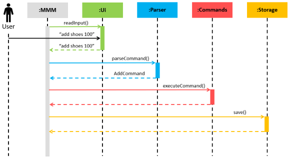
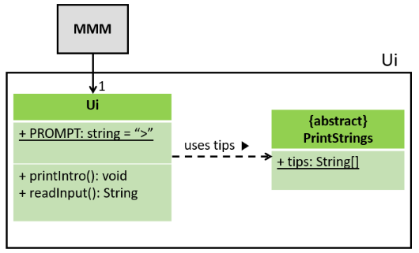
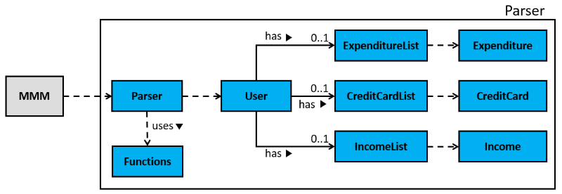
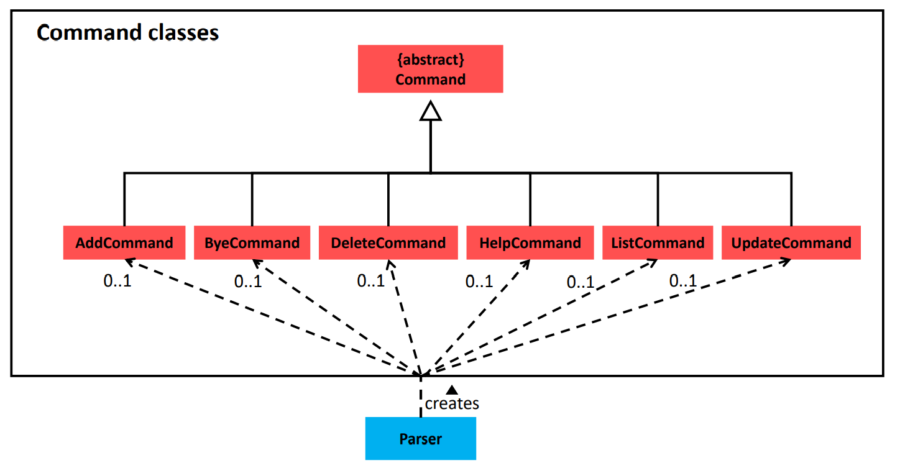
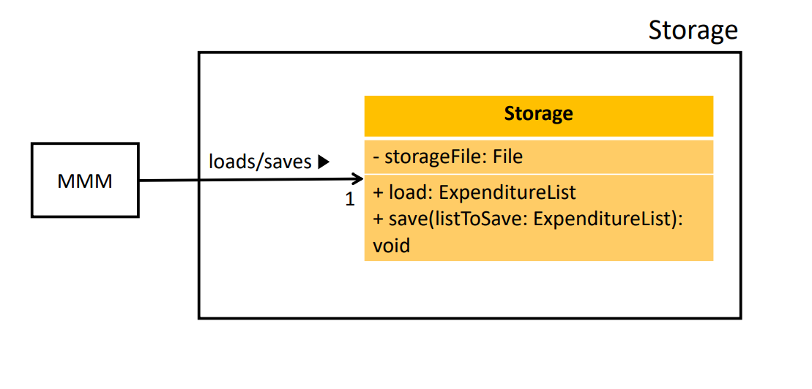
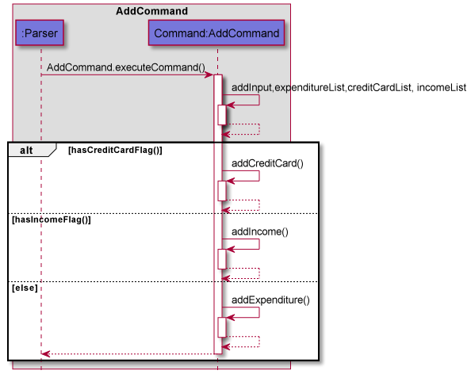

# Developer Guide

## Acknowledgements

{list here sources of all reused/adapted ideas, code, documentation, and third-party libraries -- include links to the original source as well}

## Design

### Architecture

  Fig 1 - Architecture Diagram

The Architecture Diagram above shows the high-level design of the application. The **main components**
consist of:
- `MMM`: Initialises the components in the correct sequence and connects them with each other. Also holds the user's
expenditures in memory.
- `Ui`: The User Interface of the application and deals with interaction with the user.
- `Parser`: Deals with making sense of user commands.
- `Commands`: The collection of all executable commands.
- `Storage`: Reads data from, and writes data to the hard disk.

By abstracting out closely related code into classes, it allows`MMM`to deal at a higher level, without worrying
about the lower level details. Higher cohesion is also achieved and coupling is minimized as each component is
only coupled to the main class,`MMM`.

The Sequence Diagram below shows an example of how the components interact with each other for the scenario 
where the user issues the command`add shoes 100`.

  Fig 2 - Sequence Diagram

The sections below give more details for each component.

 

### UI component
The source code can be found in [Ui.java](https://github.com/AY2122S2-CS2113T-T10-4/tp/blob/master/src/main/java/seedu/mindmymoney/Ui.java)

  Fig 3 - Ui Diagram

The UI component consists of a`Ui`and`PrintStrings`class.

The UI component:
- Prints the welcome banner and message on startup, as well as a financial tip from the`PrintStrings`class.
- Prints`>`before the user's input, to help the user differentiate between their input and an output from the
application.
- Reads input from the user.

 

### Parser component
The source code can be found in [Parser.java](https://github.com/AY2122S2-CS2113T-T10-4/tp/blob/master/src/main/java/seedu/mindmymoney/Parser.java)

  Fig 4 - Parser Diagram

The Parser component consists of a`Parser`, `Functions`, `ExpenditureList` and `Expenditure`class

The Parser component:
- Receives user's input and splits it into the Command Type and Description using the`Functions`class.
- Uses the`itemList`, which is an`ExpenditureList`object, to instantiate a`Command`object based on the Command Type.
- Returns the`Command`object that can then be executed.

We pass in the`itemList`to the`Command`object instead of using a global variable to ease testing. This way, we can 
add, delete and update`Expenditure`entries in a new`itemList`during testing without affecting the actual`itemList`.

### Command component 
The source can be found in [command](https://github.com/AY2122S2-CS2113T-T10-4/tp/blob/master/src/main/java/seedu/mindmymoney/command)

  Fig 5 - Command Diagram

The Command component consists of `Command` abstract class, `AddCommand`, `ByeCommand`, `DeleteCommand`, `HelpCommand`
, `ListCommand`and `UpdateCommand` that extends the `Command` class.

The Command component:
- Provides all the Command classes which can be instantiated by `Parser.parseCommand()`. The Command objects can then be 
executed. Only 1 Command object can be created.
- Includes a `.executeCommand()` method in each Command classes which performs the relevant command and throws 
exceptions if an error is encountered. The error is then handled.

### Storage component 
The source can be found in [Storage.java](https://github.com/AY2122S2-CS2113T-T10-4/tp/blob/master/src/main/java/seedu/mindmymoney/Storage.java)

  Fig 6 - Storage Diagram

The Storage component consists of `Storage` class.

The Storage component:
- `MMM` class initialises a `Storage` object upon start up. The `Storage` class consists of 
`load()` and `save()` methods. 
- Concurrently, `MMM` will call the `load()` method and load any data that is stored on the hard disk.
- `MMM` calls the `save()` method and stores remaining data onto the hard disk when the program exits.

## Implementation
This section describes some noteworthy details on how certain features are implemented.

### Add Command Feature
#### Current Implementation
The sequence diagram below shows the interactions of different subcomponents of the system when adding an expenditure
to the list.  
  
A key functionality of MindMyMoney is the ability to add and track user expenditure. A user can add in a new expenditure
by specifying the payment type, the category, the description of the item, the cost of the item and the date and the 
month purchased. 
1. The `Parser` component parses user input and returns the new `AddCommand` object to the
   `MindMyMoney`.
2. `AddCommand` instantiates `addInput`, `expenditureList` and `creditCardList`.
3. The application invokes `Addcommand.execute` to execute user instruction.
4. During the execution, `Addcommand.execute` will parse through user input to obtain the `EXPENDITURE`, `CATEGORY`,
   `DESCRIPTION`, `AMOUNT` and `TIME` fields.
5. The `Addcommand` object instantiates a new `Expenditure` object with the aforementioned 5 fields and adds them 
into the `ExpenditureList`.
6. The `Addcommand` object prints a list to show the user what it has saved.

#### Design considerations
Aspect: How to ask user for the 5 fields of input
* Alternative 1 (current choice): User is asked to put in all 5 fields at once, separated using flags.
   * Pros: Faster input, user can enter an expenditure using a single input
   * Cons: User must be able to remember all the flags and its sequence.

* Alternative 2: User is asked iteratively to put in all 5 fields, prompted by a message after each input.
   * Pros: Beginner friendly, easily understandable, no need to remember flags.
   * Cons: Slower, implementation when user is familiar with the application.
### Calculate Command feature

To enable users to view their finances in a more meaningfully, MindMyMoney does calculations to present financial data
that is actionable for the users.

## Product scope
### Target user profile

{Describe the target user profile}

### Value proposition

{Describe the value proposition: what problem does it solve?}

## User Stories

|Version| As a ... | I want to ... | So that I can ...|
|--------|----------|---------------|------------------|
|v1.0|new user|see usage instructions|refer to them when I forget how to use the application|
|v2.0|user|find a to-do item by name|locate a to-do without having to go through the entire list|

## Non-Functional Requirements

{Give non-functional requirements}

## Glossary

* *glossary item* - Definition

## Instructions for manual testing

{Give instructions on how to do a manual product testing e.g., how to load sample data to be used for testing}
