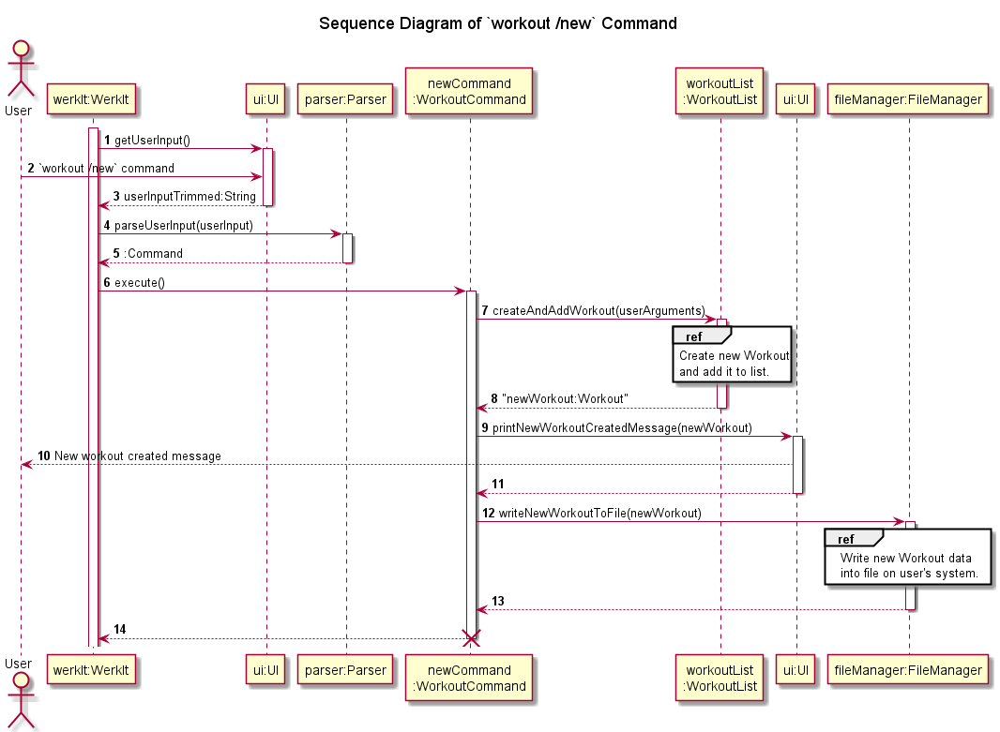
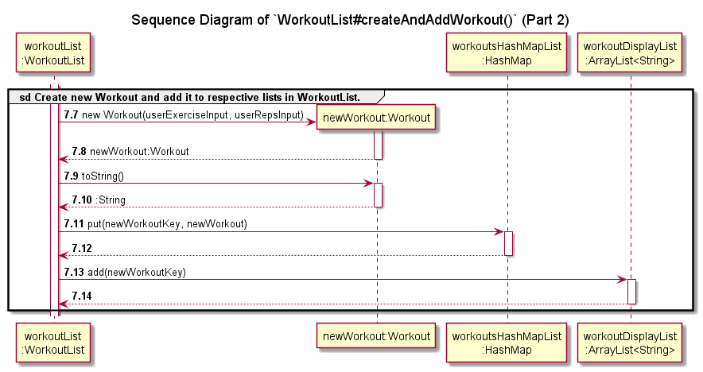
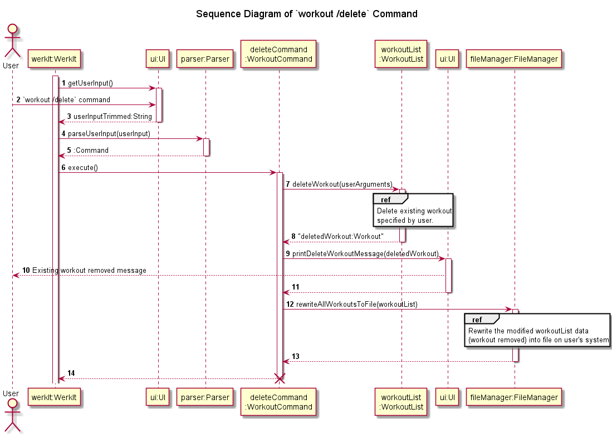
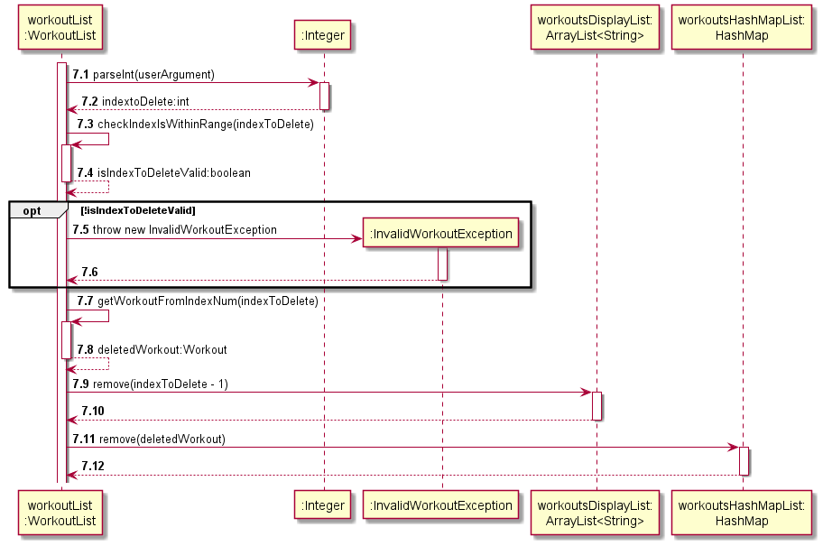
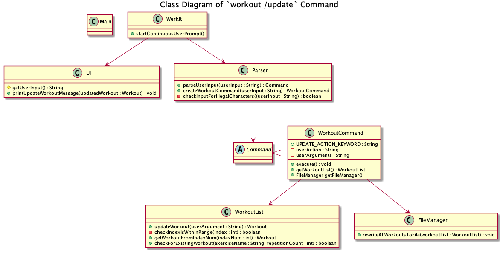
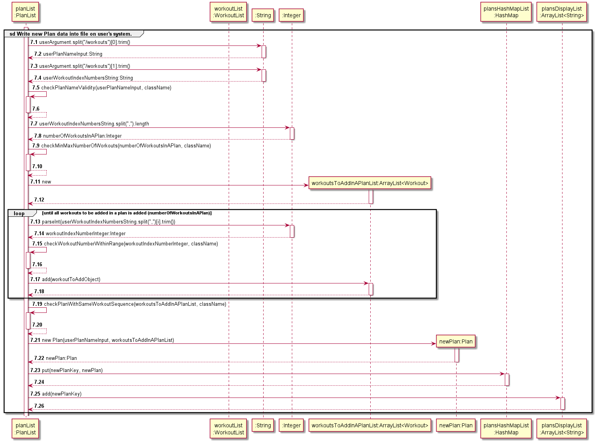
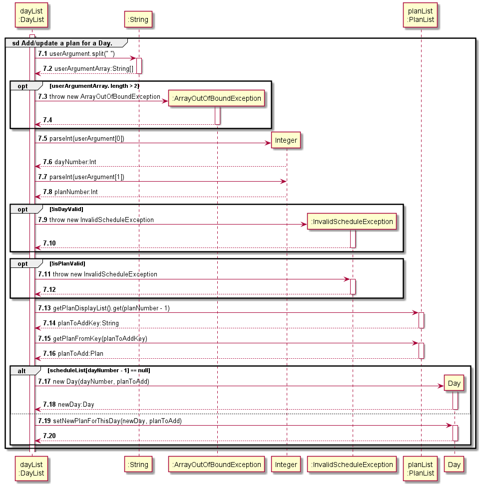
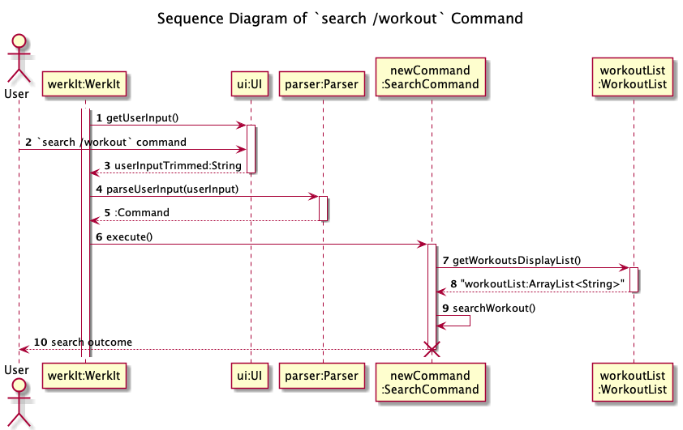

# WerkIt! Developer Guide

## Table of Contents
* [About this Guide](#about-this-guide)
* [Acknowledgements](#acknowledgements)
* [Setting Up your Development Environment](#setting-up-your-development-environment)
* [Design](#design)
* [Implementation](#implementation)
* [Product Scope](#product-scope)
* [User Stories](#user-stories)
* [Non-Functional Requirements](#non-functional-requirements)
* [Glossary](#glossary)
* [Instructions for Manual Testing](#instructions-for-manual-testing)

## About this Guide
This developer guide serves a documentation of the development of WerkIt!, an application that was created to help
prospective users to plan their exercise routines.

This technical document is meant for current and future developers of WerkIt! as a reference point on the design,
implementation, and other technical and non-technical aspects of the application.

## Acknowledgements
The following websites and codebases were referenced and adapted for our project:

* AddressBook-Level2 project ([Website](https://se-education.org/addressbook-level2/) | 
[GitHub](https://github.com/se-edu/addressbook-level2))
* AddressBook-Level3 project ([Website](https://se-education.org/addressbook-level3/DeveloperGuide.html) |
[GitHub](https://github.com/se-edu/addressbook-level3))
* Team Member Alan Low's individual project (iP) codebase ([GitHub](https://github.com/alanlowzies/ip))

## Setting Up your Development Environment
### Requirements
- [X] Java JDK version 11
- [X] An IDE of your choice, though IntelliJ IDEA is recommended as this project is developed
with this IDE.

> Note: IDE-related references in this developer guide IDE will be tailored for IntelliJ IDEA. 

### Setting Up
1. Fork the [WerkIt! GitHub repository](https://github.com/AY2122S2-CS2113T-T09-2/tp).
2. Clone your fork to your machine.
3. Set up your local repo in your IDE.
    - Ensure that the project in your IDE is configured to run on Java JDK version 11. 
    - A guide on setting your project to use JDK 11 in your IntelliJ IDEA IDE can be found 
[here](https://www.jetbrains.com/help/idea/sdk.html#set-up-jdk).
4. Run `Main.java`. If you have set up your environment correctly, you should see the following
output in your terminal: 

    ```
    ======================================================================
     __        __        _    ___ _   _ 
     \ \      / /__ _ __| | _|_ _| |_| |
      \ \ /\ / / _ \ '__| |/ /| || __| |
       \ V  V /  __/ |  |   < | || |_|_|
        \_/\_/ \___|_|  |_|\_\___|\__(_)

    Welcome to WerkIt!, your personal exercise planner.
    ----------------------------------------------------------------------
    Checking for required directory and files...
    - The required data directory was not found. It will be created.
    - The WerkIt! resource directory has been created in
      your terminal's current working directory.

    - The exercise file was not found. It will be created.
    - The exercise file 'exercises.txt' has been created in
      the WerkIt! resource directory.

    - The workout file was not found. It will be created.
    - The workout file 'workouts.txt' has been created in
      the WerkIt! resource directory.

    - The plan file was not found. It will be created.
    - The plan file 'plans.txt' has been created in
      the WerkIt! resource directory.

    - The schedule file was not found. It will be created.
    - The schedule file 'schedule.txt' has been
      created in the WerkIt! resource directory.

    Loading saved file data...
    - Exercises file	OK!
    ----------------------------------------------------------------------
    Now then, what can I do for you today?
    (Need help? Type 'help' for a guide!)
    ----------------------------------------------------------------------
    >
    ```
5. Type `exit` to exit the program.

You are now ready to begin developing!

## Design 
### Overview
### Architecture Diagram


The features of WerkIt! are split and grouped into 5 main features:
1. [Exercise-related features](#exercise-related-features)
2. [Workout-related features](#workout-related-features)
3. [Plan-related features](#plan-related-features)
4. [Schedule-related features](#schedule-related-features)
5. [Search-related features](#search-related-features)

### Exercise-related features
_to be updated_

---

### Workout-related features
_to be updated_

---

### Plan-related features
_to be updated_

---

### Schedule-related features
_to be updated_

---

### Search-related features

Below is a class diagram of the search-related features:

<br>

When WerkIt is running, the `WerkIt` class will keep prompting the user to enter command through the
`WerkIt#startContinuousUserPrompt()` method. After the user has entered command, The `UI#getUserInput()` method in `UI`
class will catch the user input, and it will be sent to `Parser#parseUserInput(String userInput)` method to analyse the
user's command. If the user's command type is search, i.e. `search <userAction> <keywords>`, the
`Parser#parseUserInput(String userInput)` method will parse the 'search' base word and proceed to create search related
command using `Parser#createSearchCommand(String userInput)` method. This method will further evaluate the
`<userAction>` and call the constructor of `SearchCommand` class by passing relevant parameters related to search to the
constructor. If the `<userAction>` is null or incorrect, an `InvalidCommandException` will be thrown. If the `<keywords>`
is not specified, an `InvalidCommandException` will be thrown.

---
## Implementation
### Overview
* [Getting User Input Continuously](#getting-user-input-continuously)
* [Parsing User Input and Getting the Right Command](#parsing-user-input-and-getting-the-right-command)
* [Exercise](#exercise)
  * [List Exercise](#list-exercise)
* [Workout](#workout)
  * [Create New Workout](#create-new-workout)
    * [Design Considerations](#design-considerations-for-creating-a-new-workout) 
  * [List Workout](#list-workout)
  * [Delete Existing Workout](#delete-existing-workout)
    * [Design Considerations](#design-considerations-for-deleting-existing-workout)
  * [Update Workout](#update-workout)
* [Plan](#plan)
  * [Create A New Plan](#create-a-new-plan)
  * [List Plans](#list-plans)
* [Schedule](#schedule)
  * [Update Schedule](#update-schedule)
    * [Design Considerations](#design-considerations-for-update-schedule)
  * [View Schedule](#view-schedule)
  * [Clear plan scheduled for a day](#clear-schedule-for-a-day)
  * [Clear all plans in the Schedule](#clear-schedule-for-the-week)
* [Search](#search)
  * [Search for Exercise](#search-for-exercise)
  * [Search for Workout](#search-for-workout)
  * [Search for Plan](#search-for-plan)
  * [Search for All](#search-for-all)

---

### Getting User Input Continuously
Once `WerkIt` has finished loading any saved file data on the user's system, it will call 
`WerkIt#startContinuousUserPrompt()`. This method will call on `UI#printUserInputPrompt()` to print a prompt message
to the terminal and `UI#getUserInput()` to wait and capture the user's input. The input will be captured with the aid 
of Java's built-in `Scanner` class.

Once the user has entered an input, `UI#getUserInput()` trims any preceding and trailing whitespaces before returning 
the user's input as a `String` object to `WerkIt#startContinuousUserPrompt()`. Then, 
`WerkIt#startContinuousUserPrompt()` calls `Parser#parseUserInput()` to parse the user's input and create a
an object that is a subclass of the `Command` class. If there is no issue with the formatting of the user's input,
this subclass-of-`Command` object is returned to `WerkIt#startContinuousUserPrompt()`.

> A detailed implementation of the parsing and creation of subclass-of-`Command` object process can be found in
'[Parsing User Input and Getting the Right Command](#parsing-user-input-and-getting-the-right-command)'.

Next, `WerkIt#startContinuousUserPrompt()` calls on the `execute()` method of the subclass-of-`Command` object to
perform the user's requested action. If the execution goes smoothly, this completes the user's inputted command.
This process is repeated until the user enters `exit`, which will terminate the loop, call `UI#printGoodbye()` to
print a goodbye message to the user, before handing control back to `Main#main` to end the program.

#### Design Considerations
* `WerkIt#startContinuousUserPompt()` has a boolean flag `isFirstPrompt`. This flag allows WerkIt to
print a different prompt each time the application starts up, before defaulting to a different prompt message
for subsequent prompts.
   * When the user starts the application, `isFirstPrompt` is set to `true` and thus, the prompt will be
  ```
  ----------------------------------------------------------------------
  Now then, what can I do for you today?
  (Need help? Type 'help' for a guide!)
  ----------------------------------------------------------------------
  >
  ```
  * Subsequent prompts in that app's session will be
  ```
  ----------------------------------------------------------------------
  What's next?
  ----------------------------------------------------------------------
  >
  ```

---

### Parsing User Input and Getting the Right Command
**_TODO_**: Explain how the app parses user input and determines which `Command` subclass object to instantiate.

---

### Exercise
#### List Exercise


If the user's command type is to list the exercises available, i.e. `exercise /list`, the
`Parser#parseUserInput(String userInput)` method will parse the 'exercise' base word and proceed to create exercise related
command using `Parser#createExerciseCommand(String userInput)` method. This method will further evaluate the
exercise action, in this case, `/list` and call the constructor of `ExerciseCommand` class by passing relevant parameters related to the
ExerciseCommand constructor. If the exercise action is null or incorrect, an InvalidCommandException will be thrown. Once the exercise command is created,
this exercise command is executed via the `ExerciseCommand#execute()` method. As it is executed, the method will check the
type of action to be executed, in this case, list. It will then list the exercises available for selection from the exerciseList using the `ExerciseList#printExerciseList()`.

The following sequence diagram illustrates how the `exercise /list` command works in greater detail:


---

### Workout
#### Create New Workout

A summary of the general procedure of a new workout being inputted and stored into WerkIt! is as follows:
1. User enters the command `workout /new <workout name> /reps <number of repetitions>`.
2. A new `Workout` object is created and stored in the application.
3. The success response is printed to the user through the terminal.
4. The new `Workout` object data is written to the resource file `workouts.txt`.

The following sequence diagram illustrates how the `workout /new` command works in greater detail:
> To simplify the sequence diagram, some method invocations that are deemed to be trivial 
> have been removed from the sequence diagram. Some reference frames will be elaborated further 
> down this section. Reference frames that will not be elaborated on will be made known.



(Steps 1 to 3) The program waits for the user to enter a new command, which in this case is the `workout /new` command,
and returns the user input in a `String` object to `WerkIt#startContinuousUserPrompt()`. 

(Steps 4 and 5) `Parser#parseUserInput()` parses the user input to obtain a `WorkoutCommand` object that is upcasted 
to a `Command` object on return to `WerkIt#startContinuousUserPrompt()`. In Step 6, `WorkoutCommand#execute()` is called
and because this is a `workout /new` command, the method will call `WorkoutList#createAndAddWorkout()`.

The following 2 sequence diagrams are the detailed procedures for Step 7's `WorkoutList#createAndAddWorkout()`:


> Note: To improve the diagram's readability, logging-related and input-checking method calls in 
> `WorkoutList#createAndAddWorkout()` have been omitted. 

Firstly, methods from the `String` and `Integer` classes are called to parse the
argument given to `WorkoutList#createAndAddWorkout()` to obtain the following information required to create the
`Workout` object:
1. Name of the exercise
2. Number of repetitions associated with the exercise in (1).

Note that these methods are not shown in the sequence diagram to improve the readability of the sequence diagram.

(Steps 7.1 to 7.6) Next, validity checks of the user input are carried out to ensure that the data entered is valid as a
new `Workout` object. The requirements for a valid new `Workout` object is as follows:
- [x] The exercise name must exist in `ExerciseList`'s `exerciseList`, which is an `ArrayList<String>` of exercise 
names.
- [x] The repetition value must be a non-negative integer greater than 0.
- [x] The (exercise name, repetition value) must not already exist in the list of workouts maintained in
`WorkoutList`. For example, if a workout of 20 reps of push-ups is already stored in the list,
it cannot be created again.

If any of the three requirements are not met, either an `InvalidExerciseException` or an
`InvalidWorkoutException` is thrown, and the entire workout creation process is aborted.

Again, note that the actual method calls to check for the validity of the user input are not shown in the sequence
diagram for the same reason as mentioned above.



If the above checks pass, Step 7.7 will create the new `Workout` object with the user-specified exercise name and
repetition value. Once that is done, a key of the `Workout` object will be generated in Step 7.9 (see the 
[Design Considerations](#design-considerations-for-creating-a-new-workout) section for more details of the `HashMap`
implementation), before storing the key-`Workout` pair in `workoutsHashMapList` which in turn is stored in `WorkoutList` 
in Step 7.11. In Step 7.13, the key of the newly-created `Workout` object is added to the `workoutsDisplayList`, an 
`ArrayList<String>` object stored in `WorkoutList`. This ArrayList will be used for displaying the workouts when the 
command `workout /list` is entered by the user. This is the final step of `WorkoutList#createAndAddWorkout()`.

(Step 9) Upon returning to `WorkoutCommand`, `UI#printNewWorkoutCreatedMessage()` is called to display a response to
the user via the terminal. The following is an example of a response after the user entered `workout /new russian twist 
/reps 50`:
```
----------------------------------------------------------------------
Alright, the following workout has been created:

	russian twist (50 reps)

----------------------------------------------------------------------
```

(Step 12) `FileManager#writeNewWorkoutToFile` is called to write the newly-created `Workout` object's data into 
`workouts.txt` which is stored on the user's local filesystem.

This completes the process of adding a new workout to WerkIt!

##### Design Considerations for Creating a New Workout
###### HashMaps - Motivation
Back in Version 1.0 of WerkIt!, workouts were stored in an ArrayList of `Workout` objects. In that version, plans
and schedules were not yet implemented and thus there was no real issues, since we can easily use index numbers
shown in `workout /list` to reference workouts when the user enters `workout /update` and `workout /delete` commands.

As an example, here is a list of workouts as shown when `workout /list` is used:
```
----------------------------------------------------------------------
> workout /list
----------------------------------------------------------------------
Showing workouts 1-3 of 3:

1. push up (10 reps)
2. sit up (10 reps)
3. pull up (10 reps)

Showed all workouts in list
----------------------------------------------------------------------
```

Thus, if we want to update the workout with 10 reps of push-ups, we can enter `workout /update 1 15` to update 
the repetition value to 15.

However, when we were designing and preparing for Version 2.0, we discovered that this **relative referencing** of
workouts by their indices pose a potentially cumbersome issue when implementing the plans and schedule features. If
we were to continue using relative indexing to reference workouts in plans, the effort needed to maintain the 
references in plans can become unnecessary complex.

For example, using the same list of workouts we have above, suppose we have a plan that includes workout indices
1 and 3 (10 push-ups and 10 pull-ups). Now, suppose the user decides to delete workout index 2 (10 sit-ups), this
means that the 10 pull-ups will now have an index number of 2. Thus, if we were to continue using relative indexing
to reference workouts in plans, there is a greater risk of making wrong references, and the amount of additional
code to update these references can become too complex.

###### Usage of HashMap
Thus, we have decided to use a HashMap on top of the existing ArrayList to store `Workout` objects. This will allow 
workouts to be referenced by their unique keys when creating plans and schedules, while allowing the user to continue
using the convenience of relative indexing for `workout /update` and `workout /delete` commands. The ArrayList of 
`Workout` objects from before is now converted into an ArrayList of Strings that will keep the keys of the `Workout` 
objects. Now, to manipulate the `Workout` object (e.g. `workout /update`),
1. User enters the index number of the workout he/she wants to update (as seen in `workout /list`).
2. The key of the `Workout` object is obtained from the ArrayList of keys (`workoutsDisplayList`).
3. The `Workout` object is obtained from the HashMap (`workoutsHashMapList`).

Note that the user will not have any direct interactions with the HashMap implementation and it should be transparent
to him/her.

---

#### List Workout

<br>
If the user's command type is to list the workouts created, i.e. `workout /list`, the
`Parser#parseUserInput(String userInput)` method will parse the 'workout' base word and proceed to create workout related
command using `Parser#createWorkoutCommand(String userInput)` method. This method will further evaluate the
workout action, in this case, `/list` and call the constructor of `WorkoutCommand` class by passing relevant parameters related to the
WorkoutCommand constructor. If the workout action is null or incorrect, an InvalidCommandException will be thrown. Once the workout command is created,
this workout command is executed via the `WorkoutCommand#execute()` method. 

As it is executed, the method will check the type of action to be executed, in this case, list. It will then list the workouts created and stored in the workoutList using the `WorkoutList#listWorkout()`
method which will call `WorkoutList#continuousPrinting(int index, int noOfPrints)` method to determine
the number of workouts to be printed. 

The maximum number of workouts to be displayed at a time is 10 workouts. If there are more than
10 workouts stored in the workoutList, it will prompt the user to enter 'yes' or 'no' to determine the continuation of the printings.
`isInputYesOrNo(String answer)` method is executed when user enter the answer for the continuation of printing.

If the answer given by the user is neither 'yes' nor 'no', user will be prompt to enter their option again until they give the expected input.
When 'yes' is entered, the printing will continue and `WorkoutList#continuousPrinting(int index, int noOfPrints)` method will be executed again.
Otherwise, `WorkoutList#listWorkout()` method will be terminated.

##### List workouts command
Format: `workout /list`

---

#### Delete Existing Workout
A summary of the general procedure of an existing workout being removed from WerkIt! is as follows:
1. User enters the command `workout /delete <workout index number in workout list>`.
2. The workout with the corresponding workout number in the workout list (can be determined by entering `workout /list`) is removed from the application's workout list.
3. The success response is printed to the user through the terminal.
4. The resource file, `workouts.txt`, is rewritten according to the application's workout list that has been modified.

The following sequence diagram illustrates how the `workout /delete` command works in greater detail:
> To simplify the sequence diagram, some method invocations that deemed to be trivial
> have been removed from the sequence diagram. Reference frames will be elaborated further
> down this section.


<br><br>

**(Steps 1 to 3)** The program waits for the user's input, which in this case, is the `workout /delete <workout index number in workout list>` command. 
An example of a valid command is `workout /delete 1`. Once the command is entered, the UI class will return the user input in a `String` object
to the `WerkIt` object.
<br><br>
**(Steps 4 to 6)** After the user input is received, the `WerkIt` object will call the `Parser#parseUserInput(userInput)` method to parse the user input.
Upon parsing of the input, a `WorkoutCommand` object is obtained. This `WorkoutCommand` object is upcasted to a `Command` object on return
to the `WerkIt` object. It will then execute the workout command by calling the `WorkoutCommand#execute()` method.
<br><br>
**(Step 7)** The `WorkoutCommand#execute()` method identifies that the workout action is of type `delete` due to the workout command that 
was supplied (`workout /delete <workout index number in workout list>`). It then calls the appropriate method, `WorkoutList#deleteWorkout(userArguments)`,
in order to perform the deletion of the workout. <br><br>
The following sequence diagram is the detailed procedure for Step 7's `WorkoutList#deleteWorkout(userArguments)`:
<br><br>


<br><br>
**(Steps 7.1 to 7.2)** The `Integer#parseInt()` method is called to parse the user argument parameter given to `WorkoutList#deleteWorkout(userArgument)`.
In this case, the user argument for `workout /delete <workout index number in workout list>` is the workout index number of the workout to be deleted from the workout list.
<br><br>
**(Steps 7.3 to 7.6)** The `WorkoutList#deleteWorkout(userArgument)` method will then proceed to check whether the workout index number to be deleted
is within the range of the workout list. This is done by calling the `WorkoutList#checkIndexIsWithinRange(indexToDelete)` method. If index to delete
is within the range of the workout list, the method returns true, else it will return false.
If the method returns false, then the `InvalidWorkoutException` exception is thrown.
<br><br>
**(Steps 7.7 to 7.8)** The `WorkoutList#deleteWorkout(userArgument)` method will then fetch the `Workout` object to be deleted
by calling the `WorkoutList#getWorkoutFromIndexNum(indexToDelete)` method.
<br><br>
**(Steps 7.9 to 7.12)** The `Workout` object to be deleted is subsequently removed from the ArrayList and HashMap which stores the
application's workout list.
<br><br>
**(Step 8)** The `WorkoutList#deleteWorkout(userArgument)` method returns the deleted `Workout` object to `WorkoutCommand`.
<br><br>
**(Steps 9 to 11)** Upon returning to the `WorkoutCommand` object, the `UI#printDeleteWorkoutMessage(deletedWorkout)` is called
to display the workout that has been deleted to the user via the terminal. The following is an example 
of a success deletion message after a valid workout is deleted from the application's workout list:
```
----------------------------------------------------------------------
Alright, the following workout has been removed:

	push up (20 reps)

----------------------------------------------------------------------
```
**(Steps 12 to 13)** The `FileManager#rewriteAllWorkoutsToFile(workoutList)` is called to rewrite
the `workouts.txt` file according to the newly modified application's workout list.
<br><br>
This completes the process of deleting an existing workout in WerkIt!

##### Design Considerations for Deleting Existing Workout
###### Rewrite All Workout To File
Currently, the WerkIt! program will rewrite all workout to the resource file, `workouts.txt`, when the delete workout
function is executed. Such implementation may have performance issues as the program needs to rewrite the whole
file with the modified workout list whenever a workout is deleted in the application.
<br><br>
An alternative considered was to find the workout to be deleted in the resource file, and then
remove that workout. While this is a more efficient implementation, it is more complex due to the
way the workout data are formatted and stored in the `workouts.txt` file.
<br><br>
Hence, to simplify the implementation, the team decided to simply
rewrite all workouts to the resource file whenever a workout is deleted.

---

#### Update Workout

<br><br>
When WerkIt is running, the `WerkIt` class will keep prompting the user to enter command through the
`WerkIt#startContinuousUserPrompt()` method. After the user has entered command, The `UI#getUserInput()` method in `UI`
class will catch the user input, and it will be sent to `Parser#parseUserInput(String userInput)` method to identify the
user's command. If the user's command type is to update an existing workout, 
i.e. `workout /update <index of workout> <new number of repetitions>`, the `Parser#parseUserInput(String userInput)` 
method will parse the 'workout' base word and proceed to create workout related command using 
`Parser#createWorkoutCommand(String userInput)` method. This method will further evaluate the workout action,
in this case, `/update` and call the constructor of `WorkoutCommand` class by passing relevant parameters related to the
WorkoutCommand constructor. If the workout action is null or incorrect, an InvalidCommandException will be thrown. 
If either `<index of workout>` or `<new number of repetitions>` parameter is also not specified, the same 
InvalidCommandException is thrown. Once the workout command is created, this workout command is executed 
via the `WorkoutCommand#execute()` method. As it is executed, the method will check the type of action to be executed, 
in this case, update. It will then update the existing workout using the `WorkoutList#updateWorkout(getUserArguments())` 
method. The updateWorkout method in addition, checks whether the given index of workout is a valid integer
and is within the range of the workout list. It also checks whether the workout to update exists in the current workout 
list. If either check is failed, `WorkoutOutOfRangeException` or `InvalidWorkoutException` will be thrown 
correspondingly. Otherwise, workout will be updated successfully. Then, `UI` will print a success message and call 
the `FileManager#rewriteAllWorkoutsToFile(getWorkoutList())` method to save the changes.

##### Update workouts command
Format: `workout /update`

---

### Plan
#### Create A New Plan

A summary of the general procedure of a new plan being created and stored in WerkIt! is as follows:
1. User enters the command `plan /new <plan name> /workouts <workout index numbers in workout list separated by comma>`.
2. A new `Plan` object is created and stored in the application.
3. The success response is printed to the user through the terminal.
4. The new `Plan` object data is written to the resource file `plans.txt`.

The following sequence diagram illustrates how the `plan /new` command works in greater detail:
> To simplify the sequence diagram, some method invocations that deemed to be trivial
> have been removed from the sequence diagram. Reference frames will be elaborated further
> down this section.


<br><br>

**(Steps 1 to 3)** The program waits for the user's input, which in this case, is the `plan /new <plan name> /workouts <workout index numbers in workout list separated by comma>` command.
An example of a valid command is `plan /new Grow Biceps /workouts 1, 2, 3`. Once the command is entered, the UI class will return the user input in a `String` object
to the `WerkIt` object.
<br><br>
**(Steps 4 to 6)** After the user input is received, the `WerkIt` object will call the `Parser#parseUserInput(userInput)` method to parse the user input.
Upon parsing of the input, a `PlanCommand` object is obtained. This `PlanCommand` object is upcasted to a `Command` object on return
to the `WerkIt` object. It will then execute the plan command by calling the `PlanCommand#execute()` method.
<br><br>
**(Step 7)** The `PlanCommand#execute()` method identifies that the plan action is of type `new` due to the plan command that
was supplied (`plan /new <plan name> /workouts <workout index numbers in workout list separated by comma>`). 
It then calls the appropriate method, `PlanList#createAndAddPlan(userArgument)`, in order to create a new plan. <br><br>
The following sequence diagram is the detailed procedure for Step 7's `PlanList#createAndAddPlan(userArgument)`:
<br><br>


<br><br>
**(Steps 7.1 to 7.2)** Before calling the `PlanList#checkPlanNameValidity(userPlanNameInput, className)` method,
the following information required to create the `Plan` object is obtained:
1. Name of the plan.
2. Workout index numbers in the workout list separated by comma.<br><br>

Once, those information are obtained, the name of the plan to be created will be validated via calling the
`PlanList#checkPlanNameValidity(userPlanNameInput, className)`.
This is to ensure all plan names are acceptable and unique in the application.
If the plan name is invalid, an `InvalidPlanException` exception will be thrown.
<br><br>
**(Steps 7.3 to 7.4)** The `PlanList` object will then find out the number of workouts
to be added into the new plan. Subsequently, it will call the `PlanList#checkMinMaxNumberOfWorkouts(numberOfWorkoutsInAPlan, className)` to ensure
that the number of workouts to be added into the new plan does not exceed 10 workouts, and there should minimally
be 1 workout in a plan. If the new plan does not meet the minimum and maximum workout number requirement,
an `InvalidPlanException` will be thrown.
<br><br>
**(Steps 7.5 to 7.6)** An ArrayList of Workout object is created to store the workouts to be added into the new plan.
<br><br>
**(Steps 7.7 to 7.10)** As the workout index numbers in the user input (e.g. "1, 2, 3") is of type `String`, 
the loop will split (by comma) and convert each number string into an `Integer`. 
Subsequently, the `PlanList#checkWorkoutNumberWithinRange(workoutIndexNumberInteger, className)` method
is called to ensure that each workout index is within the application's workout list range. 
Once the check is done, the valid `Workout` object is fetched from the application's workout list based 
on the workout index and then added into the `ArrayList` that was created in the previous step (Steps 7.5 to 7.6).
The loop will continue until all workouts to be added in the new plan is added into that `ArrayList`.
<br><br>
**(Steps 7.11 to 7.12)** Before adding this new plan, the 
`PlanList#checkPlanWithSameWorkoutSequence(workoutsToAddInAPlanList, className)` is called to ensure that
the new plan to be created does not contain the same workout order as any existing plans. If it does contain
the same workout order as an existing plan, an `InvalidPlanException` exception will be thrown.
<br><br>
**(Steps 7.13 to 7.18)** With the valid plan name and the `ArrayList` containing the workouts to be added into 
the new plan, a new `Plan` object is created. This new `Plan` object is then added to the application's plan list.
<br><br>
**(Step 8)** The `PlanList#createAndAddPlan(userArgument)` method returns the new `Plan` object to `PlanCommand`.
<br><br>
**(Steps 9 to 11)** Upon returning to the `PlanCommand` object, the `UI#printNewPlanCreatedMessage(newPlan)` is called
to display the plan that has been created to the user via the terminal. The following is an example
of a success plan creation message (new plan is called "Grow My Muscles"):
```
----------------------------------------------------------------------
Alright, the following plan has been created:

	Grow My Muscles

----------------------------------------------------------------------
```
**(Steps 12 to 13)** `FileManager#writeNewPlanToFile(newPlan)` is called to write the newly-created `Plan` 
object's data into `plans.txt`, which is stored on the user's local filesystem.
<br><br>
This completes the process of adding a new plan to WerkIt!.

---

#### List Plans

A summary of the general procedure of listing all plans in the application is as follows:
1. User enters the command `plan /list`.
2. A list of plan names is displayed to the user via the terminal.

The following sequence diagram illustrates how the `plan /list` command works in greater detail:
> To simplify the sequence diagram, some method invocations that deemed to be trivial
> have been removed from the sequence diagram. Reference frames will be elaborated further
> down this section.


<br><br>
**(Steps 1 to 3)** The program waits for the user's input, which in this case, is the `plan /list` command.
Once the command is entered, the UI class will return the user input in a `String` object
to the `WerkIt` object.
<br><br>
**(Steps 4 to 6)** After the user input is received, the `WerkIt` object will call the `Parser#parseUserInput(userInput)` method to parse the user input.
Upon parsing of the input, a `PlanCommand` object is obtained. This `PlanCommand` object is upcasted to a `Command` object on return
to the `WerkIt` object. It will then execute the plan command by calling the `PlanCommand#execute()` method.
<br><br>
**(Step 7)** The `PlanCommand#execute()` method identifies that the plan action is of type `list` due to the plan command that
was supplied (`plan /list`). It then calls the appropriate method, `PlanList#listAllPlan()`, in order to display all plan names
to the user.
<br><br>
**(Step 8)** The `PlanList#listAllPlan()` method will first check if the application's plan list is empty.
If it is, it will display to the user via the terminal that no plan has been created yet.
<br><br>
**(Step 9)** The `PlanList#listAllPlan()` method will then loop through the plan list and show
the names of the plan to the user via the terminal. The following is an example of what is 
displayed to the user when the `plan /list` command is entered while the application's plan list is not empty:
```
----------------------------------------------------------------------
Here are all your plan(s).
To view each plan in detail, enter
'plan /details <plan number in list>'.

1. Test
2. Grow My Muscles
----------------------------------------------------------------------
```
**(Steps 10 to 11)** The `PlanList#listAllPlan()` method returns to the `PlanCommand` object
and the `PlanCommand` object returns to the `WerkIt` object.
<br><br>
This completes the process of displaying all plans in WerkIt!.

---
### Schedule
User are able to create a 7-day workout plan schedule using the WerkIt application. For each day, user are only allowed
to schedule 1 workout plan. 

When WerkIt is running, the `WerkIt` class will keep prompting the user to enter command through the
`WerkIt#startContinuousUserPrompt()` method. After the user has entered command, The `UI#getUserInput()` method in `UI`
class will catch the user input, and it will be sent to `Parser#parseUserInput(String userInput)` method to analyse the
user's command. 

If the user's command type is schedule, the `Parser#parseUserInput(String userInput)` method will parse the 'schedule' 
base word and proceed to create schedule related command using `Parser#createScheduleCommand(String userInput)` method.
The following table shows the schedule commands that WerkIt! are able to process

| Command                                                             | `<userAction>` | Parameters Meaning                                                                                                                                   |
|---------------------------------------------------------------------|----------------|------------------------------------------------------------------------------------------------------------------------------------------------------|
| [schedule /update `<day number>` `<plan number>`](#update-schedule) | update         | `<day number>` Number representing the day. <br/>`<plan number>` Index of the plan stored in planList. This is the plan to be scheduled for the day. |
| [schedule /list](#view-schedule)                                    | list           |                                                                                                                                                      |
| [schedule /clear `<day number>`](#clear-schedule-for-a-day)         | clear          | `<day number>` Number representing the day.                                                                                                          |
| [schedule /clearall](#clear-schedule-for-the-week)                  | clearall       |                                                                                                                                                      |

The `<day number>` range from 1 to 7. The meaning of each day number is explained in the table below.

| Day Number | Meaning   |
|------------|-----------|
| 1          | Monday    |
| 2          | Tuesday   |
| 3          | Wednesday |
| 4          | Thursday  |
| 5          | Friday    |
| 6          | Saturday  |
| 7          | Sunday    |

This method will further evaluate the `<userAction>` and call the constructor of `ScheduleCommand` class by 
passing relevant parameters related to schedule to the constructor. If the `<userAction>` is null or incorrect, 
an `InvalidCommandException` will be thrown.
If the `<parameters>` of certain commands are not specified or met, an `InvalidScheduleException` will be thrown.

---
#### Update Schedule
A summary of the general procedure of updating a plan for a particular day to the schedule in WerkIt! is as follows:
1. User enters the command `schedule /update <day number> <plan number>`.
2. If there are no plan being scheduled for the day, a new Day object is created and stored in the application.
   If there is an existing plan scheduled for that particular day, the Day object that had already been created,
   will then be updated to store the latest plan scheduled for the day.
3. The success response is printed to the user through the terminal.
4. The Day object data is written to the resource file `schedule.txt`.

The following sequence illustrates how the schedule /update command works in greater detail:
> To simplify the sequence diagram, some method invocations that deemed to be trivial
> have been removed from the sequence diagram. Reference frames will be elaborated further
> down this section.


<br><br>

(Steps 1 to 3) The program waits for the user's input, which in this case,
is the schedule `/update <day number> <plan number>` command.
An example of a valid command would be `schedule /update 1 1`.
Once the command is entered, the UI class will return the user input in a String object to the WerkIt object.

(Steps 4 to 5) After the user input is received, the WerkIt object will call the `Parser#parseUserInput()` method
to parse the user input. A return `ScheduleCommand` object is obtained from the method.
This `ScheduleCommand` object is upcasted to a `Command` object on return to the WerkIt object.

(Step 6) The schedule command is being executed by calling the `ScheduleCommand#execute()` method.

Steps 7 and 8 are explained in greater details in the following sequence diagram:



(Steps 7.1 to 7.2) The DayList#updateDay method will be called to update/add a plan for a particular day in the schedule 
stated by the user. It will fist call the String#split method to separate out the `userArgument` given by the user. Upon, 
splitting of the whitespaces in `userArgument`, it will then check if the `userArgument` is valid. If it is invalid, an 
Exception would be thrown to the user and following the termination of the process (step 7.4).

(Steps 7.6 to 7.8) After splitting and checking the validity of `userArgument`, variables `userArgument[0]` representing
day number and `userArgument[1]` representing the plan index of the plan stored in the planList are obtained. Both the 
variables are then converted from data type string to integer. In addition, there is a check executed on both the converted 
day number and plan number to ensure that they are valid. This check is done so by calling the `DayList#isDayValid` and
`DayList#isPlanValid` methods respectively.

(Steps 7.9 and 7.11) If the day number or plan number is not valid, an `InvalidScheduleException` would be thrown to the user,
and the entire updating of a plan for a particular day in the schedule process is aborted.

(Steps 7.13 and 7.14) `PlanList#getPlanDisplayList` method is called to find and return the hash value of the plan number, 
`planToAddKey:String` to be scheduled for a particular day. The `planToAddKey` is used to get the `plan` object in the 
planList by calling the `PlanList#getPlanFromKey` (steps 7.15 to 7.16).

(Steps 7.17 to 7.18) Once the `Plan` object is retrieved, if there are no plan being scheduled for the day, 
a new Day object is created and stored in the application.

(Steps 7.19 to 7.20) However, if there is an existing plan scheduled for that particular day, the `Day` object that 
had already been created, will then be updated to store the latest plan scheduled for the day.

(Step 9 and 10) After successfully created/updated the Day object, the `UI#printNewSchedule(newDay)` method
will be called to display the day and the corresponding plan scheduled for it via the terminal. The following is an
example of the message after the user had successfully scheduled a plan for the day (e.g. `schedule /update 1 1`):
```
----------------------------------------------------------------------
Alright, the following plan schedule has been created:

Monday -- arms

----------------------------------------------------------------------
```
(Step 11) Lastly, before the `ScheduleCommand` object is discarded, the `FileManager#rewriteAllDaysScheduleToFile(dayList)`
is called to rewrite the `schedule.txt` file according to the newly modified application's day list.

This completes the process of scheduling a plan for a particular day in WerkIt!

##### Design considerations for update schedule
###### Day Object
For the application, schedule is defined to be a 7-days workout plan. The days that do not have any plan scheduled
would be considered a rest day for the user. Therefore, when implementing the creation of `Day` object, a total of 7
`Day` objects at most would be created and be stored in the dayList with size 7.

Initially, if no plan has been scheduled for a particular day, the corresponding Day object would not be created.
For example, if no plan is being scheduled for Monday, there will be no Day object created for Monday and the dayList
with index 0 will not have any `Day` object being stored.

If `dayList[0]` contains a `Day` object, it would mean that the user scheduled a plan on Monday. If the
user were to execute the `schedule /update` command again to update the plan to be scheduled for Monday, the application
will update the content in the Day object stored in `dayList[0]`. It will not recreate a Day object for Monday
to store the new plan.
---

#### View Schedule
To view the schedule in WerkIt! User can enter the command `schedule /list`.

A schedule in the WerkIt! refers to a 7-days workout plan schedule. 
For example, a plan named "leg day" which consists of 3 workouts "5 squats, 5 lunges, 5 squats"
can be added into the schedule by entering `schedule /update <day number> <plan number>` command. Hence, "leg day" plan
can be schedule on Monday by the command of `schedule /upate 1 1`. To view the plan in the schedule, user can enter the
command `schedule /list`.

The following sequence illustrates how the `schedule /list` command works in greater detail:
> To simplify the sequence diagram, some method invocations that deemed to be trivial
> have been removed from the sequence diagram. Reference frames will be elaborated further
> down this section.


<br><br>

(Steps 1 to 3) The program waits for the user's input, which in this case,
is the `schedule /list` command. Once the command is entered, the UI class will return
the user input in a String object to the WerkIt object.

(Steps 4 to 5) After the user input is received, the WerkIt object will call the `Parser#parseUserInput()` method
to parse the user input. A return `ScheduleCommand` object is obtained from the method.
This `ScheduleCommand` object is upcasted to a `Command` object on return to the WerkIt object.

(Step 6) The schedule command is being executed by calling the `ScheduleCommand#execute()` method.

(Step 7) Since the command passed in by the user is `schedule /list`, the application will execute the `DayList#printSchedule()` method.
No parameters are needed to be passed in the method as the method loop through the scheduleList, which stores all the plan names
scheduled for the individual days.

(Step 8 and 9) To ensure the printing of the schedule is formatted properly with a common standard, when `DayList#printSchedule()`
method is called, it will invoke a for loop to pad the plan name for all the plans in the scheduleList
with spaces by calling the `DayList#padWithSpaces(planForDay)` method. This method will pad both the front and back of the
plan name with spaces. Total characters that the padding and the plan name combined should not exceed 30 characters.

(Step 10) Upon the successful execution of the `DayList#printSchedule()` method, the plan scheduled on each of the day
will be display on the console to the user. An expected outcome of the `schedule /list` command would be:

```
----------------------------------------------------------------------

                         WORKOUT SCHEDULE
----------------------------------------------------------------------
     Day       |            Plan Name
----------------------------------------------------------------------
      Monday   |              arms                          
     Tuesday   |            rest day                      
   Wednesday   |            leg day                      
    Thursday   |            rest day                      
      Friday   |            rest day                      
    Saturday   |            leg day                      
      Sunday   |            rest day                      

----------------------------------------------------------------------
```

By default, if no plan is being scheduled for any of the day, the day is to be considered as a rest day for the user.

---
#### Clear Schedule For A Day
A summary of the general procedure of clearing a plan scheduled for a paricular day of the schedule in WerkIt! is as follows:
1. User enters the command `schedule /clear <day number>`.
2. The application will locate the index in the DayList which stores the corresponding `Day` object.
   This `Day` object will then be deleted from the DayList. For example, if `schedule /clear 1` command is entered,
   the index where the `Day` object storing information of the plan scheduled for Monday would be store in index 0,
   (day number -1), of the DayList.
3. DayList[day number - 1] would become null after the command is successfully being executed.
4. The success response is printed to the user through the terminal.
5. The `schedule.txt` will also be rewritten to reflect the changes. 

The following sequence illustrates how the `schedule /clear` command works in greater detail:
> To simplify the sequence diagram, some method invocations that deemed to be trivial
> have been removed from the sequence diagram. Reference frames will be elaborated further
> down this section.

 
<br><br>

(Steps 1 to 3) The program waits for the user's input, which in this case,
is the `schedule /clear <day number>` command. An example of a valid command would be `schedule \clear 1`
Once the command is entered, the UI class will return the user input in a String object to the WerkIt object.

(Steps 4 to 5) After the user input is received, the WerkIt object will call the `Parser#parseUserInput()` method
to parse the user input. A return ScheduleCommand object is obtained from the method.
This ScheduleCommand object is upcasted to a Command object on return to the WerkIt object.

(Step 6) The schedule command is being executed by calling the `ScheduleCommand#execute()` method.

(Step 7) Since the command entered is `schedule /clear <day number>`, the `DayList#clearDayPlan(userArgument)` method will
be called. This method will first convert the userArgument to an Integer data type (steps 8 and 9) and will then call
the `DayList#isDayValid()` method to check whether the day number entered by the user is valid (step 10). If the day number falls
within the range of 1 to 7 then it is considered a valid day else an `InvalidScheduleException` would be thrown to the user, 
and the entire clearing of plan for a particular day in the schedule process is aborted.

(Steps 12 and 13) Upon checking the validity of the day number, the application will then delete the `Day` object that 
stores the plan details for the specified day in the user command. Once, the `Day` object is successfully deleted, the 
`DayList#convertDayNumberToDay` method will be called. As the method name suggests, this method will convert the day number
to its corresponding meaning. For example, day number 1 will be converted to Monday. The purpose of this method is to 
make the success message displayed to the user more user-readable.

(Step 14) After the plan is successfully cleared for that indicated day, a success message of the process would be
printed to the user through the terminal. An example of a success message would be

```
----------------------------------------------------------------------
Plan had been cleared for Monday.
----------------------------------------------------------------------
```

(Step 15) `FileManager#rewriteAllDaysScheduleToFile(dayList)` is called to write all the `Day` objects' data stored in the dayList
into `schedule.txt` which is stored on the user's local filesystem.

This completes the process of clearing a plan on a particular day of the schedule on WerkIt!

---
#### Clear Schedule For The Week
A summary of the general procedure of clearing all the plans stored in the schedule in WerkIt! is as follows:
1. User enters the command `schedule /clearall.
2. The application will delete all the plans that had been added to the schedule.
3. The success response is printed to the user through the terminal. 
4. The `schedule.txt` will also be rewritten to reflect the changes.

The following sequence illustrates how the `schedule /clearall` command works in greater detail:
> To simplify the sequence diagram, some method invocations that deemed to be trivial
> have been removed from the sequence diagram. Reference frames will be elaborated further
> down this section.


<br><br>

(Steps 1 to 3) The program waits for the user's input, which in this case,
is the `schedule /clearall`. The UI class will return the user input in a String object to the WerkIt object.

(Steps 4 to 5) After the user input is received, the WerkIt object will call the `Parser#parseUserInput()` method
to parse the user input. A return ScheduleCommand object is obtained from the method.
This ScheduleCommand object is upcasted to a Command object on return to the WerkIt object.

(Step 6) The schedule command is being executed by calling the `ScheduleCommand#execute()` method.

(Step 7) Since the command entered is `schedule /clearall`, the `DayList#clearAllSchedule()` method will
be called. This method will delete all the `Day` object stored in the dayList using a for loop.  

(Steps 8 and 9) After all the plan is successfully cleared from the schedule, `UI#printClearedScheduleMessage()` method 
will be called to print a success message of the process. This message would be printed to the user through the terminal. 
An example of a success message would be

```
----------------------------------------------------------------------
Schedule had been cleared and reset.
There is no plan scheduled for any day.
To add plan for any day, enter:
schedule /update <day number [1-7]> <plan number>
----------------------------------------------------------------------
```

(Step 10) `FileManager#rewriteAllDaysScheduleToFile(dayList)` is called to write all the Day objects' data stored in the dayList
into `schedule.txt` which is stored on the user's local filesystem. Since all Day objects are deleted, the writing of
data into `schedule.txt` would be an equivalent of resetting the text file. 

This completes the process of clearing of all plans stored in the schedule on WerkIt!

---
### Search

#### Search For Exercise
Format: `search /exercise <keywords>`

The `Parser#createSearchCommand(String userInput)` method will further evaluate the user input
`/exercise` and call the constructor of `SearchCommand` class by passing relevant parameters related to search exercise
to the constructor. The created `SearchCommand` object is returned by the `Parser#createSearchCommand(String userInput)`
method to `Parser#parseUserInput(String userInput)` method, and finally returned by
`Parser#parseUserInput(String userInput)` method to `WerkIt#startContinuousUserPrompt()` method. The search command will
be executed in `WerkIt#startContinuousUserPrompt()`. And based on the `<keywords>` specified by the user, the output
will either be a list of matching exercises or 'Sorry, no matching exercise found' if the user has entered the command
correctly.

The following sequence diagram illustrates how the `search /exercise` command works in greater detail:


#### Search For Workout
Format: `search /workout <keywords>`

The `Parser#createSearchCommand(String userInput)` method will further evaluate the user input
`/workout` and call the constructor of `SearchCommand` class by passing relevant parameters to the constructor.
The created `SearchCommand` object is returned by the `Parser#createSearchCommand(String userInput)`
method to `Parser#parseUserInput(String userInput)` method, and finally returned by
`Parser#parseUserInput(String userInput)` method to `WerkIt#startContinuousUserPrompt()` method. The search command will
be executed in `WerkIt#startContinuousUserPrompt()`. And based on the `<keywords>` specified by the user, the output
will either be a list of matching names of workout or 'Sorry, no matching workout found' if the user has entered the command
correctly.

The following sequence diagram illustrates how the `search /workout` command works in greater detail:



#### Search For Plan
Format: `search /plan <keywords>`

The `Parser#createSearchCommand(String userInput)` method will further evaluate the user input
`/plan` and call the constructor of `SearchCommand` class by passing relevant parameters to the constructor.
The created `SearchCommand` object is returned by the `Parser#createSearchCommand(String userInput)`
method to `Parser#parseUserInput(String userInput)` method, and finally returned by
`Parser#parseUserInput(String userInput)` method to `WerkIt#startContinuousUserPrompt()` method. The search command will
be executed in `WerkIt#startContinuousUserPrompt()`. And based on the `<keywords>` specified by the user, the output
will either be a list of matching names of plan or 'Sorry, no matching plan found' if the user has entered the command
correctly.

The following sequence diagram illustrates how the `search /plan` command works in greater detail:


#### Search For All
Format: `search /all <keywords>`

The `Parser#createSearchCommand(String userInput)` method will further evaluate the user input
`/all` and call the constructor of `SearchCommand` class by passing relevant parameters to the constructor.
The created `SearchCommand` object is returned by the `Parser#createSearchCommand(String userInput)`
method to `Parser#parseUserInput(String userInput)` method, and finally returned by
`Parser#parseUserInput(String userInput)` method to `WerkIt#startContinuousUserPrompt()` method. The search command will
be executed in `WerkIt#startContinuousUserPrompt()`. And based on the `<keywords>` specified by the user, the output
will either be a list of matching names of exercise, workout and plan or not found messages if the user has entered the command correctly.

The following sequence diagram illustrates how the `search /all` command works in greater detail:


---

## Product Scope
### Target User Profile

{Describe the target user profile}

### Value Proposition

{Describe the value proposition: what problem does it solve?}

## User Stories

| Version | As a ... | I want to ...    | So that I can ...                                                      |
|---------|----------|------------------|------------------------------------------------------------------------|
| v1.0    | user     | create a workout | keep track of how many repetitions I would like to do with an exercise |

## Non-Functional Requirements

{Give non-functional requirements}

## Glossary

* **Exercise** - A single 'unit' of exercise. A type of exercise.
    * e.g. push up, jumping jacks, sit-ups
* **Workout** - A single 'unit' of exercise with a number of repetitions associated with it.
    * e.g. push up (5 reps), jumping jacks (2 reps), sit-ups (7 reps)
* **Plan** - A set of workouts
    * Example:

| Plan Name      | Contains                                                                                                               |
|----------------|------------------------------------------------------------------------------------------------------------------------|
| Grow my Biceps | Barbell curls (3 reps), push ups (10 reps), deadlift (2 reps)                                                          |
| Whole Body!    | Crunches (10 reps), jumping jack (3 reps), lift ups (4 reps), pull ups (3 reps), planking (2 reps), leg cycle (2 reps) |
<br><br>
* **Schedule** - Consists of Days 1 to 7. Users will add or modify a plan to that particular day
of their schedule. For instance, the user's daily schedule can look like this:

| Day   | Plan Name      |
|-------|----------------|
| Day 1 | Grow my Biceps |
| Day 2 | Rest Day       |
| Day 3 | Whole Body!    |
| Day 4 | Leg Day        |
| Day 5 | Grow my Biceps |
| Day 6 | Whole Body!    |
| Day 7 | Rest Day       |


## Instructions for manual testing

{Give instructions on how to do a manual product testing e.g., how to load sample data to be used for testing}
