# Developer Guide

## Table of Content
- [Acknowledgements](#acknowledgements)
- [Introduction](#introduction)
- [Architecture](#architecture)
- [Design & Implementation](#design--implementation)
  - [Task Implementation](#task-implementation)
    - [Editing Tasks](#editing-tasks)
  - [Study Session Implementation](#study-session-implementation) 
    - [Timer Implementation](#timer-implementation)
    - [Study session usage scenario](#study-session-usage-scenario)
    - [Design considerations for Timer](#design-considerations-for-timer-class)
  - [Timetable Implementation](#timetable-implementation)
    - [Timetable usage scenario](#timetable-usage-scenario)
    - [Design considerations for generating timetable](#design-considerations-for-generating-the-timetable)
  - [Storage Implementation](#storage-implementation)
    - [Loading saved files](#loading-saved-files)
    - [Design considerations for format of save file](#design-considerations-for-the-format-of-the-save-file)
- [Product Scope](#product-scope)
  - [Target user profile](#target-user-profile)
  - [Value proposition](#value-proposition)
  - [User Stories](#user-Stories)
  - [Non-Functional Requirements](#non-functional-requirements)
  - [Glossary](#glossary)
  - [Instruction for manual testing](#instructions-for-manual-testing)

## Acknowledgements

- Team member Jun Lim's individual project codebase - [GitHub](https://github.com/jltha/ip)

## Introduction

Our product, Sherpass, is a desktop application for students to manage their academic schedules by adding their tasks,
Sherpass will then compile their tasks and present it to them in a timetable. Sherpass also provides a 
platform for them to focus on their academic tasks through the use of timers in our study sessions. Students can use
the time to block out time to focus on their tasks. Optimised for use via a Command Line Interface (CLI),
users who can type fast will be able to plan out their tasks in a much quicker fashion compared to traditional GUI apps.

## Architecture

The above diagram provides a general overview of Sherpass and its major components. The four key areas are:

- User Interface (UI)
- Storage
- Timetable
- Study session

### UI

UI component consists the `Ui` class which manages interaction (receiving inputs and showing outputs) between the user 
and the application.

### Storage

#### Class diagram:

> 💡 **Note:** Some methods and attributes of `TaskList` are omitted here for simplicity

The storage component
- Can save the tasks in a `TaskList` to a file in JSON format
- Can load a JSON file to restore a previously saved tasks
- Relies on the `StorageParser` class to understand the content of a JSON file

Storage component consists `Storage` and `StorageParser` classes.
`Storage` class handles loading, writing and saving
data to and from a JSON file, such that users' data will be saved automatically.
`StorageParser` class handles the
parsing of JSON from the saved data file.

### Timetable

For components with more complicated use-cases (e.g., `Task` and `Timer`), we separate an extra Logic class to achieve better
modularity, such that each class addresses a separate concern.

Timetable component consists of `Timetable`, `TimetableLogic`, `TimetableParser` and `TimetablePrinting`.
It also interacts with various other classes such as `TaskList` and `Ui` to successfully generate a timetable 
for the user to view. Refer to its [implementation](#timetable-implementation) for more information on how
the different classes interact with one another.

### Study session

Timetable component consists of `Timer`, `Stopwatch`, `Countdown`, `TimerParser`, `TimerLogic` and various commands.

## Design & implementation

### Task Implementation
Sherpass provides two different ways to add, edit and delete tasks. The `/repeat` option in commands allows users to add 
recurring tasks (e.g. weekly classes or meetings). Without the `/repeat` option, commands will only affect a single task.

- Both recurring tasks and non-recurring tasks belongs to `Task` class which are stored
in a `TaskList` object that is created when the program starts.
- Recurring tasks shares a common identifier so that commands on a recurring task can identify which tasks to 
operate on.

#### Editing Tasks

The edit command is handled by the `EditCommand` class, and it allows users to edit 1 or more occurrences of a task.

If the edit command contains the `/repeat` option, the specified task
and all its future occurrences will be edited. 

The general procedure for editing a task with the `/repeat` option is as follows:
1. Get all tasks that have the same identifier and has a later date than the specified task.
2. Copy the current task list into a temporary list
3. Remove all affected tasks from the temporary list
4. Loop through the affected tasks
   1. Update the task with the new values
   2. Check for any clashes with the temporary list
   3. Add the updated task into the temporary list
5. Use the temporary list as the actual list

The sequence diagram for `EditCommand` for receiving input from the user is shown here:
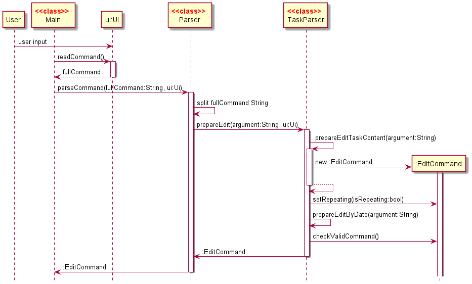

The `Main` class then calls the `execute` method of the `EditCommand` class. 
The sequence diagram of `execute()` in the `EditCommand` class is shown here:

The reference frame for `editRepeatedTasks()` in `TaskList` is shown here:

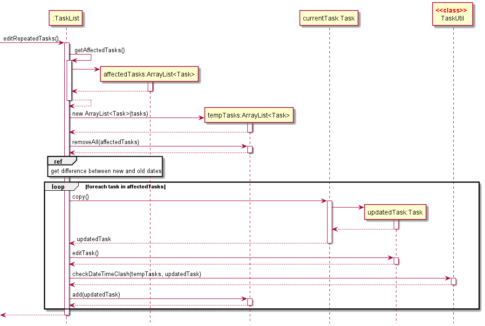

The sequence diagram for `editSingleTask()` in `TaskList` is omitted as it is similar to how recurring tasks are edited.

##### Using offsets to calculate new dates

The reason why the new dates are calculated using an offset instead of giving a date is because
of the following scenario.

1. Assume the user has a recurring task on 6th, 7th and 8th June

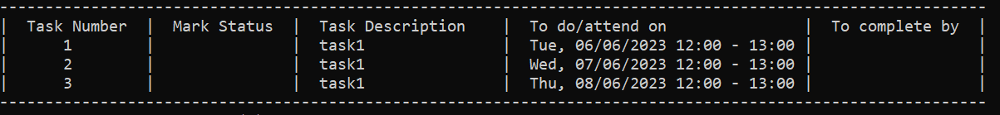
2. The user deletes the task on 7th June
3. The user edits the task happening on 6th June to be on 10th June.

|                  | Result                         |
|------------------|--------------------------------|
| Not using offset |  |
| Using offset     | 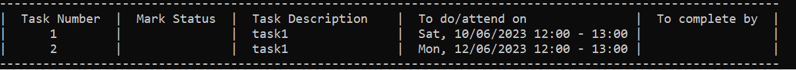 |

By not using offsets, the 2-day gap between task 1 and 2 is lost. Hence, the decision to use offset to preserve such
details was chosen even though it would make implementation slightly more complicated.

### Study Session Implementation

The study session consists of 4 main components:

- TimerParser class
- StudyCommand class
- TimerLogic class
- Abstract [Timer](#glossary) class, [Countdown](#glossary) class and [Stopwatch](#glossary) class 

The `TimerParser` component
- Parses user inputs in the main session and the study session
- Ensures the input adheres to the allowed command inputs, 
i.e. program will ask the user to key in a new input if it does not recognise the inputs given.

The `StudyCommand` component
- Passes user input from `Ui` component to necessary components
- Facilitates interaction between TimerParser and TimerLogic

The `TimerLogic` component
- Manages the timer component when study session is launched
- Handles the logic for the timer (e.g. keeps track of state of Timer component)
- Calls made to Timer component methods are made through this method

The `Timer` component

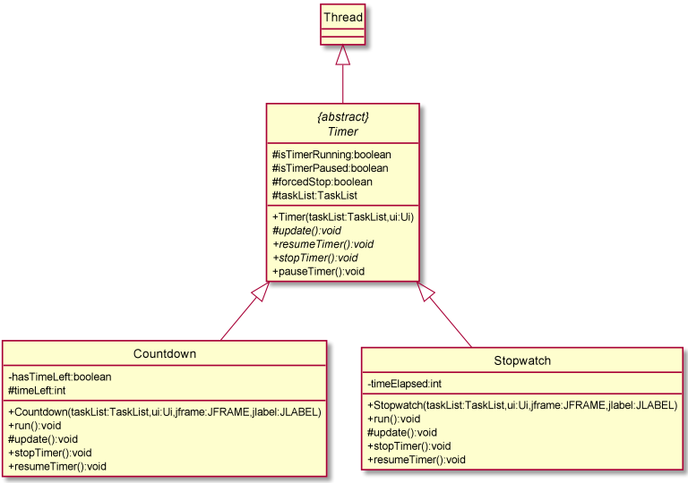

- Consists of abstract `Timer` class, `Countdown` class and `Stopwatch` class as depicted in the class diagram above
- `Timer` inherits from Java's `Thread` class
- `Countdown` and `Stopwatch` inherit from `Timer`
- `Countdown` and `Stopwatch` keep track of time remaining and elapsed respectively
- `Countdown` and `Stopwatch` can be paused, resumed and stopped
- `Countdown` and `Stopwatch` prints to standard output the time remaining and elapsed respectively at regular intervals

#### Timer Implementation

Sherpass’ implementation of the timer function in the study session is mainly through `Timer`, `Countdown` and 
`Stopwatch` class. Depending on the type of timer selected by the user, either `Countdown` or `Stopwatch` will be
instantiated. 

When a countdown timer is started by the user, the `Countdown` class starts a thread which keeps track of time through
a method called update(), where the thread sleeps for 1 second, then updates the time left, until the time left in the 
timer reaches zero, which then interrupts the thread. Starting the timer as a thread allows us to accept user commands 
like pause and stop for the timer through `StudyCommand` and `TimerLogic`, while the thread executes in the background 
and prints the time remaining at regular intervals. A similar process is followed in `Stopwatch`, except that the class
keeps track of time elapsed rather than time remaining.

#### Study session usage scenario

Given below is an example usage scenario when the user enters the study session, starts a countdown timer, then stops 
the timer.

Step 1. The user inputs the `study` command through `Ui` and enters the study session through the main `Parser` 
component, which 
executes the `StudyCommand`. `StudyCommand` then initialises an instance of `TimerLogic`, which handles the execution
and logic of user commands during the study session, and initialises `Ui` accepts the user’s input when the 
user is in the study session. `TimerParser` parses user inputs (commands) related to `Timer`.

Sequence diagram for `StudyCommand` for receiving input from `Ui`:

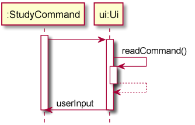

Sequence diagram for `Timer` when user starts and stops a timer:

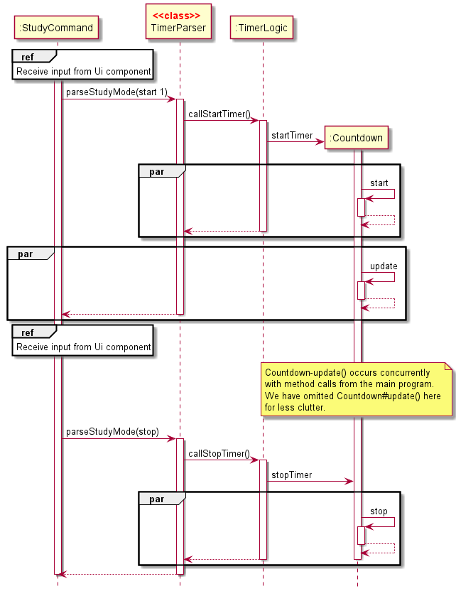

The diagram above depicts the process when user calls start and stop (in step 2 and 3 below). All the methods
called by Timer are in parallel with other commands, since `Timer` is in a separate thread. For simplicity’s
sake, `Countdown-update()` methods are omitted in step 3 to reduce clutter.

Step 2. The user inputs `start 1` command to start a 30-minute timer. The input is received through `Ui` and passed
to `StudyCommand`, 
where the `TimerParser` is called to parse the command. After parsing, `TimerParser` calls the method corresponding to 
the user’s command (`start`) in `TimerLogic`. `TimerLogic` then handles the logic and initialises an instance of
`Countdown` (spawn a thread). `Countdown` then automatically updates itself while waiting for the user to issue 
commands.

Step 3. The user executes the `stop` command to stop the timer. The same process is followed by using `TimerParser` to
parse the command in the study mode, which calls on the respective `callStopTimer` method in `TimerLogic`. Within the
`callStopTimer` method is a call to a method in `Countdown` to stop the timer. Control goes back to the `StudyCommand`
to receive further inputs from the user.

#### Design considerations for Timer class
- Current implementation: Create `Timer` from scratch, using the sleep function of threads to keep 
track of time
  - Pros: Same overhead of needing to track the time left of the timer
  - Pros: No need to follow Java’s `Timer` class syntax, which can be confusing at times
  - Pros: Implementation is simple and straight-forward
  - Cons: Have to manage how we interrupt the thread after stopping the timer
- Alternative: Using Java's `Timer` class
  - Pros: The way of keeping track of the time has already been implemented
  - Pros: Using a standard library usually makes the program less prone to various errors
  - Cons: Still have to implement a way to keep track of time for our purposes of pausing a timer, since the library 
  provided by Java has no way of pausing the timer, only stopping it.

### Timetable Implementation 

The **TimeTable** component prints the daily, weekly and monthly schedule that the user wishes to see. 

The functionalities of the timetable include:
- Prints a schedule specific to the date the user inputs 
- Prints the schedule for the week the user is at
- Prints the schedule for the week after
- Prints the schedule of the day whenever the user starts up Sherpass.
- Prints the schedule of the current month
- Prints the schedule of any specific month. 

The full timetable schedule is represented in a table form as shown below:

This applies only when printing the daily/weekly schedule. For other schedule filters,
the timetable is condensed to prevent cluttering of the terminal.

Below is an example of a condensed version of the timetable:
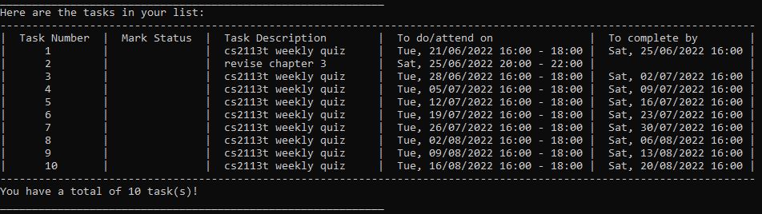

#### Task index of a task in timetable

The task number in the timetable as shown follows the index of a task
in the overall task list, i.e. the list containing all tasks added/edited. 
This allows a more intuitive approach towards adding/editing/deleting/marking/unmarking of tasks.

#### Time and Day column in timetable

The **Time** and **Day** in the full timetable follows the doOnDate attribute of a task.
Concept wise, this treats the doOnDate as the date and time when the task occurs,
or the date and time the user has set out to accomplish the task.

The **Timetable** is a component which contains the following classes:
1. Timetable (Initialises any command sequence)
2. TimetableLogic (Handles any computation necessary for the format of the timetable)
3. TimetablePrinting (Executes the printing of the timetable)

It also interacts with the classes to obtain the necessary inputs or facilitate the printing of the timetable:
- Parser (Includes TimetableParser)
- ShowCommand
- TaskList
- Ui
- Main

#### Parser Class

The **Parser** is a class which parses the inputs which the user enters. 
To activate the timetable, the user inputs commands that start with `show`.
This creates a **ShowCommand** object which will execute its method, thereby printing the timetable.

#### ShowCommand Class

Depending on the user input that was parsed by **Parser**, **ShowCommand** will call the 
relative methods which prints the timetable.

#### TaskList Class

As **ShowCommand** is being executed, it will retrieve a filtered list
of task by the date that is defined in the **ShowCommand** from the **TaskList** component. 
The filtered list represents the schedule that the user has on that given date. 
The list is assumed to be sorted previously when the user added/edited a task.

#### Ui Class
The **Ui** component is heavily relied upon when printing the timetable, as it is the class which
has a method called upon by **Timetable** to print the output into the terminal for the user to see.

#### Main Class

The overall component which accepts inputs read by **Ui** class, before assigning
the input over to Parser to break down the input into a suitable data for command execution.

#### Timetable usage scenario

Below is the overall sequence, represented by three sequence diagrams, showing what happens 
as the user enters a command to see the schedule (timetable) for 25th May 2022:

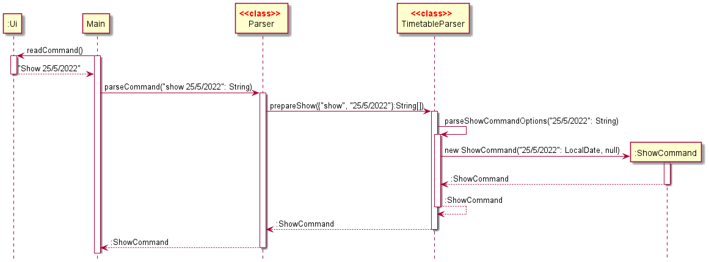

The first diagram covers the interactions between the Parser component,
the Timetable Parser, as well as the ShowCommand that is instantiated. It details
of how the user's input is being parsed into data that is recognised by the program. 
Here, we will assume that **Ui** will check and obtain any user input, before sending it to Main
and then to Parser to obtain the appropriate command to execute.

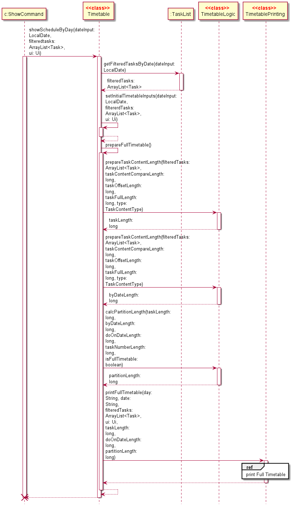

The second diagram shown above covers the next part of the interaction, which is after
the ShowCommand is being executed in main. It shows the sequences of interactions between
the ShowCommand, Timetable, TimetableLogic and TimetablePrinting, in order to print out the timetable 
the user has requested to view.

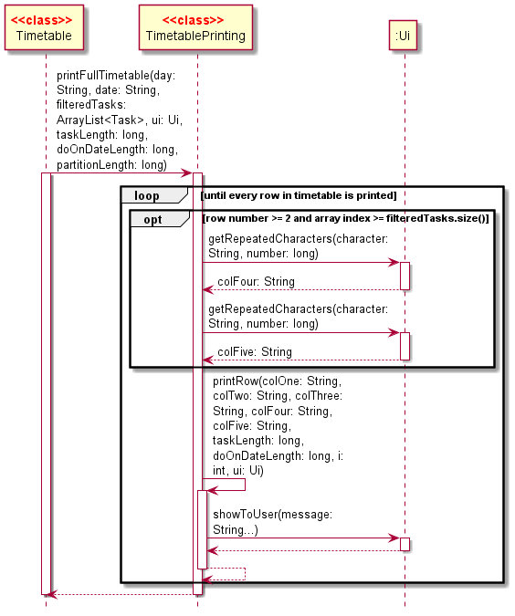

The last sequence diagram shows the inner details behind the printing of the timetable, which
follows the interactions between Timetable, TimetablePrinting and Ui.
In this case, all method calls of showToUser() by the Ui class is an output that the user is able see,
i.e. the printing of the timetable for viewing.

> **Note**: 
>- The sequence as shown above also happens in the same fashion as the user 
> requests to see the schedule for any day or the week the user is at.
>- The sequence is generally followed in the same order when printing a condensed timetable. 
> The only difference is the methods that are called to initialise and print the timetable.

The timetable for the current day is also shown to user as the user starts up
the program.

#### Design considerations for generating the timetable
- Current Implementation: Printing of timetable from scratch.
  - Pros: Easy to implement as timetable is generated based on request and input.
  - Pros: Adaptive as the timetable is only generated when needed and formatting is taken care of while generating it.
  - Cons: Significant time may be taken as timetable will have to be created from scratch. The delay may be extended if user has a lot of tasks.

- Alternative Implementation: Having a few templates, before choosing the suitable template and editing it if needed.
  - Pros: Reduces computation time
  - Cons: Increases memory usage

### Storage Implementation
#### Loading saved files

The loading of a save file is done with the function

`load()` in `Storage` class - Loads a saved JSON file and returns an ArrayList of task

The path of the JSON file is provided as a parameter in the constructor of `Storage` hence 
there is no need for any parameters in the `load()` function. Since a save file will be created in the 
constructor of `Storage` if no such file exists, there should not be any issue with a missing save file.

The save file has the following fields:
- `identifier`: A randomly generated number given to a task. A set of recurring tasks share the same identifier.
- `description`: Description of the task
- `status`: If the task is completed or not (`'X'` indicates completion, `-` otherwise)
- `do_date_start`: The start date and time of the task (d/M/yyyy HH:mm format)
- `do_date_end`: The end date and time of the task (d/M/yyyy HH:mm format)
- `by_date`: The due date of the task (d/M/yyyy HH:mm format) 

The sequence diagram of `load()` is shown here:

> 💡 **Note:** The TaskList is saved to disk at the end to ensure consistency

`load()` will throw exceptions in the following scenarios
1. The content of the save file cannot be parsed by `JSONObject` (i.e. the format of the file is incorrect)
2. There are missing fields for a task
3. There are tasks which have clashing date and times

In such scenarios, the user will get to choose to create a new save file or exit the program for manually edit the file.

#### Design considerations for the format of the save file
- JSON (current choice)
  - Pros: Easy to modify by hand if the user wants to
  - Pros: Easy to parse data
- XML
  - Pros:Reasonably easy for users to modify
  - Cons: Difficult to parse
- Text file with custom format
  - Pros: Might use less space (negligible)
  - Cons: Unintuitive for users to modify

## Product scope

### Target user profile

Students from CEG and SOC

### Value proposition

Sherpass aims to help students to tackle their individual hectic schedules by means of a planner.
Students can manage his/her time by adding their tasks into the application and get reminders
when the tasks are due for completion. Students can also use the study timers within the study session
to block out pockets of time for studying, so that they can better focus during study sessions.

## User Stories

| Version | As a ... | I want to ...                                     | So that I can ...                          |
|---------|----------|---------------------------------------------------|--------------------------------------------|
| v1.0    | user     | see the tasks I have to do today                  | remember what tasks I have to complete     |
| v1.0    | user     | edit task content and deadline                    | change my tasks accordingly                |
| v1.0    | user     | see the tasks I have planned for the week         | have a better picture of the week ahead    |
| v1.0    | user     | select amongst a few default study session timers | block out time to better focus on my tasks |
| v1.0    | user     | see the remaining time in the study session       |                                            |
| v1.0    | user     | be able to pause, stop and resume the study timer | go for a toilet/snack break                |
| v2.0    | user     | see my timetable of tasks and events              | have a better picture of my schedule       |
| v2.0    | user     | be able to mark my tasks as done in study session |                                            |
| v2.0    | user     | manage recurring tasks                            | enter my recurring tutorials and lectures  |
| v2.0    | user     | click a button to interact with the study timer   | interact with the timer more naturally     |
| v2.1    | user     | delete all my expired/completed tasks at once     |                                            | 

## Non-Functional Requirements

- The response to any commands should be returned within 3 seconds.
- The user interface should be user-friendly such that the product is still usable without referring to a user guide.

## Glossary

* *Timer* - Refers to something which can keep track of time. (e.g. `Countdown` and `Stopwatch` are timers)
* *Countdown* - Refers to a countdown timer, where it counts down from a specified time (e.g. 30 seconds) to 0 when the
countdown timer is started.
* *Stopwatch* - Refers to a stopwatch timer, where it records time elapsed from the moment the stopwatch is started.

## Instructions for manual testing

### Task managements

| Test cases                                                                      | Commands                                                                                                                                                                                    | Expected result                                                                                                                         |
|---------------------------------------------------------------------------------|---------------------------------------------------------------------------------------------------------------------------------------------------------------------------------------------|-----------------------------------------------------------------------------------------------------------------------------------------|
| Adding and editing tasks                                                        | `add task1 /do 8/8/2023 /start 13:00 /end 14:00` `add task2 /do 8/8/2023 /start 14:00 /end 15:00` `edit 1 /start 12:00 /end 13:00` `show all`                                   | Tasks are successfully added                                                                                                            |
| Adding and editing recurring tasks                                              | `add task1 /do 8/8/2023 /start 13:00 /end 14:00 /repeat weekly` `show all` `edit 1 /start 12:00 /bydate 8/8/2024 /bytime 23:59 /repeat`                                             | Tasks are successfully added                                                                                                            |
| Adding clashing tasks                                                           | `add task1 /do 8/8/2023 /start 13:00 /end 14:00` `add task2 /do 8/8/2023 /start 13:00 /end 15:00`                                                                                       | Error message listing clashing tasks                                                                                                    |
| Editing recurring tasks                                                         | `add task1 /do 8/8/2023 /start 13:00 /end 14:00 /repeat weekly` `show all` `edit 5 task2 /start 00:00 /end 23:00 /repeat` `edit 1 task3 /bydate 8/8/2024 /bytime 23:59 /repeat` | Two sets of recurring tasks, `task2` and `task3`                                                                                        |
| Deleting some occurrences of a recurring task                                   | `add task1 /do 8/8/2023 /start 13:00 /end 14:00 /repeat weekly` `show all` `delete 2` `delete 5` `show all`                                                                 | The tasks on 15/8/2022 and 12/9/2022 are deleted                                                                                        |
| Invalid index when deleting                                                     | `delete foo`                                                                                                                                                                                | Invalid index error message                                                                                                             |
| Valid Command when showing today timetable                                      | `show today`                                                                                                                                                                                | Timetable for today is displayed                                                                                                        |
| Invalid Command when showing monthly timetable                                  | `show sept`                                                                                                                                                                                 | Invalid input error message. Only 3-letter abbreviation of the specific month is accepted.                                              |
| Valid Command when displaying monthly timetable For e.g. February timetable | `show february` or `show feb`                                                                                                                                                               | February timetable is displayed. If the specific month selected is in the past, the upcoming future month will be displayed instead |

### Study Session

Remember to enter the Study session with `study` before you test these commands. 

| Test cases                                                 | Commands                      | Expected result                                      |
|------------------------------------------------------------|-------------------------------|------------------------------------------------------|
| Starting a default timer                                   | `start 1`                     | Countdown timer starts                               |
| Starting a custom timer                                    | `start /custom 60`            | Custom countdown timer starts                        |
| Starting a stopwatch timer                                 | `start stopwatch`             | Stopwatch timer starts                               |
| Pausing a running timer                                    | `pause`                       | Timer will be paused                                 |
| Resume a paused timer                                      | `resume`                      | Timer will be resumed                                |
| Stopping a running timer                                   | `stop`                        | Timer will be stopped                                |
| Viewing tasks with `show` when timer is paused             | `show all`                    | All tasks will be shown                              |
| Marking tasks as done when timer is paused                 | `mark 1`                      | Marks a task as done, assuming you have added a task |
| Viewing/marking tasks when a timer is running              | `show all` or `mark 1`        | Error message is shown                               |
| Pausing/resuming/stopping a timer without starting a timer | `pause` or `resume` or `stop` | Error message is shown                               |

