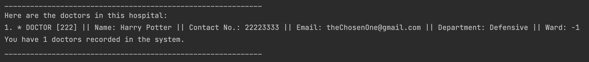
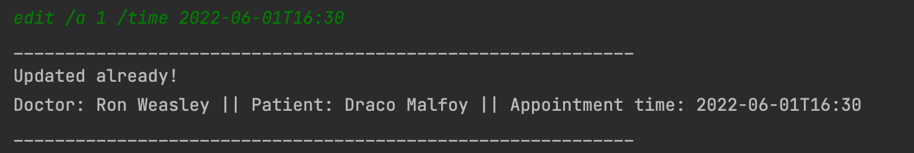

# Developer Guide

## Design & implementation

### Update patient information
Step 1:Patient inform the nurse of their change in personal information. Nurse will open up the IHospital system and request to submit the change. 
IHospital will call the Parser which calls on etPatientInfo() to update the patient information. 

Step 2:
The parser will call the database storing patient information to update the change.

The flow is presented in the sequence diagram (will be included later after pull request is permitted):

### Exit program
Step 1: User type "bye" as input to exit the program. IHospital will call Parser#getCommand()
to return the user command received.

Step 2: After checking the user command is "bye", IHospital will
call Ui#sayGoodbye to print Goodbye message

The following sequence diagram shows how the exit operation works:

### Add Doctor
Step 1: User type add command to add a doctor into the system and provide information required.
IHospital will call Parser#getCommand() to return the user command received, it will then call
Parser#parse to understand that User wants to add a doctor, and Parser#parse will return an 
AddDoctorCommand object.

Step 2: IHospital will call execute of the AddDoctorCommand object and AddDoctorCommand will
create a new Doctor with the given information and add it into DoctorList using 
DoctorList#addDoctor(doctor).

The following sequence diagram shows how the add operation works:

### Delete Doctor
Step 1: User types "delete doctor" to delete a specific doctor from the system.
This will be passed into IHospital, which will parse the command.

Step 2: The parser will call on parseDeleteDoctor which will invoke the DeleteDoctorCommand class.
The doctor list acts as a database storage containing the information of a list of doctors.
Once the doctor is removed from the doctor list, the system informs the user that the doctor is successfully removed.

### Add Ward
Step 1: User type add command to add a ward into the system and provide information required.
IHospital will call Parser#getCommand() to return the user command received, it will then call
Parser#parse to determine that the user selected add ward command, and Parser#parse will return an
AddWardCommand object.

Step 2: IHospital will call execute of the AddWardCommand object and AddWardCommand will
create a new Ward with the user provided information and add it into WardList using
WardList#addWard(ward).

The following sequence diagram shows how the add operation works:

### Add Appointment
Step 1: User types "add appointment" to add an appointment to IHospital. 
IHospital will call on the Parser to parse the command. The parser will call on the AddAppointmentCommand.

Step 2: AddAppointmentCommand calls on the Appointment List to add an appointment to the list of appointments.
The appointment list will create a new appointment object and add it to the list.

### List Nurse
Step 1: User types "list nurse" to view the list of nurses in IHospital.
IHospital will call on the Parser to parse through the command. The Parser will invoke ListNurseListCommand.

Step 2: ListNurseListCommand will call on the toString function in nurseList to print out the array of nurses.

### Storage Component
API: `PatientStorage.java` `DoctorStorage.java` `AppointmentStorage.java` `NurseStorage.java` `WardStorage.java`

The Storage component consists of:

1. `PatientStorage.java`: Reading and saving files which record all patients.
2. `DoctorStorage.java`: Reading and saving files which record all doctors.
3. `AppointmentStorage.java`: Reading and saving all appointments.
4. `WardStorage.java`: Reading and saving all wards.
## Product scope
Use in all hospitals in Singapore

## Target user profile
Hospital admin staff

## Value proposition
IHospital is a desktop application meant for staff in hospitals. Its main purpose is to manage patients,
doctors, nurses, appointments and wards data, and it’s optimised for use via a Command Line Interface (CLI).
If you can type fast, this application allows you to access relevant hospital information faster than traditional GUI applications.

## User Stories

| Version | As a ... | I want to ...                                     | So that I can ...                          |
|---------|----------|---------------------------------------------------|--------------------------------------------|
| v1.0    | user     | add a new person (doctor/patient) into the system | record information accordingly             |
| v1.0    | user     | delete an existing person                         | remove a person when he/she leaves         |
| v1.0    | user     | edit the information of a person                  | update information                         |
| v1.0    | user     | add an appointment                                | schedule an appointment for patients       |
| v1.0    | user     | search for a person/an appointment                | check details of a person/an appointment   |
| v2.1    | user     | add a nurse into the system                       | record information accordingly             |
| v2.1    | user     | assign some doctors/nurses/patients to a ward     | record information accordingly             |
| v2.1    | user     | view the doctor/patient page                      | check appointments of the doctors/patients |

## Non-Functional Requirements

1. Should work on any mainstream OS as long as it has Java 11 or above installed.

2. A user with above average typing speed for regular English text (i.e. not code, not system admin commands) 
should be able to accomplish most of the tasks faster using commands than using the mouse.

## Instructions for manual testing

1. Test case for `add doctor`: `add doctor /id 222 /n Harry Potter /ph 22223333 /e theChosenOne@gmail.com /dep Defensive`

Expected output: 

2. Test case for `add patient`: `add patient /id 333 /n Draco Malfoy /ph 88888888 /e poorPotter@gmail.com /s cough /d Allergic to Harry Potter`

Expected output: 

3. Test case for `add nurse`: `add nurse /id 001 /n Hermione Granger /ph 11111111 /e ministerForMagic@gmail.com /t Minister`

Expected output: 

4. Test case for `add appointment`: `add appointment /t 2022-06-03T10:30:00 /d 1 /p 1`

Expected output: 

5. Test case for `list`: `list doctor`

Expected output: 

6. Test case for `edit`: `edit /a 1 /time 2022-06-01T16:30`

Expected output: 

7. Test case for `search`: `search appointment 2022-06-01T16:30`

Expected output: 