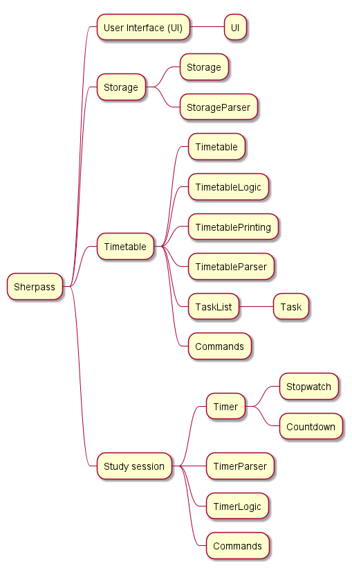
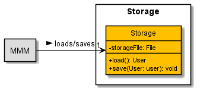

# Developer Guide

## Content Page
* [Content Page](#content-page)
* [Introduction](#introduction)
    * [Purpose](#purpose)
    * [Acknowledgements](#acknowledgements)
    * [Using the Developer Guide](#using-the-developer-guide)
* [Design](#design)
    * [Architecture Overview](#architecture-overview)
    * [Component Overview ](#component-overview )
      * [UI component](#ui-component)
      * [Parser component](#parser-component)
      * [Command component](#command-component)
      * [Storage component](#storage-component)
* [Implementation](#implementation)
    * [Add Command](#add-command)
      * [Add Expenditure](#add-expenditure-e)
      * [Add Credit Card](#add-credit-card-cc)
      * [Add Income](#add-income-i)
      * [Design Considerations](#addCommand-design-considerations)
    * [CalculateInputCommand feature](#calculateinputcommand-feature)
    * [ListCommand feature ](#listcommand-feature)
* [Appendix Requirements](#appendix-requirements)
  * [Product scope](#product-scope)
  * [User Stories](#user-stories)
  * [Non-Functional Requirements](#non-functional-requirements)
  * [Glossary](#glossary)
* [Instructions for manual testing](#instructions-for-manual-testing)

## Introduction

**MindMyMoney** (M3) is a desktop app for managing users' personal finances, optimized for use via a
Command Line Interface (CLI). With the application, users can track their expenses across multiple payment methods,
calculate monthly expenditure, and set financial goals. The application is targeted at students looking to start
managing their personal finances.

 

### Purpose
This document specifies the architecture and software design decisions for the application, MindMyMoney. 
The intended audience of this document is the developers, designers, and software testers of MindMyMoney.

 

### Acknowledgements
We would like to thank [AddressBook-3](https://se-education.org/addressbook-level3/) for assisting us in developing
MindMyMoney.

 

### Using the Developer Guide
Along the guide you may encounter several icons. These icons will provide several useful information.
> **💡 Note:**
>- This tells you that there is additional information that is useful when you are using the application.

> **⚠️Warning⚠️**
> - This tells you that there is some **important** information you should take note of to prevent issues from arising
    when you are using the application.  

Click on the hyperlinks in the [content page](#content-page) to quickly navigate the developer's guide.

 

## Design
**MindMyMoney** is written fully in **Java 11** using  Object-Oriented Programming (OOP) paradigm to help structure and
organise the code. This enables the efficiency of future improvements and revisions.
Data stored in the application is saved into text files locally on the user's device.  

 

### Architecture Overview
  
Fig 1 - Architecture Diagram for MindMyMoney

The Architecture Diagram above shows the high-level design of the application. The **main components**
consist of:
- `MMM`: Initialises the components in the correct sequence and connects them with each other. Also holds the user's
expenditures in memory.
- `Ui`: The User Interface of the application and deals with interaction with the user.
- `Parser`: Deals with making sense of user commands.
- `Commands`: The collection of all executable commands.
- `Storage`: Reads data from, and writes data to the hard disk.

By abstracting out closely related code into classes, it allows `MMM` to deal at a higher level, without worrying
about the lower level details. Higher cohesion is also achieved and coupling is minimized.

 

The Sequence Diagram below shows an example of how the components interact with each other for the scenario 
where the user issues the command `add /e /pm cash /c food /d Porridge /t 04/04/2022` to add an expenditure.

  Fig 2 - Sequence Diagram showing the Add Command

 

### Component Overview 
The major code is broken down into components for better abstraction. 
The sections below give more details for each component.

 

### UI component
The source code can be found in [`Ui.java`](https://github.com/AY2122S2-CS2113T-T10-4/tp/blob/master/src/main/java/seedu/mindmymoney/Ui.java)

  Fig 3 - Ui Class Diagram

The UI component consists of a `Ui` and `PrintStrings` class.

The UI component:
- Prints the welcome banner and message on startup, as well as a financial tip from the `PrintStrings` class.
- Prints `>` before the user's input, to help the user differentiate between their input and an output from the
application.
- Reads input from the user.

 

### Parser component
The source code can be found in [`Parser.java`](https://github.com/AY2122S2-CS2113T-T10-4/tp/blob/master/src/main/java/seedu/mindmymoney/Parser.java)

  Fig 4 - Parser Class Diagram

The Parser component consists of a `Parser` and `User` class. The `User` class further consists of an `ExpenditureList`, 
`CreditCardList` and `IncomeList` class, which makes use of the `Expenditure`, `CreditCard` and `Income` class respectively.

The Parser component:
- Receives user's input and splits it into the Command Type and Description using the `GeneralFunctions` class.
- Uses the `User` class and user's input to instantiate a `Command` object based on the Command Type.
- Returns the `Command` object that can then be executed.

We pass in the `User` class to the `Command` object instead of using a global variable to ease testing. This way, we can 
add, delete and update entries in a new `User` during testing without affecting the actual `User`.

 

### Command component 
The source can be found in [`command`](https://github.com/AY2122S2-CS2113T-T10-4/tp/blob/master/src/main/java/seedu/mindmymoney/command)

  
Fig 5 - Command Class Diagram

The Command component consists of Command abstract class, `AddCommand`, `ByeCommand`, `DeleteCommand`, `HelpCommand`
,`CalculateInputCommand`, `ListCommand`and `UpdateCommand` that extends the `Command` class.

The Command component:
- Provides all the Command classes which can be instantiated by `Parser.parseCommand()`. The Command objects can then be 
executed. Only 1 Command object can be created.
- Includes a `Command.executeCommand()` method in each Command classes which performs the relevant command and throws 
exceptions if an error is encountered. The error is then handled.

 

### Storage component 
The source can be found in [`Storage.java`](https://github.com/AY2122S2-CS2113T-T10-4/tp/blob/master/src/main/java/seedu/mindmymoney/Storage.java)

  
Fig 6 - Storage Class Diagram

The Storage component consists of `Storage` class.

The Storage component:
- `MMM` class initialises a `Storage` object upon start up. The `Storage` class consists of 
`Storage.load()` and `Storage.save()` methods. 
- Concurrently, `MMM` will call the `Storage.load()` method and load any data that is stored on the hard disk.
- `MMM` calls the `Storage.save()` method and stores remaining data onto the hard disk when the program exits.

 

## Implementation
This section describes some noteworthy details on how certain features of MindMyMoney are implemented.

 

### Add Command
The source code can be found in [`AddCommand.java`](https://github.com/AY2122S2-CS2113T-T10-4/tp/blob/master/src/main/java/seedu/mindmymoney/command/AddCommand.java)

The AddCommand feature allows users to add expenditures, credit cards or their income using a single command. 
This provides speed and ease of use by only requiring a single line of input.

The AddCommand has 3 parts. These parts are differentiated by their flags:
- Add expenditure `/e`.
- Add credit card `/cc`.
- Add income `/i`.

The sequence diagram below shows the interactions when an `AddCommand` is executed.  

  
Fig 7 - AddCommand Sequence Diagram  

Below is an example showing how the AddCommand behaves at each step.
1. The `Parser` component parses user input and returns the new `AddCommand` object to the
   `MindMyMoney`.
2. `AddCommand` instantiates `addInput`, `expenditureList`, `creditCardList`, `incomeList`.
3. The application invokes `AddCommand.executeCommand()` to execute user instruction.
4. If user input contains credit card flag, the application executes `AddCommand.addCreditCard()`.
5. Else if user input contains income flag, the application executes `AddCommand.addIncome()`.
6. Else the application executes `AddCommand.addExpenditure()`.
7. The application then returns to the Parser component.

 

#### Add Expenditure `/e`
A key functionality of MindMyMoney is the ability to add and track user expenditure. Expenditures are added through
the `AddCommand.addExpenditure()` method, invoked when using the `/e` flag. Additional parameters `PAYMENT_METHOD`, 
`CATEGORY`, `DESCRIPTION`, `AMOUNT` and `TIME` are also required.

  
Fig 8 - Add Expenditure Command Sequence Diagram  

The sequence diagram above shows the interactions of different classes when adding an expenditure
to the list.

1. During the execution, `AddCommand.addExpenditure()` will parse through user input to obtain the `PAYMENT_METHOD`, `CATEGORY`,
   `DESCRIPTION`, `AMOUNT` and `TIME` fields.
2. Once all the fields are obtained, `AddCommand.addExpenditure()` will run tests for its respective fields and capitalise the 
   `PAYMENT_METHOD`, `CATEGORY` input.
3. The `AddCommand.addExpenditure()` object instantiates a new `Expenditure` object with the aforementioned 5 fields and adds them
   into the `ExpenditureList`.
4. The `AddCommand.addExpenditure()` object prints a list to show the user what it has saved.
5. The `AddCommand.addExpenditure()` returns to `AddCommand`.

 

#### Add Credit Card `/cc`
MindMyMoney allows users to track their different credit cards. Credit cards are added through the `AddCommand.addCreditCard()`
method, invoked when using the `/cc` flag. Additional parameters `CREDIT_CARD_NAME`, `CASHBACK` and `CARD_LIMIT` are also
required.

   
Fig 9 - Add Credit Card Command Sequence Diagram

The sequence diagram above shows the interactions of different classes when adding a credit card to the list.

1. During the execution, `AddCommand.addCreditCard()` will parse through user input to obtain the `CREDIT_CARD_NAME`, `CATEGORY`,
   `CASH_BACK`, `CARD_LIMIT` and `CARD_BALANCE` fields.
2. Once all the fields are obtained, `AddCommand.addCreditCard()` object instantiates a new `CreditCard`
   object with the aforementioned 5 fields and adds them into the `CreditCardList`.
3. The `AddCommand.addCreditCard()` object prints a list to show the user what it has saved.
4. The `AddCommand.addCreditCard()` returns to `AddCommand`.

 

#### Add Income `/i`
MindMyMoney allows users to track their sources of income. Incomes are added through the `AddCommand.addIncome()`
method, invoked when using the `/i` flag. Additional parameters `AMOUNT` and `CATEGORY` are also required.

  Fig 10 - Add Income Sequence Diagram

The sequence diagram above shows the interactions of different classes when adding an income to the list.

1. After receiving the `AddCommand` object from `Parser`, `MMM` calls the `AddCommand.executeCommand()` method.
2. `AddCommand.addIncome()` method is invoked as the `/i` flag is present. It parses through the user's input to obtain 
`AMOUNT` and `CATEGORY` fields. It also runs tests on these fields to ensure the inputs are valid.
3. An `Income` object is instantiated using the aforementioned fields and is added into the `IncomeList`.
4. Control is returned to `MMM`.

 

#### AddCommand Design Considerations
Aspect: How to ask user for the fields of input.
* Alternative 1 (current choice): User is asked to put in all fields at once, separated using flags.
    * Pros: Faster input, user can enter an expenditure using a single input.
    * Cons: User must be able to remember all the flags and its sequence.

* Alternative 2: User is asked iteratively to put in all fields, prompted by a message after each input.
    * Pros: Beginner friendly, easily understandable, no need to remember flags.
    * Cons: Slower, implementation when user is familiar with the application.

 

### CalculateInputCommand feature
The source code can be found in [`CalculateInputCommand.java`](https://github.com/AY2122S2-CS2113T-T10-4/tp/blob/master/src/main/java/seedu/mindmymoney/command/CalculateInputCommand.java)
[`Calculations.java`](https://github.com/AY2122S2-CS2113T-T10-4/tp/blob/master/src/main/java/seedu/mindmymoney/helper/Calculations.java)

MindMyMoney allows users to view their finances in a more meaningful manner by displaying the total expenditure and breakdown of expenses in a
bar chart format.

The CalculateCommand can take in 3 different `[DATE]` fields:
- `calculate /epm [DD/MM/YYYY]` allows user to calculate total expenditure of the specific date.
- `calculate /epm [MM/YYYY]` allows user to calculate total expenditure of the specific month.
- `calculate /epm [YYYY]` allows user to calculate total expenditure of the specific year.

  Fig 11 - Calculate Input Command Sequence Diagram

The sequence diagram above shows the interactions of different classes when calculating the expenditure.

1. After receiving the `CalculateInputCommand` object from `Parser`, `MMM` calls the `CalculateInputCommand.executeCommand()` method.
2. `GeneralFunctions.parseInput()` method is invoked to obtain the flag and date of the input.
3. If `/epm` flag is present. It calls `Calculations.calculateExpenditure()` method to obtain the total expenditure of the date specified.
4. During the execution of `Calculations.calculateExpenditure()`, the `GeneralFunctions.findItemInList()` is invoked to 
find the items that contain the specified date.
5. Afterwards, `Calculations.displayCalculationBreakdown()` is invoked to show the breakdown of expenses in a bar chart format.
6. If `/epm` flag is not present, MindMyMoneyException is thrown.

#### CalculateCommand Design Considerations
Aspect: How to allow users to have a better understanding of their own expenses.
* User is required to input either the date, month or year in order to calculate their expenses.
  * Pros: User can have a better understanding of their expenditure breakdowns by the specified time they want to look for.
  * Cons: User is required to fill in a date, and the date must be found in the list of expenditures.

* Use of bar chart to represent breakdown of expenses in the CalculateInputCommand.
  * Pros: Users can view their overall expenses in a bar chart format, which is easier to view at one glance.
  * Cons: Some users may not prefer to visualise their data in a bar chart format.

### ListCommand feature
The source code can be found in [`ListCommand.java`](https://github.com/AY2122S2-CS2113T-T10-4/tp/blob/master/src/main/java/seedu/mindmymoney/command/ListCommand.java)  

MindMyMoney allow users to view their current list of added expenditures. 
#### Current Implementation
The sequence diagram below shows the interactions of different subcomponents of the system when listing.  

  Fig 13 - List Command Sequence Diagram

#### ListCommand design considerations
Aspect: How to make the `ListCommand` easily tested using JUnit testing.
* Alternative 1 (current choice): Abstract the conversion of `Expenditure` to `String` in a separate` ListCommand.listToString()` method.
  * Pros: Easily tested using JUnit testing, by checking the String that the `ListCommand.listToString()` method returns.
  * Cons: Added layer of abstraction that may be deemed redundant.

* Alternative 2: Print directly in the `ListCommand.executeCommand()` method .
  * Pros: Easily implemented with lesser lines of code as the code is minimalist.
  * Cons: JUnit testing would require I/O redirection prior to checking the output matches expectations.

## Appendix Requirements
  
  
### Product scope

**Target user profile**
- a student beginner who wants to start managing their finances
- possess an income
- prefer desktop application
- is proficient in CLI
- can type fast
- prefers typing to mouse interactions

**Value proposition**
Manage finances containing multiple payment methods faster than a typical mouse/GUI driven app.

### User Stories

|Version| As a ... | I want to ... | So that I can ...|
|--------|----------|---------------|------------------|
|v1.0|new user|see usage instructions|refer to them when I forget how to use the application|
|v2.0|user|find a to-do item by name|locate a to-do without having to go through the entire list|

### Non Functional Requirements

1. Should work on any mainstream OS as long as it has Java 11 or above installed.   
3. A user with above average typing speed for regular English text (i.e. not code, not system admin commands)
   should be able to accomplish most of the tasks faster using commands than using the mouse.

### Glossary

* Mainstream OS: Windows, Linux, Unix, OS-X  

## Instructions for manual testing

{Give instructions on how to do a manual product testing e.g., how to load sample data to be used for testing}
