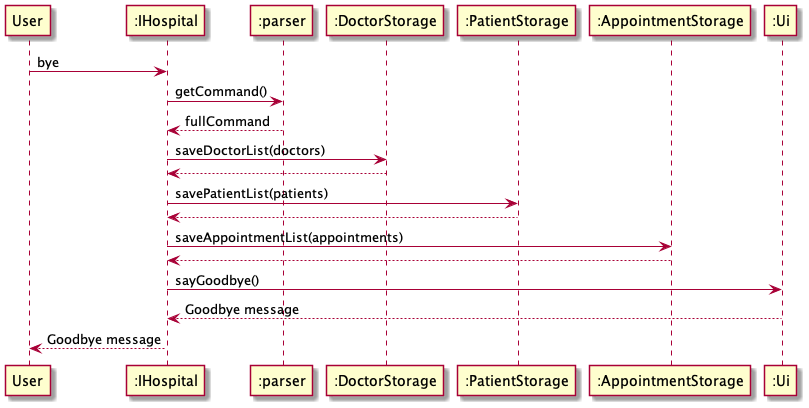

# Developer Guide

## Acknowledgements

{list here sources of all reused/adapted ideas, code, documentation, and third-party libraries -- include links to the original source as well}

## Design & implementation

{Describe the design and implementation of the product. Use UML diagrams and short code snippets where applicable.}

### Update patient information
Step 1:Patient inform the nurse of their change in personal information. Nurse will open up the Duke system and request to submit the change. Duke will call the Parser#etPatientInfo() to update the patient information. 

Step 2:
The parser will call the database storing patient information to update the change.

The flow is presented in the sequence diagram (will be included later after pull request is permitted):

### Exit program
Step 1: User type "bye" as input to exit the program. IHospital will call Parser#getCommand()
to return the user command received.

Step 2: After checking the user command is "bye", IHospital will
call Ui#sayGoodbye to print Goodbye message

The following sequence diagram shows how the exit operation works:

### Add Doctor
Step 1: User type add command to add a doctor into the system and provide information required.
IHospital will call Parser#getCommand() to return the user command received, it will then call
Parser#parse to understand that User wants to add a doctor, and Parser#parse will return an 
AddDoctorCommand object.

Step 2: IHospital will call execute of the AddDoctorCommand object and AddDoctorCommand will
create a new Doctor with the given information and add it into DoctorList using 
DoctorList#addDoctor(doctor).

The following sequence diagram shows how the add operation works:

### Delete Doctor
Step 1: User types "delete doctor" to delete a specific doctor from the system.
This will be passed into IHospital, which will parse the command.

Step 2: The parser will call on parseDeleteDoctor which will invoke the DeleteDoctorCommand class.
The doctor list acts as a database storage containing the information of a list of doctors.
Once the doctor is removed from the doctor list, the system informs the user that the doctor is successfully removed.

### Add Appointment
Step 1: User types "add appointment" to add an appointment to IHospital. 
IHospital will call on the Parser to parse the command. The parser will call on the AddAppointmentCommand.

Step 2: AddAppointmentCommand calls on the Appointment List to add an appointment to the list of appointments.
The appointment list will create a new appointment object and add it to the list.

### List Nurse
Step 1: User types "list nurse" to view the list of nurses in IHospital.
IHospital will call on the Parser to parse through the command. The Parser will invoke ListNurseListCommand.

Step 2: ListNurseListCommand will call on the toString function in nurseList to print out the array of nurses.

## Product scope
Use in all hospitals in Singapore
### Target user profile
Hospital admin staff

### Value proposition
IHospital is a desktop application meant for staff in hospitals. Its main purpose is to manage patients,
doctors, nurses, appointments and operation rooms data, and it’s optimised for use via a Command Line Interface (CLI).
If you can type fast, this application allows you to access relevant hospital information faster than traditional GUI applications.

## User Stories

| Version | As a ... | I want to ...                                     | So that I can ...                    |
|---------|----------|---------------------------------------------------|--------------------------------------|
| v1.0    | user     | add a new person (doctor/patient) into the system | record their information             |
| v1.0    | user     | delete an existing person                         | remove a person when he/she leaves   |
| v1.0    | user     | edit the information of a person                  | update information                   |
| v1.0    | user     | add an appointment                                | schedule an appointment for patients |

## Non-Functional Requirements

{Give non-functional requirements}

## Glossary

* *glossary item* - Definition

## Instructions for manual testing

{Give instructions on how to do a manual product testing e.g., how to load sample data to be used for testing}
