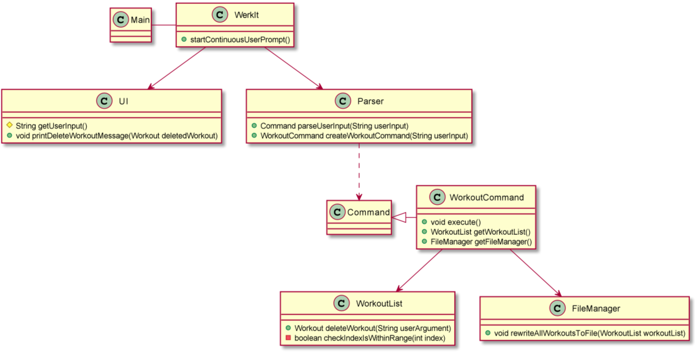

# WerkIt! Developer Guide

## Table of Contents
* [Acknowledgements](#acknowledgements)
* [Design](#design)
* [Implementation](#implementation)
* [Product Scope](#product-scope)
* [User Stories](#user-stories)
* [Non-Functional Requirements](#non-functional-requirements)
* [Glossary](#glossary)
* [Instructions for Manual Testing](#instructions-for-manual-testing)

## Acknowledgements
The following websites and codebases were referenced and adapted for our project:

* AddressBook-Level2 project ([Website](https://se-education.org/addressbook-level2/) | 
[GitHub](https://github.com/se-edu/addressbook-level2))
* Team Member Alan Low's individual project (iP) codebase ([GitHub](https://github.com/alanlowzies/ip))

## Setting Up your Development Environment
### Requirements
- [X] Java JDK version 11
- [X] An IDE of your choice, though IntelliJ IDEA is recommended as this project is developed
with this IDE.

> Note: IDE-related references in this developer guide IDE will be tailored for IntelliJ IDEA. 

### Setting Up
1. Fork the [WerkIt! GitHub repository](https://github.com/AY2122S2-CS2113T-T09-2/tp).
2. Clone your fork to your machine.
3. Set up your local repo in your IDE.
    - Ensure that the project in your IDE is configured to run on Java JDK version 11. 
    - A guide on setting your project to use JDK 11 in your IntelliJ IDEA IDE can be found 
[here](https://www.jetbrains.com/help/idea/sdk.html#set-up-jdk).
4. Run `Main.java`. If you have set up your environment correctly, you should see the following
output in your terminal: 
```
======================================================================
 __        __        _    ___ _   _ 
 \ \      / /__ _ __| | _|_ _| |_| |
  \ \ /\ / / _ \ '__| |/ /| || __| |
   \ V  V /  __/ |  |   < | || |_|_|
    \_/\_/ \___|_|  |_|\_\___|\__(_)
                                    
Welcome to WerkIt!, your personal exercise planner.
----------------------------------------------------------------------
Checking for required directory and files...
- The required data directory was not found. It will be created.
- The WerkIt! resource directory has been created in
  your terminal's current working directory.

- The exercise file was not found. It will be created.
- The exercise file 'exercises.txt' has been created in
  the WerkIt! resource directory.

- The workout file was not found. It will be created.
- The workout file 'workouts.txt' has been created in
  the WerkIt! resource directory.

- The plan file was not found. It will be created.
- The plan file 'plans.txt' has been created in
  the WerkIt! resource directory.

- The schedule file was not found. It will be created.
- The schedule file 'schedule.txt' has been
  created in the WerkIt! resource directory.

Loading saved file data...
- Exercises file	OK!
----------------------------------------------------------------------
Now then, what can I do for you today?
(Need help? Type 'help' for a guide!)
----------------------------------------------------------------------
>
```
5. Type `exit` to exit the program.

You are now ready to begin developing!

## Design 
### Overview

---

## Implementation
### Overview
* [Getting User Input Continuously](#getting-user-input-continuously)
* [Parsing User Input and Getting the Right Command](#parsing-user-input-and-getting-the-right-command)
* [Create New Workout](#create-new-workout)
    * [Design Considerations](#design-considerations-for-creating-a-new-workout) 
* [Search](#search)
  * [Search for Exercise](#search-for-exercise)
  * [Search for Plan](#search-for-plan)

---

### Getting User Input Continuously
Once `WerkIt` has finished loading any saved file data on the user's system, it will call 
`WerkIt#startContinuousUserPrompt()`. This method will call on `UI#printUserInputPrompt()` to print a prompt message
to the terminal and `UI#getUserInput()` to wait and capture the user's input. The input will be captured with the aid 
of Java's built-in `Scanner` class.

Once the user has entered an input, `UI#getUserInput()` trims any preceding and trailing whitespaces before returning 
the user's input as a `String` object to `WerkIt#startContinuousUserPrompt()`. Then, 
`WerkIt#startContinuousUserPrompt()` calls `Parser#parseUserInput()` to parse the user's input and create a
an object that is a subclass of the `Command` class. If there is no issue with the formatting of the user's input,
this subclass-of-`Command` object is returned to `WerkIt#startContinuousUserPrompt()`.

> A detailed implementation of the parsing and creation of subclass-of-`Command` object process can be found in
'[Parsing User Input and Getting the Right Command](#parsing-user-input-and-getting-the-right-command)'.

Next, `WerkIt#startContinuousUserPrompt()` calls on the `execute()` method of the subclass-of-`Command` object to
perform the user's requested action. If the execution goes smoothly, this completes the user's inputted command.
This process is repeated until the user enters `exit`, which will terminate the loop, call `UI#printGoodbye()` to
print a goodbye message to the user, before handing control back to `Main#main` to end the program.

#### Design Considerations
* `WerkIt#startContinuousUserPompt()` has a boolean flag `isFirstPrompt`. This flag allows WerkIt to
print a different prompt each time the application starts up, before defaulting to a different prompt message
for subsequent prompts.
   * When the user starts the application, `isFirstPrompt` is set to `true` and thus, the prompt will be
  ```
  ----------------------------------------------------------------------
  Now then, what can I do for you today?
  (Need help? Type 'help' for a guide!)
  ----------------------------------------------------------------------
  >
  ```
  * Subsequent prompts in that app's session will be
  ```
  ----------------------------------------------------------------------
  What's next?
  ----------------------------------------------------------------------
  >
  ```

---

### Parsing User Input and Getting the Right Command
**_TODO_**: Explain how the app parses user input and determines which `Command` subclass object to instantiate.

---

### Create New Workout

A summary of the general procedure of a new workout being inputted and stored into WerkIt! is as follows:
1. User enters the command `workout /new <workout name> /reps <number of repetitions>`.
2. A new `Workout` object is created and stored in the application.
3. The success response is printed to the user through the terminal.
4. The new `Workout` object data is written to the resource file `workouts.txt`.

The following sequence illustrates how the `workout /new` command works in greater detail:
> To simplify the sequence diagram, some method invocations that deemed to be trivial 
> have been removed from the sequence diagram. Reference frames will be elaborated further 
> down this section.


(Steps 1 to 3) The program waits for the user to enter a new command, which in this case is the `workout /new` command,
and returns the user input in a `String` object to `WerkIt#startContinuousUserPrompt()`. 

(Steps 4 and 5) `Parser#parseUserInput()` parses the user input to obtain a `WorkoutCommand` object that is upcasted 
to a `Command` object on return to `WerkIt#startContinuousUserPrompt()`. In Step 6, `WorkoutCommand#execute()` is called
and because this is a `workout /new` command, the method will call `WorkoutList#createAndAddWorkout()`.

The following sequence diagram is the detailed procedure for Step 7's `WorkoutList#createAndAddWorkout()`:


> Note: Logging-related method calls in `WorkoutList#createAndAddWorkout()` have been omitted in an effort to simplify 
> the sequence diagram.

(Steps 7.1 to 7.6) The `String#split()`, `String#trim()`, and `Integer#parseInt()` methods are used to parse the 
argument given to `WorkoutList#createAndAddWorkout()` to obtain the following information required to create the 
`Workout` object:
1. Name of the exercise
2. Number of repetitions associated with the exercise in (1).

(Steps 7.7 to 7.20) Validity checks of the user input are carried out to ensure that the data entered is valid as a
new `Workout` object. The requirements for a valid new `Workout` object is as follows:
- [x] The exercise name must exist in `ExerciseList`'s `exerciseList`, which is an `ArrayList<String>` of exercise 
names.
- [x] The repetition value must be a non-negative integer greater than 0.
- [x] The (exercise name, repetition value) must not already exist in the list of workouts maintained in
`WorkoutList`. For example, if a workout of 20 reps of push-ups is already stored in the list,
it cannot be created again.

If any of the three requirements are not met, either an `InvalidExerciseException` or an
`InvalidWorkoutException` is thrown, and the entire workout creation process is aborted.

If the above checks pass, Step 7.21 will create the new `Workout` object with the user-specified exercise name and 
repetition value. Once that is done, Step 7.23 will generate the key of the `Workout` object (see the 
[Design Considerations](#design-considerations-for-creating-a-new-workout) section for more details of the `HashMap`
implementation), before storing the key-`Workout` pair in `workoutsHashMapList` stored in `WorkoutList` in Step 7.25.
In Step 7.27, the key of the newly-created `Workout` object is added to the `workoutsDisplayList` `ArrayList<String>`
stored in `WorkoutList`. This ArrayList will be used for displaying the workouts when the command `workout /list` is 
entered by the user. This is the final step of the `WorkoutList#createAndAddWorkout()`.

(Step 9) Upon returning to `WorkoutCommand`, `UI#printNewWorkoutCreatedMessage()` is called to display a response to
the user via the terminal. The following is an example of a response after the user entered `workout /new russian twist 
/reps 50`:
```
----------------------------------------------------------------------
Alright, the following workout has been created:

	russian twist (50 reps)

----------------------------------------------------------------------
```

(Step 12) `FileManager#writeNewWorkoutToFile` is called to write the newly-created `Workout` object's data into 
`workouts.txt` which is stored on the user's local filesystem.

This completes the process of adding a new workout to WerkIt!

#### Design Considerations for Creating a New Workout
##### HashMaps - Motivation
Back in Version 1.0 of WerkIt!, workouts were stored in an ArrayList of `Workout` objects. In that version, plans
and schedules were not yet implemented and thus there was no real issues, since we can easily use index numbers
shown in `workout /list` to reference workouts when the user enters `workout /update` and `workout /delete` commands.

As an example, here is a list of workouts as shown when `workout /list` is used:
```
----------------------------------------------------------------------
> workout /list
----------------------------------------------------------------------
Showing workouts 1-3 of 3:

1. push up (10 reps)
2. sit up (10 reps)
3. pull up (10 reps)

Showed all workouts in list
----------------------------------------------------------------------
```

Thus, if we want to update the workout with 10 reps of push-ups, we can enter `workout /update 1 15` to update 
the repetition value to 15.

However, when we were designing and preparing for Version 2.0, we discovered that this **relative referencing** of
workouts by their indices pose a potentially cumbersome issue when implementing the plans and schedule features. If
we were to continue using relative indexing to reference workouts in plans, the effort needed to maintain the 
references in plans can become unnecessary complex.

For example, using the same list of workouts we have above, suppose we have a plan that includes workout indices
1 and 3 (10 push-ups and 10 pull-ups). Now, suppose the user decides to delete workout index 2 (10 sit-ups), this
means that the 10 pull-ups will now have an index number of 2. Thus, if we were to continue using relative indexing
to reference workouts in plans, there is a greater risk of making wrong references, and the amount of additional
code to update these references can become too complex.

##### Usage of HashMap
Thus, we have decided to use a HashMap on top of the existing ArrayList to store `Workout` objects. This will allow 
workouts to be referenced by their unique keys when creating plans and schedules, while allowing the user to continue
using the convenience of relative indexing for `workout /update` and `workout /delete` commands. The ArrayList of 
`Workout` objects from before is now converted into an ArrayList of Strings that will keep the keys of the `Workout` 
objects. Now, to manipulate the `Workout` object (e.g. `workout /update`),
1. User enters the index number of the workout he/she wants to update (as seen in `workout /list`).
2. The key of the `Workout` object is obtained from the ArrayList of keys (`workoutsDisplayList`).
3. The `Workout` object is obtained from the HashMap (`workoutsHashMapList`).

Note that the user will not have any direct interactions with the HashMap implementation and it should be transparent
to him/her.

---

### Delete Existing Workout
Class diagram for Delete Workout:

<br>
<br>
Sequence diagram for Delete Workout:

<br>
<br>

When WerkIt is running, the `WerkIt` class will keep prompting the user to enter command through the
`WerkIt#startContinuousUserPrompt()` method. After the user has entered command, The `UI#getUserInput()` method in `UI`
class will catch the user input, and it will be sent to `Parser#parseUserInput(String userInput)` method to analyse the
user's command. If the user's command type is to delete an existing workout, i.e. `workout /delete <workout number>`, the
`Parser#parseUserInput(String userInput)` method will parse the 'workout' base word and proceed to create workout related
command using `Parser#createWorkoutCommand(String userInput)` method. This method will further evaluate the
workout action, in this case, `/delete` and call the constructor of `WorkoutCommand` class by passing relevant parameters related to the
WorkoutCommand constructor. If the workout action is null or incorrect, an InvalidCommandException will be thrown. If the `<workout number>`
parameter is also not specified, the same InvalidCommandException is thrown. Once the workout command is created,
this workout command is executed via the `WorkoutCommand#execute()` method. As it is executed, the method will check the type of action to be executed, in this case,
delete. It will then remove the existing workout using the `WorkoutList#deleteWorkout(getUserArguments())` method. The deleteWorkout method
in addition, checks whether the workout number supplied is a valid integer and is within the range of the workout list. If both condition
is not met, the NumberFormatException and WorkoutOutOfRangeException is thrown accordingly. Once the existing workout is successfully deleted,
the UI will print a success message and call the `FileManager#rewriteAllWorkoutsToFile(getWorkoutList())` method to save the changes.

#### Delete existing workout command
Format: `workout /delete <workout number in workout list>`

### List Workout

<br>
user's command. If the user's command type is to list the workouts created, i.e. `workout /list`, the
`Parser#parseUserInput(String userInput)` method will parse the 'workout' base word and proceed to create workout related
command using `Parser#createWorkoutCommand(String userInput)` method. This method will further evaluate the
workout action, in this case, `/list` and call the constructor of `WorkoutCommand` class by passing relevant parameters related to the
WorkoutCommand constructor. If the workout action is null or incorrect, an InvalidCommandException will be thrown. Once the workout command is created,
this workout command is executed via the `WorkoutCommand#execute()` method. As it is executed, the method will check the
type of action to be executed, in this case, list. It will then list the workouts created and stored in the workoutList using the `WorkoutList#listWorkout()`
method which will call `WorkoutList#continuousPrinting(int index, int noOfPrints)` method to determine
the number of workouts to be printed. The maximum number of workouts to be displayed at a time is 10 workouts. If there are more than
10 workouts stored in the workoutList, it will prompt the user to enter 'yes' or 'no' to determine the continuation of the printings.
`isInputYesOrNo(String answer)` method is executed when user enter the answer for the continuation of printing.
If the answer given by the user is neither 'yes' nor 'no', user will be prompt to enter their option again until they give the expected input.
When 'yes' is entered, the printing will continue and `WorkoutList#continuousPrinting(int index, int noOfPrints)` method will be executed again.
Otherwise, `WorkoutList#listWorkout()` method will be terminated.

#### List workouts command
Format: `workout /list`

### Search

<br>

When WerkIt is running, the `WerkIt` class will keep prompting the user to enter command through the
`WerkIt#startContinuousUserPrompt()` method. After the user has entered command, The `UI#getUserInput()` method in `UI`
class will catch the user input, and it will be sent to `Parser#parseUserInput(String userInput)` method to analyse the
user's command. If the user's command type is search, i.e. `search <userAction> <keywords>`, the
`Parser#parseUserInput(String userInput)` method will parse the 'search' base word and proceed to create search related
command using `Parser#createSearchCommand(String userInput)` method. This method will further evaluate the
`<userAction>` and call the constructor of `SearchCommand` class by passing relevant parameters related to search to the
constructor. If the `<userAction>` is null or incorrect, an InvalidCommandException will be thrown. If the `<keywords>`
is not specified, an InvalidCommandException will be thrown.

#### Search for exercise
Format: `search /exercise <keywords>`

The `Parser#createSearchCommand(String userInput)` method will further evaluate the user input
`/exercise` and call the constructor of `SearchCommand` class by passing relevant parameters related to search exercise
to the constructor. The created `SearchCommand` object is returned by the `Parser#createSearchCommand(String userInput)`
method to `Parser#parseUserInput(String userInput)` method, and finally returned by
`Parser#parseUserInput(String userInput)` method to `WerkIt#startContinuousUserPrompt()` method. The search command will
be executed in `WerkIt#startContinuousUserPrompt()`. And based on the `<keywords>` specified by the user, the output
will either be a list of matching exercises or 'Sorry, no matching exercise found' if the user has entered the command
correctly.

#### Search for plan
Format: `search /plan <keywords>`

The `Parser#createSearchCommand(String userInput)` method will further evaluate the user input
`/plan` and call the constructor of `SearchCommand` class by passing relevant parameters to the constructor.
The created `SearchCommand` object is returned by the `Parser#createSearchCommand(String userInput)`
method to `Parser#parseUserInput(String userInput)` method, and finally returned by
`Parser#parseUserInput(String userInput)` method to `WerkIt#startContinuousUserPrompt()` method. The search command will
be executed in `WerkIt#startContinuousUserPrompt()`. And based on the `<keywords>` specified by the user, the output
will either be a list of matching names of plan or 'Sorry, no matching plan found' if the user has entered the command
correctly.

---

## Product Scope
### Target User Profile

{Describe the target user profile}

### Value Proposition

{Describe the value proposition: what problem does it solve?}

## User Stories

|Version| As a ... | I want to ... | So that I can ...|
|--------|----------|---------------|------------------|
| v1.0 | user | create a workout | keep track of how many repetitions I would like to do with an exercise |

## Non-Functional Requirements

{Give non-functional requirements}

## Glossary

* **Exercise** - A single 'unit' of exercise. A type of exercise.
    * e.g. push up, jumping jacks, sit-ups
* **Workout** - A single 'unit' of exercise with a number of repetitions associated with it.
    * e.g. push up (5 reps), jumping jacks (2 reps), sit-ups (7 reps)
* **Plan** - A set of workouts
    * Example:

| Plan Name | Contains |
| --- | --- |
| Grow my Biceps | Barbell curls (3 reps), push ups (10 reps), deadlift (2 reps) |
| Whole Body! | Crunches (10 reps), jumping jack (3 reps), lift ups (4 reps), pull ups (3 reps), planking (2 reps), leg cycle (2 reps) |

* **Schedule** - Consists of Days 1 to 7. Users will add or modify a plan to that particular day
of their schedule. For instance, the user's daily schedule can look like this:

| Day | Plan Name      |
| --- |---------------- |
| Day 1 | Grow my Biceps |
| Day 2 | Rest Day       |
| Day 3 | Whole Body!    |
| Day 4 | Leg Day        |
| Day 5 | Grow my Biceps |
| Day 6 | Whole Body!    |
| Day 7 | Rest Day       |


## Instructions for manual testing

{Give instructions on how to do a manual product testing e.g., how to load sample data to be used for testing}