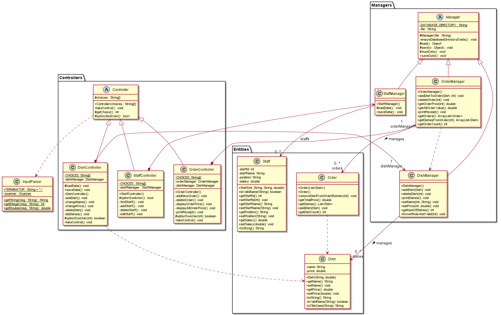
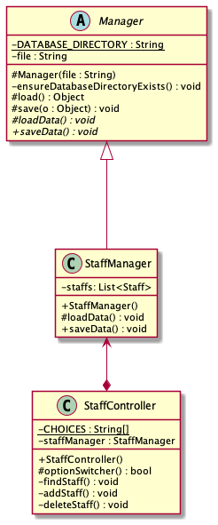

# Developer Guide

## Acknowledgements

{list here sources of all reused/adapted ideas, code, documentation, and third-party libraries -- include links to the original source as well}

## Design & implementation

Here is a quick overview of the design of the application:



Note that the diagram does not include all entities, controllers, and managers
present in the programme. It is only meant to give a quick overview of the project structure.

The later parts of this guide looks into detail each specific part of the programme.

### Controllers
A `Controller` is defined as the user-facing part of the programme. It is in charge of getting
input from the user, as well as managing the user experience and interface, such as printing to the console.

All controllers are derived from the base abstract class `Controller`. This base class acts as a mini-framework, and
includes the base implementation for the input-loop. In this way, there is no need to rewrite input handling for all 
extended controllers. 

To create a new `Controller`, the new class simply extends from the `Controller` class. The `Controller` class is then provided
a list of strings indicating the choices available to the user. **Note that the first choice is always to exit the current controller.** 
The user will then select these choices using integers (the implementation is handled by the base class, including
input loops). The new class then implements this abstract method at the least:
- `protected abstract boolean optionSwitcher(int choice) throws OperationTerminationException`
  - This method is responsible for selecting the corresponding action to the user's selected choice.
  For more information and examples, refer to the `Controller` class' documentation, and `MainController` class for an
  example implementation.

Here is the typical design for the Controller:


By itself, `Controllers` are not useful. They should usually have an underlying `Manager` class for data storage and
manipulation.

### Managers
A `Manager` is defined as the data management part of the programme. It is in charge of manipulating underlying data and
takes care of data integrity.

All managers are derived from the base abstract class `Manager`. This base class provides simple methods for reading and
saving data from the filesystem. A derived `Manager` must pass the name of the file where its underlying data is stored
to the `Manager` superclass.

The base class provides two methods for simple read/write operations:
- `protected Object load() throws Exception`
  - This method returns a simple `Object` read from the specified file. The class makes no assumption as to the
  type of object being read. As such, further processing must be done, which will be touched on below.
- `protected void save(Object o) throws Exception`
  - This method saves the provided object into the specified file. It is capable of saving **any** type of Java object,
  on the condition that it **must be serializable**. For saving complex data structures such as `ArrayLists`, it is generally
  a good idea to also make sure that any contained objects are also serializable.

Because the `load()` and `save(Object o)` methods are simple, they are generally not useful without further processing.
As such, the `Manager` class has two other abstract methods, which extended managers must implement:
- `protected abstract void loadData() throws Exception`
  - Extended managers must override this method to deserialize any read objects properly. This is to ensure that
  corrupted data is found at this phase of the programme to prevent any future errors. A good example is listed below.
  Note that it makes use of the provided `load()` function to first read the simple `Object`, then does further
  processing on it:
  ```java
    @Override
    protected void loadData() throws Exception {
        this.dishes = new ArrayList<>();
        ArrayList<?> list = (ArrayList<?>) this.load();
        for (Object object : list) {
            this.addDish((Dish) object);
        }
    }
  ```
- `public abstract void saveData() throws Exception`
  - This is a convenience method for doing any pre- / post-processing on any data you may want to save. Of course, you should
  also call the `save(Object o)` method finally.

Note that loading and saving is only done once. Loading is done once upon programme start-up, and saving is done
when the user exits the menu gracefully.

Here is the typical design of a manager:




### Menu (dishes) Management

The management of menu is handled by `DishManager`, which implements following methods:

- `void printDishes()` -- print all dishes and their menu index in current menu.
- `void addDish(Dish dish)` -- add a new dish.
- `void deleteDish(int menuIndex)` -- delete a dish using its menu index.
- `void setPrice(int menuIndex, double newPrice)` -- change the price of a dish using its menu index.
- `void setName(int menuIndex, String newName)` -- change the name of a dish using its menu index.

These functions are "delegated" to `ArrayList<Dish>`, which is associated with `DishManager`.

For example, `printDishes()`, iterates through `dishes` and calls `get(int)` method (`setPrice(int, double)`, `setName(int, String)` also call `get(int)`):


`deleteDish(int)` calls `remove(int)`:


`addDish(Dish)` calls `add(Dish)`:


### Order Management

The management of menu is functioned by `OrderManager`, which implements following methods:
- `void addDishToOrder(Dish dish, int orderIdx)` -- add dishes in to an order.
- `void deleteOrder(int orderIndex)` -- delete an order using its order index.
- `Order getOrder(int orderIndex)` -- get an order using its order index.
- `double getOrderPrice(int orderIndex)` -- get the total price of an order using its order index.
- `double getAllOrderValue()` -- get the total price of all orders.

These functions are "delegated" to `ArrayList<Order>`, which is associated with `OrderManager`. 

Methods call `get(int)` to get the element.

For example, `addDishToOrder(Dish dish, int orderIdx)`, iterates through `orders` and calls `addDish(Dish dish)` method:


`deleteOrder(int)` calls `getOrderCount()`:


Both methods `getOrderPrice(int)` and `getAllOrderValue()` call `getTotalPrice()`:


### Staff Management

The management of staff is handled by `StaffManager`, which implements following methods:

- `void printStaff()` -- print all staffs.
- `void addStaff(int staffId, String staffName, String position, double salary)` -- add a new staff with the arguments as its attributes.
- `Staff findByStaffId(int staffId, boolean printMsg)` -- find a staff using staff id, and print message if boolean variable printMsg is true.
- `void deleteByStaffId(int staffId)` -- delete a staff using staff id.
- `int getNumOfStaffs(` -- change the name of a dish using its menu index.

`StaffManager` manages `ArrayList<Staff>` and the above functions help to update the collection of `Staff`.

For example `addStaff(int staffId, String staffName, String position, double salary)` calls `add(Staff)` to add a `Staff` from `ArrayList<Staff>`:


And `deleteStaff(int)` calls `remove(int)` to remove a `Staff` from `ArrayList<Staff>`:


## Product scope
### Target user profile

{Describe the target user profile}

### Value proposition

{Describe the value proposition: what problem does it solve?}

## User Stories


|Version| As a ... | I want to ...                                  | So that I can ...          |
|--------|----------|------------------------------------------------|----------------------------|
|v1.0|staff| modify the order (add, delete, or check price) | keep the order up to date  |
|v1.0|staff|modify the menu (add, delete, or modify dishes)|keep the menu up to date|
|v2.0|staff| print out the order receipt                    | refer to the order anytime |
|v2.0|staff|store the menu|refer to the menu anytime|


## Non-Functional Requirements

{Give non-functional requirements}

## Glossary

* *glossary item* - Definition

## Instructions for manual testing

{Give instructions on how to do a manual product testing e.g., how to load sample data to be used for testing}
