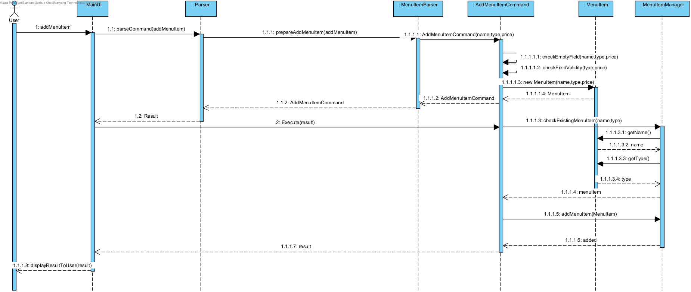
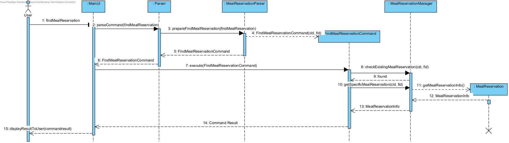
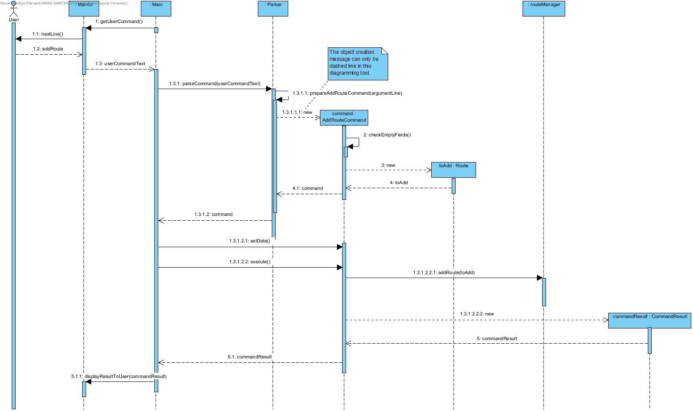
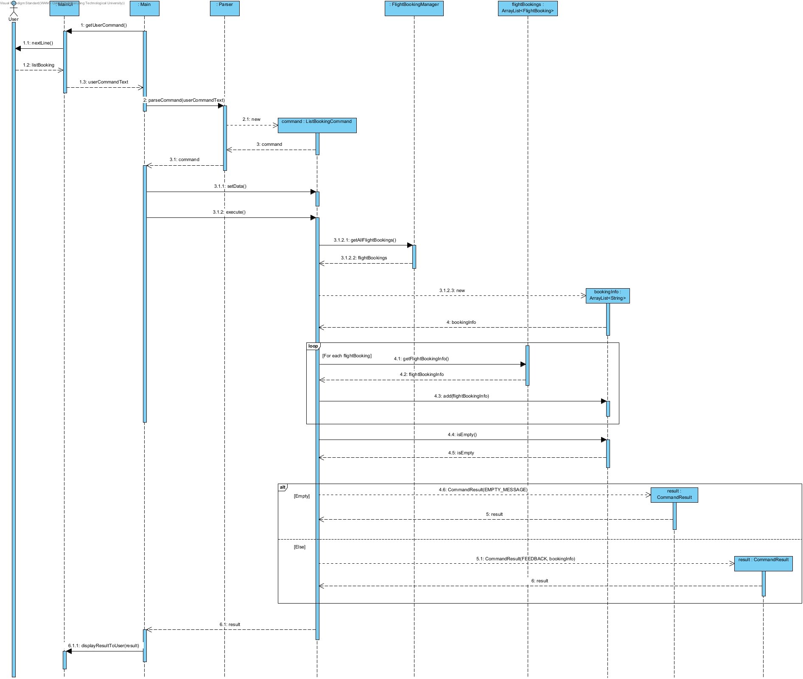
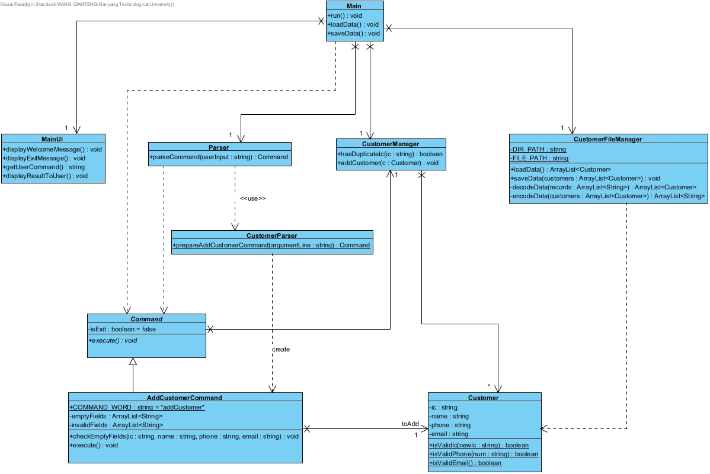

# Developer Guide

## Acknowledgements

This developer guide follows the suggested format given in [AddressBook-Level3 developer guide](https://se-education.org/addressbook-level3/DeveloperGuide.html).

## Design
### Architecture

The architecture diagram given above explains the high-level design of the App.

Given below is an overview of the main components and how they interact with each other.

### Data component
The data component consists of customers, flight bookings, menu items, routes data as well as exceptions and validity checkers. 
The actual data objects are encapsulated in the respective data managers. For example, the list of `Customer` objects are maintained in an object of `CustomerManager` class. 
In this way, data are encapsulated and decoupled from higher layers.
Manipulation of data can only be performed through data managers to ensure data integrity.

### Command component
`Command` class is an abstract class, which is then extended as specific commands such as `BookCommand` and `AddRouteCommand`. 
Each command interacts with data managers to create, retrieve, delete or modify data. 
This design makes use of polymorphism, such that duplication is avoided and the functionalities can be easily expanded.

### Parser component
Parser component consists of a general parser and dedicated parsers for customers data and flight bookings respectively.  
The `Parser` object takes in user input string, extracts desired information and returns a `Command` object. 
The `Parser` class decouples the command class from parsing input. Thus, each class has only one dedicated responsibility.

### Storage component
Each data class has a file manager to handle data storage, such as `CustomerFileManager` for customer data and `RouteFileManager` for route data. 
The file manager is responsible for decoding, encoding, saving and loading data from text file.

### Common component
Classes used by multiple components are in the `arcs.common` package.

## Implementation
This section describes how certain features are implemented. Only part of the features with noteworthy details are mentioned here.

### 1. Bye command
1.1 The following sequence diagram shows how the Bye Command works.

### 2. Add Menu Item Command
2.1 The following sequence diagram shows how the Add Menu Item command works.

### 3. Check Meal Reservation Command
3.1 The following sequence diagram shows how the Check Meal Reservation Command works.

### 4. Add Route Command
4.1 The following sequence diagram shows how the Add Route Command works.

### 5. List Booking Command
5.1 The following sequence diagram shows how the List Booking Command works.

### 6. Add Customer Command
6.1 The following class diagram shows the implementation of the Add Customer Command.  
(Only part of the classes, attributes and operations related to the Add Customer Command are shown here.)

## Product scope
### Target user profile

For airlines counter staff who are fast typist to easily manage flight bookings.

### Value proposition

Given that the pandemic is ending, more and more people are resuming air travel.  
Therefore, airlines counter staff need a fast an efficient way to manage the many flight bookings.

## User Stories

| Version | As a ... | I want to ... | So that I can ... |
|--------|----------|---------------|------------------|
|v1.0|Counter Staff|Add in flight menu item|Add menu items available for in-flight meals|
|v1.0|Counter Staff|Remove in flight menu item|Remove menu items that can be reserved for in-flight meals|
|v1.0|Counter Staff|Find Menu Item by Name|Find all Menu Items corresponding to a certain name|
|v1.0|Counter Staff|Find Menu Item by Category|Find all Menu Items corresponding to a certain category|
|v1.0|Counter Staff|List All Menu Items|View all Menu Items|
|v1.0|Counter Staff|Add in flight meal reservation|Manage in-flight meal reservation request from customers|
|v1.0|Counter Staff|Remove in flight meal reservation|Manage in-flight meal reservation request from customers|
|v1.0|Counter Staff|List all in flight menu items|To answer customer queries on the menu items available|
|v1.0|Counter Staff|Add Flight route|Add new flight route that the airline releases|
|v1.0|Counter Staff|Remove Flight route|Remove the flight routes the airline will no longer offer|
|v1.0|Counter Staff|List all flight routes|Have an overview of available flight routes|
|v1.0|Counter Staff|Find flight route|Answer customer's query on whether a flight route to certain destination is available|
|v2.0|Counter Staff|Add customer|Register this customer's information in system|
|v2.0|Counter Staff|Delete customer|Remove outdated customer information|
|v2.0|Counter Staff|Find customer|Find a customer by his/her IC number|
|v2.0|Counter Staff|List all customers|View all existing customers|
|v2.0|Counter Staff|Book flight|Book a flight for a customer|
|v2.0|Counter Staff|Delete flight booking|Cancel flight booking for a customer|
|v2.0|Counter Staff|List flight bookings|View all existing flight bookings|
|v2.1|Counter Staff|Add in-flight meal reservation|Reserve in-flight meals for customers|
|v2.1|Counter Staff|Remove in-flight meal reservation|Remove in-flight meal reservations for customers|
|v2.1|Counter Staff|Check in-flight meal reservation|Check for a customer's specific meal reservation|
|v2.1|Counter Staff|List all in-flight meal reservation|View all in-flight meal reservations|
## Non-Functional Requirements

1. The program should not crash under any circumstances.
2. The program shall display "I do not understand message" in the event of a wrong user input.
3. The program should have a user guide.
4. The program should be able to load in data from txt file.
5. The program should be able to save data to a txt file.
6. The program will be a 100% CLI interface.

## Glossary

* *Menu Item* - Refers to a food menu item

## Instructions for manual testing

The example inputs in the [User Guide](https://github.com/AY2122s2-CS2113-F12-3/tp/blob/master/docs/UserGuide.md) can be used for manual testing.

