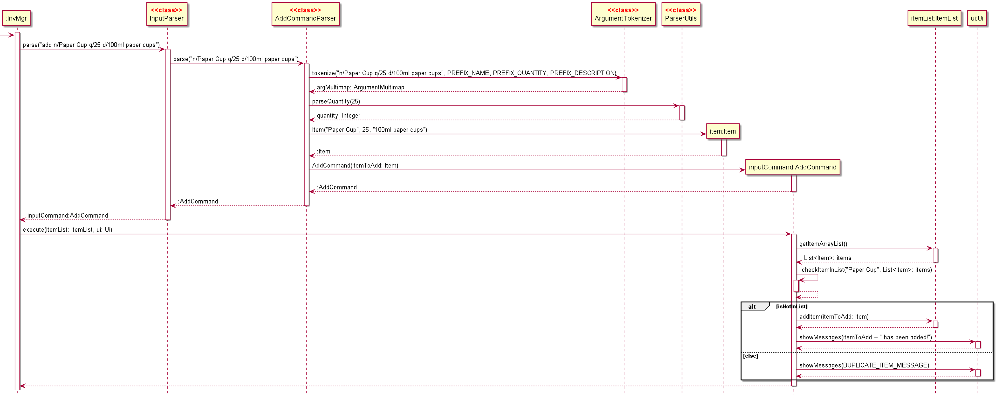
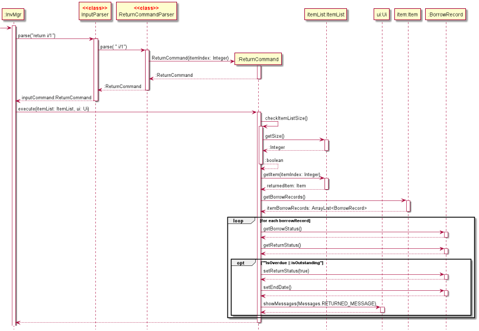
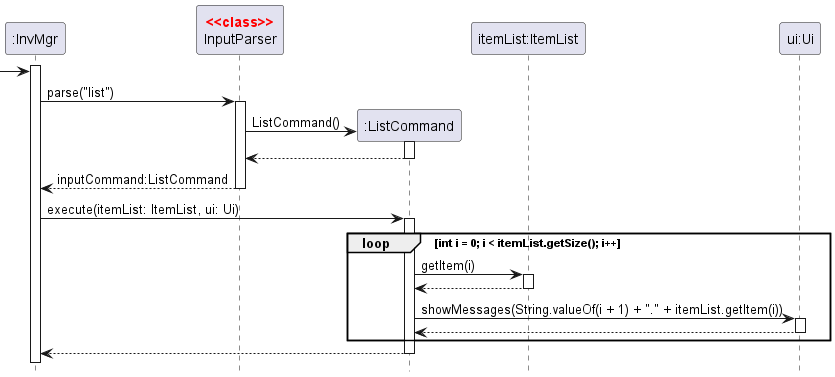
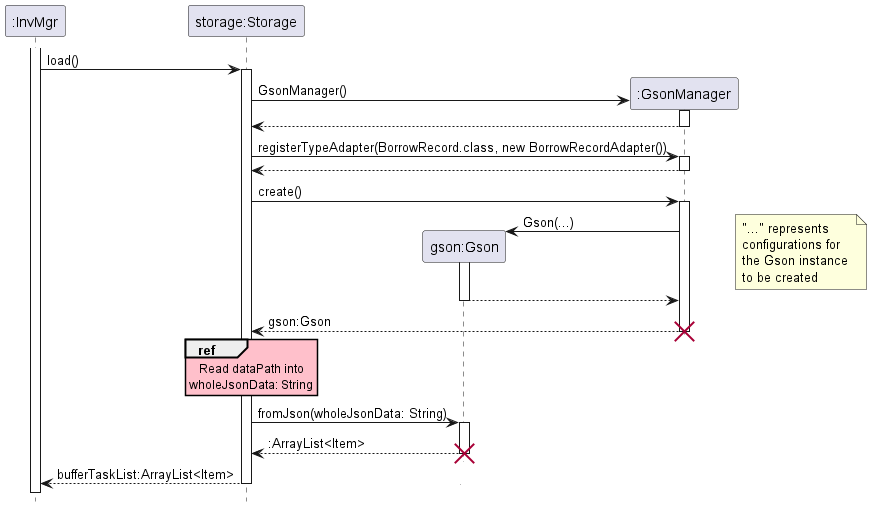

# Developer Guide

## Acknowledgements

{list here sources of all reused/adapted ideas, code, documentation, and third-party libraries -- include links to the original source as well}

## Design

### Application Launch

The following diagram shows a sequence diagram of the program when it is run.

1. `InvMgr` does a setup by creating the required `Ui`, `Storage`, and `ItemList` objects.
2. To create the `ItemList` object, `load()` from `Storage` must be called. The resulting `ArrayList<Item>` from `load()` is used to create the `ItemList` object.
3. Then, `InvMgr` will continuously loop, doing the following:
   i. `InvMgr` will call upon `Ui` to get input from the user.
   ii. `InvMgr` passes the user input to `Parser.parse(command)`.
   iii. `Parser.parse(command)` returns a `Command` object.
   iv. `InvMgr` calls upon the `execute()` method of the returned `Command` object
4. The loop stops when the user types `exit`.

### UI Component

The `UI` component consists of a single `Ui` class.

The `UI` component
- Displays salutations, prompts for user input, error messages and results of queries.
- Reads in user inputs
- Depends on the `Messages` and `InvMgrException` classes in the `Common` component. It displays messages stored in the `Messages` class and displays an error message whenever `InvMgrException` is invoked.

### Parser Component

The diagram above shows the class diagram of how the `Parser` component works.

1. The `parse(userInput)` method in `Parser` is called from `InvMgr`, and takes in the raw user input. 
2. The method checks through a logic gate whether the user input is valid, and returns 
a `Command` class based on the user input.

### Command Component

The following diagram shows the class diagram for `Command`.

`Command` is an abstract class that sets certain commonalities that is implemented across all types of commands - `AddCommand`, `DescCommand`, `ListCommand`, `DeleteCommand`, `HelpCommand`, `ExitCommand`. Each of these classes have to override the `Command`'s `execute()` method as each command has a different execution. For example, `AddCommand` will be focused on adding an item to an inventory list whereas `DescCommand` will be about retrieving information from the inventory list.

### Storage Component

The following diagram shows the class diagram for `Storage`.

1. `Storage` has `save()` and `load()` methods. These are called by `InvMgr` when needed.
2. `save(itemList)` writes the contents of an `itemList` to a file.
3. `load(itemList)` loads a JSON file into an `itemList`.
4. Gson is used to serialise and deserialise the `itemList` of type `ArrayList<Item>`.

## Implementation

### Description Command

The following diagram shows the sequence diagram for retrieving the description of an item.

For a user who is unaware of what an item is about, he/she can enter the command eg. `desc 2` command to extract the description for the second item in the inventory list. This command is interpreted by the `Parser` and a `DescCommand` is returned to `InvMgr`. `InvMgr` calls the execute command of `DescCommand` which retrieves the item's information from the `ItemList` and then outputs them into the `Ui` for the user to see.

### Add Command

The following diagram shows the sequence diagram of the addition of an item.

The user starts by typing an add command. The example used in the diagram above is the addition of an item with the name `Paper Cup`, quantity of `25` and description of `100ml paper cups`. The full command is `add n/Paper Cup q/25 d/100ml paper cups`.

1. The `run()` method within `InvMgr` calls the static method `parse()` in the `Parser` class, providing the entire string of input entered by the user.
2. Within `parse()`, the string is identified to start with the word `add`, and executes the code within the case. The case attempts to create an item using the string by self-invoking `createItem()`.
3. `createItem()` extracts the relevant arguments from the input string and generates a new `Item` which is returned to the `parse()` case block.
4. `parse()` uses the `Item` to generate a new `AddCommand` which is returned to the `run()` method.
5. The `run()` method calls on the `execute()` function in the `AddCommand` which will add the generated item to the `ItemList` using its `addItem()` method.
6. `AddCommand` will converse with `Ui` to show a message that the item has been added. In this case, the item to add will be printed as the name of the item, followed by " has been added!".

### Delete Command

The following diagram shows the sequence diagram of the addition of an item.

The user starts by typing an add command. The example used in the diagram above is the addition of an item with the index `1`, based on the list when the user types the `list` command.

1. The `run()` method within `InvMgr` calls the static method `parse()` in the `Parser` class, providing the entire string of input entered by the user.
2. Within `parse()`, the string is identified to start with the word `delete`, and executes the code within the case. The case finds the index of the item by splitting the string and indexing it.
3. `parse()` generates a new `AddCommand` using the index which is returned to the `run()` method.
4. The `run()` method calls on the `execute()` function in the `DeleteCommand` which will delete the item with that index from the `ItemList` using its `removeItem()` method.
5. `DeleteCommand` will converse with `Ui` to show a message that the item has been removed. In this case, the item to add will be printed as the name of the item, followed by " has been deleted.".

### Return Command

The above diagram shows the sequence diagram of Return command, which allows users to return an item that is either overdue or currently on loan.

The user starts by typing a return command. The diagram above uses the example of a user who wishes to mark an item of index `1` as returned. The full return command is `return i/1`.

1. The `run()` method within `InvMgr` calls the static method `parse()` in the `Parser` class, providing the entire string of input entered by the user.
2. `parse` calls the `arePrefixesPresent()` function to check that the user's input contains the compulsory field, item index. This function returns `true` if the user's input syntax is correct.
3. `parse()` uses the parsed `itemIndex` to generate a new `ReturnCommand` which is returned to the `run()` method of `InvMgr`.
4. The `run()` method calls on the `execute()` function in `ReturnCommand`.
5. The `execute()` function calls `checkItemListSize()` to check if the item list is empty. If it is, an exception is thrown and return cannot be performed. 
6. Then, it calls `getItem()` to check if the item index is within range. If it is not, an exception is thrown and return cannot be performed. 
7. Then, it obtains the item's borrow records by calling `getBorrowRecords()` from `Item`.
8. Each borrow record is iterated over and its borrow status and return status are obtained using `getBorrowStatus()` and `getReturnStatus()` respectively.
9. A borrow record is considered overdue if its borrow status is past and its return status is false, while a borrow record is outstanding if its borrow status is present and its return status is false.
   If a borrow record is either overdue or outstanding, then it is marked as returned using `setReturnStatus`. The end date of the borrow record is changed to the day of return using `setEndDate()`. 
   `ReturnCommand` then converses with `Ui` to show the successful returned message.
10. If none of the borrow records are overdue or outstanding, then it is taken to be an invalid return request. In this scenario, `ReturnCommand` will converse with `Ui` to display the return error message.

### List Command

The following diagram shows the sequence diagram of the listing of items in `itemList`.

The user starts by typing a list command.

1. `InvMgr` calls `parse("list")` method in `Parser` class, which returns a ListCommand object.
2. `InvMgr` calls `execute(itemList, ui)` method in `ListCommand` object.
3. `ListCommand` loops through every `Item` in `itemList` and prints them line by line
   and numbers them.

### Storage

#### Initialisation

The following diagram shows the sequence diagram illustrating how `Storage` is initialised when the program first launches.

1. `InvMgr` calls the `Storage(filePath)` constructor to create a `Storage` object. `filePath` is a `String` indicating where the data file to be loaded is found.
2. `Storage(filePath)` will check if the file at `filePath` exists. If it does, it returns a `Path` object pointing to the data file.
3. If not, the relevant files and subdirectories are created before returning the corresponding `Path` object.
4. The new `Storage` object will have its `dataPath` attribute set to the `Path` object earlier, and its `filePath` attribute set to the `filePath` passed into the constructor.

#### Loading data

The following diagram shows the sequence diagram illustrating how the data file is loaded. Typically, this is only run once when the program first launches.

1. `InvMgr` calls the `load()` method of `storage`.
2. `storage` initialises `Gson()` as `gson`, a library used to serialize and deserialize JSON objects into their relevant Java objects.
3. `storage` will then load the contents of the file at `dataPath` into the `wholeJsonData` `String`. The exact details are not shown in the diagram.
4. `storage` then calls the `fromJson(wholeJsonData)` method of `gson`.
5. An `ArrayList<Item>` may be returned by `fromJson()` method. If it is not, a new empty list is created.
6. `storage` returns `ArrayList<Item>` to `InvMgr`. This will be used to create the `ItemList`, but will not be shown here.

#### Saving data

The following diagram shows the sequence diagram illustrating how the data file is saved. Typically, this is done after each `Command` is run.

1. `InvMgr` calls the `save(itemList)` method of `storage`.
2. `storage` initialises `Gson()` as `gson`, a library used to serialize and deserialize JSON objects into their relevant Java objects.
3. `storage` calls the `toJson(itemList)` method of `gson`. This returns a `String` named `serializedItems` which contains the JSON String representing `itemList`.
4. `storage` then writes `serializedItems` to the file at `dataFile`.

## Product scope
### Target user profile

CCA Clubs that require assistance in inventory management, especially for fast typists who prefer CLI over GUI.

### Value proposition

1. Centralised management of resources that ensures accurate and timely allocation of equipment to students
2. Increases the ease and efficiency of resource management
3. More organised

## User Stories

| Version | As a ...                               | I want to ...                                   | So that I can ...                                                   |
|---------|----------------------------------------|-------------------------------------------------|---------------------------------------------------------------------|
| v1.0    | Manager                                | Add a new item to the inventory                 | Update my inventory                                                 |
| v1.0    | Manager                                | Remove an item from the inventory               | Update my inventory                                                 |
| v1.0    | Stocktaker                             | list out all my items                           | View all my items at a glance                                       |
| v1.0    | New user                               | List out all possible commands                  | I can familiarise myself with using the system                      |
| v1.0    | User who has not seen items physically | Get the description of a particular item        | I can visualise the item better to know if it is what i need        |
| v1.0    | As a frequent/first time user          | Write to a file containing the entire inventory | Save my inventory data to a file                                    |
| v1.0    | Stocktaker                             | Read from and load an inventory file data       | To work on and view the data                                        |
| v2.0    | User                                   | Search for an item in the inventory             | To check if the item exists in the inventory                        |
| v2.0    | User                                   | Edit an item in the inventory                   | Update/Make changes to the item attributes                          |
| v2.0    | User                                   | Borrow an item in the inventory                 | Add a borrow record in the inventory                                |
| v2.0    | User                                   | List all current borrowings                     | View which item is currently being borrowed                         |
| v2.0    | User                                   | List all future borrowings                      | View which item will be borrowed in the future and plan accordingly |
| v2.0    | User                                   | List all past borrowings                        | View which item has been borrowed in the past                       |
| v2.0    | User                                   | List all available borrowings                   | View which item is available for borrowing now                      |

## Non-Functional Requirements

{Give non-functional requirements}

## Glossary

* *glossary item* - Definition

## Instructions for manual testing

{Give instructions on how to do a manual product testing e.g., how to load sample data to be used for testing}
