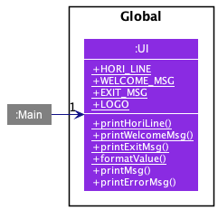
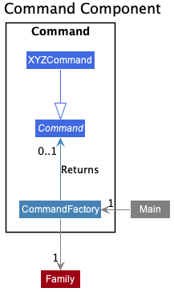
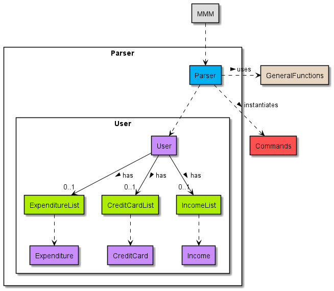
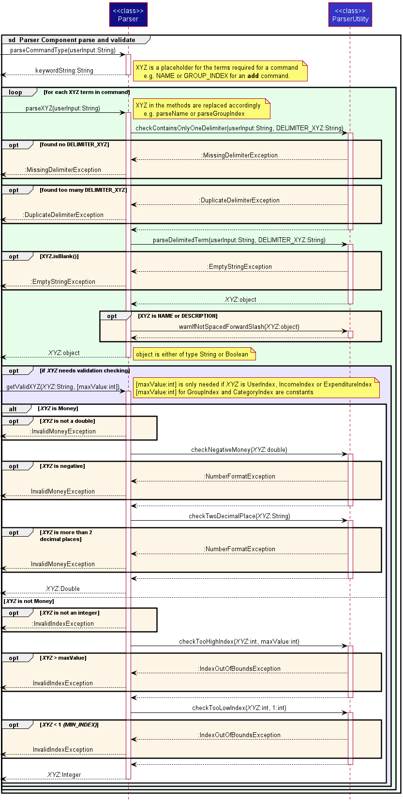
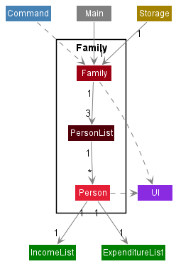
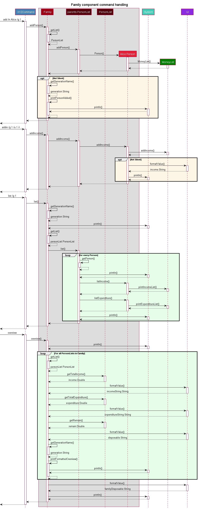
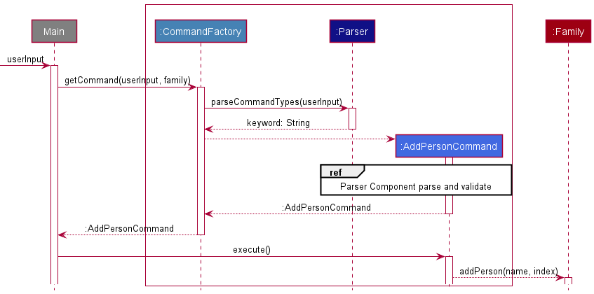

# PlanITarium Developer Guide

This document contains the Developer Guide to the **PlanITarium** application. It serves to explain the internal
workings of PlanITarium such that developers can understand the various design and implementations in detail.

---

## Table of Contents

* [Acknowledgements](#acknowledgements)
* [Design](#design)
  * [Architecture](#architecture)
  * [UI Component](#ui-component)
  * [Commands Component](#commands-component)
  * [Parser Component](#parser-component)
  * [Family Component](#family-component)
  * [Money Component](#money-component)
  * [Storage Component](#storage-component)
* [Implementation](#implementation)
  * [Command Execution](#command-execution)
  * [Logical Grouping of Persons Added](#logical-grouping-of-persons-added)
  * [Find Command](#find-feature)
  * [Data Archiving](#data-archiving)
* [Documentation](#documentation)
  * [Logging](#logging)
  * [Testing](#testing)
* [Product Scope](#product-scope)
* [User Stories](#user-stories)
* [Non-Functional Requirements](#non-functional-requirements)
* [Glossary](#glossary)
* [Instructions for Manual Testing](#instructions-for-manual-testing)

---

## Acknowledgements

In this project, we have referenced the following materials:

* Developer Guide sample from [Address Book (Level-3)](
https://se-education.org/addressbook-level3/DeveloperGuide.html)
* PlantUML Tutorial at [se-edu/guides](https://se-education.org/guides/tutorials/plantUml.html)
* [Our individual projects](AboutUs.md)

---

## Design

### Architecture

The ***Architecture Diagram*** given below shows the high-level design of PlanITarium.


> :information_source: **Note:** The that `.puml` files used to create diagrams in this document
> can be found in the diagrams folder. Refer to the above [PlantUML Tutorial](#Acknowledgements)
> to learn how to create and edit these diagrams when necessary.

**Overview of components in the Architecture**

[`Main`](https://github.com/AY2122S2-CS2113T-T10-2/tp/blob/master/src/main/java/seedu/planitarium/PlanITarium.java)
is responsible for,

* At launch, initialize the components in an appropriate manner and calls Storage to read data if any.
* Read user's commands from standard input for command execution.
* At shut down, invokes shutdown sequence and calls Storage to save its current data.

[`UI`](#UI-Component) is responsible for the UI of PlanITarium.

[`Commands`](#Commands-Component) is responsible for the handling and executing of commands.

[`Parser`](#Parser-Component) is responsible for the parsing and validating of user input.

[`Family`](#Family-Component) is responsible for holding the user data of PlanITarium in memory.

[`Money`](#Money-Component) is responsible for holding the monetary information in memory.

[`Storage`](#Storage-Component) is responsible for reading and writing data to the hard disk.

**How the components interact with each other**

The following Sequence Diagram shows a high-level view on how the components interact when the user enters the command
`add /g 2 /n Alice`.


> :information_source: **Note:** The lifeline for `AddPersonCommand` ends at the destroy marker :x:
> but due to the limitations of PlantUML, the lifeline reaches the end of the diagram.

Each of the components are defined and implemented as a class with the same name. The section below provides 
more in-depth details on how the components interact with one another.

Each component may consist of several classes that are working seamlessly together to achieve their intended abstracted 
representation. For example, the `Money` component contains an abstract class that is extended by `Income` and 
`Expenditure` to represent the types of money that can be managed.

### UI Component

The `UI` component consists following classes: [`UI.java`
](https://github.com/AY2122S2-CS2113T-T10-2/tp/blob/master/src/main/java/seedu/planitarium/global/UI.java)

The UI component provides function to standardize the output. It provides `printWelcomeMsg()` and `printExitMsg()` 
as well as chatbox pattern `printHoriLine()` to create chatbox styled output. Additionally, `formatValue()` allows for 
monetary values to be printed appropriately.
 
How the `UI` component is used:

* UI is created when initializing the program. During execution, UI will be called to create chatbox pattern by calling 
`printHoriLine()`. UI also prints welcome message at the beginning of the session and an exit message at the end of 
the session.
* `formatValue` will be called by the `Family` component whenever printing of a monetary value is involved.



### Commands Component

The `Commands` component consists following classes: [`CommandFactory.java`
](https://github.com/AY2122S2-CS2113T-T10-2/tp/blob/master/src/main/java/seedu/planitarium/commands/CommandFactory.java)
[`Command.java`
](https://github.com/AY2122S2-CS2113T-T10-2/tp/blob/master/src/main/java/seedu/planitarium/commands/Command.java)
[`AddPersonCommand.java`
](https://github.com/AY2122S2-CS2113T-T10-2/tp/blob/master/src/main/java/seedu/planitarium/commands/AddPersonCommand.java)
[`DeletePersonCommand.java`
](https://github.com/AY2122S2-CS2113T-T10-2/tp/blob/master/src/main/java/seedu/planitarium/commands/DeletePersonCommand.java)
[`AddRecordCommand.java`
](https://github.com/AY2122S2-CS2113T-T10-2/tp/blob/master/src/main/java/seedu/planitarium/commands/AddRecordCommand.java)
[`DeleteRecordCommand.java`
](https://github.com/AY2122S2-CS2113T-T10-2/tp/blob/master/src/main/java/seedu/planitarium/commands/DeleteRecordCommand.java)
[`EditRecordCommand.java`
](https://github.com/AY2122S2-CS2113T-T10-2/tp/blob/master/src/main/java/seedu/planitarium/commands/EditRecordCommand.java)
[`HelpCommand.java`
](https://github.com/AY2122S2-CS2113T-T10-2/tp/blob/master/src/main/java/seedu/planitarium/commands/HelpCommand.java)
[`ListCommand.java`
](https://github.com/AY2122S2-CS2113T-T10-2/tp/blob/master/src/main/java/seedu/planitarium/commands/ListCommand.java)
[`ListCatCommand.java`
](https://github.com/AY2122S2-CS2113T-T10-2/tp/blob/master/src/main/java/seedu/planitarium/commands/ListCatCommand.java)
[`OverviewCommand.java`
](https://github.com/AY2122S2-CS2113T-T10-2/tp/blob/master/src/main/java/seedu/planitarium/commands/OverviewCommand.java)
[`SearchCommand.java`
](https://github.com/AY2122S2-CS2113T-T10-2/tp/blob/master/src/main/java/seedu/planitarium/commands/SearchCommand.java)
[`ExitCommand.java`
](https://github.com/AY2122S2-CS2113T-T10-2/tp/blob/master/src/main/java/seedu/planitarium/commands/ExitCommand.java)



`Command` component is mainly for organizing and separating different features. Different commands refers to different features.

The `CommandFactory` provides a `getCommand()` function to get different commands according to the keywords of 
user's instructions. `getCommand()` accepts user input as a `String` object and a `Family` object for input. The keyword
is parsed by `Parser`. There are 11 cases, and it would throw an exception called `UnknownInputException` if the keyword 
from user input is none of the 11 cases provided. `CommandFactory` will only
hold at most one command at one time. When `getCommand()` is called, the command that `CommandFactory` holds will be 
updated.

The `Command` class is an abstract class that has abstract method `execute()`. All the subclasses of `Command` inherit 
this method. `Command` class also has a methods called `getType()`. This method is mainly for testing, it will return 
`null` if it is called. All the subclasses have overridden this method.

Each subclass contains some customize variables, depends on the type of the command. These variables are from user 
input after parsing by `Parser` according to user input.

Following sequence diagram has illustrated how the `CommandFactory` return a command when `getCommand()` is called.
`XYZCommand` represents the subclasses of `Command`.


How `Command` component is used:

1. `CommandFactory` translate raw input to `XYZCommand` with varies details given by user. `Main` will get this `XYZCommand`
by calling `getCommand()`
2. `XYZCommand` provides `execute()` that contains several calls of lower-level methods, so that the `Main` only need to execute
the `XYZCommand` to obtain the desired results.

### Parser Component

**Class:** [`Parser.java`
](https://github.com/AY2122S2-CS2113T-T10-2/tp/blob/master/src/main/java/seedu/planitarium/parser/Parser.java)



The `Parser` component consists of the 
[`Parser`](https://github.com/AY2122S2-CS2113T-T10-2/tp/blob/master/src/main/java/seedu/planitarium/parser/Parser.java) 
class, 
[`ParserUtility`](https://github.com/AY2122S2-CS2113T-T10-2/tp/blob/master/src/main/java/seedu/planitarium/parser/ParserUtility.java)
class and several `Exception` classes.

The `Parser` class provides the `parseXYZ()` and `getValidXYZ()` methods where `XYZ` is a placeholder for the type of
term (e.g. `parseCommandType()` and `getValidUserIndex`). The methods prepended by **parse** assists in parsing the user
input into its respective terms and the method prepended by **getValid** assists in validating the parsed terms and
returning an appropriately typed object to the `Commands` component. The `Parser` class interacts with the
`ParserUtility` class which provides supporting methods for parsing and validating. Both classes throws exceptions as
required.

How the `Parser` component is used:

1. When the `Commands` component receives a user input, `parseCommandType()` is called upon to parse the type of command to
   be executed.
2. This will result in the keyword of the command to be returned as a string.
3. When necessary, the `parseXYZ()` methods will be called upon to parse more terms for the `Commands`
   component to obtain the details required for the command execution (e.g. `parseGroupIndex("add /n Alice /g 2")`
   to get group 2). The `ParserUtility` assists the parsing during this process by providing utility methods.
4. The `getValidXYZ()` methods will also be called upon thereafter to check and return valid typecasted objects to be
   used for the command execution (e.g. `getValidGroupIndex(indexString)` to check that the index provided corresponds
   to an existing group). The `ParserUtility` is also called here to assist with the validation process.

The following Sequence Diagram shows how the classes of the `Parser` component interacts for each user command.



> :information_source: **Note:** The following are the ranges of index deemed valid:

| Index       | Range                                                                               |
|-------------|-------------------------------------------------------------------------------------|
| Group       | [1, ..., 3]                                                                         |
| User        | [1, ..., MAX_UID], where MAX_UID is the number of people in the given group         |
| Category    | [1, ..., 6]                                                                         |
| Income      | [1, ..., MAX_IID], where MAX_IID is the number of income entries for a given person |
| Expenditure | [1, ..., MAX_EID], where MAX_EID is the number of income entries for a given person |

### Family Component

The `Family` component consists of the following classes: [`Family.java`](
https://github.com/AY2122S2-CS2113T-T10-2/tp/blob/master/src/main/java/seedu/planitarium/person/Family.java)
, [`PersonList.java`](
https://github.com/AY2122S2-CS2113T-T10-2/tp/blob/master/src/main/java/seedu/planitarium/person/PersonList.java)
and [`Person.java`](
https://github.com/AY2122S2-CS2113T-T10-2/tp/blob/master/src/main/java/seedu/planitarium/person/Person.java)

The `Family` component is implemented in an n-level architecture. It stores the logical grouping of persons added i.e.,
all `Person` objects must belong to one of the `PersonList`, with all `PersonList` belonging under one `Family`.
It also depends on the `Money` component to help keep track of each `Person`'s income and expenditure as each `Person` 
contains an `IncomeList` and `ExpenditureList`.

The Class Diagram below shows the full structure of the `Family` component and the components it interacts with.



The three generational `PersonList` under `Family` are `parents`, `myGen` and `children`.

How the `Family` component is used:

1. Upon input from the user, the user is passed through the `Command` component and a corresponding method is called from 
the `Family` class.
2. Depending on the level which the command executes on, each command is passed top-down until it arrives at the relevant
level for execution.
3. If the command requires operations on the `Money` components, the command is further passed down to the `Money`
component for execution.
4. It is also responsible most of the printing to the user interface. The n-level implementation allows for effective
wrapping and indentation of lines printed.

To aid in visualisation, 

* Methods on `IncomeList` and `ExpenditureList` will be simplified to call to `MoneyList`. See 
[Money Component](#Money-component) for more information.
* The following situation will be simulated:
  1. User adds a Person, *Alice* to `parents`
  2. User adds an income to *Alice*
  3. User decides to view the `parents` generation in detail
  4. User decides to view the overall situation in the `Family`

The following Sequence Diagram shows how the `Family` component handles each call by the `Command` component.  



### Money Component

<!-- {For Jiarong} -->

### Storage Component

**Class:** [`Storage.java`
](https://github.com/AY2122S2-CS2113T-T10-2/tp/blob/master/src/main/java/seedu/planitarium/storage/Storage.java)


The `Storage` component,

* can save each person's data and their income and expenditure data when the program exits into a local file, and reads
  them back into corresponding objects when the program runs again.
* depends on the classes in the `Person` component (because the `Storage` component's job is to save/retrieve objects to
  the `Person`)

---

## Implementation

This section describes some noteworthy details on how certain features are implemented.

### Command Execution

In PlanITarium, a command usually has the following format:

```md
[command type][delimiter][description]
```

For example,

```md
add /n Alice /g 1
```

is to add a person whose name is Alice to Parents' group. `add` here is the command type to add a person, `/n` is 
the flag to indicate the name of person, and `/g` is the flag to indicate the index of the group.

There may be several flags for every input, such as

```md
addin /i 200 /d salary /u 1 /g 1 /p t
```

is to add a recurring income for the person whose uid is 1 in Parents' group, and the description of this income is 
salary. The amount of salary is 200 dollars.

When `PlanITarium` receives such input, it will pass the input to `CommandFactory`. The `CommandFactory` will call
`Parser` to parse the input into several components according to the indicator. The `Parser` will then return the type
of command to `CommandFactory`. According to the type, `CommandFactory` will return a `XYZCommand` object to `PlanITarium`.
After receiving the command, `PlanITarium` will call `execute()` of `XYZCommand` to execute the command.

Following operations are implemented:

* `CommandFactory#getCommand(userInput, family)` -- Return the command that is needed to be executed corresponding
  to the user input
* `Parser#getKeyword(userInput)` -- Return the keyword of the type of command
* `XYZCommand#execute()` -- Execute the command

Below is and example usage scenario and how Alice is added to the `PersonList`

Step 1. given that user input is

```md
add /n Alice /g 1
```

and this string will be passed to `CommandFactory` together with `personList` that contains all the people who had been
added previously by calling `getCommand()`.

Step 2. The `CommandFactory` will pass the input to `Parser` to parse the keyword by calling `Parser.parseCommandTypes()`, and
the `Parser` should return `add` as keyword.

Step 3. The `CommandFactory` will then match the keyword to the type of command. In this case, `add` is corresponding
to `AddPersonCommand`. The `CommandFactory` will then create a new `AddPersonCommand` with `userInput` and `family`,
and return this object to `PlanITarium`.

Step 4. `PlanITarium` will then execute this command by calling `execute()`. Alice will then be added to the
`family`.

The following diagram is the sequence diagram of this entire process.



The rest of the commands follow the similar flow as `AddPersonCommand`.

---

### Find feature

#### Implementation

The proposed find feature is facilitated by `Categories`, `Money(temp)`, `MoneyList(temp)`
and `Family`. The `Categories` is an enumeration of keys that is used as the expenditure categories. The `Money(temp)`
will have an additional integer attribute that acts as an index to a category. Additionally, the following operations
are implemented:

* `Categories#getLabelForIndex(index)` -- Returns the name of the category with this index.
* `Money(temp)#getCategory()` -- Returns the category index for this money object.
* `Money(temp)#getDescription()` -- Returns the description for this money object.
* `MoneyList(temp)#searchExpense(description, index)` -- Returns a list of expenditures having category index matching
  the index argument and description matching the expenditure's description.
* `MoneyList(temp)#searchIncome(description)` -- Returns a list of income having description matching the income's
  description.
* `Family#listExpenseSearch(description, index)` -- Lists all expenses matching the criteria.
* `Family#listIncomeSearch(description)` -- Lists all income with matching description.

Below is an example usage scenario and how the expenses of a category will be printed.

Step 1. Given that the application already has existing data and there is one person being tracked, Alice, who belongs
to the current generation. In this case `Family` would be initialised with one generation being tracked - myGen.


Step 2. The user executes `find /d Bills /c 1` command to search for income and expenditures with descriptions
containing "Bills". The `find` command will be parsed and calls
`Family#listExpenseSearch("Bills", 1)` and `Family#listSearch("Bills")` which would instantiate 2 temporary array list
for storing the results of the upcoming search.


Step 3. After the temporary array list for expenditure has been created, the existing generation will be iterated
for `Person` objects. The `expenditureList` for a person would be retrieved during that person's iteration
and `MoneyList(temp)#searchExpense("Bills", 1)` will be called as `expenditureList` extends `MoneyList(temp)`. This
method then iterates through the list and calls
`Money(temp)#getCategory()` and `Money(temp)#getDescription()` on each expenditure, collecting and returning the
expenditure if its category matches the given index and description matches the given description. The returned
expenditures are then appended to the temporary array list.


Step 4. After the temporary array list for income has been created, the existing generation will be iterated
for `Person` objects. The `incomeList` for a person would be retrieved during that person's iteration
and `MoneyList(temp)#searchIncome("Bills")` will be called as `incomeList` extends `MoneyList(temp)`. This method then
iterates through the list and calls
`Money(temp)#getDescription()` on each income, collecting and returning the income if its description matches the given
description. The returned incomes are then appended to the temporary array list.


Step 5. The iteration, collecting and appending to the temporary array list in step 3 and 4 is repeated until every
person has been iterated. Finally, `Categories#getLabelForIndex(1)` is called so that an appropriate message can be displayed to
the user, stating the name of the category, following by a series of print to display the expenditures in this category.

> :information_source: **Note:** If the `index` provided does not map to any existing categories,
> then it can be observed that there will never be any results returned. The `find` command will
> check the index provided using `Parser#checkValidCategory` before iterating `Family`. If the check
> fails, an error message will be displayed to the user instead of continuing with the execution.

The following sequence diagram shows how the `find` operation works after the `FindCommand` has been created
by [`CommandFactory`](#PlaceholderToCommandFactory):


#### Design considerations:

**Aspect: How to search through income and expenditures to be listed:**

* **Alternative 1 (current choice):** Maintain an individual array list for found income and expenditure
    * Pros: Easy and fast access of found results, no additional logic needed to separate income from expenditure
    * Cons: Additional memory management, needs to manage 2 array list.

* **Alternative 2 :** Maintain a single array list for both found income and expenditure
    * Pros: Easy to implement and less memory usage.
    * Cons: Additional logic check is needed to print the income and expenditure in a well formatted way

---

### Data Archiving

#### Saving and loading feature

##### Implementation

The saving and loading mechanism is facilitated by `Family`. It loads records of `PersonList` for each logical
grouping inside family from a local file, process the data and adds the record to `Family` for the current session.
Saves the `PersonList` record of each `Family` grouping back into the local file upon exit of the program. It implements
the following operations:

* `Storage#checkFileExists()` -- Checks if `PlanITarium.txt` file exists in the local hard drive, creates one if it does
  not.
* `Storage#saveData()` -- Writes `PersonList` record of each `Family` grouping into `PlanITarium.txt` file upon exit of
  the program.
* `Storage#loadData()` -- Opens and reads `PlanITarium.txt` for any existing `Family` records and updates each
  `PersonList` data in the current session for each logical group in `Family`.

Given below is an example scenario and how the save and load mechanism behaves at each step.

Step 1. The user launches the application. A `Storage` object will be initialised with an empty `PersonList` for each
`Family` grouping. The following sequence diagram shows how the `Storage` object is initialised

Step 2. The program will create a new `Family` object for the session which calls `Storage#loadData()`, causing a check 
if the local file `PlanITarium.txt` exists by calling `Storage#checkFileExists()` and creates one if it does not. The 
data in the local file will be read, parsed and added to the empty `Family` in `Storage` by calling `Family` adding
operations. After all lines of the files has been read and all data added, the `Family` object is then returned to main
and the `Family` object of the current session will consist of the data in `Family` of `Storage`. 
The following sequence diagram shows how the loading operation works:


Step 3. The user then decides to exit the program by executing the command `bye`, `Storage#saveData` will be called. All
data in the `Family` object will be written to the local file `PlanITarium.txt` in the format of
`(user/operation) (Info)` which are to be read again when the program starts up. The following
Sequence diagram shows how the saving operation will work:


#### Design considerations:

**Aspect: When saving of data is executed:**

* **Alternative 1 (current choice):** Saving occurs just before the program exits.
    * Pros: Better performance as it only needs to iterate through every person's data once
    * Cons: Data will not be saved if the program crashes or exits unintentionally.

* **Alternative 2:** Saves the current data of each Person after every addition, deletion or update operation.
    * Pros: The local file will constantly be updated and lowers the risk of losing records
    * Cons: May have performance issue as it needs to iterate through every person's data to be saved after each
      operation.

---

## Documentation

### Logging

The logging of this product is facilitated by [`ProjectLogger.java`](
https://github.com/AY2122S2-CS2113T-T10-2/tp/blob/master/src/main/java/seedu/planitarium/ProjectLogger.java).

Each class contains a static `logger` which logs information and errors through all instances of the class in a single
log file. The log files are named after the class, an example being `Family.log` for the `Family` class.

Simple logging is used as it provides sufficient information for documentation and debugging purposes. The log files 
are rewritten during every run of PlanITarium, so renaming of the old logs are necessary should it need to be saved.

### Testing

PlanITarium is tested mainly in 2 ways:
* JUnit testing
* IO redirection testing

#### JUnit testing

JUnit testing can be performed by running the tests in the [`test`](
https://github.com/AY2122S2-CS2113T-T10-2/tp/blob/master/src/test/java/seedu/planitarium) folder.

#### IO redirection testing

IO redirection testing can be performed via the following steps:
1. Launch a terminal in `tp/text-ui-test`
2. Edit the input file `input.txt`, and the expected output `EXPECTED.txt` if necessary
3. Run the file `runtest.bat` in the terminal

---

## Product Scope

### Target user profile

* Individuals who are young adults  looking for a fast and easy financial tracker.
* Individuals who needs a monthly overview on their financial status.
* Individuals who wish to track the financial status of their family members.
* Individuals who are experienced typists that can operate the application on a terminal.

### Value proposition

* Able to track family member's income and expenditure
* Able to obtain a monthly summary of the family's financial status
* Able to logically group family members for better management
* Able to categorise expenditure to assist with financial planning

---

## User Stories

| Version | As a ... | I want to ...                                  | So that I can ...                         |
|---------|:---------|:-----------------------------------------------|:------------------------------------------|
| v1.0    | user     | add people                                     | keep track of individuals                 |
| v1.0    | user     | add income                                     | keep track of income                      |
| v1.0    | user     | add expenditure                                | keep track of expenditure                 |
| v1.0    | user     | list income                                    | view each individual's income             |
| v1.0    | user     | list expenditure                               | view each individual's expenditure        |
| v1.0    | user     | view my disposable income                      | plan my spending                          |
| v2.0    | user     | add recurring fixed expenditures and incomes   | not re-add them every month               |
| v2.0    | user     | be able to edit my income and expenditure      | avoid re-adding records for minor changes |
| v2.0    | user     | add tags for each expenditure                  | clean them up into different categories   |
| v2.0    | user     | search for saved records                       | easily keep track of my finances          |
| v2.0    | user     | narrow down my expenditure search              | avoid irrelevant results                  |
| v2.0    | user     | see a summary of my family's finances          | better manage my family's spendings       |
| v2.0    | user     | be able to see the commands in the application | avoid referring to the user guide         |

---

## Non-Functional Requirements

1. Should work on any _mainstream_ operating systems that has **Java 11** or above.
2. Should be able to hold up to 1000 combined entries without a noticeable degrade in performance for typical 
usage.
3. A user with above average typing speed for regular English text, that are neither programming code nor system
administrator commands, should be able to accomplish most of the tasks faster using commands than using the keyboard
and mouse.
4. Users should be able to load and use the saved application data on _any_ operating systems that fulfils point 1.

---

## Glossary

* *glossary item* - Definition

---

## Instructions for Manual Testing

Given below are instructions to test the app manually.

> :information_source: **Note:** These instructions only provide a starting point for testers to work on; testers are 
> expected to do more *exploratory* testing.

### Launch and shutdown

1. Initial launch
   1. Download the jar file from [here](https://github.com/AY2122S2-CS2113T-T10-2/tp/releases) and copy it into an empty folder.
   2. Open a terminal in the folder and run `java -jar PlanITarium.jar`. Expected: Shows the welcome message.
2. Shutdown
   1. Upon request for input, type `bye` and press [Enter].

### Deleting persons

1. Deleting a person 
   1. Use the `list` command on the group which a person should be deleted from.
   2. Prerequisite: At least 1 person in the group.
   3. Test case: `delete /g 1 /u 1`
      Expected: First person is deleted from the `Parents` group. Upon `list /g 1`, other persons have their index decremented.
   4. Test case: `delete /g 0 /u 1`
      Expected: No person is deleted. Error details shown in the error message.
   5. Other incorrect delete commands to try: `delete`, `delete /g 1`, `delete /g 1 /u 0`, `delete /g x /u y` (where y is larger
   than the number of members in group x)
      Expected: Similar to previous.

### Adding incomes

1. Adding a non-recurring income
   1. Prerequisite: The person in which the income will be added to exists, then use the `list` command on the group 
      which the person resides in to get his user index.
   2. Test case: `addin /g 1 /u 1 /d Donations /i 6000 /p f`
      Expected: A non-recurring income entry worth $6000 from Donations is added to the first person of `Parents`.
   3. Test case: `addin /g 1 /u 1 /d Donations /i 6000.123 /p f`
      Expected: No income is added. Error details shown in the error message.
   4. Other incorrect addin commands to try: `addin`, `addin /g 1 /u 1 /d Test case /i notDouble /p f`
      Expected: Similar to previous.
2. Adding a recurring income
   1. Prerequisite: Similar to previous.
   2. Testing similar to previous, but with `/p t` instead.

### Adding expenditures

1. Adding a non-recurring expenditure
   1. Prerequisite: The person in which the expenditure will be added to exists, then use the `list` command on the group
      which the person resides in to get his user index.
   2. Test case: `addout /g 1 /u 1 /d Food /e 50 /c 2 /p f`
      Expected: A non-recurring expenditure entry worth $50 for Food, in the category *Food and Drinks*, is added to
      the first person of `Parents`.
   3. Test case: `addout /g 1 /u 1 /d Food /e 50 /c 7 /p f`
      Expected: No expenditure is added. Error details shown in the error message.
   4. Other incorrect addout commands to try: Similar to the case of [addin](#Adding-an-expenditure), with the inclusion of `/c`
      Expected: Similar to previous.
2. Adding a recurring expenditure
   1. Prerequisite: Similar to previous.
   2. Testing similar to previous, but with `/p t` instead.

### Deleting incomes and expenditures

1. Deleting an income
   1. Prerequisite: An income entry exists under an added person, then use the `list` command on the group which the 
      person resides in to get his user index as well as the income index of interest.
   2. Test case: `deletein /g 1 /u 1 /r 1`
      Expected: First income entry of the first person in `Parents` group is deleted. Upon `list /g 1`, other income entries
      under the first person is decremented.
   3. Test case: `deletein /g 1 /u 1 /r 0`
      Expected: No income is deleted. Error details shown in the error message.
   4. Other incorrect deletein commands to try: `deletein`, `deletein /u 1 /r 1`, `deletein /g 1 /u 1 /r first`
      Expected: Similar to previous.
2. Deleting an expenditure
   1. Prerequisite: Similar to previous, but existing expenditure instead of income.
   2. Testing similar to previous, but with `deleteout` instead.

### Editing incomes and expenditures

1. Editing an income
   1. Prerequisite: An income entry exists under an added person, then use the `list` command on the group which the
      person resides in to get his user index as well as the income index of interest.
   2. Test case: `editin /g 1 /u 1 /r 1 /i 50`
      Expected: In-place editing of the first income record of the first person in `Parents`. Upon `list /g 1`, first 
      income under the first person will be edited to have an income value of $50.00.
   3. Test case: `editin /g 1 /u 1 /r 1 /i 100 /d Stocks /p t`
      Expected: Similar in-place editing of the income value, description, and recurrence.
   4. Test case: `editin`
      Expected: No income is edited. Error details shown in the error message.
   5. Other incorrect editin commands to try: `editin /g 1 /u 1 /r 1`, `editin /g 1 /u 1 /r 1 /i notDouble`
      Expected: Similar to previous.
2. Editing an expenditure
   1. Prerequisite: Similar to previous, but existing expenditure instead of income.
   2. Testing similar to previous, but with `editin` instead and additional delimiter of `/c` can be added for category.

### Finding entries

1. Finding incomes and general expenditures
   1. Test case: `find /d Test`
      Expected: All incomes and expenditures whose description contains `Test` will be printed out.
2. Finding expenditures in a category
   1. Test case: `find /d Test /c 1`
      Expected: All incomes, and expenditures in the category of `Others`, whose description contains `Test` will be 
      printed out.
   2. Test case: `find /d Test /c 7`
      Expected: No entries are printed. Error details shown in the error message.

### Saving data

1. Dealing with missing data file
   1. Delete the save file `PlanITarium.txt` before executing `bye`.
      Expected: The program checks if the file exists before saving, and creates a new one if it does not.
2. Dealing with missing directory
   1. Delete the directory `data` before executing `bye`.
      Expected: The program checks if the directory exists before saving, and creates a new one if it does not.

### Loading data

1. Dealing with missing data file
   1. Delete the save file `PlanITarium.txt` if it exists and launch the program.
      Expected: The program will check if the file exists upon start up, and creates one if it does not.
2. Dealing with missing directory
   1. Delete the directory `data` if it exists and launch the program.
      Expected: The program will check if the directory exists upon start up, and creates on if it does not.
3. Dealing with corrupted data file
   1. Prerequisite: Launch the program and add valid person such as `add /n Alice /g 1` and
      a valid income such as `addin /g 1 /u 1 /d Donations /i 6000 /p f`.
   2. Execute the command `bye` to save the data to `PlanITarium.txt`.
   3. Open the save file `PlanITarium.txt` in directory `data` and manually edit the income record
      added above.
   4. Test case: Remove delimiters `/d` in save file. The corrupted record should look like this 
      `i Donations 200.0 false 2022-04-08`.
      Expected: Upon starting up the program again, `Storage` will load valid data until it encounters a
      corrupted entry as seen in the test case. We can check the loaded data by executing the command `list /g 1` 
      and only `Alice` is printed without the corrupted income entry.
   5. Test case: Edit task type from income `i` to expenditure `e` in save file. The corrupted record should look like 
      this `e Donations /d 200.0 /d false /d 2022-04-08`.
      Expected: Similar to the above expected outcome. 