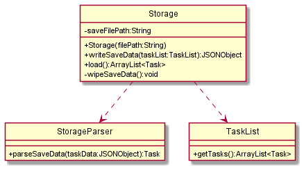
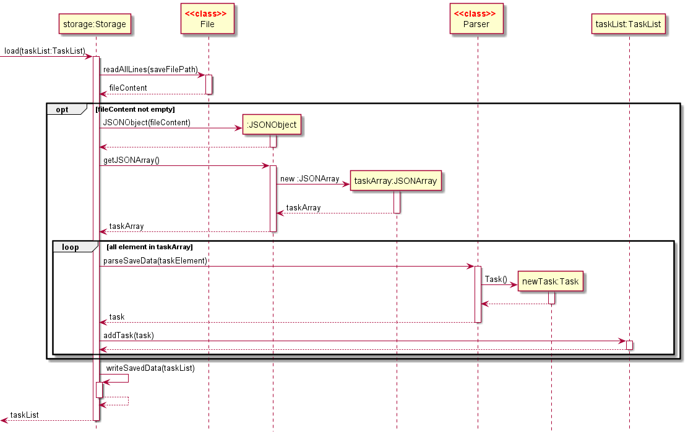

# Developer Guide

## Acknowledgements

{list here sources of all reused/adapted ideas, code, documentation, and third-party libraries -- include links to the original source as well}

## Design & implementation

### Loading saved files

Class diagram of Storage:

(_Note: some methods and attributes of `TaskList`,`Ui` and `Parser` are omitted here_)

The storage component
- Can save the content of a `TaskList` to a file in JSON format
- Can load a JSON file to restore a previously saved `TaskList`
- Relies on the `Parser` class to understand the content of a JSON file
- Communicates with the user through the `Ui` class

The loading of a save file is done with the function

`Storage#load()` - Loads a saved JSON file and returns an ArrayList of task

The path of the JSON file is provided as a parameter in the constructor of `Storage` hence 
there is no need for any parameters in the `Storage#load()`. Since a save file will be created in the 
constructor of `Storage` if no such file exists, there should not be any issue with a missing save file.

The sequence diagram of `Storage#load()` is shown here:

In the event where the save file cannot be parsed by `JSONObject`, the function `Storage#handleCorruptedSave()`
will be invoked. The user will get to choose to create a new save file or exit the program for manual inspection.

The sequence diagram of `Storage#handleCorruptedSave()` is shown here:

#### Design considerations for the format of the save file
- JSON (current choice)
  - Pros: Easy to modify by hand if the user wants to
  - Pros: Easy to parse data
- XML
  - Pros:Reasonably easy for users to modify
  - Cons: Difficult to parse
- Text file with custom format
  - Pros: Might use less space (negligible)
  - Cons: Unintuitive for users to modify
## Product scope
### Target user profile

{Describe the target user profile}

### Value proposition

Sherpass aims to help students to tackle their individual hectic schedules by means of a planner.
Students can manage his/her time by adding their tasks into the application and get reminders
when the tasks are due for completion. Students can also use the study timers within the study session
to block out pockets of time for studying, so that they can better focus during study sessions.

## User Stories

|Version| As a ... | I want to ... | So that I can ...|
|--------|----------|---------------|------------------|
|v1.0|new user|see usage instructions|refer to them when I forget how to use the application|
|v2.0|user|find a to-do item by name|locate a to-do without having to go through the entire list|

## Non-Functional Requirements

{Give non-functional requirements}

## Glossary

* *glossary item* - Definition

## Instructions for manual testing

{Give instructions on how to do a manual product testing e.g., how to load sample data to be used for testing}
