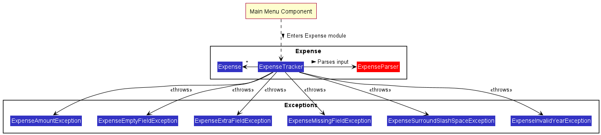

# Developer Guide

## Acknowledgements

* [AB-3 Developer Guide](https://se-education.org/addressbook-level3/DeveloperGuide.html)
* [PlantUML Tutorial at se-edu/guides](https://se-education.org/guides/tutorials/plantUml.html)
* [Our individual projects](AboutUs.md)

{list here sources of all reused/adapted ideas, code, documentation, and third-party libraries -- include links to the original source as well}

## Design & implementation

{Describe the design and implementation of the product. Use UML diagrams and short code snippets where applicable.}

## Product scope
### Target user profile

{Describe the target user profile}

### Value proposition

{Describe the value proposition: what problem does it solve?}

## User Stories

|Version| As a ... | I want to ... | So that I can ...|
|--------|----------|---------------|------------------|
|v1.0|new user|see usage instructions|refer to them when I forget how to use the application|
|v2.0|user|find a to-do item by name|locate a to-do without having to go through the entire list|

### Main Menu

### Modules

### Expense Component

How the Expense Tracker component works:
1. From the Main Menu, if the user decides to run `goto m/Expense_Tracker`, the `ExpenseTracker` class takes over.
2. The `expenseRunner` method begins by taking in user inputs depending on the user's requirements.
3. Depending on the user's input, the `ExpenseParser` class calls 
`parseXYZExpense` where `XYZ` is a placeholder for the specific command name (eg. `parseDeleteExpense`).
4. After parsing, the command is executed accordingly within the `ExpenseTracker` class.

#### [Proposed] Budgeting Reminder Feature

The proposed budgeting reminder feature is facilitated by `ExpenseTracker` and `Expense` class, which adds a 
private variable kept within the `Expense` class called `budget`. Additionally, it implements the following
operations:
- `Expense#setBudget(int)` --- Sets the current budget
- `Expense#getBudget()` --- Get the current budget left
- `ExpenseTracker#enable(int)` --- Turns on the budgeting mode which restricts exceeding of budget when adding new
expense records. It also sets the budget specified by the user.

Users may choose to enable the `Budgeting` feature via the command `enable` followed by the amount of budget
allocated in total. E.g `enable 3000`.

Whenever a new Expense record is added, the `addExpense` method of the `ExpenseTracker` class will check against
the current available `budget` and whether the expense record will cause the budget amount to be exceeded. If it 
exceeds, the addition of the new expense record will be rejected.

If the `enable` feature is turned on with existing records in the list, the `enable` method will run through the 
current list of expense records and deduct from the budget accordingly. If it already exceeds the budget, the user
will be forced to delete records until the budget is kept, or increase the budget accordingly.

Given below is an example usage scenario on how the Budgeting Reminder Feature works:

Step 1: The user navigates to the Expense Tracker for the first time, and decides to set a budget of $300.

;

Step 2: The user proceeds to add 2 expense records, each with an amount of $100.

<image src ="images/BudgetingReminder1.png">;

Step 3: The user now tries to add 1 more expense record with an amount of $200. This exceeds the budget and hence the 
addition will not be processed.

;

The following sequence diagram shows how the budget is checked upon every new addition of expense records:

;

### Contacts

## Non-Functional Requirements

{Give non-functional requirements}

## Glossary

* *glossary item* - Definition

## Instructions for manual testing

{Give instructions on how to do a manual product testing e.g., how to load sample data to be used for testing}
