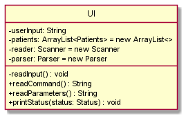
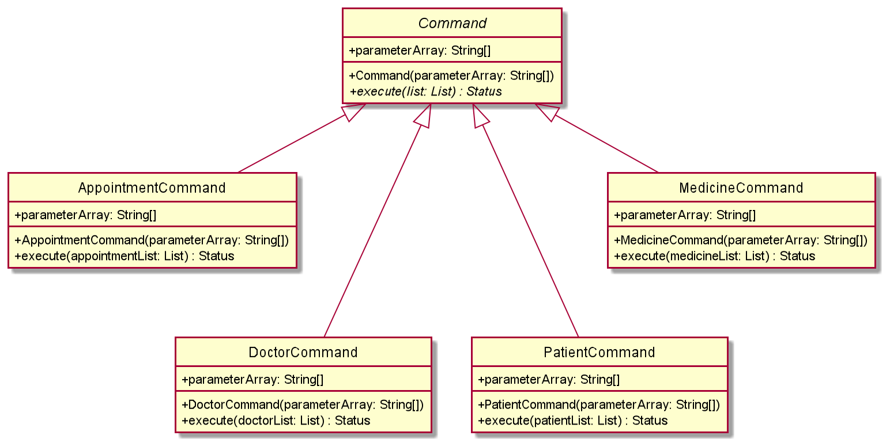
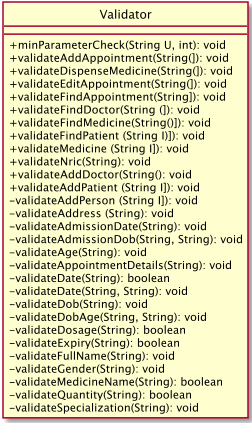
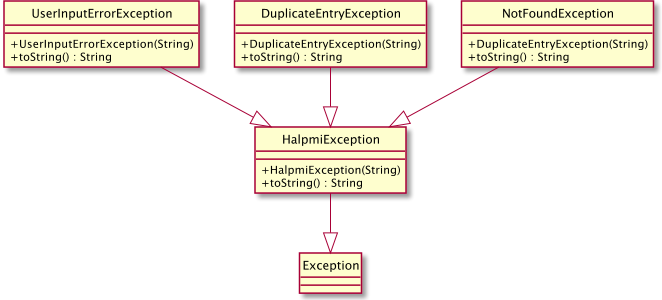
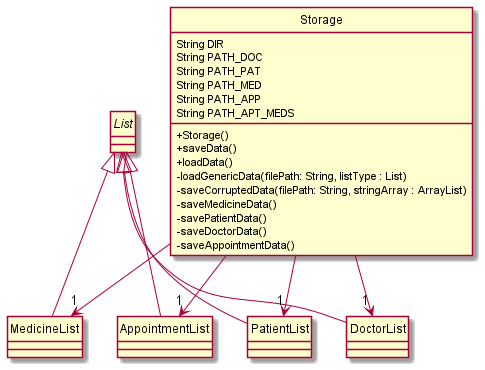
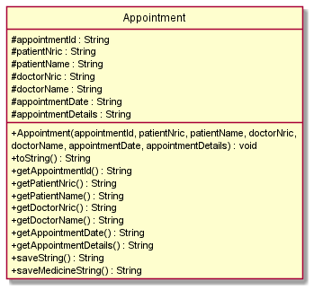
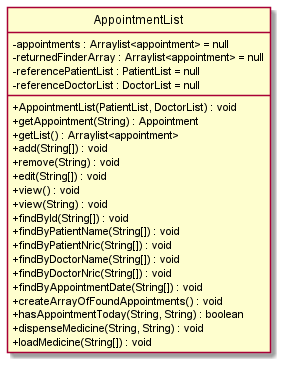
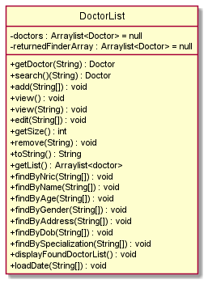

# Developer Guide

--------------------------------------------------------------------------------------------------------------------
# Contents
* [Acknowledgements](#acknowledgements)
* [Getting Started For Beginners](#getting-started-for-beginners)
* [Design](#design)
  * [Architecture](#architecture)
  * [UI Component](#ui-component)
  * [Manager Component](#manager-component)
  * [Helper Classes](#helper-classes)
    * [Command Component](#command)
    * [Parser Component](#parser)
    * [Storage Component](#storage)
    * [Validator Component](#validator)
  * [Asset Classes](#asset-classes)

* [Implementation](#implementation)
  * [Design Considerations](#design-considerations)
* [Product Scope](#product-scope)
  * [Target User](#target-user-profile)
  * [Value Proposition](#value-proposition)
  * [User Stories](#user-stories)
  * [Use Cases](#use-cases)
  * [Non-Functional Requirements](#non-functional-requirements)
* [Glossary](#glossary)
* [Appendix](#appendix)

--------------------------------------------------------------------------------------------------------------------
## **Acknowledgements**

* Design and Structure of Developer Guide referenced from the
[AB3-Developer Guide](http://se-education.org/addressbook-level3/DeveloperGuide.html).

--------------------------------------------------------------------------------------------------------------------
## **Getting Started for Beginners**

Refer to the [_User Guide_](UserGuide.md).

--------------------------------------------------------------------------------------------------------------------
## **Design**

### Architecture

The ***Architecture Diagram*** given above explains the high-level design ***HalpMi***.

Given below is a quick overview of main components and how they interact with each other.

#### **Main components of the architecture**

**`Duke`** has single method called `main` which is called upon launch. This initialises a new instance of a `Manager` class, and calls the `runLoop()`
method belonging to the Manager object.

[**`Assets`**](#asset-classes): Refers to a collection of classes that hold all the necessary data given by the User in
current and past usages.

The rest of the App consists of these components.

* [**`Manager`**](#manager-component): The Brain.
* [**`Helper`**](#helper-classes): A collection of core classes that aid with the Logical Operations performed by HalpMi.
    * [**`Command`**](#command): Contains the changes or updates to be made.
    * [**`UI`**](#ui-component): The UI of the App.
    * [**`Parser`**](#parser): Breaks down user input into parameters accepted by the app and creates a Command Object.
    * [**`Validator`**](): Checks if the input provided by the User is Valid.
    * [**`Storage`**](#storage): Reads data from data files and writes data to data files, also stores in app memory.

The Sequence Diagram below showcases the general Logic and Flow of the program from Launch till Exit.

### UI component

How the UI class works:
* Based on the architecture sequence diagram, `Manager` class calls readCommand method in `UI` class and returns the UserInput.
* Afterwards, the `Manager` class calls readParameters method in `UI` class and returns another UserInput.
* Finally, the `Manager` class calls print method in `UI` class which in turn calls `Status` enum and returns the constant.

### Manager component

 
How the Manager class works:
* When `Duke` class instantiates a `Manager` object and calls runLoop method, the program will execute a while loop.
* In the while loop, there is a switch condition.
* Based on the parameter provided to the switch, it will call the respective methods in UI, Parser & Command classes.
* The while loop only halts when isTerminated boolean becomes true. Then, the programme exits.

### Helper Classes

#### `Command`

How the Command class works:
* Based on the architecture sequence diagram, the `Parser` class calls the `Validator` class to check if the inputs are valid.
* If it is valid, the `Command` subclass executes its method.
* The subclass is based on whether the user wants to access either the `Doctor`, `Patient`, `Medicine` or `Appointment` asset list class.
* The input parameters determine which of the `Command` subclass is used.
* These input parameters are actions which can be `Add`, `Delete`, `View`, `Edit`, `Find`, `Check`, `Update` or `Clear`

#### `Validator`

The validator has a series of methods to ensure that the parameters entered are correct.  It throws a `HalpmiException` if the parameters and/or number of parameters
entered are invalid.
For example, validateAddPatient validates the parameter of `add patient` command, ensuring each parameter is in correct
format. Please refer to the below sequence diagram for a clearer understanding.

#### `Parser`

The parser parses the description of the command. It calls the validator class to validate the parameters, and then returns a command if the validation is successful.

#### `HalpmiException`
 
There are three types of HalpmiExceptions, namely, `UserInputErrorException` (usually thrown by Validator), `NotFoundException` (thrown by `find` command) and `DuplicateEntryException` (thrown when trying to add already existing data). 

The exception message will be printed out by the `Ui` class somewhere in the program. 

#### `Storage`

The Storage class holds 4 different Lists found in the Assets collection as seen in the Class Diagram shown above. Any edits made
to these Lists must be made by accessing them from the Storage object. The Storage class also has a genericLoadFunction for all types of Asset,
namely Patient, Doctor, Medicine and Appointment. These methods read in the respective text files to load existing information
into their respective lists. The Storage class has 5 save methods that save the information found in the 4 Lists into text files
in the CSV format. The Directory of these text files is found in the DIR String variable, the PATH for each of the 4 text files
can be found in the PATH_MED, PATH_PAT, PATH_DOC, PATH_APP, PATH_APT_MEDS String variables respectively.

#### Corrupted files
A preliminary check for corrupted files will be done when HalpMi starts. The validator function will be invoked to ensure the the input lines are correct. Else, the corrupted files will be moved into another separate text file named `[datatype]_corrupted.txt`.
### Asset classes

#### `Appointment`

The Appointment class holds several attributes that are exposed via getter methods. To instantiate the class, all the
attributes must be given to the constructor method.

#### `Appointment List`

The AppointmentList class contains a private list of Appointments and another list for searching.  It has several
public methods that allows the user to get information regarding the list, view the list as well as search for specific
Appointment by selected criteria.

#### `Medicine`

The Medicine class holds several attributes that are exposed via getter methods. To instantiate the class, all the
attributes must be given to the constructor method. There is a method to edit the attribute data that can be called
whenever user types in the correct command.

#### `Medicine List`

The MedicineList class contains private lists of Medicine, expired Medicine and one list for searching. It has several
public methods that allows the user to get information regarding the list, view the list as well as search for specific
Medicine by selected criteria.

##### `Patient`

The Patient class holds several attributes that are exposed via getter methods. To instantiate the class, all the
attributes must be given to the constructor method. There is a method to edit the attribute data that can be called
whenever user types in the correct command.

#### `Patient List`

The PatientList class contains private lists of Patients and one list for searching. It has several
public methods that allows the user to get information regarding the list, view the list as well as search for specific
Patients by selected criteria.

#### `Doctor`

The Doctor class holds several attributes that are exposed via getter methods. To instantiate the class, all the
attributes must be given to the constructor method. There is a method to edit the attribute data that can be called
whenever user types in the correct command.

#### `Doctor List`

The DoctorList class contains private lists of Doctors and one list for searching. It has several
public methods that allows the user to get information regarding the list, view the list as well as search for specific
Doctors by selected criteria.

--------------------------------------------------------------------------------------------------------------------

--------------------------------------------------------------------------------------------------------------------

## **Implementation**

This section describes some noteworthy details on how certain features are implemented.

### View appointments with selected criteria
This feature is a method within `AppointmentList`. `AppointmentList` contains an arraylist
of `Appointment` as a private element. `AppointmentList` methods invoked interacts with this
list, possibly making changes in the process.

Some methods included in the `AppointmentList` are:
* `AppointmentList#add` -- Appends a new `Appointment` to the list.
* `AppointmentList#remove` -- Removes an entry from the list by appointment id.
* `AppointmentList#edit` -- Edits a existing entry from the list by.
* `AppointmentList#view` -- Text display of all or selected appointments in the list.
* `AppointmentList#find` -- Find selected appointments using the criteria given.

The methods are exposed in the `Manager#runLoop` method where user input is parsed. A `ViewAppointmentCommand` will
be returned if the user input passes the validation by `Validator`. Else, a `HalpmiException` will be thrown
indicating missing parameters.

Below is a simplified sequence diagram showing the key class interactions specifically when the User calls the
`view appointment` command appropriately.

 
The user first types in the command for view appointment correctly. Then, Manager will call UI methods to
parse and identify the command string and parameters string before parsing within Parser. If parameters are absent,
then a ViewAppointmentCommand is returned. Else, a FindAppointmentCommand with the parameters is returned. The Command
is executed which displays the appointments to the User. The command allows calls to get a Status variable to be
returned to the Manager.

### Dispense Medicine to Patient

This feature allows the user to generate the Batch IDs of the medicine that he/she wishes to dispense to a patient
on his day of appointment. The logic behind this feature is that, in a clinic there will be many batches of
the same medication, each batch differing by the expiry date and the quantity left. This feature allows the user to
simply give the list of Medicine Names and the Quantity of each medicine required. HalpMi will figure out the best way
to dispense each type of medicine such that medicine that expire earlier are dispensed first before dispensing later ones.
HalpMi also generates the list of Medicine that is not available in the inventory if the medicines listed by the user
does not have the necessary quantity. Below is a sequence diagram showcasing how this functionality is achieved.

This would be the basic flow of application logic when the user gives an input
`dispense medicine /info S1234567A,Paracetamol,10`. Given that both the Patient has an appointment today and the medicine
requested is in stock.

---------------------------------------------------------------------------------------------------------------
## Product scope

### Target user profile:

* administrator in clinic(s)
* prefer desktop apps over other types
* can type fast
* prefers typing to mouse interactions
* is reasonably comfortable using CLI apps

### Value proposition:

Manage core clinic related data faster than using mouse or GUI.
Ensure each data type conforms to certain standards with in-built validations.

### User stories

Priorities: High (must have) - `* * *`, Medium (nice to have) - `* *`, Low (unlikely to have) - `*`

| Version | Priority | As a ...                                   | I want to ...                                | So that I can ...                                                      |
|---------|----------|--------------------------------------------|----------------------------------------------|------------------------------------------------------------------------|
|   1.0   | `***`    | new user | view the user guide  | to learn how to use the system |
|   1.0   | `***`    | user | use the help function  | to get help quickly within the application |
|   1.0   | `***`    | user | add patient  | keep track of the patients |
|   1.0   | `***`    | user | add doctor  | keep track of the doctors |
|   1.0   | `***`    | user | add medicine  | keep track of the medicines|
|   1.0   | `***`    | user | view patient  | see all patients in the clinic |
|   1.0   | `***`    | user | view doctor  | see all doctors in the clinic |
|   1.0   | `***`    | user | view medicine  | see all medicines in the clinic |
|   1.0   | `**`     | user | delete patient  | remove data of patients that are not needed anymore |
|   1.0   | `**`     | user | delete doctor  | remove data of doctors that are not needed anymore |
|   1.0   | `**`     | user | delete medicine  | remove data of medicines that are not needed anymore |
|   1.0   | `*`      | user | save data of the application  | all changes I made in one session is saved |
|   1.0   | `*`      | user | exit the app  | work on other issues whenever appropriate |
|   2.0   | `***`    | user | add appointment  | keep track of appointments |
|   2.0   | `***`    | user | delete appointment  | remove appointments that are not needed anymore |
|   2.0   | `***`    | user | view appointment  | see all appointment in the clinic |
|   2.0   | `**`     | user | edit appointment  | update changes to appointments |
|   2.0   | `**`     | user | edit patient  | update changes of patients |
|   2.0   | `**`     | user | edit doctor  | update changes of doctors |
|   2.0   | `**`     | user | edit medicine  | update changes of medicines |
|   2.0   | `**`     | user | find patient  | filter out patients by specific criteria |
|   2.0   | `**`     | user | find doctor  | filter out doctors by specific criteria |
|   2.0   | `**`     | user | find medicine  | filter out medicines by specific criteria |
|   2.0   | `**`     | user | find appointment  | filter out appointments by specific criteria |
|   2.1   | `*`      | user | update medicines in inventory | find medicines that are expired or have ran out |
|   2.1   | `*`      | user | clear expired medicines | remove expired/ran out medicines from the inventory |
|   2.1   | `*`      | user | generate the batch id of medicines to dispense | dispense medicine that expire earlier first |
|   2.1   | `*`      | user | schedule an appointment | schedule an appointment with a doctor that is free |

### Use cases

### Non-Functional Requirements
Device Environment:
* Must have Java 11 or higher installed in OS
* 32-bit or 64-bit environment
* Command Line Interface supported

  Performance of app:
* Function offline, without the need for internet access
* Quick to launch and use
* No noticeable lag or delay in performance when running
* Intuitive and seamless for new users
* Ability to export the data into a txt file to load on another OS

  Reliability of app:
* Data files should be updated constantly and accurately, with no data loss
* Data records should be retrievable and readable
* Text inputs should produce similar results if utilised multiple times
* Program should run without any forced-close error due to bugs

--------------------------------------------------------------------------------------------------------------------

## Glossary

* *FUllNAME* - Standard form for full name of patients and doctors is a String value with no spaces
* *NRIC* - Standard form for nric of patients and doctors is a String value with no spaces
* *AGE* - Standard form for age is an int value more than 0
* *GENDER* - Standard form for gender of patients and doctors is a char value of "M" or "F"
* *ADDRESS* - Standard form for address is a String value with no spaces
* *DOB* - Standard form for date-of-birth is a String value with no spaces
* *SPECIALIZATION* - Standard form for specialization of doctors is String value with no spaces
* *MEDICINEID* - Standard form for medicine id is a String value with no spaces
* *MEDICINENAME* - Standard form for medicine name is a String value with no spaces
* *DOSAGE* - Standard form for dosage of medicine is an int value, standard unit milligrams
* *EXPIRY* - Standard form for expiry of medicine is a String value with no spaces
* *SIDEEFFECTS* - Standard form for side effects of medicine is a String value with no spaces
* *QUANTITY* - Standard form for quantity of medicine is an int value
* *APPOINTMENTID* - Standard form for appointment id is a String value with no spaces
* *APPOINTMENTDETAILS* - Standard form for appointment details is a String value

--------------------------------------------------------------------------------------------------------------------

## **Appendix**

For manual testing, developers can follow the instructions listed out in the [UserGuide](UserGuide.md)
* Detailed input and output examples are displayed for cross checking.
  Alternatively, they can also follow the following steps to test out the respective commands,
  upon downloading the jar file, while adhering to the specified restrictions in Glossary:

1. `add doctor /info [nric],[name],[age],[gender],[address],[DOB],[Specialisation]`
  * Adds a new doctor with the specified parameters into the system
2. `add patient /info [nric],[name],[age],[gender],[address],[DOB]`
  * Adds a new patient with the specified parameters into the system
3. `add medicine /info [name],[dosage],[expiry date],[side effects],[quantity]`
  * Adds a new medicine with the specified parameters into the system
4. `view doctor` or `view doctor /info [criteria],[input]`
  * View records of all doctors or specific doctors fulfilling the criteria
5. `view patient` or `view patient /info [criteria],[input]`
  * View records of all patients or specific patients fulfilling the criteria
6. `view medicine` or `view medicine /info [criteria],[input]`
  * View records of all medicines or specific medicines fulfilling the criteria
7. `delete doctor /info [nric]`
  * deletes the record of the doctor with the specified nric
8. `delete patient /info [nric]`
  * deletes the record of the patient with the specified nric
9. `delete medicine /info [Batch ID]`
  * deletes the record of the medicine with the specified id
