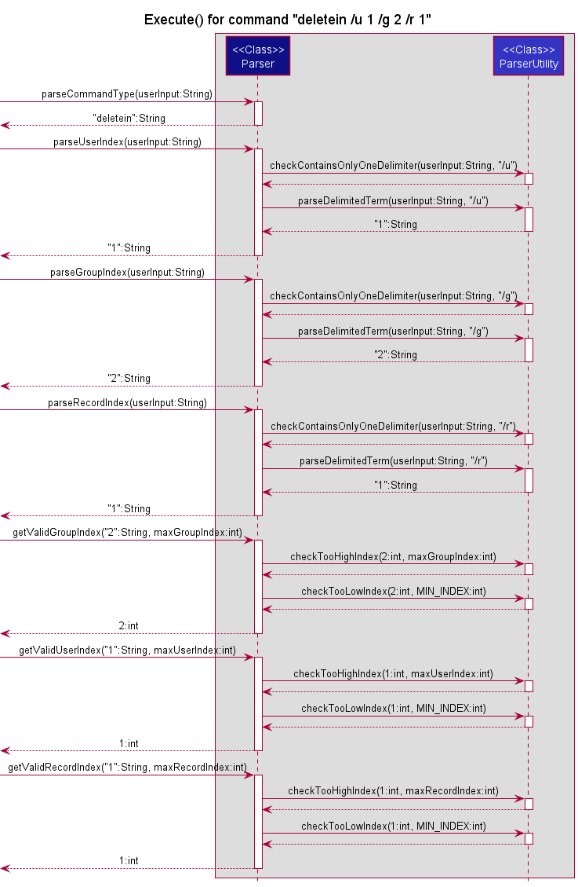
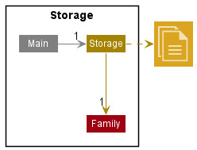
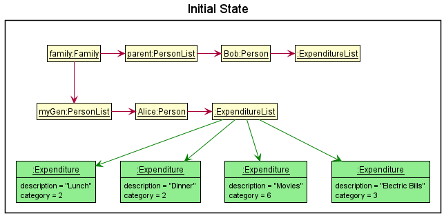
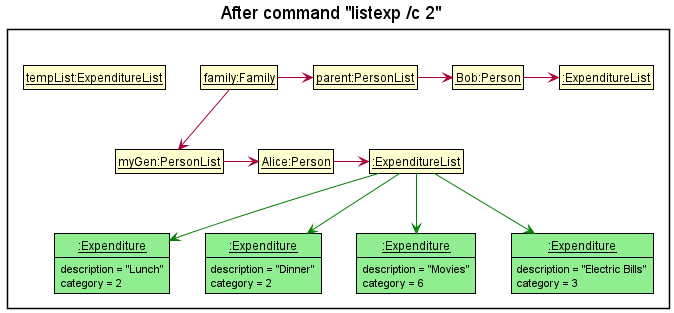
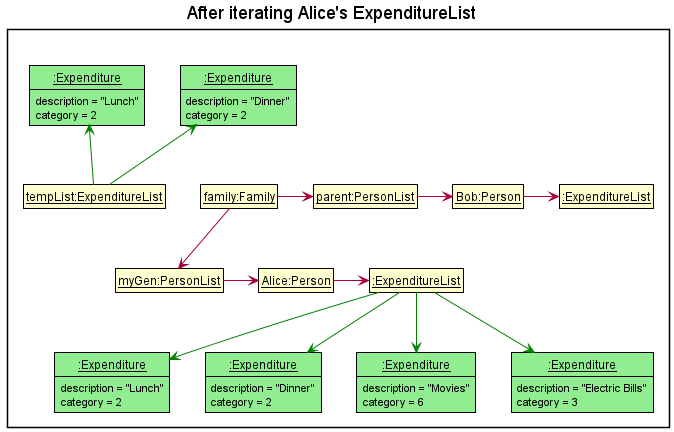
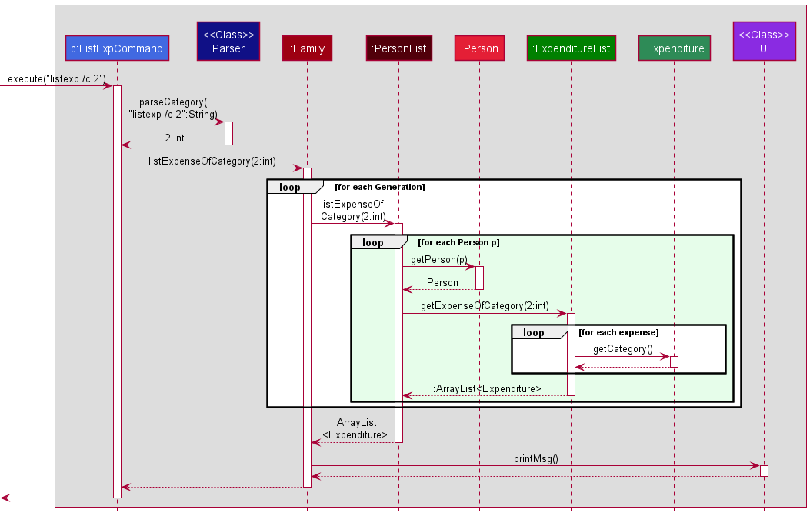
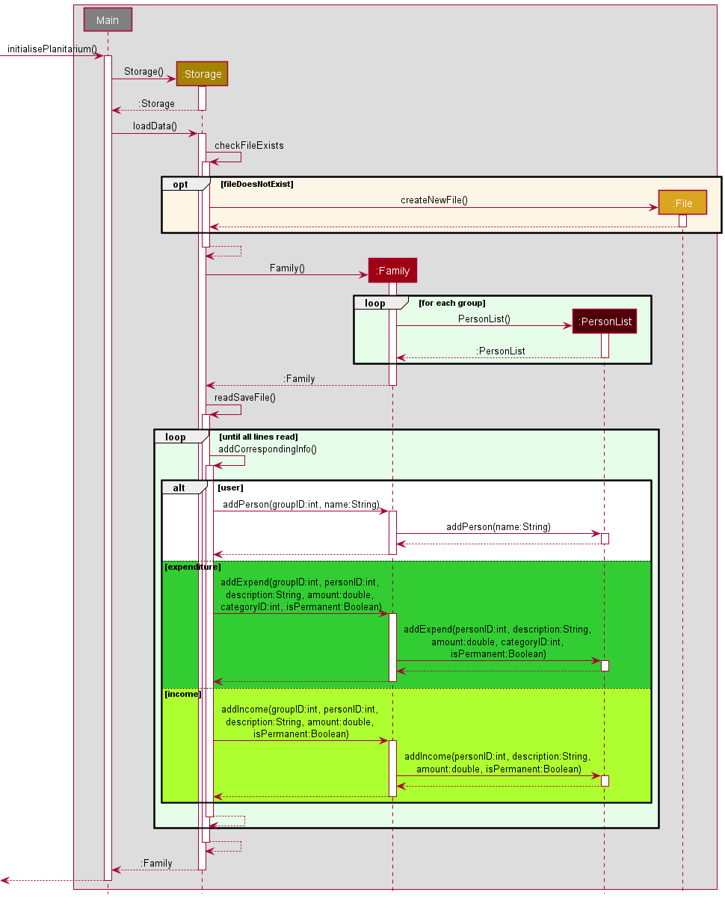
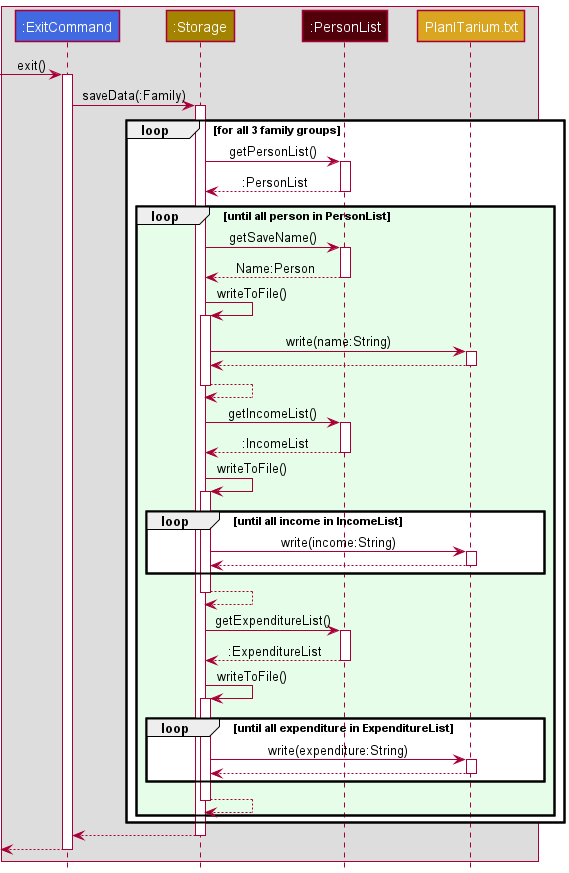

# PlanITarium Developer Guide

---

# Introductions

This document contains the Developer Guide to the **PlanITarium** application. It serves to explain the internal
workings of PlanITarium such that engineers can understand the various implementations in detail and work on the
project.

---

## Acknowledgements

In this project, we have referenced the following materials:

* Developer Guide sample from [Address Book (Level-3)](
https://se-education.org/addressbook-level3/DeveloperGuide.html)
* PlantUML Tutorial at [se-edu/guides](https://se-education.org/guides/tutorials/plantUml.html)
* [Our individual projects](AboutUs.md)

---

## Design

### Architecture

The ***Architecture Diagram*** given below shows the high-level design of PlanITarium.


> :information_source: **Note:** The that `.puml` files used to create diagrams in this document
> can be found in the diagrams folder. Refer to the above [PlantUML Tutorial](#Acknowledgements)
> to learn how to create and edit these diagrams when necessary.

**Overview of components in the Architecture**

[`Main`](https://github.com/AY2122S2-CS2113T-T10-2/tp/blob/master/src/main/java/seedu/planitarium/PlanITarium.java)
is responsible for,

* At launch, initialize the components in an appropriate manner and calls Storage to read data if any.
* Read user's commands from standard input for command execution.
* At shut down, invokes shutdown sequence and calls Storage to save its current data.

[`UI`](#UI-Component) is responsible for the UI of PlanITarium.

[`Commands`](#Commands-Component) is responsible for the handling and executing of commands.

[`Parser`](#Parser-Component) is responsible for the parsing and validating user input.

[`Family`](#Family-Component) is responsible for holding the user data of PlanITarium in memory.

[`Money`](#Money-Component) is responsible for holding the monetary information in memory.

[`Storage`](#Storage-Component) is responsible for reading and writing data to the hard disk.

**How the components interact with each other**

The following Sequence Diagram, with the specific classes and methods abstracted, shows a high-level view on how the 
components interact for the scenario where the user issues the command `add /g 2 /n Alice`.


Each of the main components shown in the diagram above is defined and implemented in a class with the same name as its
component. The section below provides a more in-depth details on how the components interact with one another.

Each component may have several other classes underneath it, belonging to the same logical grouping, to reduce coupling.
For example, the `Money` component is defined as an abstract class that is extended by `Income` and `Expenditure`.

### UI Component

<!-- {For Huilin as she is most familiar} -->

### Commands Component

The `Commands` component consists following classes: [`CommandFactory.java`
](https://github.com/AY2122S2-CS2113T-T10-2/tp/blob/master/src/main/java/seedu/planitarium/commands/CommandFactory.java)
[`Command.java`
](https://github.com/AY2122S2-CS2113T-T10-2/tp/blob/master/src/main/java/seedu/planitarium/commands/Command.java)
[`AddPersonCommand.java`
](https://github.com/AY2122S2-CS2113T-T10-2/tp/blob/master/src/main/java/seedu/planitarium/commands/AddPersonCommand.java)
[`DeletePersonCommand.java`
](https://github.com/AY2122S2-CS2113T-T10-2/tp/blob/master/src/main/java/seedu/planitarium/commands/DeletePersonCommand.java)
[`AddRecordCommand.java`
](https://github.com/AY2122S2-CS2113T-T10-2/tp/blob/master/src/main/java/seedu/planitarium/commands/AddRecordCommand.java)
[`DeleteRecordCommand.java`
](https://github.com/AY2122S2-CS2113T-T10-2/tp/blob/master/src/main/java/seedu/planitarium/commands/DeleteRecordCommand.java)
[`EditRecordCommand.java`
](https://github.com/AY2122S2-CS2113T-T10-2/tp/blob/master/src/main/java/seedu/planitarium/commands/EditRecordCommand.java)
[`HelpCommand.java`
](https://github.com/AY2122S2-CS2113T-T10-2/tp/blob/master/src/main/java/seedu/planitarium/commands/HelpCommand.java)
[`ListCommand.java`
](https://github.com/AY2122S2-CS2113T-T10-2/tp/blob/master/src/main/java/seedu/planitarium/commands/ListCommand.java)
[`ListCatCommand.java`
](https://github.com/AY2122S2-CS2113T-T10-2/tp/blob/master/src/main/java/seedu/planitarium/commands/ListCatCommand.java)
[`OverviewCommand.java`
](https://github.com/AY2122S2-CS2113T-T10-2/tp/blob/master/src/main/java/seedu/planitarium/commands/OverviewCommand.java)
[`SearchCommand.java`
](https://github.com/AY2122S2-CS2113T-T10-2/tp/blob/master/src/main/java/seedu/planitarium/commands/SearchCommand.java)
[`ExitCommand.java`
](https://github.com/AY2122S2-CS2113T-T10-2/tp/blob/master/src/main/java/seedu/planitarium/commands/ExitCommand.java)

The `CommandFactory` provides a `getCommand()` function to get different commands according to the keywords of 
user's instructions. This keyword is parsed by `Parser`. There're 11 cases, and it would throw an exception called 
`UnknownInputException` if the keyword from user input is neither of the 11 cases provided. 

The `Command` class is an abstract class that has abstract method ``
<!-- {For Huilin} -->

### Parser Component

**Class:** [`Parser.java`
](https://github.com/AY2122S2-CS2113T-T10-2/tp/blob/master/src/main/java/seedu/planitarium/parser/Parser.java)


The `Parser` component consists of the `Parser` class, `ParserUtility` class and several `Exception` classes.

The `Parser` class provides the `parseXYZ()` and `getValidXYZ()` methods where `XYZ` is a placeholder for the type of
term (e.g. `parseKeyword()` and `getValidUserIndex`). The methods prepended by **parse** assists in parsing the user
input into its respective terms and the method prepended by **getValid** assists in validating the parsed terms and
returning an appropriately typed object to the `Commands` component. The `Parser` class interacts with the
`ParserUtility` class which provides supporting methods for parsing and validating. Both classes throws exceptions as
required.

The following Sequence Diagram shows how the classes of the `Parser` component interacts for each user command.


> :information_source: **Note:** The borders of the Sequence Diagram may look cut-off due to PlantUML limitations.
> No necessary information has been omitted due to it.

How the `Parser` component is used:

1. When the `Commands` component receives a user input, `parseKeyword()` is called upon to parse the type of command to
   be executed.
2. This will result in the keyword of the command to be returned as a string.
3. When necessary, the `parseXYZ()` methods will be called upon to parse more terms for the `Commands`
   component to obtain the details required for the command execution (e.g. `parseGroupIndex("add /n Alice /g 2")`
   to get group 2). The `ParserUtility` assists the parsing during this process by providing utility methods.
4. The `getValidXYZ()` methods will also be called upon thereafter to check and return valid typecasted objects to be
   used for the command execution (e.g. `getValidGroupIndex(indexString)` to check that the index provided corresponds
   to an existing group). The `ParserUtility` is also called here to assist with the validation process.

The Sequence Diagram below illustrates the interactions in the `Parser` component for a command execution.
Let `userInput` be the command string `deletein /u 1 /g 2 /r 1` and the minimum index `MIN_INDEX` be the constant that
is supported by PlanITarium to be `1`.



### Family Component

The **Class** of this component is specified in [`Family.java`](
https://github.com/AY2122S2-CS2113T-T10-2/tp/blob/master/src/main/java/seedu/planitarium/person/Family.java)
, [`PersonList.java`](
https://github.com/AY2122S2-CS2113T-T10-2/tp/blob/master/src/main/java/seedu/planitarium/person/PersonList.java)
and [`Person.java`](
https://github.com/AY2122S2-CS2113T-T10-2/tp/blob/master/src/main/java/seedu/planitarium/person/Person.java)


The list of persons consists of a `Family` that is made up of generational `PersonList`s. Each `PersonList` holds a 
list of `Person`s who belong to that generation.

The `Person` component,

* Stores the logical grouping of persons added i.e., all `Person` objects must belong to one of the `PersonList`s.
* Stores the total number of `Person`s in the `Family`, as well as each of the generational `PersonList`s.
* Depends on the `Money` component to help keep track of each `Person`'s income and expenditure as each `Person` 
  contains an `IncomeList` and `ExpenditureList`.

### Money Component

<!-- {For Jiarong} -->

### Storage Component

**Class:** [`Storage.java`
](https://github.com/AY2122S2-CS2113T-T10-2/tp/blob/master/src/main/java/seedu/planitarium/storage/Storage.java)



The `Storage` component,

* can save each person's data and their income and expenditure data when the program exits into a local file, and reads
  them back into corresponding objects when the program runs again.
* depends on the classes in the `Person` component (because the `Storage` component's job is to save/retrieve objects to
  the `Person`)

---

## Implementation

This section describes some noteworthy details on how certain features are implemented.

### Command Execution

In PlanITarium, a command usually has the following format:

```md
[command type][indicator][description]
```

For example,

```md
add \n Alice
```

is to add a person whose name is Alice. `add` here is the command type to add a person, and `\n` is the indicator of the
name of person.

There may be several indicators for every input, such as

```md
addin \i 200 \d salary \u 1
```

is to add an income for the person whose uid is 1, and the description of this income is salary.

When `PlanITarium` receives such input, it will pass the input to `CommandFactory`. The `CommandFactory` will call
`Parser` to parse the input into several components according to the indicator. The `Parser` will then return the type
of command to `CommandFactory`. According to the type, `CommandFactory` will return a command object to `PlanITarium`.
After receiving the command, `PlanITarium` will call `execute()` of command object to execute the command.

The following diagram is the sequence diagram of this entire process.


Following operations are implemented:

* `CommandFactory#getCommand(userInput, personList)` -- Return the command that is needed to be executed corresponding
  to the user input
* `Parser#getKeyword(userInput)` -- Return the keyword of the type of command
* `Command#execute()` -- Execute the command

Below is and example usage scenario and how Alice is added to the `PersonList`

Step 1. given that user input is

```md
add \n Alice
```

and this string will be passed to `CommandFactory` together with `personList` that contains all the people who had been
added previously by calling `getCommand()`.

Step 2. The `CommandFactory` will pass the input to `Parser` to parse the keyword by calling `Parser.parseKeywords`, and
the `Parser` should return `add` as keyword.

Step 3. The `CommandFactory` will then match the keyword to the type of command. In this case, `add` is corresponding
to `AddPersonCommand`. The `CommandFactory` will then create a new `AddPersonCommand` with `userInput` and `personList`,
and return this object to `PlanITarium`.

Step 4. `PlanITarium` will then execute this command by calling `execute()`. Alice will then be added to the
`personList`.

### Logical grouping for different generation of person added

#### Implementation

The proposed logical grouping of persons added is facilitated by `Family`. It holds 3 lists of `PersonList`, each one
for a different generation. Additionally, it implements the following operations:

* `Family#list()` -- Lists a high level overview of income and expenditure of each generation.
* `Family#remain()` -- Prints the total disposable income remaining for the family after everybody's income and   
  expenditures have been taken into account.
* `Family#addParent()` -- Adds a person into the `parents` list.
* `Family#addMyGen()` -- Adds a person into the `myGen` list.
* `Family#addChild()` -- Adds a person into the `children` list.
* `Family#XYZCommand()` -- Passes relevant parameters down to lower level class.

Given below is an example usage scenario and how a generation's high level finance overview is calculated.

Step 1. The user launches the application. A `Family` object will be initialised with its 3 generational 
`PersonList`s. They are `parents`, `myGen`, and `children`.


Step 2. The user wishes to add a person, say `John Doe`, to the `children` list. The user executes 
`add /n John Doe /g 3` command, adding a `Person` with `name` as `John Doe` to group 3, which is the `children`.


Step 3. The user executes `addin /g 3 /u 1 /i ...` to add a new income to index 1 of the `children` list, who is 
`John Doe`. This causes an income object to be added to the `IncomeList` of `John Doe`.


Step 4. The user now decides to have an overview of his family's finances by executing the `list` command. The `list` 
command will call `Family#list()`, which will go through each generation to sum up their incomes and expenditures and 
print that out.


#### Design considerations:

**Aspect: How to sort persons into logical groups:**

* **Alternative 1 \(current choice):** Have a `Family` object hold 3 `PersonList`s, one for each generation.
    * Pros: Only requires storage of one instance of each income and expenditure.
    * Cons: May have performance issues related to operations which work on every income and expenditure as it makes 
      them deeply nested.
* **Alternative 2:** Maintain the single `PersonList` with everyone inside, but give a tag to each `Person` to indicate
  which generation they belong to
    * Pros: Very low maintenance and changes required to existing code.
    * Cons: Lack of abstraction, and that total income and expenditure for each generation would need to be   
      stored until the entire list is iterated through before being able to print.

**Aspect: How many levels of information to show**

* **Alternative 1 \(current choice):** Each class shows information suiting their level i.e., `Family#list()` shows 
  an overview of each `PersonList`'s total income and expenditure.
    * Pros: Users will be able to choose how much information they want to see.
    * Cons: The user would be unable to view all the information with a single command.
* **Alternative 2:** Only have a single `Family#list()` which gives detailed information of each `Person`'s income 
  and expenditures.
    * Pros: Only 1 command is required to show all information.
    * Cons: If the user only wants a high level overview, the user could be hit with information overload.

### Edit Values Feature

Maybe for Jiarong {Suggest to show the process from `parsing several delimiters` to `finding the income/expenditure`
to `editing the value`.}

### [Proposed] Find feature

#### Proposed Implementation

The proposed find feature is facilitated by `Categories`, `Money(temp)`, `MoneyList(temp)`
and `Family`. The `Categories` is an enumeration of keys that is used as the expenditure categories. The `Money(temp)`
will have an additional integer attribute that acts as an index to a category. Additionally, the following operations
are implemented:

* `Categories#getLabelForIndex(index)` -- Returns the name of the category with this index.
* `Money(temp)#getCategory()` -- Returns the category index for this money object.
* `Money(temp)#getDescription()` -- Returns the description for this money object.
* `MoneyList(temp)#searchExpense(description, index)` -- Returns a list of expenditures having category index matching
  the index argument and description matching the expenditure's description.
* `MoneyList(temp)#searchIncome(description)` -- Returns a list of income having description matching the income's
  description.
* `Family#listExpenseSearch(description, index)` -- Lists all expenses matching the criteria.
* `Family#listIncomeSearch(description)` -- Lists all income with matching description.

Below is an example usage scenario and how the expenses of a category will be printed.

Step 1. Given that the application already has existing data and there is one person being tracked, Alice, who belongs
to the current generation. In this case `Family` would be initialised with one generation being tracked - myGen.


Step 2. The user executes `find /d Bills /c 1` command to search for income and expenditures with descriptions
containing "Bills". The `find` command will be parsed and calls
`Family#listExpenseSearch("Bills", 1)` and `Family#listSearch("Bills")` which would instantiate 2 temporary array list
for storing the results of the upcoming search.


Step 3. After the temporary array list for expenditure has been created, the existing generation will be iterated
for `Person` objects. The `expenditureList` for a person would be retrieved during that person's iteration
and `MoneyList(temp)#searchExpense("Bills", 1)` will be called as `expenditureList` extends `MoneyList(temp)`. This
method then iterates through the list and calls
`Money(temp)#getCategory()` and `Money(temp)#getDescription()` on each expenditure, collecting and returning the
expenditure if its category matches the given index and description matches the given description. The returned
expenditures are then appended to the temporary array list.


Step 4. After the temporary array list for income has been created, the existing generation will be iterated
for `Person` objects. The `incomeList` for a person would be retrieved during that person's iteration
and `MoneyList(temp)#searchIncome("Bills")` will be called as `incomeList` extends `MoneyList(temp)`. This method then
iterates through the list and calls
`Money(temp)#getDescription()` on each income, collecting and returning the income if its description matches the given
description. The returned incomes are then appended to the temporary array list.


Step 5. The iteration, collecting and appending to the temporary array list in step 3 and 4 is repeated until every
person has been iterated. Finally, `Categories#getLabelForIndex(1)` is called so that an appropriate message can be displayed to
the user, stating the name of the category, following by a series of print to display the expenditures in this category.

> :information_source: **Note:** If the `index` provided does not map to any existing categories,
> then it can be observed that there will never be any results returned. The `find` command will
> check the index provided using `Parser#checkValidCategory` before iterating `Family`. If the check
> fails, an error message will be displayed to the user instead of continuing with the execution.

The following sequence diagram shows how the `find` operation works after the `FindCommand` has been created
by [`CommandFactory`](#PlaceholderToCommandFactory):


#### Design considerations:

**Aspect: How to search through income and expenditures to be listed:**

* **Alternative 1 (current choice):** Maintain an individual array list for found income and expenditure
    * Pros: Easy and fast access of found results, no additional logic needed to separate income from expenditure
    * Cons: Additional memory management, needs to manage 2 array list.

* **Alternative 2 :** Maintain a single array list for both found income and expenditure
    * Pros: Easy to implement and less memory usage.
    * Cons: Additional logic check is needed to print the income and expenditure in a well formatted way

### [Proposed] Listing Categorised Expenditures Feature

#### Proposed Implementation

The proposed listing categorised expenditure feature is facilitated by `Categories`,`Expenditure`, `ExpenditureList`
and `Family`. The proposed command to be called by the user is `listexp /c CATEGORY_INDEX`.
The following additional operations will also be implemented:

* `Family#listExpenseOfCategory(index)` -- Lists all expenses from the category index.
* `PersonList#listExpenseOfCategory(index)` -- Wrapper method to get the list of expenses in the category 
from each person.
* `ExpenditureList#getExpenseOfCategory(index)` -- Returns a list of expenditures having category index matching the
  index argument.

Below is an example usage scenario and how the expenses of a category will be printed.

Step 1. Given that the application already has existing data and there are two people being tracked, Alice and Bob, and
only Alice's expenses were added and categorised. Suppose that Alice is the main user and Bob is her father, then Alice
would belong to the current generation and Bob would belong to the parent generation. In this case `Family` would be
initialised with two generations being tracked - parents and myGen.



Step 2. The user executes `listexp /c 2` command to list all expenses in category `2`. The `listexp`
command will be parsed and calls `Family#listExpenseOfCategory(2)` which would instantiate a temporary array list for
storing the results of the upcoming search.



Step 3. After the temporary array list has been created, `PersonList#listExpenseOfCategory(2)` will be called on each
generation grouping and each tracked `Person` will be iterated. The `expenditureList` for a person would be retrieved 
during that person's iteration and `ExpenditureList#getExpenseOfCategory(1)` will be called. This method then iterates 
through the retrieved expenditure list and calls `Expenditure#getCategory()` on each expenditure, collecting and 
returning the expenditure if its category matches the target category index. 
The returned expenditures are then appended to the temporary array list.



Step 4. The iteration, collecting and appending to the temporary array list in step 3 is repeated until every person has
been iterated. Finally, an appropriate message can be displayed to the user,
stating the name of the category, following by a series of print to display the expenditures in this category.

> :information_source: **Note:** If the `index` provided does not map to any existing categories,
> then it can be observed that there will never be any results returned. The `listexp` command will
> check the index provided using `Parser#checkValidCategory` before iterating `Family`. If the check
> fails, an error message will be displayed to the user instead of continuing with the execution.

The following sequence diagram shows how the `listexp` operation works after a `ListCatCommand`
command object has been created by [`CommandFactory`](#Command-Execution):



#### Design considerations:

**Aspect: How to categorise expenses to be listed:**

* **Alternative 1 (current proposal):** Using the category attribute for expenses.
    * Pros: Easy to implement and less memory usage.
    * Cons: May have performance issues as it needs to iterate through every person's expenditure.

* **Alternative 2:** Maintain an array list for each category and store a copy of expenses.
    * Pros: Fast to print expenses in a category, no unnecessary look-ups.
    * Cons: Poor memory management, needs to store twice as many expenditures.

### Data Archiving

#### Saving and loading feature

##### Implementation

The saving and loading mechanism is facilitated by `Family`. It loads records of `PersonList` for each logical
grouping inside family from a local file, process the data and adds the record to `Family` for the current session.
Saves the `PersonList` record of each `Family` grouping back into the local file upon exit of the program. It implements
the following operations:

* `Storage#checkFileExists()` -- Checks if `PlanITarium.txt` file exists in the local hard drive, creates one if it does
  not.
* `Storage#saveData()` -- Writes `PersonList` record of each `Family` grouping into `PlanITarium.txt` file upon exit of
  the program.
* `Storage#loadData()` -- Opens and reads `PlanITarium.txt` for any existing `Family` records and updates each
  `PersonList` data in the current session for each logical group in `Family`.

Given below is an example scenario and how the save and load mechanism behaves at each step.

Step 1. The user launches the application. A `Storage` object will be initialised with an empty `PersonList` for each
`Family` grouping. The following sequence diagram shows how the `Storage` object is initialised

Step 2. The program will create a new `Family` object for the session which calls `Storage#loadData()`, causing a check 
if the local file `PlanITarium.txt` exists by calling `Storage#checkFileExists()` and creates one if it does not. The 
data in the local file will be read, parsed and added to the empty `Family` in `Storage` by calling `Family` adding
operations. After all lines of the files has been read and all data added, the `Family` object is then returned to main
and the `Family` object of the current session will consist of the data in `Family` of `Storage`. 
The following sequence diagram shows how the loading operation works:



Step 3. The user then decides to exit the program by executing the command `bye`, `Storage#saveData` will be called. All
data in the `Family` object will be written to the local file `PlanITarium.txt` in the format of
`(user/operation) (Info)` which are to be read again when the program starts up. The following
Sequence diagram shows how the saving operation will work:



#### Design considerations:

**Aspect: When saving of data is executed:**

* **Alternative 1 (current choice):** Saving occurs just before the program exits.
    * Pros: Better performance as it only needs to iterate through every person's data once
    * Cons: Data will not be saved if the program crashes or exits unintentionally.

* **Alternative 2:** Saves the current data of each Person after every addition, deletion or update operation.
    * Pros: The local file will constantly be updated and lowers the risk of losing records
    * Cons: May have performance issue as it needs to iterate through every person's data to be saved after each
      operation.

---

## Documentation

### Logging

The logging of this product is facilitated by [`ProjectLogger.java`](
https://github.com/AY2122S2-CS2113T-T10-2/tp/blob/master/src/main/java/seedu/planitarium/ProjectLogger.java).

Each class contains a static `logger` which logs information and errors through all instances of the class in a single
log file. The log files are named after the class, an example being `Family.log` for the `Family` class.

Simple logging is used as it provides sufficient information for documentation and debugging purposes. The log files 
are rewritten during every run of PlanITarium, so renaming of the old logs are necessary should it need to be saved.

### Testing

PlanITarium is tested mainly in 2 ways:
* JUnit testing
* IO redirection testing

#### JUnit testing

JUnit testing can be performed by running the tests in the [`test`](
https://github.com/AY2122S2-CS2113T-T10-2/tp/blob/master/src/test/java/seedu/planitarium) folder.

#### IO redirection testing

IO redirection testing can be performed via the following steps:
1. Launch a terminal in `tp/text-ui-test`
2. Edit the input file `input.txt`, and the expected output `EXPECTED.txt` if necessary
3. Run the file `runtest.bat` in the terminal

---

## Product scope

### Target user profile

The target user profile for PlanITarium is young adults who have a family to support.

### Value proposition

PlanITarium offers ease of financial tracking for the entire family. It features a single input process for performing 
tasks, and users will be able to neatly categorise their family members as well as expenditures.

---

## User Stories

| Version | As a ... | I want to ...             | So that I can ...                                           |
|---------|----------|---------------------------|-------------------------------------------------------------|
| v1.0    | new user | see usage instructions    | refer to them when I forget how to use the application      |
| v2.0    | user     | find a to-do item by name | locate a to-do without having to go through the entire list |

 

---

## Non-Functional Requirements

{Give non-functional requirements}

---

## Glossary

* *glossary item* - Definition

---

## Instructions for manual testing

See [IO redirection testing](#IO-redirection-testing).
