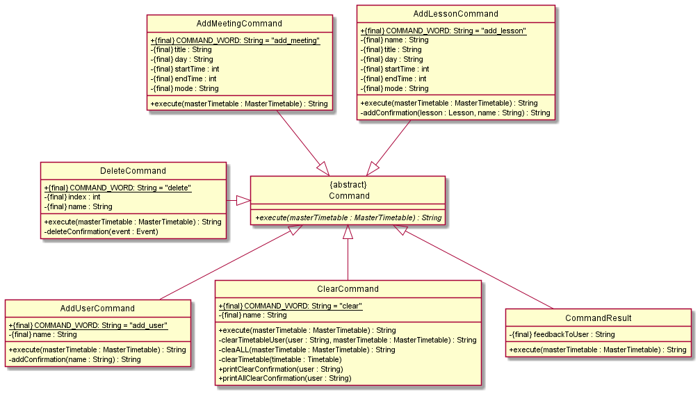
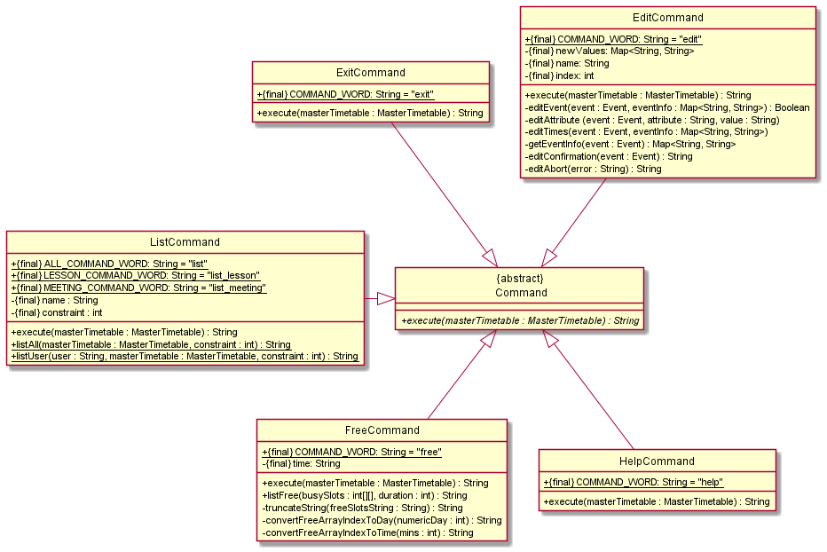
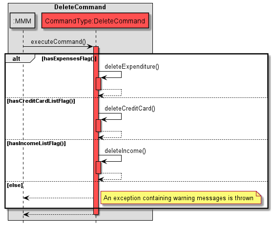
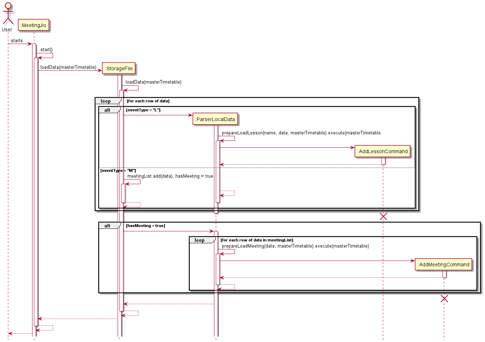

# Developer Guide

## Acknowledgements

This guide was done referencing https://se-education.org/addressbook-level3/DeveloperGuide.html.

# 1. Overview
MeetingJio is a program for **finding potential time slots for team meetings based on everyone’s availability**.

# 2. Design

## 2.1 Architecture

{Describe the design and implementation of the product. Use UML diagrams and short code snippets where applicable.}

## 2.2 UI Component

The Ui class is initialised by MeetingJio, and it handles:
- Reading user input
- Printing output

The Parser and Command classes will also be called by Ui class in the process of handling the user's input.

## 2.3 Commands Component

The above partial class diagrams illustrate the classes inside the commands component
that correspond to specific functionalities.

The commands component consists of a commands package. Inside the package are the following classes:
1. An abstract `Command` class which other individual command classes inherit from.
2. Individual Command classes which corresponding to a specific command based on the user's input.
- `AddLessonCommand`
- `AddMeetingCommand`
- `AddUserCommand`
- `ClearCommand`
- `DeleteCommand`
- `EditCommand`
- `ExitCommand`
- `FreeCommand`
- `HelpCommand`
- `ListCommand`
3. Lastly, `CommandResult` class returns corresponding feedbacks to the user.

##2.4 Parser Component
## 2.5 Timetable Component
- Timetable
- MasterTimetable

## 2.6 Event Component

The above class diagram illustrates the classes within the Event package.

The Event package includes:
1. An abstract `Event` class that other event classes inherit from
2. Individual Event classes that inherits from the `Event` class 
   - Lesson
   - Meeting

## 2.7 Storage Component

The storage component uses the `StorageFile` and `ParserLocalData` classes.
- `StorageFile` class consists of the two main functions, `saveData` and `loadData`.
- `saveData` writes all the elements in the timetable and masterTimetable to the `MeetingJio.txt`. 
If the file is not found, the file will be created.
- `loadData` reads all the data stored in the `MeetingJio.txt` and passes them to the corresponding function 
in the `ParserLocalData` class.
- `ParserLocalData` parsers all the data and stores them back into the corresponding list. In addition, it contains
error exception handler to ensure that the data in the `MeetingJio.txt` is correctly formatted.

>The directory and filename of the data file is defined within the `StorageFile` class 
The default value is set to 'MeetingJio.txt'

# 3. Implementation
This section describes some noteworthy details on how certain features are implemented.

The following sequence diagram shows how the commands generally works.
Note that certain commands may slightly different implementation compared to the one below.

Given below is the steps on how the command operations generally works.

1. User inputs is passed to the UI.
2. Ui then provides user input to the Parser class which parses it and retrieves the command and parameters.
3. Ui subsequently executes the command on the MasterTimetable.
4. Eventually a feedback message will be shown to user upon successful or failed execution.

## 3.1 Add Feature
The `add` command is a command that allows user to 
1. add new users to the master timetable.
2. add new events to the timetables.

The following sequence diagram shows how the `add` operation generally works.

**_Note:_**

This is a condensed diagram. Several terms in the sequence diagram above have been substituted by a common term.

| Common Term | User-specific term | Lesson-specific term | Meeting-specific term      |
|-------------|-------------------|----------------------|----------------------------|
| add         | `"add_user ..."`  | `"add_lesson ..."`   | `"add_meeting ..."`|
| AddCommand  | `AddUserCommand`  | `AddLessonCommand`   | `AddMeetingCommand`|

### 3.1.1 Add User Feature
`add_user` adds new user and his or her timetable into the master timetable.

The following sequence diagram shows how the `add_user` command works:

Given below is the steps on how the `add_user` operation works.

1. User inputs add_user with username which is passed to the UI.
2. Ui then provides user input to the Parser class which parses it and retrieves the name.
3. Ui subsequently executes the command on the MasterTimetable.
4. The AddUserCommand will create a new Timetable and add it to the MasterTimetable.
5. Eventually a confirmation message will be shown to user upon successful addition.

### 3.1.2 Add Events Feature

`add_lesson` allows users to create a new lesson and add it to their own timetables.

`add_meeting` allows users to create a new meeting and add it to all the existing timetables.

**Add Lesson**

The following sequence diagram shows how the `add_lesson` operation works in detail.

Given below is the steps on how the `add_lesson` operation works.

1. User inputs add_lesson with appropriate parameters which is passed to the UI.
2. Ui then provides user input to the Parser class which parses it and retrieves the respective lesson description.
3. Ui subsequently executes the command on the MasterTimetable.
4. The AddLessonCommand will create a new Lesson and add it to the specified user's timetable.
5. Eventually a confirmation message will be shown to user upon successful addition.

**Add Meeting**

The following sequence diagram shows how the `add_meeting` operation works in detail.

The above diagram shows the sequence diagram of an addition of a meeting  which is normally after a few users 
and some of their lessons have been added and the free command is executed to see the free slots.

1. User inputs add_meeting with appropriate parameters which is passed to the UI.
2. Ui then provides user input to the Parser class which parses it and retrieves the respective meeting command.
3. Ui subsequently executes the command on the masterTimetable for the whole application.
4. The AddMeetingCommand will create a new meeting object from Meeting and will add to every user's timetable.
5. Subsequently, a addMeeting confirmation message will be shown to user upon successful addition.

## 3.2 Listing Events Feature
The `list` command is a command that the user can input in order to list out the events he has in his timetable.

Before the timetable is listed out, it will also be sorted according to day and time for easy reading.

The following sequence diagram shows how the command `list all` is executed.

Given below is the steps of how the `list` command works:
1. If the given command is `list [user]`, the ListCommand calls the Timetable class to sort the user's timetable and 
list all events out.
2. If the given command is `list all`, the ListCommand repeats Step 1 for all users.
3. If user inputs `list_lesson...` instead of `list...`, the ListCommand checks first if the event listed out in Step 1 
is a Lesson. If not, it will not be printed out.
4. If user inputs `list_meeting...` instead of `list...`, the ListCommand checks first if the event listed out in Step 1
is a Meeting. If not, it will not be printed out.

## 3.3 Finding Common Free Timeslots Feature
The `free` command is a command that the user can input in order to find timeslots where all users are free.

For greater customisation, `free [duration]` displays all common timeslots which has a duration longer than or equal to
what is specified.

The following sequence diagram shows how the command `free` is executed.

Given below is the steps of how the `free` command works:
1. A 7 x 1440 array is created, with 7 rows for each day of the week, and 1440 columns for each minute from 0000-2359, 
where each element is initialised to 0 (FREE).
2. The listBusy() method in MasterTimetable is called. Within this method, each timetable in the MasterTimetable is 
called to populateBusySlots(). 
3. The populateBusySlots() method iterates through each event in the timetable, and sets the corresponding minute in the
array to 1 (BUSY).
4. After iterating through every timetable in Master Timetable, the Free Command class obtains the updated array, and 
looks at the number of consecutive 0s to determine if the common free timeslot exceeds the minimum duration required.
5. The free timeslots will then be printed onto the screen.

## 3.4 Edit events feature

The `edit` command is a command that allows users to edit a specified event.

The following sequence diagram shows how the `edit` command works:

Given below is the steps on how the `edit` operation works.

1. User inputs edit with appropriate parameters which is passed to the UI.
2. Ui then provides user input to the Parser class which parses it and retrieves the respective parameters' values.
3. Ui subsequently executes the command on the MasterTimetable.
4. The EditCommand will edit the specified event if the values provided in user input are valid.
5. Eventually a confirmation message will be shown to user upon successful edit.

## 3.5 Delete events `delete`
Deletes an event from the user's specified timetable

**Format:** ` delete n/NAME i/INDEX`

Example of usage:

`delete n/John i/1`

If the event is a meeting, it will delete this meeting from all users.
Else it will delete that specific lesson from the user's timetable.

The following sequence diagram shows how the `delete` command works:

The above diagram shows the sequence diagram of a meeting deletion.

1. User inputs delete with appropriate parameters which is passed to the UI.
2. Ui then provides user input to the Parser class which parses it and retrieves the respective delete command.
3. Ui subsequently executes the command on the masterTimetable for the whole application.
4. For a normal event(non-meeting) the DeleteCommand will get the user's timetable from `MasterTimetable` 
and perform the deletion of that event.
6. If it is a meeting that the user is trying to delete, the DeleteCommand will find that meeting in 
everyone's timetable and delete it.

## 3.6 Clear events `clear`
The `clear` command is a command that the user can clear a certain user's timetable or everyone's timetable.

`clear [user]` clears the timetable for the particular user.

`clear all` clears the timetable for all users.

## 3.7 Data Saving Feature

The save mechanism is facilitated by StorageFile. It creates a text file in the local machine and writes all the elements
in the MasterTimetable and Timetable to the text file in human-readable format.

Given below is the steps on how the save operation works.

1. When the user exits the application. The StorageFile.saveData will be initialized.
2. It will check for the existence of the data file. If the file is not found, it will create the file.
Else do nothing.
3. After creating the file, collateAll method will be called to consolidate all elements in the MasterTimetable and Timetable list,
and write them into the data file. 
4. A message will be shown to the user, informing him that the data has been saved successfully. For any exception
encountered along the way, an error message will be shown.

The following sequence diagram shows how the save operation works:

## 3.8 Loading Data Feature

The save mechanism is facilitated by StorageFile. It reads the data specified in the local machine and stores all 
the records back into the MasterTimetable and Timetable list.

Given below is the steps on how the load operation works.

1. When the user starts the application. The StorageFile.LoadData will be initialized.
2. It will check for the existence of the data file. If the file is not found, do nothing.
Else it will open the file and extract the record line by line. 
3. If a record is a lesson type, then it will call ParserLocalData.prepareLoadLesson method.
Else if the record is a meeting type, then it will add the record into the meetingList.
4. If there is no record left, the program will check if the previous record contain a meeting.
If yes, it will call for ParserLocalData.prepareLoadMeeting method to add all the meetings into the list.

The following sequence diagram shows how the load operation works:

## Appendix A: Product scope
### Target user profile

NUS Students who wish to meet as a group (be it for project meetings or to eat together)

### Value proposition

1. Allow a group of students to quickly identify a common time slot such that all of them are free to meet up

2. If the group of students has a certain constraint regarding the minimum number of hours they want to meet for, the
programme can also accommodate to this requirement

## Appendix B: User Stories

| Version | As a ... | I want to ...                                    | So that I can ...                                    |
|---------|----------|--------------------------------------------------|------------------------------------------------------|
| v1.0    | new user | see usage instructions                           | refer to them when I forget the command format       |
| v1.0    | user     | add a lesson                                     | view my schedule easily                              |
| v1.0    | user     | delete a lesson                                  | modify my schedule accordingly                       |
| v1.0    | user     | view all the lessons I have in my timetable      | plan my activities accordingly                       |
| v1.0    | user     | add the location parameter to my lesson          | plan my route in advance                             |
| v1.0    | user     | add a start time and end time to my lessons      | know what time a lesson starts and ends              |
| v1.0    | user     | clear all the lessons saved in the timetable     | reset my timetable without the need to delete one by one |
| v2.0    | user     | add a new user                                   | add my friends' timetables                           |
| v2.0    | user     | see some common free slots                       | arrange a meeting                                    |
| v2.0    | user     | add a meeting                                    | block the time slot in everyone's timetables         |
| v2.0    | user     | view all the events filtered by type             | obtain a quick summary of my week                    |
| v2.0    | user     | edit a lesson                                    | update the lesson without replace it with a new one  |
| v2.0    | user     | remove a user                                    | remove the user's timetable and his or her events    |
| v2.0    | user     | save the modified timetable to the local machine | reuse it next time                                   |

## Appendix C: Non-Functional Requirements
1. MeetingJio should work on Windows, macOSX and Linux as long as it has Java 11 or above installed. 
2. As long as the user can type commands in the CLI quickly and properly, tasks are likely to be accomplished faster 
than using GUI.

## Appendix D: Instructions for manual testing

### Start up 

- Download the latest [MeetingJio.jar](https://github.com/AY2122S2-CS2113-T11-3/tp/releases/tag/v2.1)
- Ensure Java 11 is installed and configured on your device
- Open a command prompt or terminal and run the command `java -jar MeetingJio.jar`

{Give instructions on how to do a manual product testing e.g., how to load sample data to be used for testing}
### Running Commands

- Input `help` to get an overview of the list of accepted commands
- You can also refer to our User Guide to understand how to use each command

### Shut Down

- Input `exit` to quit the programme

