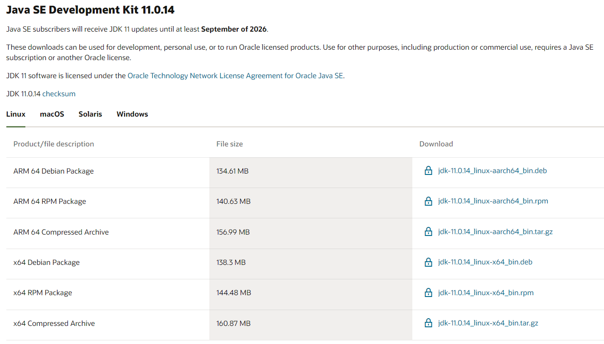

# Developer Guide

- [Acknowledgements](#acknowledgements)
- [Design](#design)
  - [Architecture](#architecture)
- [Implementation](#implementation)
  - [`add` feature](#add-feature)
  - [`delete` feature](#delete-feature)
  - [`set` spending limit feature](#set-spending-limit-feature)
  - [`list` feature](#list-feature)
  - [`help` feature](#help-feature)
  - [`find` feature](#find-feature)
- [Product scope](#product-scope)
  - [Target user profile](#target-user-profile)
  - [Value proposition](#value-proposition)
- [User stories](#user-stories)
- [Non-functional requirements](#non-functional-requirements)
- [Glossary](#glossary)

## Acknowledgements

Initial version of this codebase was created as a stripped-down version of PersonBook by Akshay Narayan and Damith C. Rajapakse.

## Design
### Architecture

Fig 1 - Architecture Diagram

The Architecture Diagram given above explains the high-level design of the App.

**Main components of the architecture:**

- `Main Spendvelope`: Initializes and makes use of the services in each component.
- `TextUi`: Interacts with the user.
- `Parser`: Makes sense of user commands.
- `Commands`: The collection of executable commands on the App.
- `Storage`: Reads data from, and writes data to the hard disk.
- `LimitManager`: Allows the user to set an expenditure limit. Holds this limit in memory.
- `RecordManager`: Allows user to add, delete, view records. Holds this list in memory.
- `ExpenseManager`: Tracks the total expenditure from all records.

## Implementation
### `add` feature

When command `add` is called, a `Record` object is created and added to the record list in `RecordManager`. Depending 
on the input, either a `Product` or a `Subscription` object will be created. They extend `Record` with their own 
properties. `ExpenseManager` will add the price of the new record to total expense using `addToExpense(price)`.

### `delete` feature

When command `delete` is called, the corresponding record will be deleted by `RecordManager` from the record list. 
`ExpenseManager` subtracts the price from total expense using `subtractFromExpense(price)`.

### `set` spending limit feature

When command `set` is called, the `LimitManager` object will be called to set the limit for the user. A warning is 
triggered if the user exceeds this limit when they next `add` a record.

### `list` feature

When command `list` is called, `listCommand` calls `getAllRecords()` from `RecordManager`. The method returns 
the `ArrayList` of records that have been inputted by the user before.

### `help` feature
When command `help` is called, `helpCommand` prints all the instruction explanations and examples in order for the user 
to know what they can input to the program.

### `find` feature

The `find` mechanism is facilitated by `FindCommand`. `FindCommand`, extending `Command`, calls
`getFilteredRecords(String query)` in `RecordManager`. The method returns the `ArrayList` of all records that have been 
filtered by the query inputted by the user.

>**Note:** all the IncorrectCommand reference above is referred to below diagram
> .

## Product scope
### Target user profile

Online shoppers who tend to splurge on virtual platforms

### Value proposition

As online shopping becomes more convenient and transactions become easier, people tend to overshoot 
their budget because they are not aware of their accumulated expenditure. It is designed to 
regularly remind the buyer of their preset spending limit for each month.

## User Stories

|Version| As a ... | I want to ... | So that I can ...|
|---|----------|------------------|------------------|
|v1.0|user|see usage instructions|refer to them when I forget how to use the application|
| |online shopper|add and delete my spending record|note down what I have bought|
| |“spendthrift” user|set spending warning and limits|be reminded if I exceed the spending limit I set|
|v2.0|user|search record by name|locate a record without having to go through the entire list|
| |user|get the summary of records classified by types|keep track of my spending for different types|

## Non-Functional Requirements

1. The system must not crash when users open the application.
2. The system must provide 5 seconds or less feedback time.
3. The system must have at least 75 percent maintainability for 24 hours.
4. The system must have at least 85 percent reliability for a month.
5. Error message must be displayed if the system encounters any error.
6. The system must strive for consistency.
7. The system must offer informative feedback when invalid inputs are detected or a certain process fails.

## Glossary

* *user* - A user is a person who uses the application to keep track of his expenses.
* *system* - A system refers to Spendvelope.
* *feedback* - Feedback refers to the response from the application to the user.