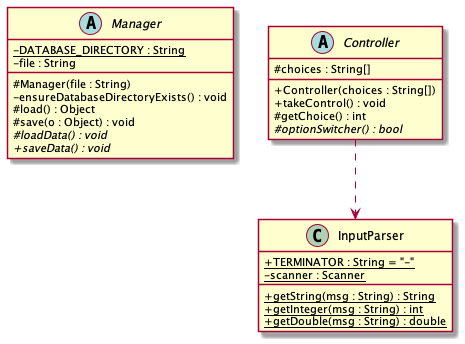
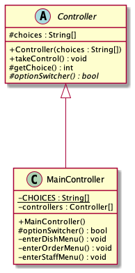
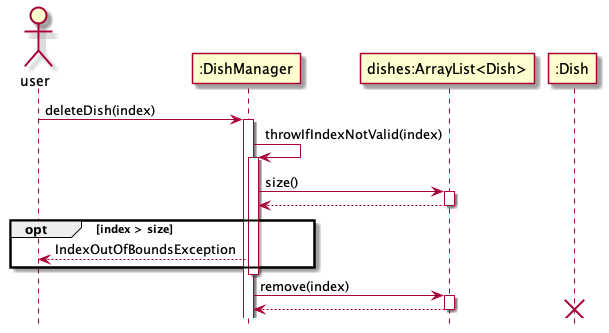
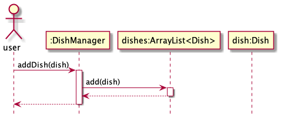
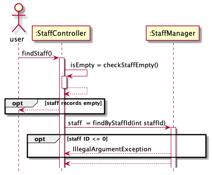
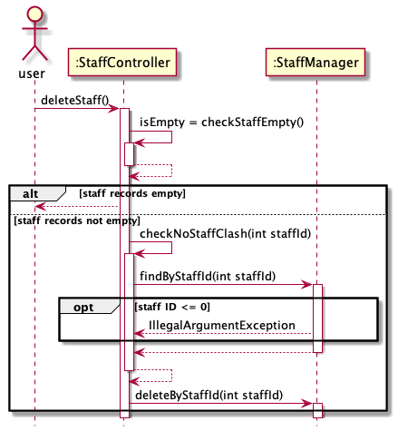
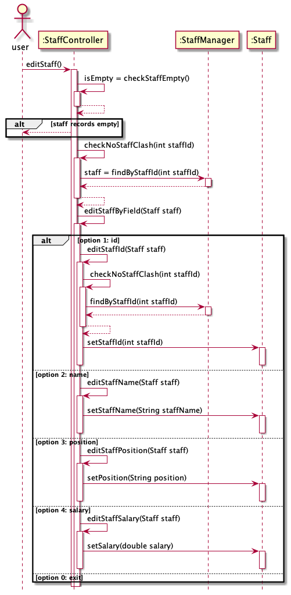

# Developer Guide
- [Acknowledgements](#acknowledgements)
- [Design & implementation](#design--implementation)
  - [Controllers](#controllers)
  - [Managers](#managers)
  - [InputParser](#inputparser)
- [Menu Management](#menu-dishes-management)
- [Order Management](#order-management)
- [Staff Management](#staff-management)
- [Product Scope](#product-scope)
- [User Stories](#user-stories)
- [Class Diagram](#class-diagram)
- [Non-functional Requirements](#non-functional-requirements)

## Acknowledgements

Huge thanks to all members of the team for chipping in for this project! As always, teamwork is what makes the magic happen :)

Thank you to all professors and student teachers who have helped us along the way!

## Design & implementation

Here is a quick overview of the design of the application:



Note that the diagram does not include all entities, controllers, and managers
present in the programme. It is only meant to give a quick overview of the project structure.

The later parts of this guide looks into detail each specific part of the programme.

### Controllers
A `Controller` is defined as the user-facing part of the programme. It is in charge of getting
input from the user, as well as managing the user experience and interface, such as printing to the console.

All controllers are derived from the base abstract class `Controller`. This base class acts as a mini-framework, and
includes the base implementation for the input-loop. In this way, there is no need to rewrite input handling for all 
extended controllers. 

To create a new `Controller`, the new class simply extends from the `Controller` class. The `Controller` class is then provided
a list of strings indicating the choices available to the user. **Note that the first choice is always to exit the current controller.** 
The user will then select these choices using integers (the implementation is handled by the base class, including
input loops). The new class then implements this abstract method at the least:
- `optionSwitcher(int choice)`
  - This method is responsible for selecting the corresponding action to the user's selected choice.
  For more information and examples, refer to the `Controller` class' documentation, and `MainController` class for an
  example implementation.

Here is the typical design for the Controller:




By itself, `Controllers` are not useful. They should usually have an underlying `Manager` class for data storage and
manipulation.

### Managers
A `Manager` is defined as the data management part of the programme. It is in charge of manipulating underlying data and
takes care of data integrity.

All managers are derived from the base abstract class `Manager`. This base class provides simple methods for reading and
saving data from the filesystem. A derived `Manager` must pass the name of the file where its underlying data is stored
to the `Manager` superclass.

The base class provides two methods for simple read/write operations:
- `load()`
  - This method returns a simple `Object` read from the specified file. The class makes no assumption as to the
  type of object being read. As such, further processing must be done, which will be touched on below.
- `save(Object o)`
  - This method saves the provided object into the specified file. It is capable of saving **any** type of Java object,
  on the condition that it **must be serializable**. For saving complex data structures such as `ArrayLists`, it is generally
  a good idea to also make sure that any contained objects are also serializable.

Because the `load()` and `save(Object o)` methods are simple, they are generally not useful without further processing.
As such, the `Manager` class has two other abstract methods, which extended managers must implement:
- `loadData()`
  - Extended managers must override this method to deserialize any read objects properly. This is to ensure that
  corrupted data is found at this phase of the programme to prevent any future errors. A good example is listed below.
  Note that it makes use of the provided `load()` function to first read the simple `Object`, then does further
  processing on it:
  ```java
    @Override
    protected void loadData() throws Exception {
        this.dishes = new ArrayList<>();
        ArrayList<?> list = (ArrayList<?>) this.load();
        for (Object object : list) {
            this.addDish((Dish) object);
        }
    }
  ```
- `saveData()`
  - This is a convenience method for doing any pre- / post-processing on any data you may want to save. Of course, you should
  also call the `save(Object o)` method finally.

Note that loading and saving is only done once. Loading is done once upon programme start-up, and saving is done
when the user exits the menu gracefully.

Here is the typical design of a manager:


### InputParser

All input from the user is done through the `InputParser` class. This limits the scope of which the developers will need
to perform error checking and sanitation of user input, which greatly reduces the need for boilerplate plate throughout
the rest of the programme.

Due to customer requirements, the team has decided that the constraint of making this application command-based is not applicable,
and in fact could inhibit usage and uptake of this programme. As such, the developers of this programme have decided to modify
this requirement in order to better suit the needs of the users and also fulfill certain non-functional requirements (which are
listed at the bottom of the guide).

Consequently, most inputs are index-based (usually, users will only need to input numbers). This greatly reduces the 
possibility of human-error in inputs, and more importantly, they are simple to use and remember. Familiar users will
find it easy to remember the inputs, and will be able to do fast operations in time, which would also fulfill the original
constraint in the first place.

The class itself is simple, and simply provides a few helper methods to get certain input. They are listed here:
- `getString(String msg)`
- `getInteger(String msg)`
- `getDouble(String msg)`

The implementation of the last 2 methods depend on the implementation of the first method. This reduces code complexity
and further isolates the area of concern for which errors are most prone. In addition, it enables easy addition of more
methods if required. If possible, additional methods should continue to depend on the first `getString` method.

## Menu (dishes) Management
### Overview


### Dish

`Dish` consists of `name` and `price` and corresponding modification methods.
It is used as a structure to store dish information.

### DishManager
The management of menu is handled by `DishManager`, which implements following methods:

- `printDishes()` -- print all dishes and their menu index in current menu.
- `addDish(Dish dish)` -- add a new dish.
- `deleteDish(int menuIndex)` -- delete a dish using its menu index.
- `setPrice(int menuIndex, double newPrice)` -- change the price of a dish using its menu index.
- `setName(int menuIndex, String newName)` -- change the name of a dish using its menu index.

These functions are "delegated" to `ArrayList<Dish>`, which is associated with `DishManager`.

For example, `printDishes()`, iterates through `dishes` and calls `get(int)` method (`setPrice(int, double)`, `setName(int, String)` also call `get(int)`):


`deleteDish(int)` calls `remove(int)`:



`addDish(Dish)` calls `add(Dish)`:



`void setPrice(int, double)`:


`void setName(int, String)` is similar:


### DishController
`DishController` is the user-facing part of `DishManagement`
It offers the functions of `DishManager` to user and get input from user.

The index and corresponding function can be found at `DishController.CHOICES`:

- `void listDishes()` -- print all dishes and their menu index in current menu.
- `void changeName()` -- get dish index and change the name of corresponding dish.
- `void changePrice()` -- get dish index and change the price of corresponding dish.
- `void deleteDish()` -- get dish index and delete corresponding dish.
- `void addDish()` -- get new dish name and price then create a dish.
- `getDishManager()` -- get the list in `dishManager`, this is for `OrderManager` since it might need menu information.

## Order Management

The management of menu is functioned by `OrderManager`, which implements following methods:
- `addDishToOrder(Dish dish, int orderIdx)` -- add dishes in to an order.
- `deleteOrder(int orderIndex)` -- delete an order using its order index.
- `getOrder(int orderIndex)` -- get an order using its order index.
- `getOrderPrice(int orderIndex)` -- get the total price of an order using its order index.
- `getAllOrderValue()` -- get the total price of all orders.

These functions are "delegated" to `ArrayList<Order>`, which is associated with `OrderManager`. 

Methods call `get(int)` to get the element.

For example, `addDishToOrder(Dish dish, int orderIdx)`, iterates through `orders` and calls `addDish(Dish dish)` method:


`deleteOrder(int)` calls `getOrderCount()`:


Both methods `getOrderPrice(int)` and `getAllOrderValue()` call `getTotalPrice()`:


## Staff Management

I/O for staff is being handled by `StaffController`, and handles the following method:

- `editStaff()` -- change attribute of a staff using staff id, with the aid of setter methods in `Staff`.

The management of staff is handled by `StaffManager`, which implements following methods:

- `printStaff()` -- print all staffs.
- `addStaff(int staffId, String staffName, String position, double salary)` -- add a new staff with the arguments as its attributes.
- `findByStaffId(int staffId, boolean printMsg)` -- find a staff using staff id, and print message if boolean variable printMsg is true.
- `deleteByStaffId(int staffId)` -- delete a staff using staff id.

`StaffManager` manages `ArrayList<Staff>` and the above functions help to update the collection of `Staff`.
The sequence diagrams for each feature of staff handling is attached below.

Sequence diagram for `printStaff()`:


Sequence diagram for `findStaff()`:



Sequence diagram for `addStaff()`:


Sequence diagram for `deleteStaff()`:



Sequence diagram for `editStaff()`:




## Product scope
### Target user profile

The application is meant for the usage of all employees of a restaurant.


### Value proposition

Often, restaurants need a centralised system for stock keeping and administrative information.

While this can still be done using normal pen-and-paper, or Excel, using such methods are often slow and may be
prone to error.

As such, this application provides many functionalities to do so. The possibility of human-errors is greatly reduced!

## User Stories

| Version | As a ... | I want to ...                  | So that I can ...               |
|---------|----------|--------------------------------|---------------------------------|
| v1.0    | staff    | add orders                     | keep the order up to date       |
| v1.0    | staff    | delete orders                  | keep the order up to date       |
| v1.0    | staff    | check orders                   | keep the order up to date       |
| v1.0    | staff    | add menu items                 | keep the menu up to date        |
| v1.0    | staff    | delete menu items              | keep the menu up to date        |
| v1.0    | staff    | modify menu items              | keep the menu up to date        |
 | v1.0    | staff    | add staff info                 | keep the roster up to date      | 
| v1.0    | staff    | delete staff info              | keep the roster up to date      | 
| v1.0    | staff    | modify staff info              | keep the roster up to date      | 
| v2.0    | staff    | print out the order receipt    | refer to the order anytime      |
| v2.0    | staff    | store the application data     | save data across different uses |
| v2.0    | staff    | mark the deleted dish in order | keep the order up to date       |

## Class diagram


## Non-Functional Requirements

The application fulfills many non-functional requirements that make it easy to use:
- Simple commands for easy uptake. Great for restaurants where most staff members work on part-time basis.
- High performance. Operations take on average less than a second to complete!
- Easy portability. A simple copy-paste allows data and application to be transferred to a new workstation easily.

## Glossary

NA.

## Instructions for manual testing

NA.
