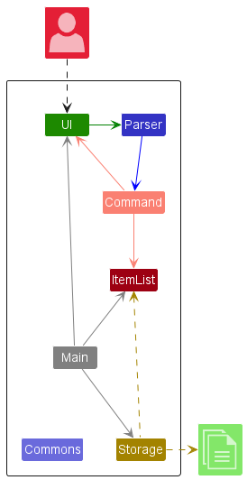
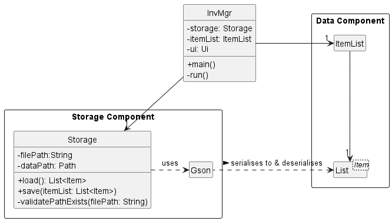
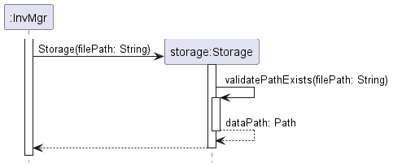

# Developer Guide

## Table of contents
(tbd at the end)

## Acknowledgements

The following third party libraries and applications were utilised and referenced in the making of InvMgr.

1. GSON 
   1. [Library Link](https://github.com/google/gson) & [License](https://github.com/google/gson/blob/master/LICENSE)
   2. JSON serialisation and deserialisation
2. SE-EDU Address Book Level 3 
   1. [App link](https://github.com/se-edu/addressbook-level3) & [License](https://github.com/se-edu/addressbook-level3/blob/master/LICENSE)
   2. Parser Code
   3. Developer Guide

## Setting up and getting started

### Prerequisites

Before setting up the project locally, ensure you have installed the following:

1. Java 11
2. Intellij IDEA (Community/Pro) 

Follow the steps in the following guide precisely. Things will not work out if you deviate in some steps.

First, **fork** this repo, and **clone** the fork into your computer.

If you plan to use Intellij IDEA (highly recommended):
1. **Configure the JDK**: Follow the guide [_[se-edu/guides] IDEA: Configuring the JDK_](https://se-education.org/guides/tutorials/intellijJdk.html) to to ensure Intellij is configured to use **JDK 11**.
2. **Import the project as a Gradle project**: Follow the guide [_[se-edu/guides] IDEA: Importing a Gradle project_](https://se-education.org/guides/tutorials/intellijImportGradleProject.html) to import the project into IDEA.  
   Note: Importing a Gradle project is slightly different from importing a normal Java project.
3. **Verify the setup**:
   1. Run `seedu.duke.InvMgr` and try a few commands.
   2. Run the tests to ensure they all pass.
   
## Design

### Architecture

The Architecture Diagram given above explains the high-level design of the application

Given below is a quick overview of main components and how they interact with each other.

**Main components of the architecture**

`InvMgr` is the main class and entry point for the application. It does the following:

1. **At app launch**: Initializes the components in the correct sequence, and connects them up with each other.
2. **When process is running**: Keeps the program running by continuously invoking the correct components in order
3. **At shut down**: Shuts down the components and invokes cleanup methods where necessary.

`Commons` represents a collection of classes used by multiple other components. 

The rest of the App consists of five other components.

1. `UI`: The UI of the App. 
2. `Data`: Holds the data of the application (`Item`) in memory.
3. `Parser`: Creates the appropriate `Command` object.
4. `Command`: Executes user instructions.
5. `Storage`: Reads data from, and writes data to, the storage medium.
 
#### Application Startup

The above diagram shows a sequence diagram of the program when it first starts up

On startup, `InvMgr` does a setup by creating the required `Ui`, `Storage`, and `ItemList` objects.

1. The `Ui` object is initialised.
2. `load()` from `Storage` is called. This returns an `ArrayList<Item>` containing the application data.
3. The `ArrayList<Item>` from before is used to create the `ItemList` object. `ItemList` is a wrapper around a `List<Item>`, and acts as the `Data` component of the application.

#### Application runtime and exit

The above diagram shows a sequence diagram of the program when it is running.

`InvMgr` will continuously loop, doing the following:

1. `InvMgr` will call upon `Ui` to get input from the user.
2. `InvMgr` passes the user input to `Parser.parse(command)`.
3. `Parser.parse(command)` returns a `Command` object.
4. `InvMgr` calls upon the `execute()` method of the returned `Command` object .
5. The loop stops when the user types `exit`.

### Commons Component

The above diagram todo...

### UI Component

The above diagram shows the class diagram for the `Ui` component.

The `UI` component
- Displays salutations, prompts for user input, error messages and results of queries.
- Reads in user inputs
- Depends on the `Messages` and `InvMgrException` classes in the `Common` component. It displays messages stored in the `Messages` class and displays an error message whenever `InvMgrException` is invoked.

### Data Component

The above diagram todo...

### Parser Components

The above diagram shows the class diagram for the `Parser` component.

How the parsing works:
- When called upon to parse a user command, the `InputParser` class creates an `XYZCommandParser` (`XYZ` is a placeholder for the specific command name e.g., `AddCommandParser`) which uses the other classes shown above to parse the user command and create a `XYZCommand` object (e.g., `AddCommand`) which the `InputParser` returns back as a `Command` object.
- All `XYZCommandParser` classes (e.g., `AddCommandParser`, `DeleteCommandParser`, ...) inherit from the `Parser` interface so that they can be treated similarly where possible e.g, during testing.

### Command Component

The above diagram shows the class diagram for the `Command` component.

`Command` is an abstract class that sets certain commonalities that is implemented across all types of commands - `AddCommand`, `DescCommand`, `ListCommand`, `DeleteCommand`, `HelpCommand`, `ExitCommand`. Each of these classes have to override the `Command`'s `execute()` method as each command has a different execution. For example, `AddCommand` will be focused on adding an item to an inventory list whereas `DescCommand` will be about retrieving information from the inventory list.

### Storage Component

The above diagram shows the class diagram for the `Storage` component.

1. `Storage` has `save()` and `load()` methods. These are called by `InvMgr` when needed.
2. `Storage` uses the 3rd party library GSON through the `Gson` object to convert the `Data` component into JSON and vice-versa.
3. `save(itemList)` which writes the contents of the `List` within the Data Component to the file at `dataPath`.
4. `load(itemList)` loads a JSON file into the `Data` component.

## Implementation

### Add Command

The above diagram shows the sequence diagram of the addition of an item.

The user starts by typing an add command. The example used in the diagram above is the addition of an item with the name `Paper Cup`, quantity of `25` and description of `100ml paper cups`. The full command is `add n/Paper Cup q/25 d/100ml paper cups`.

1. The `run()` method within `InvMgr` calls the static method `parse()` in the `Parser` class, providing the entire string of input entered by the user.
2. Within `parse()`, the string is identified to start with the word `add`, and executes the code within the case. The case attempts to create an item using the string by self-invoking `createItem()`.
3. `createItem()` extracts the relevant arguments from the input string and generates a new `Item` which is returned to the `parse()` case block.
4. `parse()` uses the `Item` to generate a new `AddCommand` which is returned to the `run()` method.
5. The `run()` method calls on the `execute()` function in the `AddCommand` which will add the generated item to the `ItemList` using its `addItem()` method.
6. `AddCommand` will converse with `Ui` to show a message that the item has been added. In this case, the item to add will be printed as the name of the item, followed by " has been added!".

### Description Command

The above diagram shows the sequence diagram for retrieving the description of an item.

For a user who is unaware of what an item is about, he/she can enter the command eg. `desc 2` command to extract the description for the second item in the inventory list. This command is interpreted by the `Parser` and a `DescCommand` is returned to `InvMgr`. `InvMgr` calls the execute command of `DescCommand` which retrieves the item's information from the `ItemList` and then outputs them into the `Ui` for the user to see.

### Delete Command

The above diagram shows the sequence diagram of the addition of an item.

The user starts by typing an add command. The example used in the diagram above is the addition of an item with the index `1`, based on the list when the user types the `list` command.

1. The `run()` method within `InvMgr` calls the static method `parse()` in the `Parser` class, providing the entire string of input entered by the user.
2. Within `parse()`, the string is identified to start with the word `delete`, and executes the code within the case. The case finds the index of the item by splitting the string and indexing it.
3. `parse()` generates a new `AddCommand` using the index which is returned to the `run()` method.
4. The `run()` method calls on the `execute()` function in the `DeleteCommand` which will delete the item with that index from the `ItemList` using its `removeItem()` method.
5. `DeleteCommand` will converse with `Ui` to show a message that the item has been removed. In this case, the item to add will be printed as the name of the item, followed by " has been deleted.".

### List Command

The above diagram shows the sequence diagram of the listing of items in `itemList`.

The user starts by typing a list command.

1. `InvMgr` calls `parse("list")` method in `Parser` class, which returns a ListCommand object.
2. `InvMgr` calls `execute(itemList, ui)` method in `ListCommand` object.
3. `ListCommand` loops through every `Item` in `itemList` and prints them line by line
   and numbers them.

### Edit Command

**Normal function**

The above diagrams show the sequence diagram when editing an item.

The user starts by typing an `edit` command.

1. `InvMgr` calls `parse(command)`. `command` is the user input, i.e. `edit 1 n/Marker q/5 d/To draw on whiteboard r/+`.
2. `InvMgr` creates the appropriate `Command` object based on the user input. The arguments are also parsed and the needed values are stored within `EditCommand`.
3. `InvMgr` calls `execute(itemList, ui)` of the `EditCommand` object.
4. Within the `execute()` method of `EditCommand`, `EditCommand` will try to extract the `Item` at the specified index of `ItemList` (`1` in this case).
5. Next, `EditCommand` duplicates the `Item`. It will be named as placeholderItem.
6. `placeholderItem` will have its attributes set accordingly based on the presence of various arguments.
   1. Since `name` is present (`n/Marker`), `EditCommand` will change the name of `placeholderItem` to `Marker`.
   2. Since `quantity` is present (`q/5`), `EditCommand` will change the quantity of `placeholderItem`. An intermediary calculation is needed due to the presence of the relative modifier `r/+`. Ultimately, the quantity of `placeholderItem` will be increased by 5. 
   3. Since `description` is present (`q/To draw on whiteboard`), `EditCommand` will change the description of `placeholderItem` to `To draw on whiteboard`.
7. The `Item` at index 1 of `ItemList` will be replaced by the `placeholderItem`.
8. `EditCommand` will print out the changes in `Item`.

**Error handling**

Exceptions are thrown for the following:

1. When the user enters a command without any name, description or quantity (missing all of `n/ q/ d/`). This is done in `EditCommandParser`.
2. When the user sets the relative flag (`r/`) without any associated quantity. This is done in `EditCommandParser`.
3. When the user enters an index for an item that is not in the list (e.g. `100000` when item 100000 does not exist). This is done in `EditCommand`.

### Search Command

**Normal function**

The above diagrams show the sequence diagram when searching for items.

The user starts by typing a `search` command.

1. `InvMgr` calls `parse(command)`. `command` is the user input, i.e. `search n/Marker d/draw`.
2. `InvMgr` creates the appropriate `Command` object based on the user input. The arguments are also parsed and the needed values are stored within `SearchCommand`.
3. `InvMgr` calls `execute(itemList, ui)` of the `SearchCommand` object.
4. For each `Item` in `ItemList`, `SearchCommand` will try to:
   1. Match, if given, the `name` to search in the name of `Item`.
   2. Match, if given, the `description` to search in the name of `Item`.
   3. If the `Item` matches the given arguments, the `Item` is prepared for printing through `String.format`, not shown for brevity.
   4. The `Item` is then printed.

**Error handling**

Exceptions are thrown for the following:

1. When the user enters a command without any name or description (missing all of `n/ d/`). This is done in `SearchCommandParser`.

### Storage

#### Initialisation

The following diagram shows the sequence diagram illustrating how `Storage` is initialised when the program first launches.

1. `InvMgr` calls the `Storage(filePath)` constructor to create a `Storage` object. `filePath` is a `String` indicating where the data file to be loaded is found.
2. `Storage(filePath)` will check if the file at `filePath` exists. If it does, it returns a `Path` object pointing to the data file.
3. If not, the relevant files and subdirectories are created before returning the corresponding `Path` object.
4. The new `Storage` object will have its `dataPath` attribute set to the `Path` object earlier, and its `filePath` attribute set to the `filePath` passed into the constructor.

#### Loading data

The following diagram shows the sequence diagram illustrating how the data file is loaded. Typically, this is only run once when the program first launches.

1. `InvMgr` calls the `load()` method of `storage`.
2. `storage` initialises `Gson()` as `gson`, a library used to serialize and deserialize JSON objects into their relevant Java objects.
3. `storage` will then load the contents of the file at `dataPath` into the `wholeJsonData` `String`. The exact details are not shown in the diagram.
4. `storage` then calls the `fromJson(wholeJsonData)` method of `gson`.
5. An `ArrayList<Item>` may be returned by `fromJson()` method. If it is not, a new empty list is created.
6. `storage` returns `ArrayList<Item>` to `InvMgr`. This will be used to create the `ItemList`, but will not be shown here.

#### Saving data

The following diagram shows the sequence diagram illustrating how the data file is saved. Typically, this is done after each `Command` is run.

1. `InvMgr` calls the `save(itemList)` method of `storage`.
2. `storage` initialises `Gson()` as `gson`, a library used to serialize and deserialize JSON objects into their relevant Java objects.
3. `storage` calls the `toJson(itemList)` method of `gson`. This returns a `String` named `serializedItems` which contains the JSON String representing `itemList`.
4. `storage` then writes `serializedItems` to the file at `dataFile`.

#### Extra diagrams regarding file read/write

The above diagram todo

## Product scope
### Target user profile

CCA Clubs that require assistance in inventory management, especially for fast typists who prefer CLI over GUI.

### Value proposition

1. Centralised management of resources that ensures accurate and timely allocation of equipment to students
2. Increases the ease and efficiency of resource management
3. More organised

## User Stories

| Version | As a ...                               | I want to ...                                   | So that I can ...                                                   |
|---------|----------------------------------------|-------------------------------------------------|---------------------------------------------------------------------|
| v1.0    | Manager                                | Add a new item to the inventory                 | Update my inventory                                                 |
| v1.0    | Manager                                | Remove an item from the inventory               | Update my inventory                                                 |
| v1.0    | Stocktaker                             | list out all my items                           | View all my items at a glance                                       |
| v1.0    | New user                               | List out all possible commands                  | I can familiarise myself with using the system                      |
| v1.0    | User who has not seen items physically | Get the description of a particular item        | I can visualise the item better to know if it is what i need        |
| v1.0    | As a frequent/first time user          | Write to a file containing the entire inventory | Save my inventory data to a file                                    |
| v1.0    | Stocktaker                             | Read from and load an inventory file data       | To work on and view the data                                        |
| v2.0    | User                                   | Search for an item in the inventory             | To check if the item exists in the inventory                        |
| v2.0    | User                                   | Edit an item in the inventory                   | Update/Make changes to the item attributes                          |
| v2.0    | User                                   | Borrow an item in the inventory                 | Add a borrow record in the inventory                                |
| v2.0    | User                                   | List all current borrowings                     | View which item is currently being borrowed                         |
| v2.0    | User                                   | List all future borrowings                      | View which item will be borrowed in the future and plan accordingly |
| v2.0    | User                                   | List all past borrowings                        | View which item has been borrowed in the past                       |
| v2.0    | User                                   | List all available borrowings                   | View which item is available for borrowing now                      |

## Non-Functional Requirements

1. Should work across Windows, Linux and Mac OS X that has an installation of Java 11.
2. A user with above average typing speed should be able to accomplish tasks faster relative to using a mouse.

## Glossary

* *glossary item* - Definition

## Instructions for manual testing

{Give instructions on how to do a manual product testing e.g., how to load sample data to be used for testing}
