# WerkIt! Developer Guide
## Table of Contents
* [About this Guide](#about-this-guide)
* [Acknowledgements](#acknowledgements)
* [Setting Up your Development Environment](#setting-up-your-development-environment)
* [Design](#design)
* [Implementation](#implementation)
* [Product Scope](#product-scope)
* [User Stories](#user-stories)
* [Non-Functional Requirements](#non-functional-requirements)
* [Glossary](#glossary)
* [Instructions for Manual Testing](#instructions-for-manual-testing)

## About this Guide
This developer guide serves as a documentation of the development of WerkIt!, an application that was created to help
prospective users to plan their exercise routines.

This technical document is meant for current and future developers of WerkIt! as a reference point on the design,
implementation, and other technical and non-technical aspects of the application.

### Notations Used In This Guide
When reading this document, there are several icons that you may encounter. 
Below are the icons and their meanings:


<span class="box warning">:warning: **Warning**: Information that you may want to pay attention to in order to prevent 
possible issues from arising when using the application.</span>

<span class="box info">:memo: **Note**: Additional information that may be useful for you.</span>


## Acknowledgements
The following websites and codebases were referenced and adapted for our project:

* AddressBook-Level2 project ([Website](https://se-education.org/addressbook-level2/) | 
[GitHub](https://github.com/se-edu/addressbook-level2))
* AddressBook-Level3 project ([Website](https://se-education.org/addressbook-level3/DeveloperGuide.html) |
[GitHub](https://github.com/se-edu/addressbook-level3))
* Team Member Alan Low's individual project (iP) codebase ([GitHub](https://github.com/alanlowzies/ip))

## Setting Up your Development Environment
### Requirements
- [X] Java JDK version 11.
- [X] An IDE of your choice, though IntelliJ IDEA is recommended as this project is developed
with this IDE.

<span class="box info">:memo: IDE-related references in this developer guide IDE will be tailored for IntelliJ IDEA.</span>

### Setting Up
1. Fork the [WerkIt! GitHub repository](https://github.com/AY2122S2-CS2113T-T09-2/tp).
2. Clone your fork to your machine.
3. Set up your local repo in your IDE.
    - Ensure that the project in your IDE is configured to run on Java JDK version 11. 
    - A guide on setting your project to use JDK 11 in your IntelliJ IDEA IDE can be found 
[here](https://www.jetbrains.com/help/idea/sdk.html#set-up-jdk).
4. Run `Main.java`. If you have set up your environment correctly, you should see the following
output in your terminal: 

    ```
    ======================================================================
     __        __        _    ___ _   _ 
     \ \      / /__ _ __| | _|_ _| |_| |
      \ \ /\ / / _ \ '__| |/ /| || __| |
       \ V  V /  __/ |  |   < | || |_|_|
        \_/\_/ \___|_|  |_|\_\___|\__(_)

    Welcome to WerkIt!, your personal exercise planner.
    ----------------------------------------------------------------------
    Checking for required directory and files...
    - The required data directory was not found. It will be created.
    - The WerkIt! resource directory has been created in
      your terminal's current working directory.

    - The exercise file was not found. It will be created.
    - The exercise file 'exercises.txt' has been created in
      the WerkIt! resource directory.

    - The workout file was not found. It will be created.
    - The workout file 'workouts.txt' has been created in
      the WerkIt! resource directory.

    - The plan file was not found. It will be created.
    - The plan file 'plans.txt' has been created in
      the WerkIt! resource directory.

    - The schedule file was not found. It will be created.
    - The schedule file 'schedule.txt' has been
      created in the WerkIt! resource directory.

    Loading saved file data...
    - Exercises file	OK!
    ----------------------------------------------------------------------
    Now then, what can I do for you today?
    (Need help? Type 'help' for a guide!)
    ----------------------------------------------------------------------
    >
    ```
5. Type `exit` to exit the program.

You are now ready to begin developing!

<div class="button-container"><a class="button" href="#werkit-developer-guide">Back to Top</a></div>

## Design 

### Table of Contents
- [Architecture Overview](#architecture-overview)
  - [Main Components of the Architecture](#main-components-of-the-architecture)
  - [How the Components Interact with Each Other](#how-the-components-interact-with-each-other)
- [Component Overview](#component-overview)
  - [Storage Component](#storage-component)
  - [UI Component](#ui-component)
  - [Parser Component](#parser-component)
  - [Logic Component](#logic-component)
- [Feature Overview](#feature-overview)

### Architecture Overview

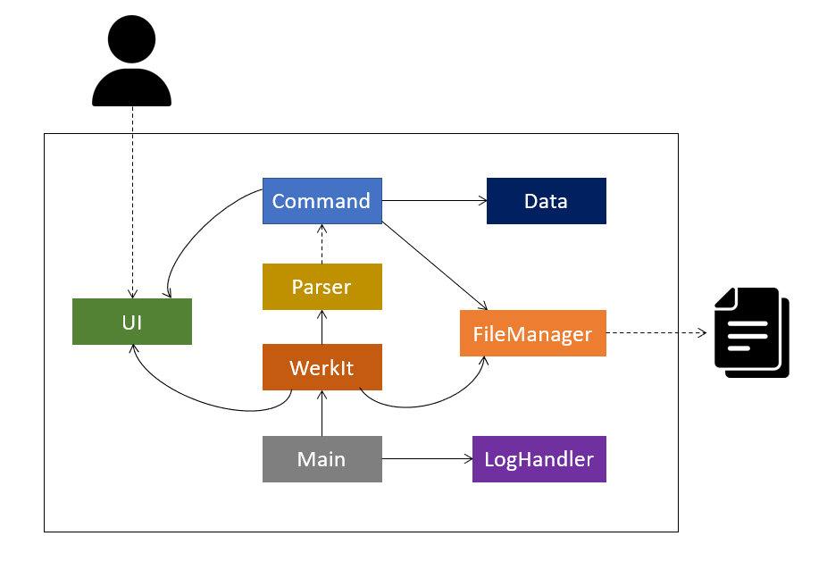

The architecture diagram above shows the high-level design of the application.
Given below is a quick overview of the main components of the application
and their interactions.

#### Main Components of the Architecture
- `Main`: The main component that starts the application upon launch of the applicaiton.
- `WerkIt`: Initializes other components in the correct sequence, and connects them up with each other.
- `Storage`: Reads data from, and writes data to the user's local storage.
- `UI`: The UI of the application that deals with interaction with the user.
- `Parser`: Parses user input to make sense of the command supplied by the user.
- `Logic`: Executes the appropriate command as intended by the user.

#### How the components interact with each other
The *Component Interaction Diagram* shows the inner workings of how each component in WerkIt interacts.

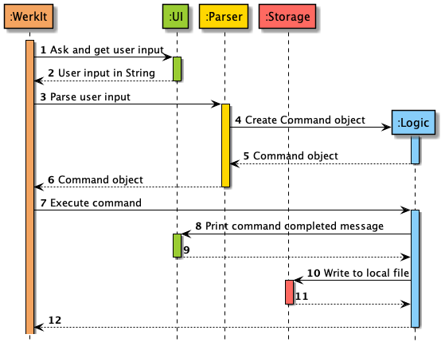

<span class="box info">:memo: To improve the diagram's readability, 
some methods and parameters have been omitted.</span>

1. When `WerkIt` is initialized, `UI` class is called to ask and get the user input.
2. The `Parser` class parses the user input and identifies the command type (e.g. plan/schedule/workout/exercise). Based
   on the command type, the corresponding `Command` object is created, which will then be executed.
3. When the `Command` object is executed, a sequence of actions will be performed. 
   The actions performed are dependent on the type of action specified by the user.
4. After the execution process has finished, an appropriate message may be printed to show the user that the command 
   is executed successfully.
5. Finally, the change may be written to local file.

### Component Overview

#### Storage Component

This component of WerkIt! is mainly responsible for reading and writing application data from and to files
stored on the user's filesystem. This is to allow the user to retain the data he/she has entered into WerkIt! and be
able to continue using the data when he/she starts WerkIt! the next time.

The following class diagram shows how the storage component's classes and how it interacts with some other
components and classes in WerkIt!:

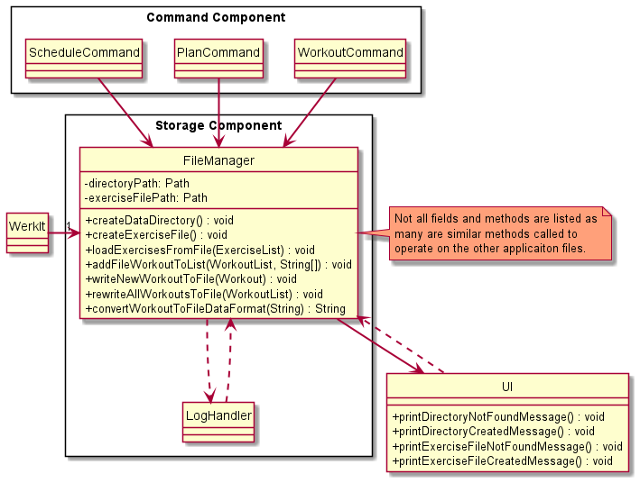

The storage component consists of two classes: `FileManager` and `LogHandler`.

| Class Name | Description |
| --- | --- |
| `FileManager` | - Loads saved data (if any) from the user's local filesystem.<br/>- Writes new/updated data into the user's local filesystem. |
| `LogHandler` | - Utility class to direct log messages to a file that is stored on the user's local filesystem. |

`WerkIt` is responsible for creating an instance of `FileManager` when the application is started. This same instance
will be used by commands in the logic component that requires writing of data to the user's filesystem when the user
executes an action (for example, creating a new workout). Specifically, classes in the logic component that requires 
this are `WorkoutCommand`, `PlanCommand`, and `ScheduleCommand`.

`LogHandler` was deliberately grouped in the storage component as this class merely provides functionality to allow
whichever class in WerkIt! to write the logs to a designated log file.

On the user's local filesystem, the organisation of the application files are as follows:
```
werkItResources/        // Primary resource directory for WerkIt!
    ├── exercises.txt   // Text file containing a list of exercises
    ├── workouts.txt    // Text file containing a list of user-created workouts
    ├── plans.txt       // Text file containing a list of user-created plans
    └── schedule.txt    // Text file containing a 7-day schedule of user-assigned plans for each day
werkItLogs/
    └── logs.log        // Log file containing logs created by the application
```

<div class="button-container"><a class="button" href="#design">Back to Design</a></div>

#### UI Component
UI component consists of a single [UI class](https://github.com/AY2122S2-CS2113T-T09-2/tp/blob/master/src/main/java/werkit/UI.java)
which manages interaction (prompting for user input and displaying results
of commands/methods being called) between the user and the application.

How the UI class works:
* Upon the initialization of `WerkIt`, the `UI` class will call the `printGreetings()` method to display the greeting messages to
  the user.
* Additionally, local files storing the data of previous sessions of `WerkIt` will also be loaded into the program. Thereafter,
  the loading statuses of these files are also displayed by calling the `printFileLoadStatusMessage()` method.
* `UI` class is also responsible for getting the user input by calling the `getUserInput(String filename, boolean isLoadSuccessful)`
  method, which will then parse the input by sending it to the `Parser` class. The `Parser` class will process
  the input and call other relevant methods to execute the command.
* `UI` class also displays messages when a
    * workout has been successfully created, updated or deleted.
    * plan has been successfully created or deleted.
    * schedule has been successfully created/updated or cleared.
* Help messages are also printed in the `UI` class by calling `printHelpMessage()` method.
* Lastly, when the user exits the program, the `printGoodBye()` method will be called to indicate that the 
user has successfully exited the program. 

<div class="button-container"><a class="button" href="#design">Back to Design</a></div>

#### Parser Component

The [Parser class](https://github.com/AY2122S2-CS2113T-T09-2/tp/blob/master/src/main/java/werkit/Parser.java) 
of WerkIt! is mainly responsible for making sense of the user commands.
This is to allow WerkIt! to breakdown user's command into components of different types, and proceed to create the
appropriate `Command` object to be executed in `WerkIt`.

How the `Parser` class works:
<br>
1. After the user has entered a string containing the user's command to `WerkIt`, `WerkIt` will call
`Parser#parseUserInput()` to parse the string.
2. Upon calling `parseUserInput()`, this method will first check the first non-null component of user input, and based on
this component, `parseUserInput()` will call one of `createWorkoutCommand()`, `createExitCommand()`,
`createHelpCommand()`, `createExerciseCommand()`, `createSearchCommand()`, `createPlanCommand()`,
`createScheduleCommand()` or throw an `InvalidCommandException`.
3. If the `InvalidCommandException` is thrown, `parseUserInput()` will be terminated and `WerkIt` will continue on
`startContinuousUserPrompt()` and repeat from step 1 again once a new user input is received.
4. If one of the `createExitCommand()`, `createHelpCommand()` is called. In the case that the user input contains any 
non-spacing characters other than the first non-null component mentioned in step 2, an `InvalidCommandException` will be
thrown. Otherwise, the constructor of `HelpCommand` or `ExitCommand` will be called to create the `Command` object and 
return to `WerkIt` for execution.
5. If one of the `createExerciseCommand()`, `createWorkoutCommand()`, `createPlanCommand()`, `createScheduleCommand()`,
`createSearchCommand()` is called. The method will check the validity of the remaining components of user input, 
if any component of the user input is invalid, an `InvalidCommandException` will be thrown. 
Otherwise, the constructor of the appropriate
type of `Command` will be called to create the appropriate `Command` object and return to `WerkIt` for execution.

<div class="button-container"><a class="button" href="#design">Back to Design</a></div>

#### Logic component
The logic component is mainly responsible for executing the command.
In addition, the respective commands will operate on the appropriate data
structure objects to create, manipulate and delete data based on the user's requests.

Below is a class diagram of the `Logic` component:<br/><br/>
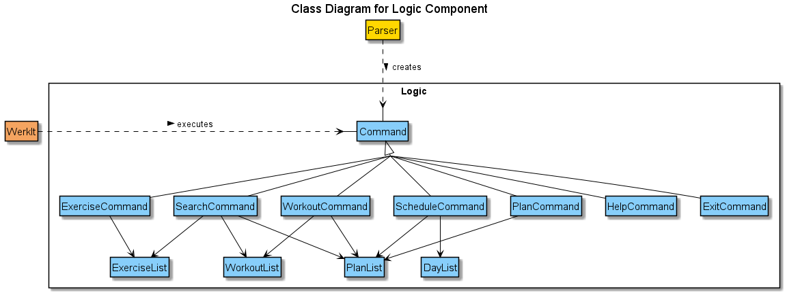
<span class="box info">:memo: This is a high-level overview of the `Logic` component, thus,
other components have been omitted from the diagram above.</span>

The `Logic` component consists of:
- **`Command` abstract class**. The `ExerciseCommand`, `SearchCommand`, `WorkoutCommand`, `ScheduleCommand`,
`PlanCommand`, `HelpCommand` and `ExitCommand` extends the `Command` class. These classes
identify the command action (i.e. create, update, delete and list) supplied by the user and also executes the command.
The source of these classes can be found [here](https://github.com/AY2122S2-CS2113T-T09-2/tp/tree/master/src/main/java/commands).
- **`[command name]List` classes**. It includes `ExerciseList`,
`WorkoutList`,`PlanList` and `DayList`. These classes hold the methods
to perform the command action desired by the user. Examples of command actions
are create, delete, update and listing of the objects. The source of these classes
can be found [here](https://github.com/AY2122S2-CS2113T-T09-2/tp/tree/master/src/main/java/data) 
(each class is grouped in packages according to their command name).

<br><br>
How the `Logic` component works:
<br>
1. The `Parser` class parses the user command and identifies the command type (e.g. plan/schedule/workout/exercise).
2. Depending on the command type, it creates the appropriate `Command` subclass object.
3. This subclass-of-`Command` object is executed by the `WerkIt` class, which calls the `execute()` method of that subclass-of-`Command` object.
4. Depending on the command action (e.g. create/delete/update/list), the `execute()` method will identify and perform the appropriate actions.

<br/>

Illustration of the interactions within the `Logic` component can be found
in the sequence diagram below. 
The example given below is for the listing of workouts in WerkIt! (`workout /list`):
<br><br>

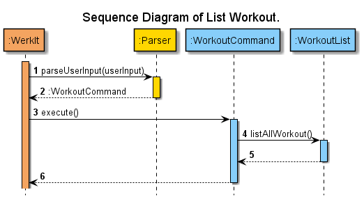
<br><br>
<span class="box info">:memo: This is a high-level overview of how the listing of workouts
is done. To improve readability, some classes and methods have been omitted from the diagram above.</span>

<br>
Each command type is a feature of the WerkIt! application.
The next section will explain the design of each feature in detail.

<div class="button-container"><a class="button" href="#design">Back to Design</a></div>

### Feature Overview

The features of WerkIt! are split and grouped into 5 **main** features:
1. [Exercise-Related Features](#exercise-related-features)
2. [Workout-Related Features](#workout-related-features)
3. [Plan-Related Features](#plan-related-features)
4. [Schedule-Related Features](#schedule-related-features)
5. [Search-Related Features](#search-related-features)

### Exercise-Related Features

Format: `exercise /commandAction <condition>`

Below is a class diagram of the exercise-related features:

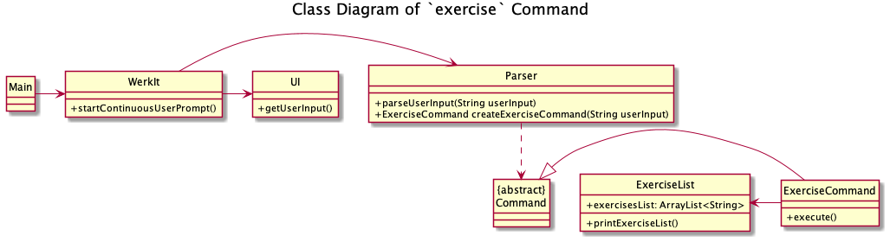
<br>

When WerkIt! is running, the `WerkIt` class will keep prompting the user to enter command through the
`WerkIt#startContinuousUserPrompt()` method. After the user has entered command, The `UI#getUserInput()` method in `UI`
class will catch the user input, and it will be sent to `Parser#parseUserInput(String userInput)` method to analyse the
user's command. If the user's command type is `exercise`, the `Parser#parseUserInput(String userInput)` method will 
parse the 'exercise' base word and proceed to create exercise related command using 
`Parser#createExerciseCommand(String userInput)` method. This method will further evaluate the
`/commandAction` and call the constructor of `ExerciseCommand` class by passing relevant parameters related
to the constructor. If the `/commandAction` is null or incorrect, an `InvalidCommandException` will be thrown.

Currently, the exercise-related feature is limited to `exercise /list` only. Therefore, the `condition` mentioned can
be ignored for now, and the only supported `/commandAction` is `/list`. However, more exciting exercise-related features 
are expected to be delivered in future iterations, and we currently have set the framework to implement these features 
in the future. Thus, we have this standalone section specifically kept for exercise-related features.

<div class="button-container"><a class="button" href="#feature-overview">Back to Feature Overview</a></div>

---

### Workout-Related Features

Format: `workout /commandAction <condition>`

Below is a class diagram of the workout-related features:

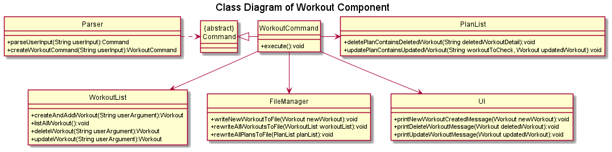
<br>
<span class="box info">:memo: To improve readability, some classes and methods have been omitted from the diagram above.
The diagram shows the main classes and methods the workout-related features uses. </span>

The `Parser` class will call the `Parser#parseUserInput()` method
to analyse the user's command. If the user's command is of type 
`workout`, the `Parser#parseUserInput()` method
will parse the `workout` base word and proceed to create a `WorkoutCommand` object via the
`Parser#createWorkoutCommand()` method. 
<br><br>
Once the `WorkoutCommand` object is created, the `WorkoutCommand#execute()` method
is called. Depending on the type of command action, this method will
call the appropriate operations from the `WorkoutList` class. For instance, if the command action
is `/new`, the `WorkoutCommand#execute()` method will call `WorkoutList#createNewWorkout()`
to create a new workout, followed by `WorkoutList#addNewWorkoutToLists()` to add the new workout to the application. 
To view the details of the `WorkoutCommand#execute()`, click [here](https://github.com/AY2122S2-CS2113T-T09-2/tp/blob/master/src/main/java/commands/WorkoutCommand.java). 
<br><br>
When all methods except the `listAllWorkout()` method are executed, the
`FileManager` and `UI` classes will call its appropriate methods depending on the command action.
From the previous example, the `/new` workout command action will call the 
`FileManager#writeNewWorkoutToFile()` and also the `UI#printNewCreatedMessage()`
methods after the new workout has been created.
<br><br>
Finally, methods in the `PlanList` class is only called when the `/delete` and `/update`
workout command actions are executed. These methods are used to modify the application's plan list
as the `/delete` and `/update` actions are cascading actions 
(i.e. deleting a workout will delete plan(s) containing that deleted workout).

<div class="button-container"><a class="button" href="#feature-overview">Back to Feature Overview</a></div>

---

### Plan-Related Features

Format: `plan /commandAction <condition>`

Below is a class diagram of the plan-related features:

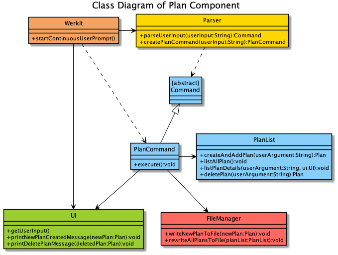
<br>

When WerkIt! is running, the `WerkIt` class will keep prompting the user to enter command through the
`WerkIt#startContinuousUserPrompt()` method. After the user has entered a command,
the `UI#getUserInput()` method will catch the user input,
and it will be sent to `Parser` class. Then, the `Parser#parseUserInput(userInput)`
method will be called to analyse the user's command.

If the user's command is of type `plan`, the `Parser#parseUserInput(userInput)` method
will parse the `plan` base word and proceed to create a `PlanCommand` object through
`Parser#createPlanCommand(userInput)` method.

Once the `PlanCommand` object is created, the `PlanCommand#execute()` method
is called. Depending on the type of command action, this method will
call the appropriate operations from the `PlanList` class. For instance, if the command action
is `/new`, `PlanList#createNewPlan(userArgument)` will be called to create a new plan, followed
by `PlanList#addNewPlanToLists()` to add the newly created plan to the application's plan list.
To view the details of the `PlanCommand#execute()`,
click [here](https://github.com/AY2122S2-CS2113T-T09-2/tp/blob/master/src/main/java/commands/PlanCommand.java).

When `createNewPlan()` and  `deletePlan()` method in `PlanList` class are executed, the
`FileManager` and `UI` classes will call its appropriate methods depending on the command action.
From the previous example, the `/new` workout command action will call
the `UI#printNewPlanCreatedMessage()` and also the `FileManager#writeNewPlanToFile()`
methods after the new plan has been created.

Lastly, `WerkIt#startContinuousUserPrompt()` will check whether the command is of type `delete`.
If so, `reloadScheduleFile()` method in the `WerkIt` class will be executed to modify the
application’s day list.

<div class="button-container"><a class="button" href="#feature-overview">Back to Feature Overview</a></div>

---

### Schedule-Related Features

Format: `schedule /commandAction <condition>`

Below is a class diagram of the schedule-related features:

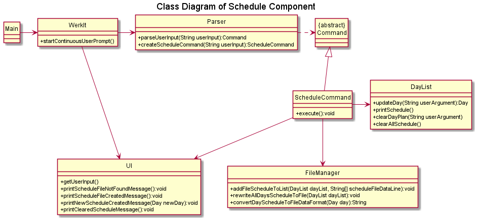

Users are able to create and make changes to a 7-day workout plan schedule using the WerkIt application. For each day, users are only allowed
to schedule 1 workout plan. Click [here](#glossary) to get a better understanding of what `workout`, `plan` and `schedule`
means.

When WerkIt! is running, the `WerkIt` class will continuously prompt the user to enter a command via the
`WerkIt#startContinuousUserPrompt()` method. After the user has entered command, the `UI#getUserInput()` method in `UI`
class will catch the user input, and it will be sent to `Parser#parseUserInput(String userInput)` method to analyse the
user's command.

If the user's command type is `schedule`, the `Parser#parseUserInput(String userInput)` method will parse the `schedule`
base word and proceed to create a schedule-related command using `Parser#createScheduleCommand(String userInput)` method.
The following table shows the schedule commands that WerkIt! is able to process by calling the `ScheduleCommand#execute()`
method.
<br>

| Command                                                             | `/commandAction` | Parameters                                                                                                                                                  | Method Called                               |
|---------------------------------------------------------------------|------------------|-------------------------------------------------------------------------------------------------------------------------------------------------------------|---------------------------------------------|
| [schedule /update `<day number>` `<plan number>`](#update-schedule) | update           | `<day number>`: Number representing the day. <br/><br/>`<plan number>`: Index of the plan stored in planList. This is the plan to be scheduled for the day. | `DayList#updateDay(String userArgument)`    |
| [schedule /list](#view-schedule)                                    | list             |                                                                                                                                                             | `DayList#printSchedule() `                  |
| [schedule /clear `<day number>`](#clear-schedule-for-a-day)         | clear            | `<day number>`: Number representing the day.                                                                                                                | `DayList#clearDayPlan(String userArgument)` |
| [schedule /clearall](#clear-schedule-for-the-week)                  | clearall         |                                                                                                                                                             | `DayList#clearAllSchedule()`                |


To view the details of the `ScheduleCommand#execute()`, click [here](https://github.com/AY2122S2-CS2113T-T09-2/tp/blob/master/src/main/java/commands/ScheduleCommand.java).


The `<day number>` ranges from 1 to 7. The meaning of each day number is explained in the table below.

| Day Number | Meaning   |
|------------|-----------|
| 1          | Monday    |
| 2          | Tuesday   |
| 3          | Wednesday |
| 4          | Thursday  |
| 5          | Friday    |
| 6          | Saturday  |
| 7          | Sunday    |

The `ScheduleCommand#execute()` will further evaluate the `/commandAction` and depending on the type of command action, 
this method will call the appropriate methods from the `DayList` class. If the `/commandAction` is null or incorrect,
an `InvalidCommandException` will be thrown. If the `<parameters>` of certain commands are not specified or met, 
an `InvalidScheduleException` will be thrown.

For `commandAction` such as `/update`, `/clear` and `/clearall`, the method that was called to perform such commands will
modify the application's schedule list. Hence, appropriate methods in the `FileManager` will be called to manage the data 
and save them to the local file, `schedule.txt`. For more information on `FileManager` class, you can refer to this 
[section](#how-data-is-written-or-updated-to-a-resource-file).

Furthermore, when methods such as `DayList#updateDay()` and `DayList#clearAllSchedule` are successfully executed, 
for the former method, `UI#printNewScheduleCreatedMessage(Day newDay)` method will be called to display a message 
to indicate that the plan has been successfully scheduled on a day and for the latter method, 
`UI#printClearedScheduleMessage()` method will be called to display a message to indicate that the 
schedule list has been successfully reset.

<div class="button-container"><a class="button" href="#feature-overview">Back to Feature Overview</a></div>

---


### Search-Related Features

Format: `search /commandAction <keywords>`

Below is a class diagram of the search-related features:


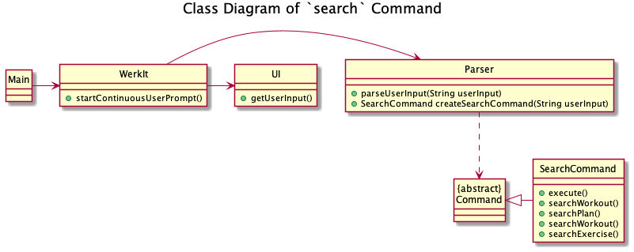


When WerkIt! is running, the `WerkIt` class will keep prompting the user to enter command through the
`WerkIt#startContinuousUserPrompt()` method. After the user has entered a command, The `UI#getUserInput()` method in `UI`
class will catch the user input, and it will be sent to `Parser#parseUserInput(String userInput)` method to analyse the
user's command. 

If the user's command type is search, i.e. `search /commandAction <keywords>`, the
`Parser#parseUserInput(String userInput)` method will parse the 'search' base word and proceed to create search-related
command using `Parser#createSearchCommand(String userInput)` method. This method will further evaluate the
`/commandAction` and call the constructor of `SearchCommand` class by passing relevant parameters related to search to
the constructor. If the `/commandAction` is null or incorrect, an `InvalidCommandException` will be thrown. If
the `<keywords>` is not specified, it will be deemed as searching for whitespaces.

<div class="button-container"><a class="button" href="#feature-overview">Back to Feature Overview</a></div>

---

## Implementation
### Overview
* [Getting User Input Continuously](#getting-user-input-continuously)
* [Parsing User Input and Getting the Right Command](#parsing-user-input-and-getting-the-right-command)
    * [Illegal Characters and Phrases](#illegal-characters-and-phrases)
* [Exercise](#exercise)
  * [List Exercise](#list-exercise)
* [Workout](#workout)
  * [Create New Workout](#create-new-workout)
    * [Design Considerations](#design-considerations-for-creating-a-new-workout)
  * [List All Workouts](#list-workout)
  * [Delete Existing Workout](#delete-existing-workout)
    * [Design Considerations](#design-considerations-for-deleting-existing-workout)
  * [Update Existing Workout](#update-existing-workout)
    * [Design Consideration](#design-considerations-for-updating-existing-workout)
* [Plan](#plan)
  * [Create A New Plan](#create-a-new-plan)
    * [Design Considerations](#design-considerations-for-creating-a-new-plan)
  * [List Plans](#list-plans)
  * [List Workouts In A Plan](#list-workouts-in-a-plan)
  * [Delete Existing Plan](#delete-existing-plan)
    * [Design Consideration](#design-considerations-for-deleting-existing-plan)
* [Schedule](#schedule)
  * [Update Schedule](#update-schedule)
    * [Design Considerations](#design-considerations-for-update-schedule)
  * [View Schedule](#view-schedule)
  * [Clear plan scheduled for a day](#clear-schedule-for-a-day)
  * [Clear all plans in the Schedule](#clear-schedule-for-the-week)
* [Search](#search)
  * [Search for Exercise](#search-for-exercise)
  * [Search for Workout](#search-for-workout)
  * [Search for Plan](#search-for-plan)
  * [Search for All](#search-for-all)
* [File Management](#file-management)
  * [About the Location of Directories and Files Created](#about-the-location-of-directories-and-files-created)
  * [Storage Format for Each Resource File](#storage-format-for-each-resource-file)
  * [Loading Resource File Data Into WerkIt!](#loading-resource-file-data-into-werkit)
  * [Writing a New Line of Data to the Resource File](#writing-a-new-line-of-data-to-the-resource-file)
  * [Rewriting the Resource Entire File With the Most Recent Set of Data](#rewriting-the-entire-resource-file-with-the-most-recent-set-of-data)
  * [About the `LogHandler` Class](#about-the-loghandler-class)
  * [Design Considerations](#design-considerations-for-file-management)

---

### Getting User Input Continuously
Once `WerkIt` has finished loading any saved file data on the user's system, it will call 
`WerkIt#startContinuousUserPrompt()`. This method will call on `UI#printUserInputPrompt()` to print a prompt message
to the terminal and `UI#getUserInput()` to wait and capture the user's input. The input will be captured with the aid 
of Java's built-in `Scanner` class.

Once the user has entered an input, `UI#getUserInput()` trims any preceding and trailing whitespaces before returning 
the user's input as a `String` object to `WerkIt#startContinuousUserPrompt()`. Then, 
`WerkIt#startContinuousUserPrompt()` calls `WerkIt#parseUserInput()`, an intermediary method to call
`Parser#parseUserInput()`, which will parse the user's input and create an 
object that is a subclass of the `Command` class. If there is no issue with the formatting of the user's input,
this subclass-of-`Command` object is returned to `WerkIt#startContinuousUserPrompt()` via `WerkIt#parseUserInput()`.

<span class="box info">:memo: The intermediary `WerkIt#parseUserInput()` method is created to reduce the arrowhead code 
that was grossly present in `WerkIt#startContinuousUserPrompt()`.</span>

<span class="box info">:memo: A detailed implementation of the parsing and creation of subclass-of-`Command` 
object process can be found in 
'[Parsing User Input and Getting the Right Command](#parsing-user-input-and-getting-the-right-command)'.</span>

Next, `WerkIt#startContinuousUserPrompt()` calls on the `execute()` method of the subclass-of-`Command` object to
perform the user's requested action. If the execution goes smoothly, this completes the user's inputted command.
This process is repeated until the user enters `exit`, which will terminate the loop, call `UI#printGoodbye()` to
print a goodbye message to the user, before handing control back to `Main#main()` to end the program.

#### Design Considerations
* `WerkIt#startContinuousUserPompt()` has a boolean flag `isFirstPrompt`. This flag allows WerkIt to
print a different prompt each time the application starts up, before defaulting to a different prompt message
for subsequent prompts.
   * When the user starts the application, `isFirstPrompt` is set to `true` and thus, the prompt will be:
  ```
  ----------------------------------------------------------------------
  Now then, what can I do for you today?
  (Need help? Type 'help' for a guide!)
  ----------------------------------------------------------------------
  >
  ```
  * Subsequent prompts in that app's session will be:
  ```
  ----------------------------------------------------------------------
  What's next?
  ----------------------------------------------------------------------
  >
  ```

<div class="button-container"><a class="button" href="#implementation">Back to Implementation Overview</a></div>

---

### Parsing User Input and Getting the Right Command

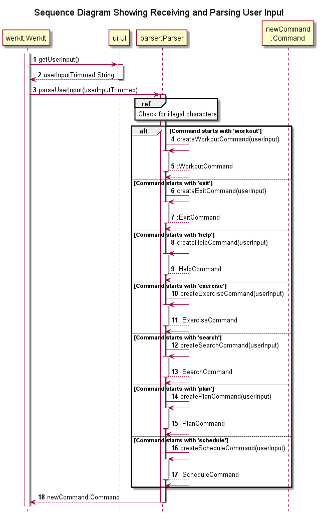

<span class="box info">:memo: To improve the readability of the sequence diagram, the construction of the respective
objects which are subclasses of the `Command` class between Steps 4 and 17 are not included in the diagram.</span>

**(Steps 1 and 2)** When a user enters something into the terminal (when prompted), `UI#getUserInput()` will take in 
the user's input as a `String` and call `String#trim()` to remove leading and trailing whitespaces in the input.
Thereafter, a line is printed on the terminal to indicate that the user's input has been received
and will be processed, before returning the user input as a `String` to the calling method (i.e. 
`WerkIt#startContinuousUserPrompt()`).

**(Step 3)** In `WerkIt#startContinuousUserPrompt()`, the method will pass the obtained user string as a parameter into
`WerkIt#parseUserInput()`, an intermediary method that will pass the parameter to `Parser#parseUserInput()` which does
the actual parsing of the user input.

<span class="box info">:memo: The intermediary `WerkIt#parseUserInput()` is created to reduce the arrowhead code that
was grossly present in `WerkIt#startContinuousUserPrompt()`.</span>

**(Step 4)** In `Parser#parseUserInput()`, it will first check if the user input contains any characters
or symbols that are deemed as illegal (see ['Illegal Characters and Phrases'](#illegal-characters-and-phrases) for details).
If at least one illegal character or phrase is found, an `InvalidCommandException` will be thrown and the parsing is
aborted.

**(Steps 5 to 18)** If no illegal characters and phrases are found, `Parser#parseUserInput()` will examine the first
word in the user input. This first word should represent the command type that the user wish to execute (i.e. `exercise`,
`workout`, `plan`, `schedule`, `search`, `help`, or `exit`). Depending on the first word of the user input, different
methods will be invoked to create the appropriate object of the subclass of the `Command` abstract superclass (see the 
bulleted point after this paragraph for an example). However, if the first word is not a valid command type, an 
`InvalidCommandException` will be thrown and the parsing is aborted.
- For example, if the user input is `workout /new push up /reps 10`, `Parser#createWorkoutCommand()` will be invoked
and a `WorkoutCommand` object will be returned by this method.

Inside each of these 'create command' methods, the following generalised procedure to create an object of the subclass 
of `Command` is carried out:
1. (For commands that expect an action keyword (e.g. `/list`, `/new`)) The action keyword is parsed and determined.
    - If the action keyword is invalid, an `InvalidCommandException` is thrown and the parsing is aborted.
2. Depending on the action keyword (or lack thereof), the number of arguments are checked.
    - If insufficient or too many arguments are provided in the user input, an `InvalidCommandException` is thrown
   and the parsing is aborted.
3. A new object of the subclass of `Command` is created and if the object is successfully constructed with no errors,
it is returned to `Parser#parseUserInput()`.

**(Steps 19 and 20)** The object created is then returned to `WerkIt#parseUserInput()`, which will return to
`WerkIt#startContinuousUserInput()`.

<span class="box info">:memo: (About the sequence diagram) Strictly speaking, the object is returned right after whichever 
'create command' method is invoked. However, to improve the readability of the diagram, only one return line is shown,
since all alternate paths will return an object that is a subclass of the `Command` class.</span>

The final step of this section is to invoke the `Command#execute()` method, which will in turn call the
overridden `execute()` method of the subclass of `Command`.
- For example, if the user input is `workout /new push up /reps 10`, the created `WorkoutCommand` object is upcasted
to `Command` when returned to `WerkIt#startContinuousUserInput()`, but when `newCommand#execute()` is called,
`WorkoutCommand#execute()` is called.

Thereafter, the appropriate procedures are taken to complete the task requested by the user. The various procedures
are explained in later sections of this developer guide.

#### Illegal Characters and Phrases
Some symbols and phrases are reserved for use by the application and thus are not allowed to be used by the user
in his/her inputs to avoid any potential instabilities when processing his/her inputs.

| Illegal Character/Phrase | Purpose in Application                                                                                                                                                                |
|--------------------------|---------------------------------------------------------------------------------------------------------------------------------------------------------------------------------------|
| The pipe character &#124; | Used as a delimiter in the app data files to separate the various data. Allowing the user to use delimiters in their plan names may cause issues when storing them in the data files. |
| The phrase 'rest day' | Used as an indicator that a particular day in the user's schedule does not have a plan in it. Allowing the user to name a plan as 'rest day' may cause issues when displaying the schedule. |

If these characters are inputted by the user, as mentioned in Step 3 above, an `InvalidCommandException` will be thrown 
and the parsing is aborted.

<div class="button-container"><a class="button" href="#implementation">Back to Implementation Overview</a></div>

---

### Exercise

The overview of the design of the exercise feature can be found [here](#exercise-related-features).

#### List Exercise

If the user's command type is to list the exercises available, i.e. `exercise /list`, the
`Parser#parseUserInput(String userInput)` method will parse the 'exercise' base word and proceed to create exercise related
command using `Parser#createExerciseCommand(String userInput)` method. 

This method will further evaluate the
exercise action, in this case, `/list` and call the constructor of `ExerciseCommand` class by passing relevant parameters related to the
ExerciseCommand constructor.

If the exercise action is null or incorrect, an `InvalidCommandException` will be thrown. Once the exercise command is created,
this exercise command is executed via the `ExerciseCommand#execute()` method. As it is executed, the method will check the
type of action to be executed, in this case, `/list`. It will then list the exercises available for selection from 
the exerciseList using the `ExerciseList#printExerciseList()`.

The following sequence diagram illustrates how the `exercise /list` command works in greater detail:

<span class="info box">:memo: To simplify the sequence diagram, some method invocations that are deemed to be trivial
have been removed from the sequence diagram. Reference frames will be elaborated further
down this section.</span>

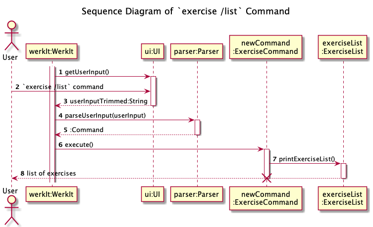

<span class="box info">:memo: For more information on the obtaining and parsing functionality of WerkIt!, please refer to
["Parsing User Input and Getting the Right Command"](#parsing-user-input-and-getting-the-right-command) section.</span>

<div class="button-container"><a class="button" href="#implementation">Back to Implementation Overview</a></div>

---

### Workout

The overview of the design of the workout features can be found [here](#workout-related-features).

#### Create New Workout

A summary of the general procedure of a new workout being inputted and stored into WerkIt! is as follows:
1. User enters the command `workout /new <workout name> /reps <number of repetitions>`.
2. A new `Workout` object is created and stored in the application.
3. The success response is printed to the user through the terminal.
4. The new `Workout` object data is written to the resource file `workouts.txt`.

The following sequence diagram illustrates how the `workout /new` command works in greater detail:

<span class="box info">:memo: To simplify the sequence diagram, some method invocations that are deemed to be trivial 
have been removed from the sequence diagram. Some reference frames will be elaborated further 
down this section. Reference frames that will not be elaborated on will be made known.</span>

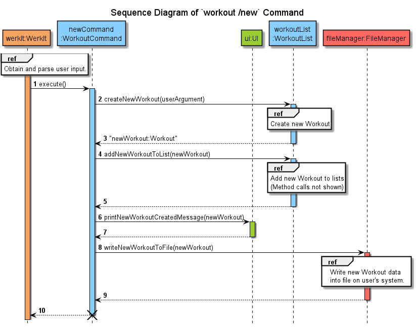

**(Before Step 1)** The user's input (in this case will be a `workout /new` command) is obtained and parsed to obtain
a `WorkoutCommand` object that contains the user's input.

<span class="box info">:memo: For more information on the obtaining and parsing functionality of WerkIt!, please refer to
["Parsing User Input and Getting the Right Command"](#parsing-user-input-and-getting-the-right-command) section.</span>

**(Step 1)** When `WorkoutCommand#execute()` is called, because this is a `workout /new` command, the method will call
`WorkoutList#createNewWorkout()`.

The following sequence diagram is the detailed procedures for Step 2's `WorkoutList#createNewWorkout()`:

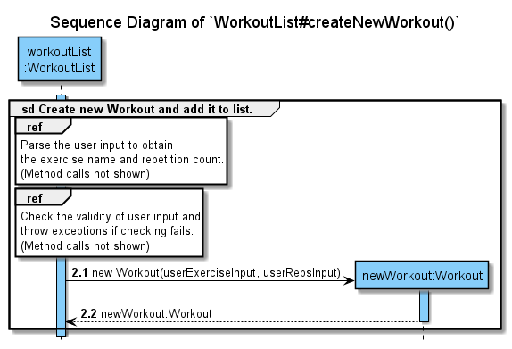

<span class="box info">:memo: To improve the diagram's readability, logging-related and input-checking method calls, and 
exception throws in `WorkoutList#createNewWorkout()` have been omitted.</span> 

**(Before Step 2.1)** Methods from the `String` and `Integer` classes are called to parse the
argument given to `WorkoutList#createNewWorkout()` to obtain the following information required to create the
`Workout` object:
1. Name of the exercise
2. Number of repetitions associated with the exercise in (1).

Next, validity checks of the user input are carried out to ensure that the data entered is valid as a
new `Workout` object. The requirements for a valid new `Workout` object are as follows:
1. The exercise name must exist in `ExerciseList`'s `exerciseList`, which is an `ArrayList<String>` of exercise 
names. An `InvalidExerciseException` is thrown if this requirement is not met. 
2. The repetition value must be a non-negative integer greater than 0.
3. The (exercise name, repetition value)-pair must not already exist in the list of workouts maintained in
`WorkoutList`. For example, if a workout of 20 reps of push-ups is already stored in the list,
it cannot be created again.

If any of the three requirements are not met, the entire workout creation process is aborted.
If requirement 1 is not met, an `InvalidExerciseException` will be thrown. If requirements 2 and/or 3 are not met, an 
`InvalidWorkoutException` will be thrown.

Note that the above methods and exception throws are not shown in the sequence diagram to improve the readability of the 
sequence diagram.

**(Steps 2.1 and 2.2)** If the above checks pass, a new `Workout` object with the user-specified exercise name and
repetition value is created. The new object is then returned to `WorkoutCommand#execute()` 

**(Steps 4 and 5)** The new `Workout` object passed to `WorkoutList#addNewWorkoutToLists()` to add to two lists maintained
in the `WorkoutList` object: `workoutsHashMapList` and `workoutsDisplayList`. The following steps are 
taken:
1. Key of the `workout` object will be generated (see the 
[Design Considerations](#design-considerations-for-creating-a-new-workout) section for more details of the `HashMap`
implementation).
2. The key-`Workout` pair is stored in `workoutsHashMapList` which in turn is stored in `WorkoutList`. 
3. The key of the newly-created `Workout` object is added to the `workoutsDisplayList`, an 
`ArrayList<String>` object stored in `WorkoutList`. This ArrayList will be used for displaying the workouts when the 
command `workout /list` is entered by the user.

**(Step 6)** Upon returning to `WorkoutCommand`, `UI#printNewWorkoutCreatedMessage()` is called to display a response to
the user via the terminal. The following is an example of a response after the user entered `workout /new russian twist 
/reps 50`:
```
----------------------------------------------------------------------
Alright, the following workout has been created:

	russian twist (50 reps)

----------------------------------------------------------------------
```

**(Step 8)** `FileManager#writeNewWorkoutToFile` is called to write the newly-created `Workout` object's data into 
`workouts.txt` which is stored on the user's local filesystem.

<span class="info box">:memo: For more information on how the data is written to `workouts.txt`, please refer to
['File Management - Writing a New Line of Data to the Resource File'](#writing-a-new-line-of-data-to-the-resource-file).</span>

This completes the process of adding a new workout to WerkIt!

##### Design Considerations for Creating a New Workout
###### HashMaps - Motivation
Back in Version 1.0 of WerkIt!, workouts were stored in an ArrayList of `Workout` objects. In that version, plans
and schedules were not yet implemented and thus there was no real issues, since we can easily use index numbers
shown in `workout /list` to reference workouts when the user enters `workout /update` and `workout /delete` commands.

As an example, here is a list of workouts as shown when `workout /list` is used:
```
----------------------------------------------------------------------
> workout /list
----------------------------------------------------------------------
Showing workouts 1-3 of 3:

1. push up (10 reps)
2. sit up (10 reps)
3. pull up (10 reps)

Showed all workouts in list
----------------------------------------------------------------------
```

Thus, if we want to update the workout with 10 reps of push-ups, we can enter `workout /update 1 15` to update 
the repetition value to 15.

However, when we were designing and preparing for Version 2.0, we discovered that this **relative referencing** of
workouts by their indices pose a potentially cumbersome issue when implementing the plans and schedule features. If
we were to continue using relative indexing to reference workouts in plans, the effort needed to maintain the 
references in plans can become unnecessary complex.

For example, using the same list of workouts we have above, suppose we have a plan that includes workout indices
1 and 3 (10 push-ups and 10 pull-ups). Now, suppose the user decides to delete workout index 2 (10 sit-ups), this
means that the 10 pull-ups will now have an index number of 2. Thus, if we were to continue using relative indexing
to reference workouts in plans, there is a greater risk of making wrong references, and the amount of additional
code to update these references can become too complex.

###### Usage of HashMap
Thus, we have decided to use a HashMap on top of the existing ArrayList to store `Workout` objects. This will allow 
workouts to be referenced by their unique keys when creating plans and schedules, while allowing the user to continue
using the convenience of relative indexing for `workout /update` and `workout /delete` commands. The ArrayList of 
`Workout` objects from before is now converted into an ArrayList of Strings that will keep the keys of the `Workout` 
objects. Now, to manipulate the `Workout` object (e.g. `workout /update`),
1. User enters the index number of the workout he/she wants to update (as seen in `workout /list`).
2. The key of the `Workout` object is obtained from the ArrayList of keys (`workoutsDisplayList`).
3. The `Workout` object is obtained from the HashMap (`workoutsHashMapList`).

Note that the user will not have any direct interactions with the HashMap implementation and it should be transparent
to him/her.

<div class="button-container"><a class="button" href="#implementation">Back to Implementation Overview</a></div>

---

#### List Workout
A summary of the general procedure of listing all the workouts being stored on WerkIt! is as follows:
1. User enters the command `workout /list`.
2. The application will then process this command and display all workouts stored in the `workoutList` object.

The following sequence diagram illustrates how the `workout /list` command works in greater detail:

<span class="info box">:memo: To simplify the sequence diagram, some method invocations that are deemed to be trivial
 have been removed from the sequence diagram. Reference frames will be elaborated further
 down this section.</span>

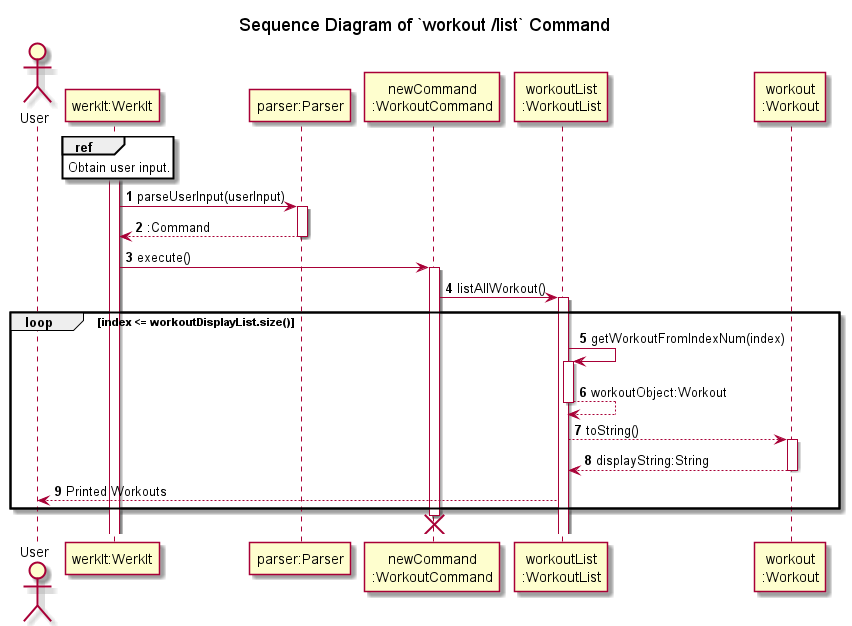
<br>

<span class="info box">:memo: For more information on the obtaining and parsing functionality of WerkIt!, please refer to
["Parsing User Input and Getting the Right Command"](#parsing-user-input-and-getting-the-right-command) section.</span>

**(Steps 1)** The command entered by the user is a workout command and thus will be executed by calling the 
`WorkoutCommand#execute()` method.

**(Steps 2)** Since the command action is `/list`, 
the application will execute the `WorkoutList#listAllWorkout()` method to perform the action of listing the workouts. 

**(Step 3)** If the workout list is empty, a message indicating the list is empty will be displayed to the user and the
process of printing all workouts stored in the list is completed. 

**(Steps 4 and 5)** To get each of the workouts stored in the `workoutList` object, `WorkoutList#getWorkoutFromIndexNum()` 
method is called to obtain each of the `Workout` object. Each `Workout` object contains the exercise name as well as the 
number of repetitions of that exercise set by the user. 

**(Steps 6 to 8)** Upon obtaining the `Workout` object, `Workout#toString()` method is called to 
obtain a `String` representation of the `Workout` object, which will thereafter be printed onto the terminal for the user
to read. A message to indicate that all workouts in the workout list have been printed will be displayed via 
the terminal after all `Workout`objects have been printed.

<div class="button-container"><a class="button" href="#implementation">Back to Implementation Overview</a></div>

---

#### Delete Existing Workout
A summary of the general procedure of an existing workout being removed from WerkIt! is as follows:
1. User enters the command `workout /delete <workout index number in workout list>`.
2. The workout with the corresponding workout index number in the workout list (can be determined by entering `workout /list`) is removed from the application's workout list.
3. The success response is printed to the user through the terminal.
4. The resource file, `workouts.txt`, is rewritten according to the application's workout list that has been modified.

The following sequence diagram illustrates how the `workout /delete` command works in greater detail:

<span class="box info">:memo: To simplify the sequence diagram, some method invocations that are deemed to be trivial
 have been removed from the sequence diagram. Reference frames will be elaborated further
 down this section.</span>

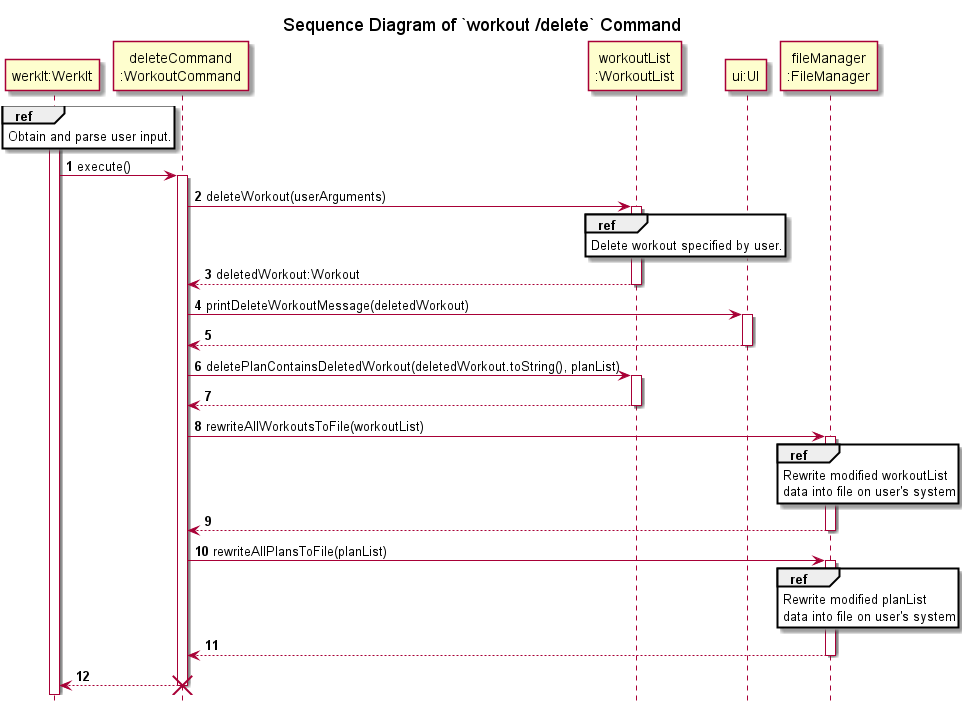
<br><br>
**(Before Step 1)** The user's input (in this case will be a `workout /delete` command) is obtained and parsed to obtain
a `WorkoutCommand` object that contains the user's input.

<span class="box info">:memo: For more information on the obtaining and parsing functionality of WerkIt!, please refer to
 ["Parsing User Input and Getting the Right Command"](#parsing-user-input-and-getting-the-right-command) section.</span>

**(Step 1)** When the `WorkoutCommand#execute()` method is called, it will identify
that the workout action is of type `/delete`. Subsequently, it will call the 
`WorkoutList#deleteWorkout()` method to perform the deletion of the workout.
<br><br>
The following sequence diagram is the detailed procedure for Step 2's `WorkoutList#deleteWorkout()`:
<br><br>
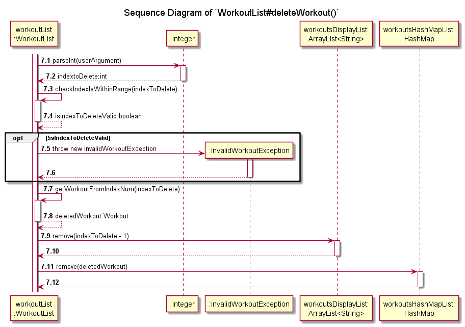

<span class="box info">:memo: To improve the diagram's readability, logging-related and input-checking method calls, and exception throws in
 `WorkoutList#deleteWorkout()` have been omitted.</span>

**(Steps 2.1 to 2.2)** The `Integer#parseInt()` method is called to parse the user argument parameter given to `WorkoutList#deleteWorkout()`.
In this case, the user argument parameter is the workout index number of the workout to be deleted from the workout list as a `String` object.
<br><br>
**(Steps 2.3 to 2.4)** With the workout index to delete, the `WorkoutList#deleteWorkout()` method will then
fetch the `Workout` object to be deleted by calling the `WorkoutList#getWorkoutFromIndexNum()` method.
However, before that `Workout` object is fetched, the `WorkoutList#deleteWorkout()` method
checks that the workout index to delete is within the range of the application's workout list.
If index to delete is not within the range of the workout list, an `InvalidWorkoutException` exception is thrown.
<br><br>
**(Steps 2.5 to 2.8)** The `Workout` object to be deleted is subsequently removed from the ArrayList and HashMap which stores the
application's workout list.
<br><br>
**(Step 3)** The `WorkoutList#deleteWorkout()` method returns the deleted `Workout` object to `WorkoutCommand`.
<br><br>
**(Steps 4 to 5)** Upon returning to the `WorkoutCommand` object, the `UI#printDeleteWorkoutMessage()` is called
to display the workout that has been deleted to the user via the terminal. The following is an example 
of a success deletion message after a valid workout is deleted from the application's workout list:
```
----------------------------------------------------------------------
Alright, the following workout has been removed:

	push up (20 reps)

----------------------------------------------------------------------
```

**(Steps 6 to 7)** The `WorkoutCommand#deletePlanContainsDeletedWorkout()` method will
be called to delete any existing plan(s) that contains that deleted workout.
<br><br>
**(Steps 8 to 11)** The `FileManager#rewriteAllWorkoutsToFile()` is called to rewrite
the `workouts.txt` file according to the newly modified application's workout list and the
`FileManager#rewriteAllPlansToFile()` is also called to rewrite
the `plans.txt` file according to the newly modified application's plan list.
For more information on the file management, 
refer to this [section](DeveloperGuide.md#rewriting-the-entire-resource-file-with-the-most-recent-set-of-data).

<br/>
This completes the process of deleting an existing workout in WerkIt!

##### Design Considerations for Deleting Existing Workout
###### Rewrite All Workout To File
Currently, the WerkIt! program will rewrite all workouts to the resource file, `workouts.txt`, when the delete workout
function is executed. Such an implementation may have performance issues as the program needs to rewrite the whole
file with the modified workout list whenever a workout is deleted in the application.
<br><br>
An alternative considered was to find the workout to be deleted in the resource file, and then
remove that workout. While this is a more efficient implementation, it is more complex due to the
way the workout data are formatted and stored in the `workouts.txt` file.
<br><br>
Hence, to simplify the implementation, the team decided to simply
rewrite all workouts to the resource file whenever a workout is deleted.

###### Deleting a Workout Will Cause a Cascading Delete Action
When an existing workout is deleted from the application, plans that contain that workout
should also be deleted. In addition, affected plans in the schedule should also be removed. This
cascading delete action from `workout -> plan -> schedule` must be done so that 
the data in the `workouts.txt`, `plans.txt` and `schedule.txt` files matches.

<div class="button-container"><a class="button" href="#implementation">Back to Implementation Overview</a></div>

---

#### Update Existing Workout
A summary of the general procedure of an existing workout from WerkIt! being updated to new number of repetitions
is as follows:<br>
1. User enters the command `workout /update <workout index number> <new number of repetitions>`.
2. The workout with the corresponding workout index number in the workout list 
(can be determined by entering `workout /list`) is updated to the number of repetitions that user specified.
3. The success response is printed to the user through the terminal.
4. The resource file, `workouts.txt`, is rewritten according to the application's workout list that has been modified.

The following sequence diagram illustrates how the `workout /update` command works in greater detail:

<span class="box info">:memo: To simplify the sequence diagram, some method invocations that are deemed to be trivial 
have been removed from the sequence diagram. Some reference frames will be elaborated further down this section.</span>

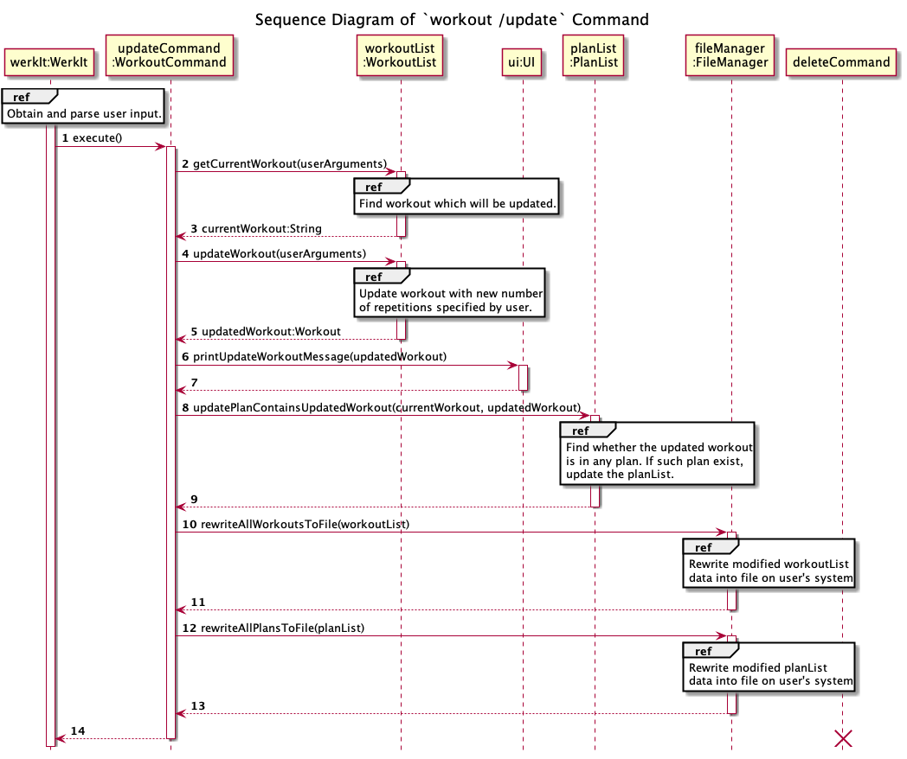
<br><br>
**(Before Step 1)** The user's input (in this case will be a `workout /update` command) is obtained and parsed to obtain
a `WorkoutCommand` object that contains the user's input.

<span class="box info">:memo: For more information on the obtaining and parsing functionality of WerkIt!, please refer to
 ["Parsing User Input and Getting the Right Command"](#parsing-user-input-and-getting-the-right-command) section.</span>

**(Step 1 to 3)** When the `WorkoutCommand#execute()` method is called, `workout /update` command is identified, and
`WorkoutList#getCurrentWorkout()` will be called to get the name of the workout which will be updated later.

Subsequently, `WorkoutList#updateWorkout()` method will be called.
<br><br>

The following sequence diagram is the detailed procedure for Step 4's `WorkoutList#updateWorkout()`:
<br><br>
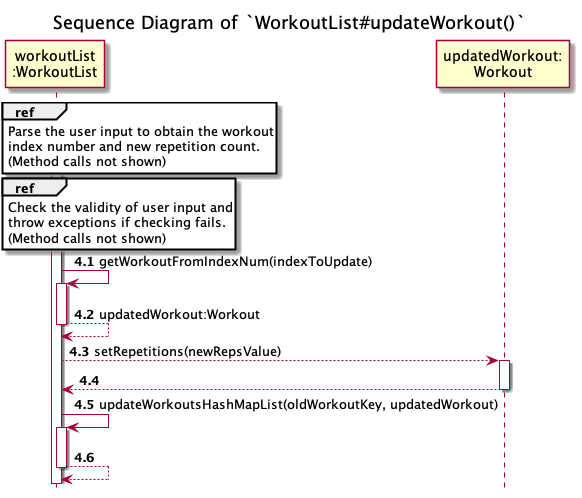

<span class="box info">:memo: To improve the diagram's readability, logging-related and input-checking method calls, 
and exception throws in `WorkoutList#updateWorkout()` have been omitted.</span>

**(Before Step 4.1)** Methods from the `String` and `Integer` classes are called to parse the
argument given to `WorkoutList#updateWorkout()` to obtain the following information required to update a
workout:
1. Workout index number in list.
2. New number of repetitions assigned to the workout in (1).

Next, validity checks of the user input are carried out to ensure that the data entered is valid. 
The requirements for a valid input are as follows:
1. Workout index number must be a positive integer smaller than the total number of workouts in list.
2. New repetition value must be a non-negative integer greater than 0.
3. Updated workout's exercise name and repetition number cannot be identical to an existing workout.

If any of the three requirements are not met, an `InvalidWorkoutException` will be thrown and 
the entire update process is aborted.

**(Steps 4.1 to 4.2)** With the workout index number to update, the `WorkoutList#updateWorkout()` method 
will then fetch the `Workout` object to be updated by calling method `WorkoutList#getWorkoutFromIndexNum()`.
After the `Workout` object is fetched, a check will be conducted to ensure that the 
(exercise name of the workout, new repetition value)-pair does not exist in the list of workouts maintained 
in `WorkoutList`. For example, if a workout of 20 reps of push-ups is already stored in the list, a workout of 
push up with 15 reps cannot be updated to push up with 20 reps.

If this check fails, an `InvalidWorkoutException` exception is thrown.
<br><br>
**(Steps 4.3 to 4.6)** The `Workout` object to be updated is modified to the new number of reps and `workoutsHashMapList` 
is subsequently updated.

This is the end of `WorkoutList#updateWorkout()` method.
<br><br>
**(Step 5)** The `WorkoutList#updateWorkout()` method returns the updated `Workout` object to `WorkoutCommand`.
<br><br>
**(Steps 6 to 7)** Upon returning to the `WorkoutCommand` object, the `UI#printUpdateWorkoutMessage()` is called
to display the workout that has been updated to the user via the terminal. The following is an example
of a success update message after a valid workout is updated from the workout list:
```
----------------------------------------------------------------------
Alright, the following workout has been updated:

	push up (10 reps)

----------------------------------------------------------------------
```

**(Steps 8 to 9)** The `WorkoutCommand#updatePlanContainsUpdatedWorkout()` method will
be called to update any existing plan(s) that contains the workout that has been updated.
<br><br>
**(Steps 10 to 13)** The `FileManager#rewriteAllWorkoutsToFile()` is called to rewrite
the `workouts.txt` file according to the modified workout list and 
the `FileManager#rewriteAllPlansToFile()` is also called to rewrite
the `plans.txt` file according to the newly modified plan list.
<br><br>
This completes the process of updating an existing workout in WerkIt!

##### Design Considerations for Updating Existing Workout
###### Update a Workout Will Cause a Cascading Update Action
When an existing workout is updated, plans that contain that workout
should also be updated. This cascading update action from `workout -> plan` must be done so that
the data in the `workouts.txt` and `plans.txt` files matches.

<div class="button-container"><a class="button" href="#implementation">Back to Implementation Overview</a></div>

---

### Plan

The overview of the design of the plan features can be found [here](#plan-related-features).

#### Create A New Plan

A summary of the general procedure of a new plan being created and stored in WerkIt! is as follows:
1. User enters the command `plan /new <plan name> /workouts <workout index numbers in workout list separated by comma>`.
2. A new `Plan` object is created and stored in the application.
3. The success response is printed to the user through the terminal.
4. The new `Plan` object data is written to the resource file `plans.txt`.

The following sequence diagram illustrates how the `plan /new` command works in greater detail:

<span class="box info">:memo: To simplify the sequence diagram, some method invocations that are deemed to be trivial
 have been removed from the sequence diagram. Reference frames will be elaborated further
 down this section.</span>

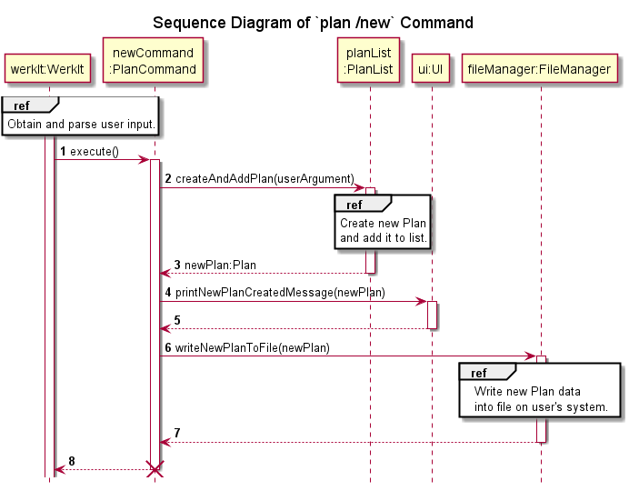
<br><br>
**(Before Step 1)** The user's input (in this case will be a `plan /new` command) is obtained and parsed to obtain
a `PlanCommand` object that contains the user's input.

<span class="info box">:memo: For more information on the obtaining and parsing functionality of WerkIt!, please refer to
 ["Parsing User Input and Getting the Right Command"](#parsing-user-input-and-getting-the-right-command) section.</span>

**(Step 1)** When the `PlanCommand#execute()` method is called, it will identify
that the plan action is of type `/new`. Subsequently, it will call the
`PlanList#createNewPlan()` method to perform the creation of the plan.
<br><br>
The following sequence diagram is the detailed procedure for Step 2's `PlanList#createNewPlan()`:
<br><br>
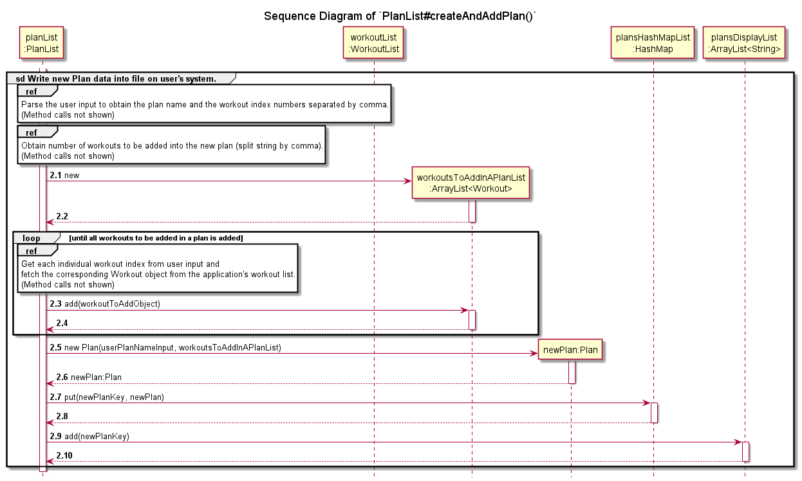

<span class="box info">:memo: To improve the diagram's readability, logging-related and input-checking method calls, and exception throws in
 `PlanList#createNewPlan()` have been omitted.</span>

**(Before Steps 2.1 to 2.2)** The user argument parameter of the `PlanList#createNewPlan()`
method is parsed to obtain the following information required to create the `Plan` object:
1. Name of the plan.
2. Workout index numbers in the workout list separated by comma.
<br>

Once the information are obtained, the name of the plan to be created will be validated.
This is to ensure all plan names are valid and unique in the application.
If the plan name is invalid, an `InvalidPlanException` exception will be thrown.
<br><br>
Subsequently, this `PlanList#createNewPlan()` method will find out the number of workouts
to be added into the new plan. This is done in order to check that the number of workouts to be added into the new plan
does not exceed 10 workouts, and there should minimally
be 1 workout in a plan. If the new plan does not meet the requirements,
an `InvalidPlanException` will be thrown.
<br><br>
**(Steps 2.1 to 2.2)** An ArrayList of `Workout` objects is created to store the workouts to be added into the new plan.
<br><br>
**(Steps 2.3 to 2.4)** As the workout indexes in the user argument parameter (e.g. "1, 2, 3") is of type `String`, 
the loop will split (by comma) and convert each number string into an `Integer`. 
These workout indexes are also checked to ensure that they are within
the application's workout list range.
<br><br>
If the workout indexes are valid, the valid `Workout` object is fetched from the application's workout list based 
on the workout index and then added into the `ArrayList<Workout>` that was created in the previous step (Steps 2.1 to 2.2).
The loop will continue until all workouts to be added in the new plan is added into that `ArrayList<Workout>`.
<br/><br/>
**(Steps 2.5 to 2.6)** With the valid plan name and the `ArrayList<Workout>` containing the workouts to be added into the new plan, 
a new `Plan` object is created. However, before creating the `Plan` object, the `PlanList#createNewPlan()` method will 
check that the new plan to be created does not contain the same workout order as any existing plans. If it does, 
an `InvalidPlanException` exception will be thrown.
<br/><br/>
If it is confirmed that the new plan does not contain
the same workout order as any existing plan, a new `Plan` object is created.
<br><br>
**(Step 3)** The `PlanList#createNewPlan()` method returns the newly created `Plan` object to `PlanCommand`.
<br/><br/>
**(Steps 4 to 5)** The `PlanCommand` object will then call the `PlanList#addNewPlanToLists()` method to add this new
`Plan` object to two lists maintained in the `PlanList` object: `plansHashMapList` and `plansDisplayList`.
The following are the steps taken:<br/>

1. Key of the `Plan` object will be generated. In this case, the key is the unique plan name.
2. The key-`Plan` pair is stored in `plansHashMapList` which in turn is stored in `PlanList`.
3. The key of the newly-created `Plan` object is added to the `plansDisplayList`, an `ArrayList<String>` object stored in `PlanList`.
This ArrayList will be used for displaying the plans when the command `plan /list` is entered by the user.

After the new `Plan` object has been added, this `PlanList#addNewPlanToLists()` method will return to the `PlanCommand` object.
<br/><br/>
**(Steps 6 to 7)** Upon returning to the `PlanCommand` object, the `UI#printNewPlanCreatedMessage()` is called
to display the plan that has been created to the user via the terminal. The following is an example
of a successful plan creation message (new plan is called "grow my muscles"):
```
----------------------------------------------------------------------
Alright, the following plan has been created:

	grow my muscles

----------------------------------------------------------------------
```
**(Steps 8 to 9)** `FileManager#writeNewPlanToFile()` is called to write the newly-created `Plan` 
object's data into `plans.txt`, which is stored on the user's local filesystem.
For more information on the file management,
refer to this [section](DeveloperGuide.md#writing-a-new-line-of-data-to-the-resource-file).

<br/>
This completes the process of creating and adding a new plan to WerkIt!.

##### Design Considerations for Creating a New Plan
###### Validity Checks for New Plans to Be Inserted
The following table lists the validity checks done before a new plan can be inserted into the application's plan list,
as well as the rationale of each check:

| Type of Validity Checks             | Reason for Creating the Validity Checks                                                                                                                                                                                                                                                                                                     |
|:------------------------------------|:--------------------------------------------------------------------------------------------------------------------------------------------------------------------------------------------------------------------------------------------------------------------------------------------------------------------------------------------|
| Unique plan name                    | All plan names within the application should be unique as it makes no sense for users to create plans with the same names.                                                                                                                                                                                                                  |
| No plans called "rest day"          | "rest day" is used to identify the days in the schedule that do not have a plan assigned to it. If a plan called "rest day" is allowed, users might not be able to differentiate a rest day from days that they actually need to work out.                                                                                                  |
| Character limit for plan name       | Currently, the maximum character limit set for all plan names is 30 characters. This is for UI printing purposes.                                                                                                                                                                                                                           |
| Maximum number of workouts          | Currently, a plan only supports a maximum of 10 workouts as it makes no sense for a plan to have many different workouts in the real-life context. In addition, it helps to simplify the tracking of workouts in a plan if a maximum number is placed.                                                                                      |
| Check plans with same workout order | All plans within the application should have different workout orders. For instance, `PlanA with workout sequence 1,1,2` is the same as `PlanB with workout sequence 1,1,2`, even though the plan names are different. This check is done as it makes no sense to create two plans with different plan names, but same workout orders.      |

<br>
<div class="button-container"><a class="button" href="#implementation">Back to Implementation Overview</a></div>

---

#### List Plans

A summary of the general procedure of listing all plans in the application is as follows:
1. User enters the command `plan /list`.
2. A list of plan names is displayed to the user via the terminal.

The following sequence diagram illustrates how the `plan /list` command works in greater detail:

<span class="box info">:memo: To simplify the sequence diagram, some method invocations that are deemed to be trivial
 have been removed from the sequence diagram. </span>

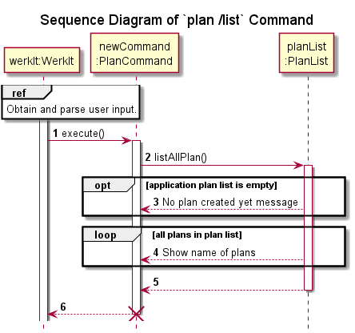
<br><br>
**(Before Step 1)** The user's input (in this case will be a `plan /list` command) is obtained and parsed to obtain
a `PlanCommand` object that contains the user's input.

<span class="box info">:memo: For more information on the obtaining and parsing functionality of WerkIt!, please refer to
 ["Parsing User Input and Getting the Right Command"](#parsing-user-input-and-getting-the-right-command) section.</span>

**(Steps 1 to 2)** When the `PlanCommand#execute()` method is called, it will identify
that the plan action is of type `list`. Subsequently, it will call the
`PlanList#listAllPlan()` method to display all available plan names.
<br><br>
**(Step 3)** The `PlanList#listAllPlan()` method will first check if the application's plan list is empty.
If it is, it will display to the user that no plan has been created yet.
<br><br>
**(Step 4)** The `PlanList#listAllPlan()` method will then loop through the application's plan list and show
the names of the plan to the user. The following is an example of what is 
displayed to the user when the `plan /list` command is entered while the application's plan list is not empty:
```
----------------------------------------------------------------------
Here are all your plan(s).
To view each plan in detail, enter
'plan /details <plan number in list>'.

1. test
2. grow my muscles
----------------------------------------------------------------------
```
**(Steps 5 to 6)** The `PlanList#listAllPlan()` method returns to the `PlanCommand` object
and the `PlanCommand` object returns to the `WerkIt` object.
<br><br>
This completes the process of displaying all plans in WerkIt!.

<div class="button-container"><a class="button" href="#implementation">Back to Implementation Overview</a></div>

---

#### List Workouts In A Plan
A summary of the general procedure of listing all workouts in a plan is as follows:
1. User enters the command `plan /details <plan index number>`.
2. A list of workouts that the user has specified is displayed through the terminal.

The following sequence diagram illustrates how the `plan /details` command works:

<span class="box info">:memo: To simplify the sequence diagram, some method invocations that are deemed to be trivial
have been removed from the sequence diagram.</span>

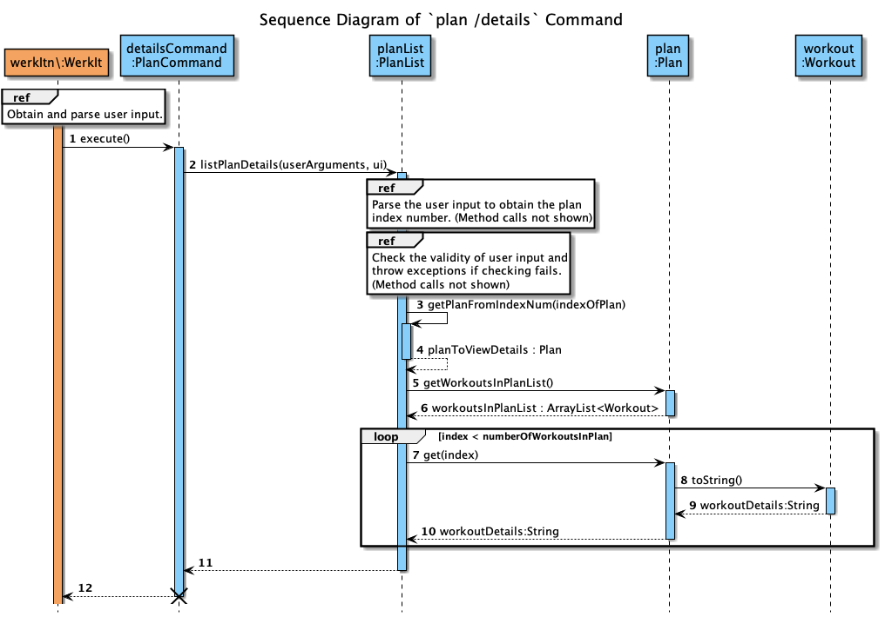
<br><br>

<span class="box info">:memo: To improve the diagram's readability, logging-related, input-checking method calls,
and exception throws in `PlanList#listPlanDetails()` have been omitted.</span>

**(Before Step 1)** The user's input (in this case will be a `plan /details` command) is obtained and parsed to obtain
a `PlanCommand` object that contains the user's input.

<span class="box info">:memo: For more information on the obtaining and parsing functionality of WerkIt!, please refer to
["Parsing User Input and Getting the Right Command"](#parsing-user-input-and-getting-the-right-command) section.</span>

**(Step 1 to 2)** When the `PlanCommand#execute()` method is called, it will identify that the plan action is of type 
`/details`. Thus, `PlanList#listPlanDetails()` will be called to display all the workouts in the plan
which user specified.

**(Before Step 3)** Methods from the `Integer` class is called to parse the
argument given to `PlanList#listPlanDetails()` to obtain the plan index number in the plan list.

Next, validity checks of the user input are carried out to ensure that the data entered is valid.
Plan index number must be a positive integer and smaller than the total number of plans in the list 
in order to pass the check. Otherwise, an `InvalidPlanException` will be thrown and
the entire process is aborted.

**(Steps 3 to 4)** With the plan index number, a `Plan` object which user want to view details 
will be fetched by calling method `PlanList#getPlanFromIndexNum()`.

**(Steps 5 to 6)** An ArrayList of `Workout` object is created to store the workouts in the `Plan` object we get 
in the previous step.

**(Steps 7 to 9)** The `PlanList#listPlanDetails()` method will then loop through the workout list which we have obtained
in the previous step and show the name of the workouts with number of repetitions to the user. 
The following is an example of what will be displayed to the user when the `plan /details` command is entered:

```
----------------------------------------------------------------------
Here are the 3 workouts in [grow my muscles].
1. push up (20 reps)
2. sit up (10 reps)
3. pull up (10 reps)
----------------------------------------------------------------------
```
This completes the process of displaying all workouts in a plan in WerkIt!

<div class="button-container"><a class="button" href="#implementation">Back to Implementation Overview</a></div>

---

#### Delete Existing Plan
A summary of the general procedure of listing all workouts in a plan is as follows:
1. User enters the command `plan /delete <plan index number>`.
2. The plan with corresponding plan index number (can be determined by entering `plan /list`) is removed from
   the application’s plan list.
3. The success response is printed to the user through the terminal.
4. The resource file, `plans.txt`, is rewritten according to the application’s plan list that has been modified.

The following sequence diagram illustrates how the `plan /delete` command works in greater detail:

<span class="box info">:memo: To simplify the sequence diagram, some method invocations that are deemed to be trivial
have been removed from the sequence diagram. Reference frames will be elaborated further
down this section.</span>

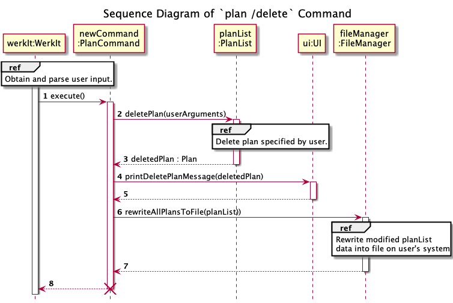
<br><br>
**(Before Step 1)** The user's input (in this case will be a `plan /delete` command) is obtained and parsed to obtain
a `PlanCommand` object that contains the user's input.

<span class="box info">:memo: For more information on the obtaining and parsing functionality of WerkIt!, please refer to
["Parsing User Input and Getting the Right Command"](#parsing-user-input-and-getting-the-right-command) section.</span>

**(Step 1)** When the `PlanCommand#execute()` method is called,  it will identify that the workout action is
of type `/delete`. `PlanList#deletePlan()` will be called to perform the deletion of plan.

The following sequence diagram is the detailed procedure for Step 2's `PlanList#deletePlan()`:
<br><br>
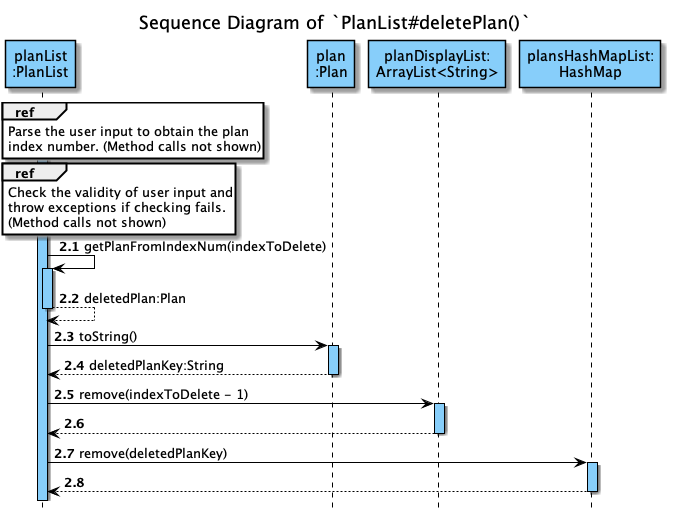

<span class="box info">:memo: To improve the diagram's readability, logging-related and input-checking method calls,
and exception throws in `PlanList#deletePlan()` have been omitted.</span>

**(Before Step 2.1)** Method from `Integer` class is called to parse the user argument parameter given to
`PlanList#deletePlan()` to obtain the plan index number.

Next, validity checks of the user input are carried out to ensure that the data entered is valid.
Plan index number must be a positive integer and smaller than the total number of plan in list
in order to pass the check. Otherwise, an `InvalidPlanException` will be thrown and
the entire process is aborted.


**(Steps 2.1 to 2.2)** With the plan index number, the `Plan` object to be deleted is obtained by calling method 
`Planlist#getPlanFromIndexNum()`.
<br><br>
**(Steps 2.3 to 2.8)** The `Plan` object to be deleted is subsequently removed from the ArrayList and HashMap
which stores the application’s workout list.

This is the end of `PlanList#deletePlan()` method.
<br><br>
**(Step 3)** The `PlanList#deletePlan()` method returns the deleted `Plan` object to `PlanCommand`.
<br><br>
**(Steps 4 to 5)** Upon returning to the `PlanCommand` object, the `UI#printDeletePlanMessage()` is called
to display the plan name that has been deleted to the user through the terminal. The following is an example
of a success deletion message after a valid plan is deleted from the workout list:
```
----------------------------------------------------------------------
Alright, the following plan has been removed:

	grow my muscles

----------------------------------------------------------------------
```
**(Steps 6 to 7)** The `FileManager#rewriteAllPlansToFile()` is called to rewrite
the `plans.txt` file according to the modified plan list.
<br><br>
This completes the process of deleting an existing plan in WerkIt!

##### Design Considerations for Deleting Existing Plan
###### Rewrite All Plans To File
Currently, when delete plan function is executed, the WerkIt! program will rewrite all plans to the resource file, 
`plans.txt`. Such an implementation may have performance issues as the program needs to rewrite the whole
file with the modified plan list whenever a plan is deleted in the application.

An alternative considered was to find the plan to be deleted in the resource file, and then
remove that plan. While this is a more efficient implementation, it is more complex due to the
way the plan data are formatted and stored in the `plans.txt` file.

Hence, to simplify the implementation, the team decided to simply
rewrite all plans to the resource file whenever a plan is deleted.

###### Deleting a Plan Will Cause a Cascading Delete Action
When an existing plan is deleted from the application, days which is scheduled with that plan 
should also be cleared. This cascading delete action from `plan -> schedule` must be done so that
the data in the `plans.txt`, `schedule.txt` files matches.

<div class="button-container"><a class="button" href="#implementation">Back to Implementation Overview</a></div>

---
### Schedule
The overview of the design of the schedule features can be found [here](#schedule-related-features). 

#### Update Schedule
A summary of the general procedure of updating a plan for a particular day to the schedule in WerkIt! is as follows:
1. User enters the command `schedule /update <day number> <plan number>`.
2. If there is no plan being scheduled for the day, a new `Day` object is created and stored in the application.
   If there is an existing plan scheduled for that particular day, the `Day` object that has already been created
   will then be updated to store the latest plan scheduled for the day.
3. The success response is displayed via the terminal.
4. The `Day` object data is written to the resource file `schedule.txt`.

The following sequence diagram illustrates how the `schedule /update` command works in greater detail:

<span class="box info">:memo: To simplify the sequence diagram, some method invocations that are deemed to be trivial
 have been removed from the sequence diagram. Reference frames will be elaborated further
 down this section.</span>

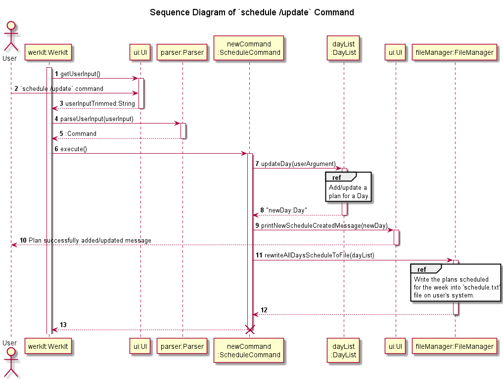
<br><br>

<span class="info box>:memo: For more information on the obtaining and parsing functionality of WerkIt!, please refer to
["Parsing User Input and Getting the Right Command"](#parsing-user-input-and-getting-the-right-command) section.</span>

**(Step 1)** The program waits for the user's input, which in this case,
is the `schedule /update <day number> <plan number>` command.
An example of a valid command would be `schedule /update 1 1`. This command entered
by the user is a `schedule` command, hence it is executed by calling the `ScheduleCommand#execute()` method.

Steps 2 and 3 are explained in greater details in the following sequence diagram:

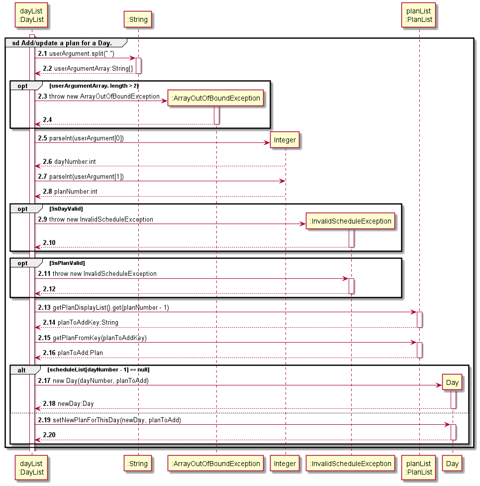

<span class="box info">:memo: To improve the diagram's readability, logging-related and input-checking method calls,
and exception throws in `DayList#updatePlan()` have been omitted.</span>

Firstly, the `DayList#updateDay()` method will be called to update/add a plan for a particular 
day in the schedule stated by the user. It will first call the `String#split()` method 
to separate out the `userArgument` given by the user. Upon splitting the whitespaces in `userArgument`, 
it will check if the `userArgument` is valid. If it is invalid, an 
`ArrayIndexOutOfBoundsException` would be thrown and the process terminates.

After splitting and checking the validity of `userArgument`, variables `userArgument[0]` representing
`dayNumber` and `userArgument[1]` representing `planNumber`, the plan index of the plan stored in the `planList` 
are obtained. Both the variables are then converted from data type `String` to `int`.

**(Steps 2.1 to 2.4)**  A check executed on both the converted`dayNumber` and `planNumber` to ensure that they are valid. 
This check is done so by calling the `DayList#isDayValid()` and`DayList#isPlanValid()` methods respectively. 
If the `dayNumber` or `planNumber` is not valid, an `InvalidScheduleException` would be thrown,
and the entire process of updating of a plan for a particular day in the schedule is aborted.

**(Steps 2.5 to 2.8)** `PlanList#getPlanDisplayList()` method is called to find and return the HashMap value of the `planNumber`, 
`planToAddKey`, to be scheduled for a particular day. The `planToAddKey` is used to get the `Plan` object in the 
`planList` by calling the `PlanList#getPlanFromKey()`.

**(Steps 2.9 to 2.10)** Once the `Plan` object is retrieved, if there is no plan scheduled for the day, 
a new `Day` object is created and stored in the application.

**(Steps 2.11 to 2.12)** However, if there is an existing plan scheduled for that particular day, the `Day` object that 
has already been created will then be updated to store the latest plan scheduled for the day. This process is done by
calling `Day#setNewPlanForThisDay()` method.

**(Step 3)** The `Day` object is successfully created.

**(Steps 4 and 5)** After successfully creating/updating the `Day` object, the `UI#printNewSchedule()` method
will be called to display the day and the corresponding plan scheduled for it via the terminal. The following is an
example of the message after the user has successfully scheduled a plan for the day (e.g. `schedule /update 1 1`):
```
----------------------------------------------------------------------
Alright, the following plan schedule has been created:

Monday -- arms

----------------------------------------------------------------------
```
**(Step 6)** Lastly, before the `ScheduleCommand` object is marked for disposal, the `FileManager#rewriteAllDaysScheduleToFile()`
is called to rewrite the `schedule.txt` file according to the newly modified application's day list. For more information
on the file management, refer to this [section](#rewriting-the-entire-resource-file-with-the-most-recent-set-of-data).

This completes the process of scheduling a plan for a particular day in WerkIt!.

##### Design considerations for update schedule
###### `Day` Object
For the application, schedule is defined to be a 7-day workout plan. Days that do not have any plan scheduled
would be considered a rest day for the user. Therefore, when implementing the creation of a `Day` object, up to 7
`Day` objects will be created and stored in the `dayList` (a `Day` array of size 7).

Initially, if no plan has been scheduled for a particular day, the corresponding `Day` object will not be created.
For example, if no plan is being scheduled for Monday, there will be no `Day` object created for Monday and index 0 of
the `dayList` array will not have any `Day` object stored.

If `dayList[0]` contains a `Day` object, it means that the user has scheduled a plan on Monday. If the
user is to execute the `schedule /update` command again to update the plan to be scheduled for Monday, the application
will update the content in the `Day` object stored in `dayList[0]`. It will not recreate a `Day` object for Monday
to store the new plan.

<div class="button-container"><a class="button" href="#implementation">Back to Implementation Overview</a></div>

---

#### View Schedule
To view the schedule in WerkIt!, the user can enter the command `schedule /list`.

A schedule in WerkIt! refers to a 7-day workout plan schedule. 
For example, a plan (plan number 1) named "leg day" which consists of 3 workouts: "5 squats, 5 lunges, 5 squats",
can be added into the schedule by entering `schedule /update <day number> <plan number>`. Hence, the "leg day" plan
can be scheduled on Monday by entering `schedule /update 1 1`. To view the plans in the schedule, the user can enter the
command `schedule /list`.

The following sequence diagram illustrates how the `schedule /list` command works in greater detail:

<span class="box info">:memo: To simplify the sequence diagram, some method invocations that are deemed to be trivial
 have been removed from the sequence diagram. Reference frames will be elaborated further
 down this section.</span>

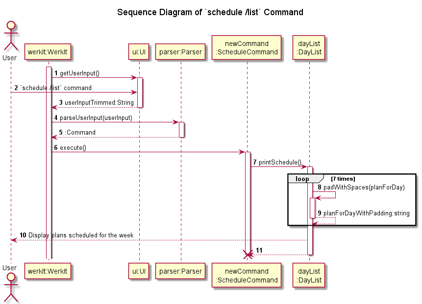
<br><br>

<span class="info box">:memo: For more information on the obtaining and parsing functionality of WerkIt!, please refer to
["Parsing User Input and Getting the Right Command"](#parsing-user-input-and-getting-the-right-command) section.</span>

**(Steps 1 and 2)** The command entered by the user (`schedule /list`) is a schedule command and will be executed by calling the 
`ScheduleCommand#execute()` method. Since the command action is `/list` the application will execute the 
`DayList#printSchedule()` method. No parameters are needed to be passed into the method as the method loops through the 
`scheduleList`, which stores all the plan names scheduled for the individual days.

**(Steps 3 and 4)** To ensure that the printing of the schedule is standardised, when `DayList#printSchedule()`
method is called, it will invoke a `for` loop to pad the plan name with whitespaces for all the plans in the `scheduleList` 
by calling the `DayList#padWithSpaces()` method. This method will pad both the front and back of the
plan name with whitespaces. The padding and plan name should not exceed 30 characters in total.

**(Steps 5 and 6)** To make the schedule more understandable `DayList#convertDayNumberToDay()` method will be called
to convert the day number to its corresponding day name. For example, day number 1 will be converted to Monday.

**(Step 7)** Upon the successful execution of the `DayList#printSchedule()` method, the 7-day workout plan schedule will
be displayed on the console to the user. An expected outcome of the `schedule /list` command will be:

```
----------------------------------------------------------------------

                         WORKOUT SCHEDULE
----------------------------------------------------------------------
     Day       |            Plan Name
----------------------------------------------------------------------
      Monday   |              arms                          
     Tuesday   |            rest day                      
   Wednesday   |            leg day                      
    Thursday   |            rest day                      
      Friday   |            rest day                      
    Saturday   |            leg day                      
      Sunday   |            rest day                      

----------------------------------------------------------------------
```

By default, if no plan is being scheduled for any of the day, the day is considered as a rest day for the user.

<div class="button-container"><a class="button" href="#implementation">Back to Implementation Overview</a></div>

---
#### Clear Schedule For A Day
A summary of the general procedure of clearing a plan scheduled for a particular day of the schedule in WerkIt! is as follows:
1. User enters the command `schedule /clear <day number>`.
2. The application will locate the index in the `dayList` which stores the corresponding `Day` object.
   This `Day` object will then be deleted from the `dayList`. For example, if the `schedule /clear 1` command is entered,
   the `Day` object stored in index 0 of the `dayList` array will be removed. In general, if day number x is to be 
   cleared, then index (x - 1) of `dayList` will be cleared.
3. `DayList[day number - 1]` will become `null` after the command is successfully executed.
4. The success response is printed to the user through the terminal.
5. The `schedule.txt` will also be rewritten to reflect the changes. 

The following sequence diagram illustrates how the `schedule /clear` command works in greater detail:

<span class="box info">:memo: To simplify the sequence diagram, some method invocations that are deemed to be trivial
 have been removed from the sequence diagram. Reference frames will be elaborated further
 down this section.</span>

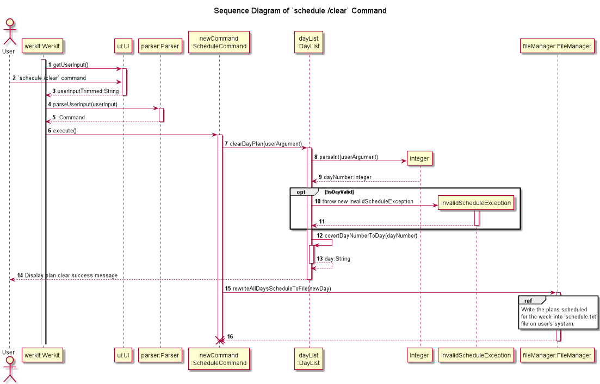 
<br><br>

<span class="info box">:memo: For more information on the obtaining and parsing functionality of WerkIt!, please refer to
["Parsing User Input and Getting the Right Command"](#parsing-user-input-and-getting-the-right-command) section.</span>

<span class="box info">:memo: To improve the diagram's readability, logging-related and input-checking method calls,
and exception throws in `DayList#clearDayPlan()` have been omitted.</span>

**(Step 1)** The program waits for the user's input, which in this case,
is the `schedule /clear <day number>` command. An example of a valid command would be `schedule /clear 1`. This command 
entered by the user is a `schedule` command, hence it is being executed by calling the `ScheduleCommand#execute()` method.

**(Steps 2 to 4)** Since the command entered is `schedule /clear <day number>`, the `DayList#clearDayPlan()` method will
be called. This method will first convert the `userArgument` to an `int` data type, after which it will call
the `DayList#isDayValid()` method to check whether the day number entered by the user is valid. 
If the day number falls within the range of 1 to 7 then it is considered a valid day, otherwise 
an `InvalidScheduleException` would be thrown, and the entire process is aborted.

**(Steps 5 and 6)** If the `dayNumber` is valid, the method `DayList#clearPlan()` will be called to remove the plan 
scheduled on that day. The `Day` object that stores the plan details for the specified day in 
the user command will be deleted.

**(Steps 7 and 8)** After which, the `DayList#convertDayNumberToDay()` method will be called.
As the method name suggests, this method will convert the day number to its corresponding day name. 
For example, day number 1 will be converted to Monday. The purpose of this method is to 
make the success message to be displayed to the user more readable.

**(Steps 9 and 10)** After the plan is successfully cleared for that indicated day, a success message of the process 
would be printed to the user through the terminal by calling the `UI#printClearedScheduleOnADay()` method. 
An example of a success message would be

```
----------------------------------------------------------------------
Plan has been cleared for Monday.
----------------------------------------------------------------------
```

**(Step 11)** `FileManager#rewriteAllDaysScheduleToFile()` is called to write all the `Day` objects' data stored 
in the `dayList` into `schedule.txt` which is stored on the user's local filesystem. For more information
on the file management, refer to this [section](#rewriting-the-entire-resource-file-with-the-most-recent-set-of-data).

This completes the process of clearing a plan on a particular day of the schedule on WerkIt!.

<div class="button-container"><a class="button" href="#implementation">Back to Implementation Overview</a></div>

---
#### Clear Schedule For The Week
A summary of the general procedure of clearing all the plans stored in the schedule in WerkIt! is as follows:
1. User enters the command `schedule /clearall`.
2. The application will delete all the plans that have been added to the schedule.
3. The success response is printed to the user through the terminal. 
4. The `schedule.txt` will also be rewritten to reflect the changes.

The following sequence diagram illustrates how the `schedule /clearall` command works in greater detail:

<span class="box info">:memo: To simplify the sequence diagram, some method invocations that are deemed to be trivial
 have been removed from the sequence diagram. Reference frames will be elaborated further
 down this section.</span>

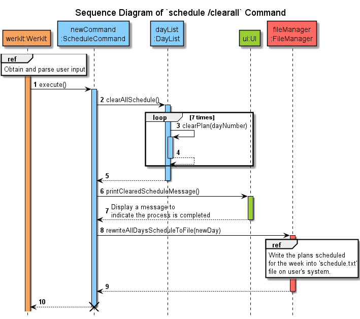
<br><br>

<span class="info box">:memo: For more information on the obtaining and parsing functionality of WerkIt!, please refer to
["Parsing User Input and Getting the Right Command"](#parsing-user-input-and-getting-the-right-command) section.</span>

<span class="box info">:memo: To improve the diagram's readability, logging-related and input-checking method calls,
and exception throws in `DayList#clearall()` have been omitted.</span>

**(Step 1)** The program waits for the user's input, which in this case,
is the `schedule /clearall` command. This command entered by the user is a `schedule` command, 
hence it is being executed by calling the `ScheduleCommand#execute()` method.

**(Step 2)** Since the command entered is `schedule /clearall`, the `DayList#clearAllSchedule()` method will
be called. This method will delete all the `Day` objects stored in the `dayList` using a `for` loop. 

**(Steps 3 and 4)** `DayList#clearPlan()` will be called 7 times in a `for` loop to 
delete all the `Day` objects stored in the `dayList` array.

**(Steps 6 and 7)** After all the plans are successfully cleared from the schedule, `UI#printClearedScheduleMessage()` method 
will be called to print a success message of the process. This message would be printed to the user through the terminal. 
An example of a success message would be:

```
----------------------------------------------------------------------
Schedule has been cleared and reset.
There is no plan scheduled for any day.
To add plan for any day, enter:
schedule /update <day number [1-7]> <plan number>
----------------------------------------------------------------------
```

**(Step 8)** Lastly, `FileManager#rewriteAllDaysScheduleToFile()` is called to write all the `Day` objects' data stored 
in the `dayList` into `schedule.txt` which is stored on the user's local filesystem. 
Since all `Day` objects are deleted, the `schedule.txt` file is essentially cleared. For more information on the file 
management, refer to this [section](#rewriting-the-entire-resource-file-with-the-most-recent-set-of-data).

This completes the process of clearing of all plans stored in the schedule on WerkIt!.

<div class="button-container"><a class="button" href="#implementation">Back to Implementation Overview</a></div>

---

### Search

The overview of the design of the search features can be found [here](#search-related-features).

#### Search For Exercise

A summary of the general procedure of search for exercise in the application is as follows:
1. User enters the command `search /exercise <exercise keyword>`.
2. A list of exercise names with matching result is displayed to the user via the terminal.

The following sequence diagram illustrates how the `search /exercise` command works in greater detail:

<span class="info box">:memo: To simplify the sequence diagram, some method invocations that are deemed to be trivial
have been removed from the sequence diagram. Reference frames will be elaborated further
down this section.</span>

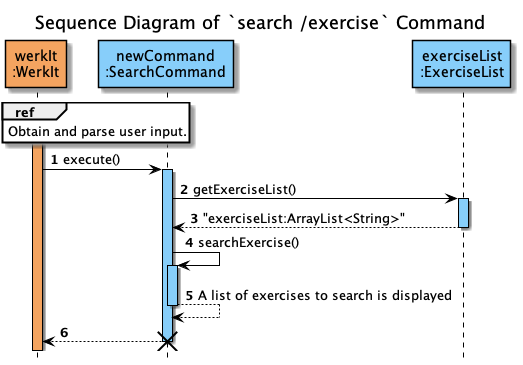

**(Before Step 1)** The user's input (in this case will be a `search /exercise <exercise keyword>` command) is obtained
and parsed to obtain a `SearchCommand` object that contains the user's input.

<span class="box info">:memo: For more information on the obtaining and parsing functionality of WerkIt!, please refer to
["Parsing User Input and Getting the Right Command"](#parsing-user-input-and-getting-the-right-command) section.</span>

**(Steps 1 to 3)** When the `SearchCommand#execute()` method is called, it will identify that the search action is of type `/exercise`.
Subsequently, it will call the `ExerciseList#getExerciseList()` method to fetch the `exerciseList` that is used to 
search through the available exercises.

**(Step 4)** Based on the exercises from the `exerciseList`, the `searchExercise()` will retrieve all the exercises with name
containing `<exercise keyword>` and display them in the user's terminal.

**(Step 5)** The `SearchCommand` object returns to the `WerkIt` object.

This completes the process of searching for exercise in WerkIt!.

---

#### Search For Workout

A summary of the general procedure of search for workout in the application is as follows:
1. User enters the command `search /workout <exercise keyword or number of reps>`.
2. A list of workouts with matching result is displayed to the user via the terminal.

The following sequence diagram illustrates how the `search /workout` command works in greater detail:

<span class="info box">:memo: To simplify the sequence diagram, some method invocations that are deemed to be trivial
have been removed from the sequence diagram. Reference frames will be elaborated further
down this section.</span>

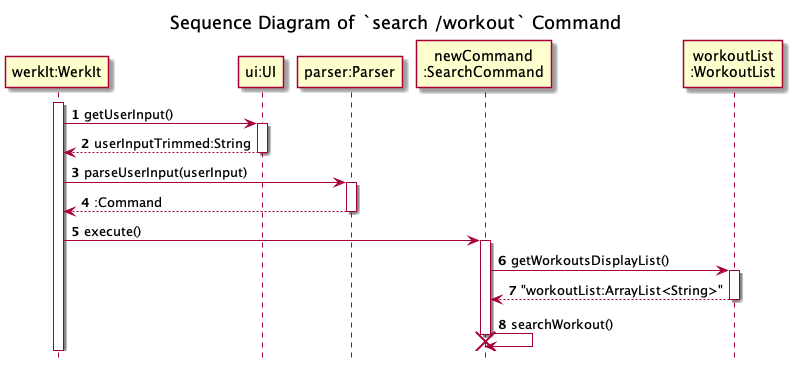

**(Before Step 1)** The user's input (in this case will be a `search /workout <exercise keyword or number of reps>` command) is obtained
and parsed to obtain a `SearchCommand` object that contains the user's input.

<span class="box info">:memo: For more information on the obtaining and parsing functionality of WerkIt!, please refer to
["Parsing User Input and Getting the Right Command"](#parsing-user-input-and-getting-the-right-command) section.</span>

**(Steps 1 to 3)** When the `SearchCommand#execute()` method is called, it will identify that the search action is of type `/workout`.
Subsequently, it will call the `WorkoutList#getWorkoutsDisplayList()` method to fetch the `workoutList` that is used to
search through the available workouts.

**(Step 4)** Based on the `workout` objects from the `workoutList`, the `searchWorkout()` will retrieve all the workouts with name
containing `<exercise keyword>` or repetitions equals to `<number of reps>`, and display them in the user's terminal.

**(Step 5)** The `SearchCommand` object returns to the `WerkIt` object.

This completes the process of searching for workout in WerkIt!.

---

#### Search For Plan

A summary of the general procedure of search for plan in the application is as follows:
1. User enters the command `search /plan <plan keyword>`.
2. A list of plan names with matching result is displayed to the user via the terminal.

The following sequence diagram illustrates how the `search /plan` command works in greater detail:

<span class="info box">:memo: To simplify the sequence diagram, some method invocations that are deemed to be trivial
have been removed from the sequence diagram. Reference frames will be elaborated further
down this section.</span>

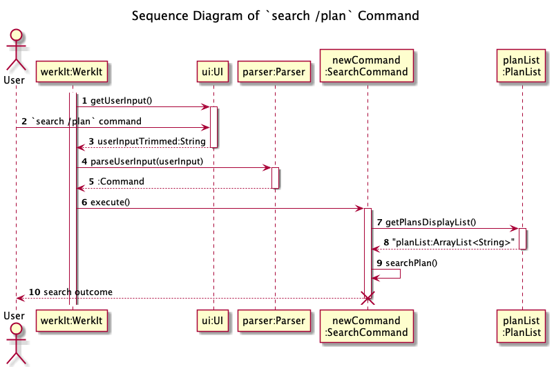

**(Before Step 1)** The user's input (in this case will be a `search /plan <plan keyword>` command) is obtained
and parsed to obtain a `SearchCommand` object that contains the user's input.

<span class="box info">:memo: For more information on the obtaining and parsing functionality of WerkIt!, please refer to
["Parsing User Input and Getting the Right Command"](#parsing-user-input-and-getting-the-right-command) section.</span>

**(Steps 1 to 3)** When the SearchCommand#execute() method is called, it will identify that the search action is of type `/plan`.
Subsequently, it will call the `PlanList#getPlansDisplayList()` method to fetch the `planList` that is used to
search through the available plans.

**(Step 4)** Based on the `plan` objects from the `planList`, the `searchPlan()` will retrieve all the plans with name
containing `<plan keyword>`, and display them in the user's terminal.

**(Step 5)** The `SearchCommand` object returns to the `WerkIt` object.

This completes the process of searching for plan in WerkIt!.

---

#### Search For All

A summary of the general procedure of search for plan in the application is as follows:
1. User enters the command `search /all <keyword>`.
2. A list of exercise name, workouts and plan names with matching result is displayed to the user via the terminal.

The following sequence diagram illustrates how the `search /all` command works in greater detail:

<span class="info box">:memo: To simplify the sequence diagram, some method invocations that are deemed to be trivial
have been removed from the sequence diagram. Reference frames will be elaborated further
down this section.</span>

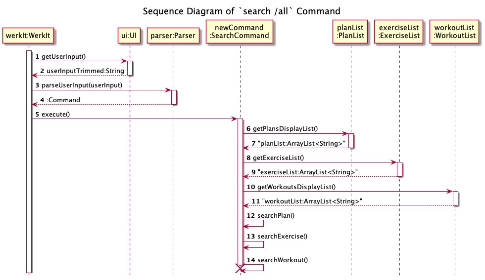

**(Before Step 1)** The user's input (in this case will be a `search /plan <plan keyword>` command) is obtained
and parsed to obtain a `SearchCommand` object that contains the user's input.

<span class="box info">:memo: For more information on the obtaining and parsing functionality of WerkIt!, please refer to
["Parsing User Input and Getting the Right Command"](#parsing-user-input-and-getting-the-right-command) section.</span>

**(Steps 1 to 7)** When the `SearchCommand#execute()` method is called, it will identify that the search action is of type `/all`.
Subsequently, it will call the `ExerciseList#getExerciseList()`, `WorkoutList#getWorkoutsDisplayList()` and
`PlanList#getPlansDisplayList()` methods to fetch the `exerciseList`, `workoutList` and `planList` that are used to
search through the available exercises, workouts and plans.

**(Step 8)** Based on the exercises, `workout` objects and `plan` objects retrieved, the `searchAll()` will retrieve 
all the matching results, and display them in the user's terminal.

**(Step 9)** The `SearchCommand` object returns to the `WerkIt` object.

This completes the process of searching for everything in WerkIt!.


<div class="button-container"><a class="button" href="#implementation">Back to Implementation Overview</a></div>

---

### File Management
#### About the Location of Directories and Files Created
Ideally, the `werkItResources` and `werkItLogs` directories should be in the same directory as the `WerkIt.jar` file,
but the creation of the directories and files depends on where the user starts WerkIt! from. Specifically, it depends
on the working directory that the user is in when he/she runs WerkIt!. In the user guide's 
[quick start guide](UserGuide.md#quick-start-guide) as well as the section regarding 
[information about the app's local storage](UserGuide.md#werkits-local-storage-information), the user has been 
instructed to create a new directory to put the WerkIt! JAR file in and to set his/her current working directory to that 
new folder before starting the application. This is to ensure that the resource directories and files are created in the 
same location as the WerkIt! JAR file as well as to maintain cleanliness on the user's local filesystem.

#### Storage Format for Each Resource File
There are four resource files in total: `exercises.txt`, `workouts.txt`, `plans.txt`, and `schedule.txt`. For all
four resource files, each line in the file represents one entry of data.

The data format for a line in each file is as follows:

| File            | Data Format      | Example      |
|-----------------|------------------|--------------|
| `exercises.txt` | `<exercise name>` | `push up`    |
| `workouts.txt`  | `<exercise name> | <repetition value>` | `push up | 10` |
| `plans.txt`     | `<plan name> <workout 1>,<workout 2>,...` | `plan 1 | push up | 10,pull up | 10` |
| `schedule.txt`  | `<day number of the week> | <plan name>` | `1 | plan 1` |

<span class="info box">:memo: In our application, the week starts on a Monday. Thus, in `schedule.txt`, if the day number
is `1`, it means that plan is meant for Monday, `2` for Tuesday, and so on...</span>

<span class="info box">To maintain simplicity, WerkIt! only stores words in lower case.</span>

<span class="warning box">In the [user guide](UserGuide.md#werkits-local-storage-information), users have been warned
not to directly modify the file data in order to avoid application instability and data loss.</span>

<div class="button-container"><a class="button" href="#implementation">Back to Implementation Overview</a></div>

#### Loading Resource File Data Into WerkIt!
When WerkIt! is launched for the first time, WerkIt! will create the required resource directories and files. Alternatively,
if the user has deleted some resource files for whatever reason (e.g. data reset), WerkIt! will recreate the missing
files (and directories, if necessary). In either case, the application will not attempt to load the data in any of these
files since they are just created.

On subsequent launches, if the application discovers the existence of these resource files, it will attempt to load the
data stored in the files.

The following sequence diagram shows the procedure of how data in `workouts.txt` is read and loaded into WerkIt!:

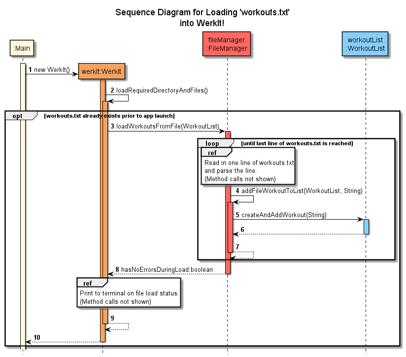

<span class="info box">:memo: To simplify the sequence diagram, some method calls have been omitted as they are
irrelevant to the loading of `workouts.txt` or they do not add significant value to the diagram.</span>

<span class="info box">:memo: The procedures for reading and loading the data for plan and schedule data sets are 
largely similar to the above sequence diagram. Thus, the sequence diagrams for these data sets are not shown.</span>

**(Steps 1 to 3)** When the `WerkIt` object is instantiated, `WerkIt#loadRequiredDirectoryAndFiles()` is called in the
constructor. This method is responsible for checking if the necessary resource files and directories are present. In this
case, we assume that all resource files are in place and since we are only interested in `workouts.txt`, `WerkIt#loadWorkoutFile()`
is called (not shown in the sequence diagram to simplify the diagram), which will in turn call `WerkIt#loadWorkoutsFromFile()`.

**(Before Step 4)** With the aid of the `Scanner` class that is built into Java, the first line of `workouts.txt` is
read into the application and stored as a `String`.  The data is then parsed into a `String` array and sent to
`FileManager#addFileWorkoutToList()`.

**(Step 4)** In `FileManager#addFileWorkoutToList()`, a `String` is crafted to follow a format that is a truncated
version of the `workout /new` command that is accepted by `WorkoutList#createNewWorkout()`. 

| Original Command                | Truncated `String` |
|---------------------------------|--------------------|
| `workout /new push up /reps 10` | `push up /reps 10` |


**(Steps 5 and 6)** The crafted `String` is passed to `WorkoutList#createNewWorkout()` to check the validity of the workout
data and create the `Workout` object before returning the object to `FileManager#addFileWorkoutToList()`.

**(Step 7)** The newly created `Workout` object is passed to `WorkoutList#addNewWorkoutToLists()` to add the new
`Workout` object to the respective data structures maintained in the `WorkoutList` object.

Steps 4 to 9 is repeated until all the lines in `workouts.txt` have been read.

**(Step 10)** A boolean value that indicates whether the loading of `workouts.txt` went without any issues is returned
from `WerkIt#loadWorkoutsFromFile()`. A value of `true` means that no issues were encountered and `false` means otherwise. 
This boolean will be used to determine the status message of the loading of `workouts.txt`. This status message will then 
be printed to the terminal.

This will finish the loading of the data in `workouts.txt` into WerkIt!

<span class="info box">In practice, the other resource files (i.e. `plans.txt` and `schedule.txt`)
are also processed and loaded in `WerkIt#loadRequiredDirectoryAndFiles()`. Once all the other resource files have been
loaded, the constructor for `WerkIt` will end.</span>

<div class="button-container"><a class="button" href="#implementation">Back to Implementation Overview</a></div>

#### Writing a New Line of Data to the Resource File
Writing a new line of data to the respective resource files is done when the user creates a new workout or plan.
See [this design consideration](#design-considerations-for-how-data-is-written-or-updated-to-a-resource-file)
for more details.

Currently, a new line of data is written to the respective resource files when creating a [new workout](#create-new-workout)
or a [new plan](#create-a-new-plan).

The following sequence diagram shows how a new workout is written to `workouts.txt` when the user enters a `workout /new`
command:

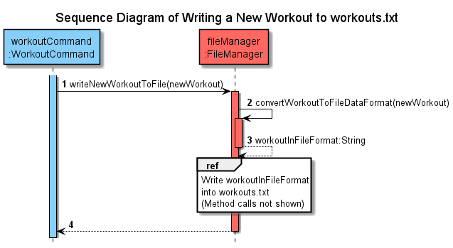

<span class="info box">:memo: The procedure for writing a new line of data when the user creates a new plan is largely 
similar to the above sequence diagram. Thus, the sequence diagram for the plan data set is not shown.</span>

**(Step 1)** After a new workout has been created, the `WorkoutCommand` object calls `FileManager#writeNewWorkoutToFile()`,
passing the newly created `Workout` object as the argument.

**(Steps 2 and 3)** `FileManager#convertWorkoutToFileDataFormat()` is called, passing the newly created `Workout` object as the
argument. In this method, the newly created `Workout` object's data is converted into a specified `String` format that will be
stored in `workouts.txt`. The format of a workout data when stored in the file will look something like this:

```
<exercise name> | <repetition value>
```

For example, a workout of 10 reps of push ups will look like this in `workouts.txt`:

```
push up | 10
```

**(Step 3 and beyond)** The 'file-formatted' workout data is returned to `FileManager#writeNewWorkoutToFile()` and thereafter
written to `workouts.txt` with the help of the `FileWriter` class that is built into Java. Each line of `workouts.txt` 
represents one workout.

This finishes the writing of the new workout to the resource file and control is returned to `WorkoutCommand#execute()`.

<div class="button-container"><a class="button" href="#implementation">Back to Implementation Overview</a></div>

#### Rewriting the Entire Resource File With the Most Recent Set of Data
In contrast to the previous section which covers the scenarios where only the new data is written as a new line to the 
file, rewriting the respective entire resource file is done when the user updates or deletes a workout, plan, or
schedule. See [this design consideration](#design-considerations-for-how-data-is-written-or-updated-to-a-resource-file)
for more details.

The following sequence diagram shows how `workouts.txt` is rewritten when the user updates or deletes a workout:

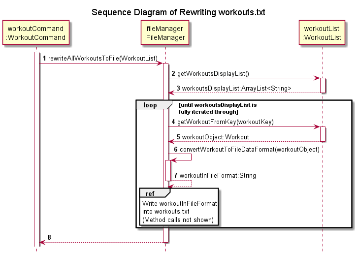

<span class="info box">:memo: The procedures for rewriting the entire file for plan and schedule data sets are largely similar 
to the above sequence diagram.</span>

**(Step 1)** After an existing workout is updated or deleted, the `WorkoutCommand` object calls
`FileManager#rewriteAllWorkoutsToFile()`, passing an instance of `WorkoutList` as the argument.

**(Steps 2 and 3)** In `FileManager#rewriteAllWorkoutsToFile()`, `workoutsDisplayList` is obtained from the `WorkoutList`
instance. `workoutsDisplayList` is an ArrayList of `String` objects where each `String` represents a key that is
mapped to a `Workout` object stored in a HashMap object in `WorkoutList`. (More information about the HashMap
implementation for `Workout` objects can be found [here](#hashmaps---motivation)).

The ArrayList of keys is iterated through using an enhanced for loop.

**(Steps 4 and 5)** For each key iterated, the actual `Workout` object mapped to the key is obtained via the
`WorkoutList#getWorkoutFromKey()` method.

**(Steps 5 and 6)** `FileManager#convertWorkoutToFileDataFormat()` is called, with the `Workout` object obtained in Step
5 as the parameter. This method will convert the `Workout` object's data into a specified `String` format that will be
stored in `workouts.txt`. The format of a workout data when stored in the file will look something like this:

```
<exercise name> | <repetition value>
```

For example, a workout of 10 reps of push ups will look like this in `workouts.txt`:

```
push up | 10
```

Thereafter, the 'file-formatted' workout data is returned to `FileManager#rewriteAllWorkoutsToFile()` and the method
will write the data into `workouts.txt` with the help of the `FileWriter` class that is built into Java. Each line of
`workouts.txt` will represent one workout.

Steps 4 to 7 (as well as the reference frame) is repeated until all keys in `workoutsDisplayList` has been iterated
through.

This finishes the process of rewriting the entire `workouts.txt` and control is returned to `WorkoutCommand#execute()`.

<div class="button-container"><a class="button" href="#implementation">Back to Implementation Overview</a></div>

#### About the `LogHandler` Class
Logging in WerkIt! is mainly handled by the `Logger` class that is built into Java. The `LogHandler` class is created
as a custom utility class to help WerkIt!'s various components log to a designated log file in an easier manner.
Whenever a class wants to log information, besides creating a `Logger` object, the object must be 'linked' to a
log file handler that has been configured in the `LogHandler` class.

The log file, `logs.log`, is stored in the `werkItLogs` directory, which is in the same directory as the `werkItResources`
directory. Each log entry has the following format:

```
<timestamp> <package.ClassName> <methodName>
<log level>: <log message>
```

Here's a sample log entry that you may find in `logs.log`:
```
Mar 17, 2022 7:24:43 PM data.workouts.WorkoutList createNewWorkout
INFO: New workout created.
```

#### Design Considerations for File Management
##### How Data Is Written or Updated to a Resource File
While writing newly created workout or plan data to its respective resource file is a trivial task, updating or deleting
existing data is more complex. When we want to update or delete the data in the resource file (including `schedule.txt`)
, we need to find a way to traverse through the file and find the exact part of the file where the data that needs to be 
updated or deleted is at. While it
is doable and can potentially be more efficient than rewriting the entire file, it is currently too complex for the
development team to work on, considering the limited time given. Thus, we have decided to take the less difficult route 
of rewriting the entire file with the most recent set of data when an existing data is updated or deleted.

The following table shows whether a certain operation writes a new line of data or rewrites the entire resource file:

**Legend**<br/>
:large_blue_diamond:: Only write the new line of data to the resource file<br/>
:large_orange_diamond:: Rewrite the entire resource file with the most recent set of data

| Data Type \ Operation |        Create        |         Update          |         Delete         |
|:---------------------:|:--------------------:|:-----------------------:|:----------------------:|
|       Workouts        | :large_blue_diamond: | :large_orange_diamond:  | :large_orange_diamond: |
|         Plans         | :large_blue_diamond: | :large_orange_diamond:  | :large_orange_diamond: |
|       Schedule        |        _N.A._        | :large_orange_diamond:  | :large_orange_diamond: |

<span class="info box">:memo: The delete operations for schedule commands is the `schedule /clear` and `schedule /clearall`
commands.</span>

##### Inconsistent Data Between Resource Files
The first step of loading local files to WerkIt! involves the checking of the validity of data. That is, before loading plan
data, `FileManager` will check whether the workouts in the plan exist in the `workouts.txt` file, and before loading the
schedule data, `FileManager` will also check whether the plans in `schedule.txt` can be found in `plans.txt`. If 
all the data can be matched, the files will be loaded successfully, otherwise only the unmatched data are classified as 
"corrupted data" and will be deleted and the deletion will be cascaded. 

Although the users are warned not to edit the local resource files as this action may corrupt the stored data,
resulting in WerkIt! being unable to load the data properly, there may still be scenarios where the users may accidentally edit 
the files. Thus, other than the warning in our [user guide](UserGuide.md#werkits-local-storage-information),
we have also implemented error handling methods to handle the situation where users edited the files, resulting in data 
corruption. We could have implemented the handling of "corrupted data" in a more hassle-free way by simply clearing 
all local data. However, in order to provide the best possible user experience by minimising the amount of data lost in 
such situations, we have decided to implement the validity checking such that only the affected data are removed while 
keeping all the non-affected data safe.

##### `LogHandler` Managing Its Own Log File Instead of `FileManager` Class
The development team decided to let the `LogHandler` class manage its own log file instead of the `FileManager` class,
which is already managing the other resource files and directories. Specifically, managing its own log file also includes
checking if the log directory exists. This is because logging is done in the `Main` class, and when the application first 
starts, `WerkIt` has yet to be instantiated, which is responsible for creating the `FileManager` object. Thus, to avoid 
the risk of further complicating the solution, it was decided to just let `LogHandler`manage its own log file.

<div class="button-container"><a class="button" href="#implementation">Back to Implementation Overview</a></div>

---

## Product Scope
### Target User Profile

Generally, our target user profile are people who are interested in exercising and want a simple and quick way to 
plan their exercise routines. In addition, it would help that they are comfortable with a command-line interface (CLI) 
and can type fast, since WerkIt! is currently CLI-based.

### Value Proposition

WerkIt! aims to be a one-stop application for our target users to manage their workout routines in a simple and quick manner,
instead of memorising it in their heads or using a conventional note-taking application to keep track of their workout routines,
where there are many other day-to-day things being kept too.

## User Stories

| Version | As a ... | I want to ...                                        | So that I can ...                                                      |
|---------|----------|------------------------------------------------------|------------------------------------------------------------------------|
| v1.0    | user     | view exercises                                       | create my workout                                                      |
| v1.0    | user     | create a workout                                     | keep track of how many repetitions I would like to do with an exercise |
| v1.0    | user     | view workouts                                        | see what are the workouts I can add into my workout plan               |
| v1.0    | user     | delete workout                                       | remove any workouts that I will not be doing                           |
| v1.0    | user     | update workout                                       | make modification to my workouts after I got stronger                  |
| v1.0    | user     | work on the workouts/plans I have created previously | use those workouts in my current workout sessions                      |
| v2.0    | user     | create a workout plan                                | perform multiple workouts at a time                                    |
| v2.0    | user     | view all plans I have created                        | see what plans I have already created                                  |
| v2.0    | user     | be able to delete a plan I have created              | remove the plans that I will not be doing                              |
| v2.0    | user     | schedule a plan on a particular day                  | plan my workout routine                                                |
| v2.0    | user     | view my schedule                                     | see what plans I have scheduled for the week                           |
| v2.0    | user     | remove the plan scheduled on a particular day        | change the workout plan that I want to do                              |
| v2.0    | user     | reset my workout plan schedule                       | easily re-schedule the plans that I want to do                         |
| v2.0    | user     | search for exercise                                  | find the exercises that I am interested                                |
| v2.0    | user     | search for workouts that I have created              | find the workouts that I am interested                                 |
| v2.0    | user     | search for plans that I have created                 | find the plans that I am interested                                    |
| v2.0    | user     | view the summary of what I can do in the application | know which command to use to perform the actions I want                |

<br/>
<div class="button-container"><a class="button" href="#werkit-developer-guide">Back to Top</a></div>

## Non-Functional Requirements
#### Data Requirements
For `workout /new` and `workout /update` commands, the maximum number of repetitions a user can set is `2,147,483,647`. 
This limit is restricted by the `int` data type. The size of `int` is 4 bytes which is 32 bits, therefore, the maximum value 
for a variable of type `int` will be `2,147,483,647`. If the user set the number of repetitions larger than `2,147,483,647`, 
a `NumberFormatException` will be thrown to indicate that the value entered is not allowed. 

It is expected that `2,147,483,647` repetitions of any exercise is not achievable by humans. Hence, 
using `int` as the data type to hold the value of repetitions is more than sufficient. 

#### Technical/Environment Requirements
This application is developed using Java JDK 11. Hence to run this application, please ensure that you 
are running it on a 64-bit operating system and with a minimum of 8 GB of RAM. 

#### Performance Requirements 
Each command entered by the user should respond within two seconds.

<div class="button-container"><a class="button" href="#werkit-developer-guide">Back to Top</a></div>

---
## Glossary

* **Repetitions** - The process of repeating an exercise. Often abbreviated to 'reps'.
* **Exercise** - A single 'unit' of exercise. A type of exercise.
    * e.g. push up, jumping jacks, sit-ups
* **Workout** - A single 'unit' of exercise with a number of repetitions associated with it.
    * e.g. push up (5 reps), jumping jacks (2 reps), sit-ups (7 reps)
* **Plan** - A set of workouts
* **Schedule** - Consists of Days 1 to 7. Users will add or modify a plan to that particular day
  of their schedule. For instance, the user's daily schedule can look like this:

**Example of Plans**

| Plan Name      | Contains                                                                                   |
|----------------|--------------------------------------------------------------------------------------------|
| grow my biceps | bicep curl (3 reps), push up (10 reps), russian twist (2 reps)                             |
| whole body!    | crunch (10 reps), jumping jack (3 reps), squat (4 reps), pull up (3 reps), burpee (2 reps) |

**Example of A Schedule**

| Day            | Plan Name                                 |
|----------------|-------------------------------------------|
| Monday         | grow my biceps                            |
| Tuesday        | rest day                                  |
| Wednesday      | whole body!                               |
| Thursday       | leg day                                   |
| Friday         | grow my biceps                            |
| Saturday       | whole body!                               |
| Sunday         | rest day                                  |

---

## Instructions for Manual Testing
This section includes instructions to test WerkIt! manually.
<br/>
<span class = "info box">:memo: These test instructions covers the basic testing of the WerkIt! features. 
Testers are welcome conduct more extensive and rigorous testing.
</span>

### Overview
- [Launch and Shutdown](#launch-and-shutdown)
- [Test on Exercise Features](#test-on-exercise-features)
- [Test on Workout Features](#test-on-workout-features)
- [Test on Plan Features](#test-on-plan-features)
- [Test on Schedule Features](#test-on-schedule-features)
- [Test on Search Features](#test-on-search-features)
- [Test on Data Saving](#test-on-data-saving)

### Launch and Shutdown
#### Initial Launch
1. Download the JAR file of WerkIt! [here](https://github.com/AY2122S2-CS2113T-T09-2/tp/releases/tag/Jar-V2.0) and copy it into an empty folder.
2. Open up your terminal (Windows Terminal for Microsoft users) and navigate to the directory containing the 
`WerkIt.jar` file.
3. On your terminal, type the command `java -jar WerkIt.jar` to launch WerkIt!.
4. Upon successful launch, WerkIt! will display a welcome message and also file loading-related messages on the terminal.

#### Shutdown
1. Enter the `exit` command to exit WerkIt!

<div class="button-container"><a class="button" href="#instructions-for-manual-testing">Back to Manual Testing Overview</a></div>

---

### Test on Exercise Features
#### Listing All Exercises

(For details on the usage of this command, please refer to the [user guide](UserGuide.md#show-all-exercises-exercise-list).)

The following are some test cases for you to try:

**Positive Test Cases**<br/>

| Test Case                    | Command                 | Expected result                                  |
|:-----------------------------|:------------------------|:-------------------------------------------------|
| Valid list exercise command. | `exercise        /list` | List down all exercises stored in exercise list. |

<br/>**Negative Test Cases**<br/>

| Test Case                                    | Command                    | Expected result                                                  |
|:---------------------------------------------|:---------------------------|:-----------------------------------------------------------------|
| Valid list command with extra arguments.     | `exercise /list extraline` | Error response (invalid user argument), exercises not displayed. |
| Extra whitespaces between command arguments. | `exercise         /list`   | Error response (invalid user action), exercise not displayed.    |

---

### Test on Workout Features
#### Creating A New Workout
(For details on the usage of this command, please refer to the [user guide](UserGuide.md#create-a-workout-workout-new).)

**Prerequisites:** Ensure that your list of exercises is populated with at least one exercise for you to test the
`workout` command on.

The following are some test cases for you to try:

**Positive Test Cases**<br/>

| Test Case                                                  | Command                               | Expected result                    |
|:-----------------------------------------------------------|:--------------------------------------|:-----------------------------------|
| Valid exercise name and repetition value.                  | `workout /new russian twist /reps 20` | New workout is added successfully. |
| Valid exercise name and highest possible repetition value. | `workout /new sit up /reps 2147483647` | New workout is added successfully. |

<br/>**Negative Test Cases**<br/>

| Test Case                                                                              | Command                                       | Expected result                                                |
|:---------------------------------------------------------------------------------------|:----------------------------------------------|:---------------------------------------------------------------|
| Valid exercise name and repetition value that exceeds upper bound for `int` data type. | `workout /new russian twist /reps 2147483648` | Error response (invalid user argument), workout not added.     |
| Valid exercise name and repetition value that is 0.                                    | `workout /new push up /reps 0`                | Error response (reps specified is invalid), workout not added. |
| Exercise name that does not exist in the list of exercises and valid repetition value. | `workout /new somersault /reps 20` | Error response (exercise name does not exist), workout not added. |

#### Listing All Workouts
(For details on the usage of this command, please refer to the [user guide](UserGuide.md#show-all-workouts-workout-list).)

The following are some test cases for you to try:

**Positive Test Cases**<br/>

| Test Case                   | Command         | Expected result                                |
|:----------------------------|:----------------|:-----------------------------------------------|
| Valid list workout command. | `workout /list` | List down all workouts stored in workout list. |

<br/>**Negative Test Cases**<br/>

| Test Case                                     | Command                   | Expected result                                                 |
|:----------------------------------------------|:--------------------------|:----------------------------------------------------------------|
| Valid list command with extra arguments.      | `workout /list extraline` | Error response (invalid user argument), workouts not displayed. |
| Extra whitespaces between commands arguments. | `workout         /list`   | Error response (invalid user action), workouts not displayed.   |

#### Deleting An Existing Workout
(For details on the usage of this command, please refer to the [user guide](UserGuide.md#delete-a-workout-workout-delete).)

**Prerequisites:** Ensure that your workout list is populated with at least one
workout for you to test the `workout` command on. 
See [this section](#creating-a-new-workout) to view how you can populate your workout list.

The following are some test cases for you to try:

**Positive Test Cases**<br/>

| Test Case                  | Command             | Expected result                                                                                                                                                                                                                                                                                                                                                                                                                                                                                                             |
|:---------------------------|:--------------------|:----------------------------------------------------------------------------------------------------------------------------------------------------------------------------------------------------------------------------------------------------------------------------------------------------------------------------------------------------------------------------------------------------------------------------------------------------------------------------------------------------------------------------|
| Valid workout to delete    | `workout /delete 1` | The first workout is deleted from the workout list. Details of the deleted workout will be shown on the terminal.  <br/><br/> Addition: If you have any existing plans containing the deleted workout, that plan will also be removed from the plan list. Subsequently, that plan will be removed from the schedule list if it has been assigned to any of the days in the 7-day workout schedule. Any plans or schedules that are affected by the deletion of this workout will display their delete messages accordingly. |

<br/>**Negative Test Cases**<br/>

| Test Case                                                                                                                                                  | Command             | Expected result                         |
|:-----------------------------------------------------------------------------------------------------------------------------------------------------------|:--------------------|:----------------------------------------|
| Missing workout index to delete                                                                                                                            | `workout /delete`   | Error response (Insufficient arguments) |
| Invalid argument supplied. <br/><br/>X could be a word, a negative number or an index that does not fall within the range of workouts in the workout list. | `workout /delete X` | Error response (Invalid user argument)  |


#### Updating An Existing Workout
(For details on the usage of this command, please refer to the [user guide](UserGuide.md#update-a-workout-workout-update).)

**Prerequisites:** Ensure that your workout list has at least one
workout for you to test the `workout /update` command.
See [this section](#creating-a-new-workout) to view how you can populate your workout list.

The following are some test cases for you to try:

**Positive Test Cases**<br/>

| Test Case                                                           | Command                        | Expected result                                                                                                                                                                                                                                                                        |
|:--------------------------------------------------------------------|:-------------------------------|:---------------------------------------------------------------------------------------------------------------------------------------------------------------------------------------------------------------------------------------------------------------------------------------|
| Valid workout index number and new number of repetitions.           | `workout /update 1 10`         | The first workout in the workout list is updated to 10 reps. Details of the workout after update will be shown on the terminal.  <br/><br/> Addition: If you have any existing plans containing the updated workout, that plan will also be updated to new number of reps.             |
| Valid workout index number and a highest new number of repetitions. | `workout /update 2 2147483647` | The second workout in the workout list is updated to 2,147,483,647 reps. Details of the workout after update will be shown on the terminal.  <br/><br/> Addition: If you have any existing plans containing the updated workout, that plan will also be updated to new number of reps. |
| Valid workout index number and a minimum new number of repetitions. | `workout /update 3 1`          | The third workout in the workout list is updated to 1 rep. Details of the workout after update will be shown on the terminal.  <br/><br/> Addition: If you have any existing plans containing the updated workout, that plan will also be updated to new number of reps.               |

<br/>**Negative Test Cases**<br/>

| Test Case                                                                                                                                     | Command                        | Expected result                                                     |
|:----------------------------------------------------------------------------------------------------------------------------------------------|:-------------------------------|:--------------------------------------------------------------------|
| Valid workout index number but new repetition value is smaller than 0.                                                                        | `workout /update 1 0`          | Error response (reps specified is invalid), workout is not updated. |
| Valid workout index number but new repetition value exceeds the upper bound for int data type.                                                | `workout /update 2 2147483648` | Error response (invalid user argument), workout is not updated.     |
| Valid workout index but new repetition value is identical with the repetition value of a workout in the workout list with same exercise name. | `workout /update 3 1`          | Error response (identical workout), workout is not updated.         |
| Workout index number or new repetition value is not an integer.                                                                               | `workout /update a 2`          | Error response (invalid user argument), workout is not updated.     |
| Missing either workout index number or new repetition value.                                                                                  | `workout /update 4`            | Error response (insufficient argument), workout is not updated.     |
| Missing both workout index number and new repetition value.                                                                                   | `workout /update `             | Error response (invalid command).                                   |
| Workout index number is smaller than 1 or greater than the total number of workouts in the workouts list.                                     | `workout /update 0 10`         | Error response (index out of range).                                |
| Extra whitespaces between commands arguments.                                                                                                 | `workout       /update 1 2`    | Error response (invalid user action), workout is not updated.       |
| Extra whitespaces between command parameters.                                                                                                 | `workout /update     1      2` | Error response (invalid user argument), workout is not updated.     |
| Command with extra arguments.                                                                                                                 | `workout /update 1 8 8`        | Error response (invalid user argument), workout is not updated.     |

<br>
<div class="button-container"><a class="button" href="#instructions-for-manual-testing">Back to Manual Testing Overview</a></div>

---

### Test on Plan Features
#### Creating A New Plan 
(For details on the usage of this command, please refer to the [user guide](UserGuide.md#create-a-plan-plan-new).)

**Prerequisites:** Ensure that your workout list is populated with at least one
workout before a new plan can be created as plans contains workout(s).
See [this section](#creating-a-new-workout) to view how you can populate your workout list.

The following are some test cases for you to try:

**Positive Test Cases**<br/>

| Test Cases         | Command                                | Expected result                                                                                                              |
|:-------------------|:---------------------------------------|:-----------------------------------------------------------------------------------------------------------------------------|
| Valid plan created | `plan /new first plan /workouts 1,1,1` | A new plan called "first plan" will be created. This plan contains 3 instances of workout with index 1 in the workout list.  |

<br/>**Negative Test Cases**<br/>

| Test Cases                                                                                                                                    | Command                                                             | Expected result                                               |
|:----------------------------------------------------------------------------------------------------------------------------------------------|:--------------------------------------------------------------------|:--------------------------------------------------------------|
| Missing plan name and workouts                                                                                                                | `plan /new`                                                         | Error response (Insufficient arguments)                       |
| Missing workouts                                                                                                                              | `plan /new [plan name]`                                             | Error response (Insufficient arguments)                       |
| Missing plan name                                                                                                                             | `plan /new /workouts 1,1`                                           | Error response (Invalid plan name)                            |
| Invalid workout index supplied (Index 0)                                                                                                      | `plan /new [plan name] /workouts 0,1`                               | Error response (Invalid workout index)                        |
| Reserved plan name "rest day" supplied                                                                                                        | `plan /new rest day /workouts 1,1`                                  | Error response (A plan called "rest day" cannot be created)   |
| Existing plan name supplied                                                                                                                   | `plan /new [existing plan name] /workouts 1,1`                      | Error response (Duplicate plan name within application)       |
| Plan has same workout order as an existing plan                                                                                               | `plan /new [plan name] /workouts [same order as an existing plan]`  | Error response (Duplicate workout order)                      |
| Invalid workout arguments <br/><br/> X could be a word, a negative number or an index that exceeds the number of workouts in the workout list | `plan /new [plan name] /workouts X`                                 | Error response (Invalid argument)                             |
| Number of workouts exceeds the maximum in a plan                                                                                              | `plan /new [plan name] /workouts [11 ones separated by comma]`      | Error response (Exceeds maximum number of workouts in a plan) |                                                                                         

#### Listing All Plans
(For details on the usage of this command, please refer to the [user guide](UserGuide.md#list-a-plan-plan-list).)

The following are some test cases for you to try:

**Positive Test Cases**<br/>

| Test Cases             | Command      | Expected result                                                                                                                                                                  |
|:-----------------------|:-------------|:---------------------------------------------------------------------------------------------------------------------------------------------------------------------------------|
| Valid listing of plans | `plan /list` | a. If plan list is empty, the terminal will display to the user that the plan list is empty. <br/><br/> b. If plan list is not empty, all plan names will be listed to the user. |


<br/>**Negative Test Cases**<br/>

| Test Cases                                                            | Command        | Expected result                             |
|:----------------------------------------------------------------------|:---------------|:--------------------------------------------|
| Additional argument supplied <br/><br/> X could be a word or a number | `plan /list X` | Error response (Additional arguments found) |


#### Listing Workouts In A Plan
(For details on the usage of this command, please refer to the [user guide](UserGuide.md#list-details-of-a-plan-plan-details).)

**Prerequisites:** Ensure that your plan list has at least one
plan for you to test the `plan /details` command.
See [this section](#creating-a-new-plan) to view how you can populate your plan list.

The following are some test cases for you to try:

**Positive Test Cases**<br/>

| Test Case               | Command           | Expected result                                         |
|:------------------------|:------------------|:--------------------------------------------------------|
| Valid plan index number | `plan /details 1` | All workouts in plan with index number 1 are displayed. |

<br/>**Negative Test Cases**<br/>

| Test Case                                                                                       | Command                 | Expected result                                                             |
|:------------------------------------------------------------------------------------------------|:------------------------|:----------------------------------------------------------------------------|
| Plan index number is smaller than 1 or greater than the total number of plans in the plan list. | `plan /details 0`       | Error response (index out of range), workouts in plan are not displayed.    |
| Command with extra arguments.                                                                   | `plan /details 1 1`     | Error response (invalid user argument), workouts in plan are not displayed. |
| Extra whitespaces between commands arguments.                                                   | `plan       /details 1` | Error response (invalid user action), workouts in plan are not displayed.   |
| Missing plan index number.                                                                      | `plan /details`         | Error response (invalid command).                                           |
| Plan index number is not an integer.                                                            | `plan /details a`       | Error response (invalid user argument).                                     |

#### Deleting An Existing Plan
(For details on the usage of this command, please refer to the [user guide](UserGuide.md#delete-a-plan-plan-delete).)

**Prerequisites:** Ensure that your plan list has at least one
plan for you to test the `plan /delete` command.
See [this section](#creating-a-new-plan) to view how you can populate your plan list.

The following are some test cases for you to try:

**Positive Test Cases**<br/>

| Test Case               | Command          | Expected result                      |
|:------------------------|:-----------------|:-------------------------------------|
| Valid plan index number | `plan /delete 1` | Plan with index number 1 is deleted. |

<br/>**Negative Test Cases**<br/>

| Test Case                                                                                       | Command                | Expected result                                              |
|:------------------------------------------------------------------------------------------------|:-----------------------|:-------------------------------------------------------------|
| Plan index number is smaller than 1 or greater than the total number of plans in the plan list. | `plan /delete 0`       | Error response (index out of range), plan is not deleted.    |
| Command with extra arguments.                                                                   | `plan /delete 1 1`     | Error response (invalid user argument), plan is not deleted. |
| Extra whitespaces between commands arguments.                                                   | `plan       /delete 1` | Error response (invalid user action), plan is not deleted.   |
| Missing plan index number.                                                                      | `plan /delete`         | Error response (invalid command).                            |
| Plan index number is not an integer.                                                            | `plan /delete a`       | Error response (invalid user argument).                      |

<br>
<div class="button-container"><a class="button" href="#instructions-for-manual-testing">Back to Manual Testing Overview</a></div>

---

### Test on Schedule Features
#### Updating The Schedule
(For details on the usage of this command, please refer to the [user guide](UserGuide.md#update-schedule-schedule-update).)

**Prerequisites:** Ensure that you have created some plans, at least one, before you to test the
`schedule /update` command.

The following are some test cases for you to try:

**Positive Test Cases**<br/>

| Test Case                      | Command                | Expected result                      |
|:-------------------------------|:-----------------------|:-------------------------------------|
| Valid update schedule command. | `schedule /update 1 3` | Plan number 3 is schedule on Monday. |

<br/>**Negative Test Cases**<br/>

| Test Case                                     | Command                            | Expected result                                                                         |
|:----------------------------------------------|:-----------------------------------|:----------------------------------------------------------------------------------------|
| Update schedule with extra arguments.         | `schedule /update 1 3 extraline`   | Error response (too many arguments entered), plan is not added/updated to the schedule. |
| Update schedule with missing plan number.     | `schedule /update 1`               | Error response (too few arguments entered), plan is not added/updated to the schedule.  |
| Schedule a plan on an invalid day.            | `schedule /update 8 1`             | Error response (invalid day number), plan is not added/updated to the schedule.         |
| Schedule an invalid plan.                     | `schedule /update 1 1222`          | Error response (invalid plan number), plan is not added/updated to the schedule.        |
| Extra whitespaces between commands arguments. | `schedule         /update 1 2`     | Error response (invalid user action), plan is not added/updated to the schedule.        |
| Extra whitespaces between command parameters. | `schedule /update     1         2` | Error response (invalid user action), plan is not added/updated to the schedule.        |


#### Viewing The Schedule
(For details on the usage of this command, please refer to the [user guide](UserGuide.md#view-schedule-schedule-list).)

The following are some test cases for you to try:

**Positive Test Cases**<br/>

| Test Case                    | Command          | Expected result                                      |
|:-----------------------------|:-----------------|:-----------------------------------------------------|
| Valid list schedule command. | `schedule /list` | List down all plans scheduled in the 7-day schedule. |

<br/>**Negative Test Cases**<br/>

| Test Case                                     | Command                    | Expected result                                                 |
|:----------------------------------------------|:---------------------------|:----------------------------------------------------------------|
| List schedule with extra arguments.           | `schedule /list extraline` | Error response (wrong command entered), schedule not displayed. |
| Extra whitespaces between commands arguments. | `schedule         /list`   | Error response (invalid user action), schedule not displayed.   |

#### Clearing Plan Schedule For A Day
(For details on the usage of this command, please refer to the [user guide](UserGuide.md#clear-schedule-for-a-day-schedule-clear).)

The following are some test cases for you to try:

**Positive Test Cases**<br/>

| Test Case                      | Command             | Expected result                                                                   |
|:-------------------------------|:--------------------|:----------------------------------------------------------------------------------|
| Valid clear scheduled command. | `schedule /clear 1` | If there is a plan scheduled on Monday, it will be cleared and set to `rest day`. |

<br/>**Negative Test Cases**<br/>

| Test Case                                     | Command                       | Expected result                                                                 |
|:----------------------------------------------|:------------------------------|:--------------------------------------------------------------------------------|
| Day Number exceed the range of 1 to 7.        | `schedule /clear 9`           | Error response (invalid day number), no plan in the schedule is being cleared.  |
| Clear scheduled command with extra arguments. | `schedule /clear 1 extraline` | Error response (invalid command), no plan in the schedule is being cleared.     |
| Extra whitespaces between commands arguments. | `schedule         /clear 1`   | Error response (invalid user action), no plan in the schedule is being cleared. |

#### Clearing All Plans In The Schedule
(For details on the usage of this command, please refer to the [user guide](UserGuide.md#clear-schedule-for-the-week-schedule-clearall).)

The following are some test cases for you to try:

**Positive Test Cases**<br/>

| Test Case                         | Command              | Expected result                             |
|:----------------------------------|:---------------------|:--------------------------------------------|
| Valid clear all schedule command. | `schedule /clearall` | All plans added to the schedule is removed. |

<br/>**Negative Test Cases**<br/>

| Test Case                                               | Command                        | Expected result                                                                                 |
|:--------------------------------------------------------|:-------------------------------|:------------------------------------------------------------------------------------------------|
| Clear all plans scheduled command with extra arguments. | `schedule /clearall extraline` | Error response (wrong command entered), plans not removed from schedule and schedule not reset. |
| Extra whitespaces between commands arguments.           | `schedule         /clearall`   | Error response (invalid user action), plans not removed from schedule and schedule not reset.   |

<br/>
<div class="button-container"><a class="button" href="#instructions-for-manual-testing">Back to Manual Testing Overview</a></div>

---

### Test on Search Features

#### Searching For Exercise

(For details on the usage of this command, please refer to the [user guide](UserGuide.md#search-for-exercise-search-exercise).)

The following are some test cases for you to try:

**Positive Test Cases**<br/>

| Test Case                                                                                                 | Command                             | Expected result                                         |
|:----------------------------------------------------------------------------------------------------------|:------------------------------------|:--------------------------------------------------------|
| Valid searching for exercise command.                                                                     | `search /exercise`                  | All exercise names containing whitespace will be shown. |
| Valid searching for exercise command.                                                                     | `search /exercise a`                | All exercise names containing 'a' will be shown.        |

<br/>**Negative Test Cases**<br/>

| Test Case                                                             | Command                      | Expected result                                                                                 |
|:----------------------------------------------------------------------|:-----------------------------|:------------------------------------------------------------------------------------------------|
| Extra whitespaces between command arguments `search` and `/exercise`. | `search         /exercise a` | Error response (invalid user action), no result is retrieved.                                   |


#### Searching For Workout

(For details on the usage of this command, please refer to the [user guide](UserGuide.md#search-for-workout-search-workout).)

The following are some test cases for you to try:

**Positive Test Cases**<br/>

| Test Case                                                                                                                 | Command                            | Expected result                                                      |
|:--------------------------------------------------------------------------------------------------------------------------|:-----------------------------------|:---------------------------------------------------------------------|
| Valid searching for workout command.                                                                                      | `search /workout`                  | All workouts with exercise name containing whitespace will be shown. |
| Valid searching for workout command.                                                                                      | `search /workout 15`               | All workouts with repetitions equal to 15 will be shown.             |
| Valid searching for workout command.                                                                                      | `search /workout a`                | All workouts with exercise name containing 'a' will be shown.        |


<br/>**Negative Test Cases**<br/>

| Test Case                                                            | Command                      | Expected result                                                                                 |
|:---------------------------------------------------------------------|:-----------------------------|:------------------------------------------------------------------------------------------------|
| Extra whitespaces between command arguments `search` and `/workout`. | `search         /exercise a` | Error response (invalid user action), no result is retrieved.                                   |


#### Searching For Plan

(For details on the usage of this command, please refer to the [user guide](UserGuide.md#search-for-plan-search-plan).)

The following are some test cases for you to try:

**Positive Test Cases**<br/>

| Test Case                                                                                     | Command                         | Expected result                                          |
|:----------------------------------------------------------------------------------------------|:--------------------------------|:---------------------------------------------------------|
| Valid searching for plan command.                                                             | `search /plan`                  | All plans with name containing whitespace will be shown. |
| Valid searching for plan command.                                                             | `search /plan a`                | All plans with name containing 'a' will be shown.        |


<br/>**Negative Test Cases**<br/>

| Test Case                                                         | Command                           | Expected result                                                                                 |
|:------------------------------------------------------------------|:----------------------------------|:------------------------------------------------------------------------------------------------|
| Extra whitespaces between command arguments `search` and `/plan`. | `search              /exercise a` | Error response (invalid user action), no result is retrieved.                                   |


#### Searching For All

(For details on the usage of this command, please refer to the [user guide](UserGuide.md#search-for-all-search-all).)

The following are some test cases for you to try:

**Positive Test Cases**<br/>

| Test Case                                                                                | Command                        | Expected result                                                                                                               |
|:-----------------------------------------------------------------------------------------|:-------------------------------|:------------------------------------------------------------------------------------------------------------------------------|
| Valid searching for all command.                                                         | `search /all`                  | All exercises, workouts and plans with name containing whitespace will be shown.                                              |
| Valid searching for all command.                                                         | `search /all a`                | All exercises, workouts and plans with name containing 'a' will be shown.                                                     |
| Valid searching for all command.                                                         | `search /all 15`               | All exercises and plans with name containing '15' will be shown, and all workouts with repetitions equal to 15 will be shown. |


<br/>**Negative Test Cases**<br/>

| Test Case                                                        | Command                 | Expected result                                                                                 |
|:-----------------------------------------------------------------|:------------------------|:------------------------------------------------------------------------------------------------|
| Extra whitespaces between command arguments `search` and `/all`. | `search         /all a` | Error response (invalid user action), no result is retrieved.                                   |


<br/>
<div class="button-container"><a class="button" href="#instructions-for-manual-testing">Back to Manual Testing Overview</a></div>

---

### Test on Data Saving 

The following are some test cases for you to try:

<span class="info box">:memo: **Important!** These test cases are done on the following assumptions:<br/><br/>
**(a)** Resource files `workouts.txt`, `plans.txt`, and `schedule.txt` are empty.<br/>
**(b)** `exercise.txt` is populated with its default exercises.<br/><br/>
If you have some data written into these files or modified `exercises.txt`, please do the following
prior to conducting the test cases mentioned below:<br/><br/>
**(1)** If WerkIt! is running, exit the application.<br/>
**(2)** Backup your existing `werkItResources` directory.<br/>
**(3)** Delete the `werkItResources` directory (not your backup!)<br/>
**(4)** Start WerkIt! to generate a fresh set of `werkItResources` directory and its resource files.
</span>

<span class="warning box">:warning: Please follow the test cases and its commands in sequence as subsequent test cases 
rely on former test cases.</span>

| Test Case                                                                                      | Command                                                                                                                                | Expected result                                                                                                                                                                                                                                                                                                                                                                                                                                                                                                |
|:-----------------------------------------------------------------------------------------------|:---------------------------------------------------------------------------------------------------------------------------------------|:---------------------------------------------------------------------------------------------------------------------------------------------------------------------------------------------------------------------------------------------------------------------------------------------------------------------------------------------------------------------------------------------------------------------------------------------------------------------------------------------------------------|
| 1. Write new data into `workouts.txt`.                                                         | (a) `workout /new sit up /reps 10`<br/><br/>(b) `workout /new push up /reps 20`<br/><br/>(c)`workout /new russian twist /reps 30`      | The following three lines are added to `workouts.txt`:<br/><br/>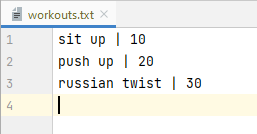                                                                                                                                                                                                                                                                                                                                                                                             |
| 2. Update data in `workouts.txt`.                                                              | `workout /update 2 40`                                                                                                                 | Workout (push up, 20 reps) is updated to 40 reps. `workouts.txt` should look something like this:<br/><br/>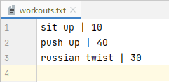                                                                                                                                                                                                                                                                                                                                 |
| 3. Write new data into `plans.txt`.                                                            | (a) `plan /new plan a  /workouts 1, 2`<br/><br/>(b) `plan /new plan b /workouts 2, 3`<br/><br/>(c) `plan /new plan c /workouts 1, 3`   | The following lines are added to `plans.txt`:<br/><br/>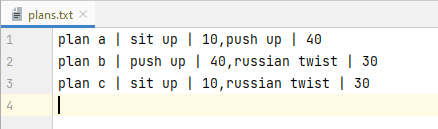                                                                                                                                                                                                                                                                                                                                                                                                               |
| 4. Write new data into `schedule.txt`.                                                         | (a) `schedule /update 1 1`<br/><br/>(b) `schedule /update 3 2`<br/><br/>(c) `schedule /update 5 3`<br/><br/>(d) `schedule /update 6 3` | The following lines are added to `schedule.txt`:<br/><br/>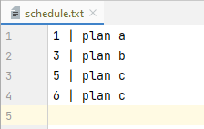                                                                                                                                                                                                                                                                                                                                                                                                       |
| 5. Delete data from `schedule.txt`.                                                            | `schedule /clear 5` | `schedule.txt` will be updated the following:<br/><br/>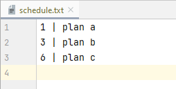                                                                                                                                                                                                                                                                                                                                                                                            |
| 6. Delete data from `plans.txt` and `schedule.txt` is updated accordingly.                     | `plans /delete 3` | `plans.txt` will be updated to the following:<br/><br/>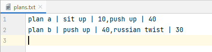<br/><br/>`schedule.txt` will also be updated as one of the days has the deleted plan:<br/><br/>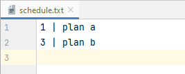                                                                                                                                                                                                                             |
| 7. Delete workout from `workouts.txt`. `plans.txt` and `schedule.txt` are updated accordingly. | `workout /delete 1` | `workout.txt` will be updated to the following:<br/><br/>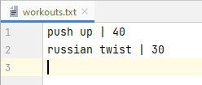<br/><br/>`plans.txt` will also be updated as some plans with the deleted workout are affected:<br/><br/>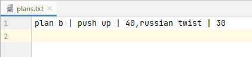<br/><br/>Likewise, `schedule.txt` is also updated as a plan assigned to a day has been affected:<br/><br/>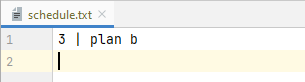 |                                    

<br>
<div class="button-container"><a class="button" href="#instructions-for-manual-testing">Back to Manual Testing Overview</a></div>
<br/>
<div class="button-container"><a class="button" href="#werkit-developer-guide">Back to Top</a></div>
