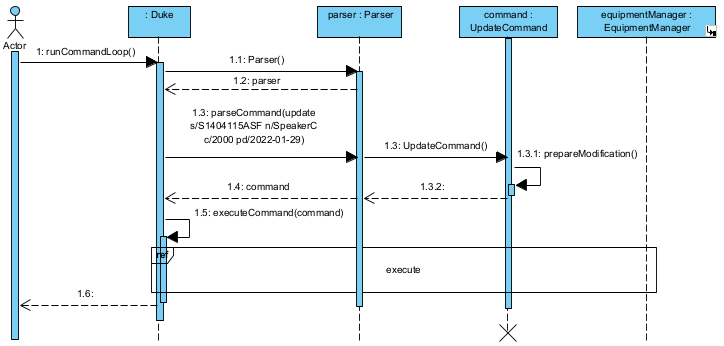

# Table of Content

- [Acknowledgements](#acknowledgements)
- [Design and Implementation](#design-and-implementation)
  - [Architecture](#architecture)
  - [Parser](#parser)
  - [Command classes](#command-classes)
  - [EquipmentManager](#equipmentmanager)
- [Product scope](#product-scope)
  - [Target user profile](#target-user-profile)
  - [Value proposition](#value-proposition)
- [User stories](#user-stories)
- [NonFunctional requirements](#nonfunctional-requirements)
- [Glossary](#glossary)
- [Instructions for manual testing](#instructions-for-manual-testing)

## Acknowledgements

Our project could not have been possible without the prior work of the following:

- [SE-EDU project team](https://se-education.org/docs/team.html) for their work on [AddressBook Level 3](https://github.com/se-edu/addressbook-level3), for which we referenced ideas as well as code snippets.
- Google's [Gson Java library](https://github.com/google/gson) for which we used to load and save our data files.
- Members of the [AY2122S2-CS2113-F10-2 team](https://github.com/nus-cs2113-AY2122S2) for pointing out the possibility of and requesting permission to make use of the above Gson library.  

--------------------------------------------------------------------------------------------------------------------
## **Design and Implementation**

### Architecture

Our design draws significant inspiration from the implementation of AddressBook Level 3 (henceforth AddressBook). 
As the program was initially conceptualised to be a text-based command-line interface, heavy consideration was given
to the design and user interactions when it came to the text input to be parsed by the user. 
As such, we referenced AddressBook to segment the program into `Parser`, `Command` and `Equipment` classes.

**Main components of the architecture**

- `Duke` is the Main class and entry-point for the program. 
- `Parser` serves as the first filter to split raw text input and pass in arguments to the `Command` for further processing.
- `Command`, together with its various subclasses serve as specific implementations to pass the arguments taken in to the various methods of the `EquipmentManager` class.
- `EquipmentManager` keeps track of actual `Equipment` instances created by our program.
- `Storage` performs File I/O functions.

### Parser

`Parser` is the first filter for text inputs read to the user. It serves to:
1. Split text input from the user into strings of argument pairs.
2. Check and modify upper/lower case for argument tags.
3. Remove backticks, beginning and trailing whitespace.
4. Create the correct instance of `Command` based on the argument tag.

As alluded to prior, one major consideration was to build it in a manner that can parse text input as effectively as possible. In considering text input, we divided the parsing into the following segments:

<!--suppress HtmlDeprecatedAttribute -->

<code>commandWord [argumentType/`argumentValue`] [...]</code>

To dispatch <code>argumentType/\`argumentValue\`</code> strings to the correct `Command` class, the following logic is employed by `Parser#parseCommand`.

#### 1. Parse the command word

<code>commandWord</code>

`Parser#splitCommandTerm` splits the input string upon the first space. 
The first substring is used to decide which `Command` to dispatch while the second is used for its arguments.
In the case where a second substring is not required, as in the case of `help` and `list`, a null String is used and the following step is skipped entirely.

####2. Split arguments

<code>[argumentType/`argumentValue`] [...]</code>

Complex commands such as `add` and `update` necessitate multiple arguments.
To implement this while ensuring that multi-word strings are acceptable input, `extractArguments` is implemented.

The main regular expression ([details here](https://regex101.com/r/dMwMWw/3)) sought to match `argumentType` and <code>argumentValue</code> pairs with a positive lookahead. 
The final argument pair will then be extracted using a separate regex. 
Together, this ensured that all argument pairs can be effectively parsed and dispatched to each `Command` class.

<b>Special <code>delete</code> implementation</b>

For added safeguards in equipment deletion, the delete command implements a more stringent regex to match one argument pair of <code>s/\`SERIAL_NUMBER\`</code>.  

Throughout the `Parser` implementation, exceptions were caught to return `IncorrectCommand` classes that can be used to pass error messages to the user. These will be discussed in the following segments.

### Command classes

`Command` classes are largely similar to each other. Taking in input Strings from `Parser`, they invoke methods from `EquipmentManager` to perform the necessary actions. Where applicable, the `Command` classes also convert values to the necessary data types (Double, EquipmentType and LocalDate) prior to passing these values in.

The most complex command, `UpdateCommand` will be explained here as the method calls are similar to the remaining commands. The update feature is facilitated by `UpdateCommand`. It extends `ModificationCommand` and implements the following operations:

* `UpdateCommand#generateUpdatePairs()` — Generates pairs of attributes and their update values.
* `UpdateCommand#generateUpdateString()` — Generates String with details of the update executed.

Given below is an example usage scenario and how the update feature behaves at each step.

#### Step 1 
The user adds an equipment to the system with the help of the `add` command. The added equipment has the following attributes shown below.

#### Step 2
The user executes `update s/S1404115ASF n/SpeakerC c/2000 pd/2022-01-29` to update equipment with serial number S1404115ASF. `Parser#parseCommand` is called from `Duke` to parse the user's input.

#### Step 3
The parser recognises that an `UpdateCommand` is required, and the UpdateCommand is prepared to return to `Duke`. In the constructor of `UpdateCommand`, `UpdateCommand#prepareModification` is called to set the values of the attributes to be updated. The other attributes are set to null by default.

#### Step 4
`UpdateCommand#execute` is run to process the update. If the serialNumber attribute is null, a `CommandResult` with a `MISSING_SERIAL_NUMBER` output string will be returned. Otherwise, `EquipmentManager#updateEquipment` is called.

#### Step 5
If the update was successful, a `CommandResult` with success message will be returned, else a `CommandResult` with `UPDATE_FAILURE_MESSAGE` will be returned. Upon successful update, the object should be updated with the new attributes as shown in the diagram below.

#### Step 6
It is not shown in the sequence diagram but ultimately when the CommandResult is returned to `Duke`, the output of the `CommandResult` gets printed out and displayed to the user.

### EquipmentManager

The `EquipmentManager`, as the name suggests, manages all the equipment that the user has.
When initialised, it creates a HashMap called `equipmentList` which is used to save the equipment with their serial numbers as their keys.
The `EquipmentManager` has several methods which allow manipulation to said HashMap such as `addEquipment`, `checkEquipment`, `listEquipment`, `updateEquipment`, and `deleteEquipment`.
These methods are used during the execution of each of the `Command` class.
* `addEquipment` — Adds an `Equipment` to the `equipmentList`.
* `checkEquipment` — Returns the `Equipment` in `equipmentList` that has the given `itemName`.
* `listEquipment` — Returns an ArrayList of all the `Equipment` in `equipmentList`.
* `updateEquipment` — Updates the specified `Equipment` with the corresponding updates given in the ArrayList of pairs.
* `deleteEquipment` — Deletes the specified `Equipment`.

The `EquipmentManager` is implemented as the main storage unit of all `Equipment` during the execution of the program.

### Storage

The `Storage` class is used to store the data of the program. It utilises the Gson library to serialise and deserialise the data.
There is also a LocalDateAdapter class which is used to convert the LocalDate objects to YYYY-MM-DD format.

#### 1. `saveData` method

The `saveData` method is used to save the Equipments added to the `equipment.json` file.
The method will automatically create the file if it does not exist.
While saving the data, the `Equipment` objects in `equipmentList` is converted to a JSON string and saved to the file.
During the execution of the program, the `equipment.json` file will be updated with the latest data after every 5 commands.
Alternatively, the user can manually save the data by calling the `save` command.

#### 2. `loadData` method

The `loadData` method is used to load the data from the `equipment.json` file.
The method is able to handle the cases where:

* The file does not exist.
* The file is empty.
* The data in the file is not in the correct format.
* There are more than one `Equipment` object with the same serial number.

While loading the data, the `equipment.json` file is read and the data is converted from a JSON string to an ArrayList of `Equipment` objects.
The ArrayList of `Equipment` objects is then added to the `equipmentList` HashMap.

--------------------------------------------------------------------------------------------------------------------
## Product scope
### Target user profile

The target user is the logistics chief of an event support club. He is responsible for the logistics of the club and the equipment that is used during events. 

### Value proposition

Equipment for the club differ in terms of shape and size. Owing to the climate-sensitive and fragile nature of some of these equipment, they are often stored in opaque containers, which may not be easily accessible or quickly identifiable given space constraints. By keeping records of this information on our application, the logistics chief can easily access and retrieve this information without having to make a physical trip down to the storeroom.

Further, maintaining a record of the equipment is a time-consuming task given that they often need to be referred to by both the serial number and a common name (short alias) used by club members. As the post of logistics chief is changed every year when passed down to a new member, this member will need to be acquainted with both the common name and the serial number of the relevant equipment. Our application thus provides a convenient way to search by both specifications. In fact, additional information such as the vendor, purchased date, equipment type, and the cost of the equipment is also stored and searchable.

--------------------------------------------------------------------------------------------------------------------
## User Stories

| Version | As a ...                              | I want to ...                                                  | So that I can ...                                                    |
|---------|---------------------------------------|----------------------------------------------------------------|----------------------------------------------------------------------|
| v1.0    | new user                              | list all equipment                                             | see all current equipment in the application                         |
| v1.0    | conscientious logs chief              | add equipment                                                  | newly purchased equipment can be kept up to date                     |
| v2.0    | new user                              | see usage instructions                                         | refer to them when I forget how to use the application               |
| v2.0    | meticulous logs chief                 | update equipment                                               | correct any errors in previously recorded equipment                  |
| v2.0    | conscientious logs chief              | save the state of the equipment list                           | come back to a saved version of my work later on                     |
| v2.0    | conscientious logs chief              | delete equipment                                               | remove decommissioned equipment from the application                 |
| v2.1    | forgetful logs chief                  | search for equipment                                           | be able to find equipment by its attributes                          |
| v3.0    | forward-planning logs chief           | filter equipment by date and cost range                        | conduct more regular checks on expensive or old equipment            |
| v3.0    | busy logs chief                       | mark equipment to be faulty/working                            | filter and send the faulty ones for repair                           |
| v3.0    | forgetful logs chief                  | add comments to equipment                                      | take note of any other information relating to my equipment          |
| v3.0    | logs chief supporting multiple events | ensure that equipment can be earmarked for an associated event | my equipment will not be double-booked and have scheduling conflicts |

--------------------------------------------------------------------------------------------------------------------
## NonFunctional Requirements

1. Spaces should be permitted as a delimiter for equipment attributes of type String, e.g. equipment name, vendor name.
2. Equipment name need not be unique as there may be multiple equipment with the same name.
3. Serial number should be unique and case-insensitive.

--------------------------------------------------------------------------------------------------------------------
## Glossary

* *Equipment* - Each entity that is being stored/manipulated in the application
* *Inventory* - Refers to the whole of the Equipment stored in the application
* *Command Word* - First word keyed preceding any subsequent arguments to indicate a command to the application
* *Argument Pair/Type/Value* - Refers to a pair of words keyed following a command word, indicating a type of attribute to be updated and its value
* *`Command`* - Keywords that users use to tell the application to perform certain actions
* *`CommandResult`* - Results that are produced from the execution of Commands.

--------------------------------------------------------------------------------------------------------------------
## Instructions for manual testing

### Launch and exit
1. Initial launch
   1. Ensure that you have Java 11 or above installed.
   2. Download the latest version of `EquipmentManager` jar file from [here](https://github.com/AY2122S2-CS2113-F12-2/tp/releases) and copy into an empty folder.
   3. Launch command line and change into the directory jar file is saved.
   4. Run java -jar tp.jar. 
   Expected: application starts with greeting message.
2. Exit application
   1. Enter `bye` into command line. 
      Expected: application exits.

### Help
1. Help
   1. Test case: `help` 
      Expected: List of commands usage examples is shown.

### Adding equipment
1. Adding equipment to inventory
   1. Test case: ``add n/`SpeakerB` s/`S1404115ASF` t/`Speaker` c/`1000` pf/`Loud_Technologies` pd/`2022-02-23` ``
   
      Expected: Equipment successfully added.
   2. Test case: ``add n/`SpeakerB` s/`S1404115ASF` c/`1000` pf/`Loud_Technologies` pd/`2022-02-23` ``

      Expected: Unable to add equipment with missing attributes.
   3. Test case: ``add n/`SpeakerB` s/`S1404115ASF` t/`something` c/`1000` pf/`Loud_Technologies` pd/`2022-02-23` ``

      Expected: Unable to add equipment, Equipment Type has to be `MICROPHONE`, `SPEAKER`, `STAND` or `CABLE`.
   4. Test case: ``add n/`SpeakerB` s/`S1404115ASF` t/`something` c/`1000` pf/`Loud_Technologies` pd/`2123928` ``

      Expected: Unable to add equipment, date must be in YYYY-MM-DD format.
2. Adding equipment with duplicate serial number to inventory
   1. Prerequisites: There is already equipment in the inventory, for example the one added above.
   2. Test case: ``add n/`SpeakerB` s/`S1404115ASF` t/`Speaker` c/`1000` pf/`Loud_Technologies` pd/`2022-02-23` ``

      Expected: Unable to add equipment with duplicate serial number.
   
### Updating equipment
1. Updating equipment in inventory
   1. Prerequisite: There is already equipment present in the inventory.
   2. Test case: ``update s/`S1404115ASF` n/`SpeakerC` c/`2510` pd/`2022-08-21` ``

      Expected: Equipment details updated with the specified values
   3. Test case: ``update s/`S1404115ASF` c/`2510` rand/`SpeakerC` pd/`2022-08-21` ``

      Expected: Update unsuccessful due to unrecognised tag.

### Checking equipment
1. Checking for equipment matching to a specified attribute value
   1. Prerequisite: There is already equipment present in the inventory.
   2. Test case: ``check n/`Mic` ``

      Expected: List of equipment with name containing `Mic`.
   3. Test case: ``check c/`700` ``

      Expected: List of equipment with cost of `700`.
   4. Test case: ``check pf/`Tech` ``

      Expected: List of equipment purchased from supplier with name containing `Tech`.
   5. Test case: ``check pd/`2022-01-27` ``

      Expected: List of equipment purchased on `2022-01-27`.
   6. Test case: ``check t/`SPEAKER` ``

      Expected: List of equipment of type `SPEAKER`.
2. Checking for equipment, but using wrong input format
   1. Prerequisite: There is already equipment present in the inventory.
   2. Test case: ``check c/`hello` ``

      Expected: Error in displaying equipment, specified cost needs to be able to be parsed to double.
   3. Test case: ``check t/`BLA` ``

      Expected: Error in displaying equipment, specified type has to be `MICROPHONE`, `SPEAKER`, `STAND` or `CABLE`.
   4. Test case: ``check pd/`2022` ``

      Expected: Error in displaying equipment, specified date needs to follow `YYYY-MM-DD` format.

### Listing equipment
1. Listing all equipment available in inventory
   1. Test case: `list`

      Expected: List of all equipment. 

### Saving
1. Manual saving of application state
   1. Test case: `save`

      Expected: Successfully saved.
2. Auto saving of application state
   1. Prerequisite: Application state automatically saved after every 5 commands issued.
   2. Test case: Execution of any 5 commands

      Expected: Application auto saved.