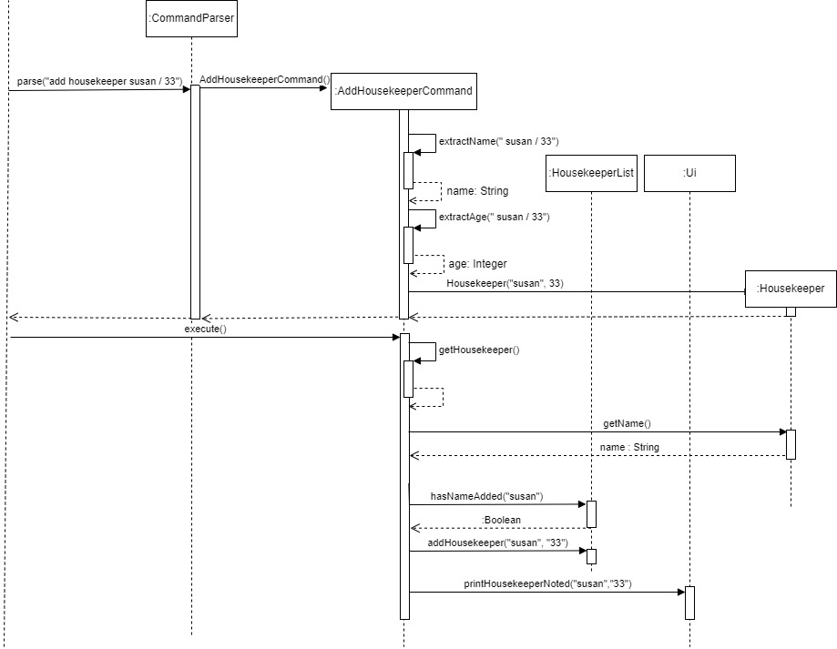

# Developer Guide

## Acknowledgements

{list here sources of all reused/adapted ideas, code, documentation, and third-party libraries -- include links to the original source as well}

## Design & implementation

## Design

### Add Housekeeper Command

The objective of the `AddHousekeeperCommand` is to take in user input and spilt it into two parts which is the name and age of a Housekeeper. These details make up parts of the Housekeeper profile. With the name and age derived, this information will be added into a new Housekeeper object, which will be recorded into the list of housekeeper. The class diagram below depicts how the `AddHousekeeperCommand` interacts with other classes.

Below is an example showing the usage of `AddHousekeeperCommand`.
1. Command given from the user: `add housekeeper susan / 33`. This command meant to add a new housekeeper called susan who is 33 years old.
2. The parse method from `CommandParser` will run parse to create `AddHousekeeperCommand` and would be return to Duke.
3. The execute method in `AddHousekeeperCommand` will be performed. It first checks with the housekeeperList if the name of the housekeeper to be added has been recorded into the list. If it has not been recorded, housekeeperList would then add this new user into the records. Ui will be called to print a confirmation to show that the housekeeper has been entered into the list.
5. If housekeeper exist, the housekeeper profile would not be added into the list.

#### Add Item Command
The objective of the AddItemCommand is to allow the user to add a new item to the list of items found within the inventory. It takes in the user input and spilt it up into two parts which are the name of the item to be added and its pax. These two information would then be used to create an Item Object and the Item Object would be saved into a list of items.

Below is the partial class diagram detailing the design of the Add Item Command Class as well as its interactions with the various other classes required to execute the Add Item Command.

- Step 1: When the user enters the command `Add Item Toilet Roll / 15`, the `Duke` class would pass the user input to the `Command Parser` Class.
- Step 2: The `Command Parser` Class would run the `parse` method and create an `AddItemCommand` object containing and `Item` object which is made up of the name of the item to add as well as its pax which are found within the user input.
- Step 3: The `AddItemCommand` class would be passed back to the `Duke` class.
- Step 4: The `execute` method of the `AddItemCommand` class would be run and the the `ItemList` Object would be called and the `AddItemCommand` object would pass its Item object to the `ItemList` Object's `addItemToList` method.
- Step 5: The addItemToList method would then add the `Item` object to its ArrayList of `Items` called listOfItems.
- Step 6: The `AddItemCommand` then call the `UI` and execute the `UI`'s `printAddItemAcknowledgementMessage` method which would print an acknowledgement message to the user informing him that the item has been added into the item list.

## Implementation

#### Assign a housekeeper to a room
The assignment of housekeeper to a room is facilitated by `AssignHousekeeperCommand`. This command objects uses `AssignmentMap`, which keeps a `HashMap`, to help us map a `Room` object to a `Housekeeper` object. 

``
Map<Room, Housekeeper> map = new HashMap<>();
``

The following steps exhibit how `AssignHousekeeperCommand` 
and `AssignmentMap` fit together in the structure and how the mechanism for adding an assinment behaves at each step.

__Step 1.__ The user launches the application. In the `Duke` class, an empty instance of the `AssignmentMap` class,
called `assignmentMap`, is created.

__Step 2.__ The user types the command `Assign Susan ## 301`. In the `Duke` class, a `Command` object
is created by invoking the `CommandParser` class's constructor on the user input. The details of this
step are further described below.

__Step 3.__ The `CommandParser` class replaces the `Assign Susan ## 301` in the user input with an empty string,
leaving just `Susan ## 301`. Then, an instance of `AssignHousekeeperCommand` is created which extends the class `Command`.

__Step 4.__ The `assignHousekeeperCommand` object parses the name of the housekeeper and the ID of the room and send both to the the `assignmentMap`.

__Step 5.__ The `assignmentMap` looks for the appropriate `Room` object for `301` in the `RoomList` and then looks for the appropriate `Housekeeper` object for `Susan`. It then adds both to the hashmap contained inside itself.

__Interaction__ To understand the interaction between objects of these classes in order to actually add an entry into the hash map inside an `AssignmentMap`, refer to the sequence diagram below.

The command object passes on the ID of the room and the name of the housekeeper to the `AssignmentMap` object after parsing the input appropriately. The `addAssignment` function first locates the appropriate `Room` object from `RoomList`, and then looks for the `Housekeeper` object in the `HousekeeperList` and finally adds the mapping to the hash map.

#### Adding a customer's satisfaction rating

The mechanism for adding a customer satisfaction (represented by the Satisfaction class) is facilitated
by `AddSatisfactionCommand`. The constructor parses user input to create a `Satisfaction` object (which contains
attributes storing the customer's name and their satisfaction rating, represented as an integer from 1 to 5).
`AddSatisfactionCommand` extends `Command` and contains an override of the `Command` class's execute method.
This execute method adds the `Satisfaction` object created from parsing user command into `satisfactionList`, the
object of type `SatisfactionList` that stores the `Satisfaction` objects. Additionally, it implements the
following operations:
* `AddSatisfactionCommand#extractCustomerName(String userInput)`: Extracts the customer's name (a string) from the
  provided string of user input.
* `AddSatisfactionCommand#extractSatisfactionValue(String userInput)`: Extracts the customer's satisfaction rating
  (an integer from 1 to 5) from the provided string of user input.
* `AddSatisfactionCommand#getSatisfaction()`: Grabs the value of the `satisfaction` instance variable.
* `AddSatisfactionCommand#setSatisfaction(Satisfaction satisfaction)`: Sets the `satisfaction` instance variable to the
  provided `Satisfaction` object.

Given below is an example usage scenario and how the mechanism for adding a satisfaction behaves at each step.

Step 1. The user launches the application. In the `Duke` class, an empty instance of the `SatisfactionList` class,
called `satisfactionList`, is created.

Step 2. The user types the command `add satisfaction Bob 5`. In the `Duke` class, a `Command` object
is created by invoking the `CommandParser` class's constructor on the user input. The details of this
step are further described below.

Step 3. The `CommandParser` class replaces the `add satisfaction` in the user input with an empty string,
leaving just `Bob 5`. Then, the `AddSatisfactionCommand` class's constructor is invoked with `Bob 5`.

Step 4. The `AddSatisfactionCommand` class's constructor parses `Bob 5`, extracting the customer name `Bob` using the
`AddSatisfactionCommand#extractCustomerName(String userInput)` method and extracting the customer satisfaction rating
`5`using the `AddSatisfactionCommand#extractSatisfactionValue(String userInput)` method. The `AddSatisfactionCommand`
class constructor then invokes the `Satisfaction` class's constructor to create a new `Satisfaction` object, passing in
customer name `Bob` and satisfaction rating `5`.

Step 5. When the `AddSatisfactionCommand` object is executed in the `Duke` class, the `Satisfaction` object
created in the `AddSatisfactionCommand` class is added to `satisfactionList`.

The following sequence diagram shows what would happen if the user typed `add satisfaction Bob 5`.

PLEASE NOTE: Due to the limitation of PlantUML, the lengths of the activation bars may not be correct, and
certain return values from method calls that could not be placed correctly were omitted. For example, the
instantiation of objects of type `SatisfactionList`, `CommandParser`, `Command`, `AddSatisfactionCommand`,
and `Satisfaction` should have return value arrows (representing the object that was instantiated) to the
entity that created those instances, but those are not indicated in the diagram. Furthermore, for neatness, the
`User` entity should be the left-most entity, but that could not be formatted properly in the diagram.

### Add Housekeeper feature

The add housekeeper mechanism is facilitated by `AddHousekeeperCommand`. It extends command. Additionally, it implements the following operations:
* `AddHousekeeperCommand#extractDetails()`— Stores the name and age of the new Housekeeper
* `AddHousekeeperCommand#extractName()`— Derive the name of the Housekeeper
* `AddHousekeeperCommand#extractAge()`— Derive the age of Housekeeper and cast it into an integer
* `AddHousekeeperCommand#execute()` — Executes the addition of new housekeeper into list

Given below is an example usage scenario of how AddHousekeeperCommand behaves at each step.

Step 1: User launches the application for the first time. The list of housekeeper in records is empty.

Step 2: User give an add housekeeper command `add housekeeper sally / 40`. The input will be split by the delimiter `/` to derive `sally` and `40`. The `CommandParser` runs parse which will return a new `AddHousekeeperCommand`.

Step 3: `AddHousekeeperCommand#extractDetails()` will call `AddHousekeeperCommand#extractName()` and `AddHousekeeperCommand#extractAge()` to derive `sally` and `40`.

Step 4: The `AddHousekeeperCommand` will now contain `sally` and `40`.

Step 5: The execute method will derive the housekeeper name, `susan` which would call `HousekeeperList#hasNameAdded()` to verify if name has been recorded. If name is not in records, `HousekeeperList#addHousekeeper()` would be called to add the housekeeper, `sally` and `40` into the housekeeperList.

#### Add Item Command
The add item to a list of items in the invetory mechanism is facilated by 'AddItemCommand'. It extends 'Command' and implements the following operations:
- `AddItemCommand#extractItemName` - Extracts the name of the item to add from the user input.
- `AddItemCommand#extractPax` - Extracts the pax of the item to add from the user input.
- `AddItemCommand#execute` - Adds the item into the list of items.
- `AddItemCommand#getItem` - Extracts the item saved within the AddItemCommand object.

The sequence diagram above showcases an example usage scenario of the Add Item Command and how the Add Item mechanisms behaves at each step:
- Step 1: The user executes the `Add Item Toilet Roll / 15` command to add a new item which is `Toilet Roll` that has a pax of `15` into the inventory. `CommandParser#parse` is called and the user input `Add Item Toilet Roll /15` is passed to it.
- Step 2: `CommandParser#parse` would identify the user input as an Add Item Command by searching for the keyword `Add Item` within the user input. It would then remove `Add Item` from the user input causing the user input to be just `Toilet Roll / 15`. `CommandParser#parse` would then call the constructor of `AddItemCommand` and pass it `Toilet Roll / 15`.
- Step 3: The constructor of `AddItemCommand` would call `AddItemCommand#extractItemName` and `AddItemCommand#extractPax` respectively to extract out `Toilet Roll` and `15`. The constructor of `AddItemCommand` would then call the constructor of `Item` which would create an `Item` object containing `Toilet Roll` and `15`. The `Item` object would then be returned to the constructor of `AddItemCommand`.  An `AddItemCommand` object with the `Item` object would be created and passed back to `CommandParser#parse`.
- Step 4: `CommandParser#parse` would then call `AddItemCommand#execute` which would call `AddItemCommand#getItem` to extract out the item currently saved within the `AddItemCommand` object.
- Step 5: `AddItemCommand#execute` would then call `ItemList#addItemToList` and pass it the item object.This results in the `Item` object being added into the `ItemList`.
- Step 6: `AddItemCommand#execute` would then call `Ui#printAddItemAcknowledgementMessage` which would print out an acknowledgement message informing the user that the item has been succesfully added into the item list.

## Product scope
### Target user profile

{Describe the target user profile}

### Value proposition

{Describe the value proposition: what problem does it solve?}

## User Stories

|Version| As a ... | I want to ... | So that I can ...|
|--------|----------|---------------|------------------|
|v1.0|new user|see usage instructions|refer to them when I forget how to use the application|
|v2.0|user|find a to-do item by name|locate a to-do without having to go through the entire list|

## Non-Functional Requirements

{Give non-functional requirements}

## Glossary

* *glossary item* - Definition

## Instructions for manual testing

{Give instructions on how to do a manual product testing e.g., how to load sample data to be used for testing}
