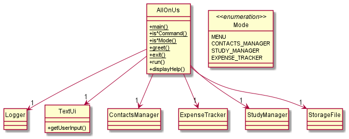

# Developer Guide

## Acknowledgements

{list here sources of all reused/adapted ideas, code, documentation, and third-party libraries -- include links to the original source as well}

## Design & implementation

{Describe the design and implementation of the product. Use UML diagrams and short code snippets where applicable.}

## Product scope
### Target user profile

{Describe the target user profile}

### Value proposition

{Describe the value proposition: what problem does it solve?}

## User Stories

|Version| As a ... | I want to ... | So that I can ...|
|--------|----------|---------------|------------------|
|v1.0|new user|see usage instructions|refer to them when I forget how to use the application|
|v2.0|user|find a to-do item by name|locate a to-do without having to go through the entire list|

### Main Menu
This section describes the implementation of core main menu features.

**API:** `AllOnUs.java`

The menu is accessed through a call to static method main() of the AllOnUs class. 
The Class Diagram below shows the overall structure of the application from the menu's point of view.
The AllOnUs class and other classes that are coupled to the menu are therefore included.

Note: Exception classes are left out of this diagram that aims to show the core structure of the application. is*Command()
method here refers to all methods of this form (more on this will be elaborated later in detail). 

As illustrated in the Class Diagram above, the AllOnUs class only associates to one of each of the other classes.
These classes are, namely, the ContactsManager class which manages the contacts section of the application, 
the StudyManager class which manages the module and timetable part of the application, the ExpenseTracker class
which manages the expenses section of the application, the Logger class which helps with logging information about the 
state of the programme when it is running and the TextUi class which handles user input from command line.

Now we will look at the sequence of operations that take place upon a call to method main() of the AllOnUs class. 
Below is a sequence diagram that shows the core interactions between associated classes and objects in the execution 
and runtime of the programme.

As illustrated in the diagram, once main() method of AllOnUs is called, a new unnamed :AllOnUs object is created 
for which we execute the non-static method run(), which contains a loop for sustained interaction with the user
(command line). Objects for the ContactsManager (contactsManager), StudyManager (studyManager) and ExpenseTracker (expenseTracker)
classes are also created, where Logger (logger) and TextUi (ui) objects are already contained in the fields of the 
:AllOnUs object. 

In the loop, run() method calls the getUserInput() method, which belongs to ui, and then checks the returned string for 
whether it is a command to enter a particular section, to get help, to exit the application or is an empty or unrecognizable 
command. 

Command to enter a particular section: 
The returned string from getUserInput() call becomes a parameter for a function call to static method is*Command(), which
belongs to the AllOnUs class, and the is*Command() method is of the form isStudyManagerCommand(), isContactsManagerCommand(),
isExpenseTrackerCommand(), which are called in a certain sequence. For instance, when isStudyManagerCommand() is called with
the string parameter and the string indeed contains a command to enter the study manager section, then the method returns true,
else false. If true is returned, we call the studyManagerRunner() method of the studyManager object. The studyManagerRunner() method
will carry out what it needs to and then eventually return to the run() method of the :AllOnUs object. If false is returned, we proceed 
to the next check on the string. This is also how the other commands and methods of the same form work. 

Command for help section:
If the isHelpCommand() method returns true on the string representing user input, the displayHelp() static method is called (in AllOnUs class)
which displays the help section to the user and then returns to the run() method of :AllOnUs object.

Empty of unrecognized command:
When the returned string is empty, we simply continue to the next iteration of the loop. This is essentially similar to a "pass" statement
as when the user does not input anything, the application silently waits for the user to input something into the command line. 
When there is an unrecognized command, the application prompts the user through a function call to a static method printInvalidMainMenuCommandMessage()
(belongs to AllOnUs class and not included in the diagrams above) to enter a known command and suggests referring to the help section.

Exit command:
If the isExitCommand() method returns true on the string representing user input, the loop breaks, and control is returned to the static main()
method of the AllOnUs class, which then calls the static exit method in the same class to print a termination message, and then finally control
is returned to the OS. 

### Modules

### Expenses

### Contacts

## Non-Functional Requirements

{Give non-functional requirements}

## Glossary

* *glossary item* - Definition

## Instructions for manual testing

{Give instructions on how to do a manual product testing e.g., how to load sample data to be used for testing}
