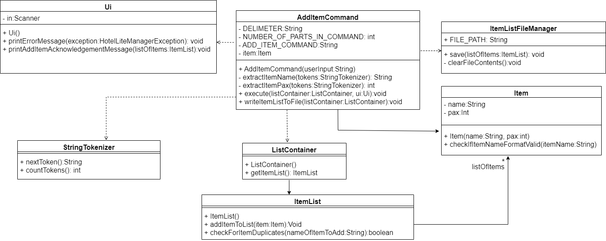
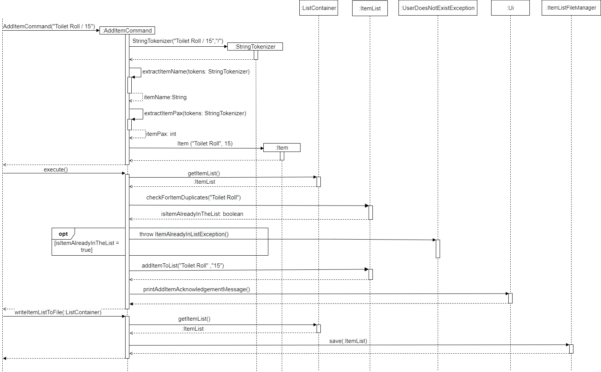
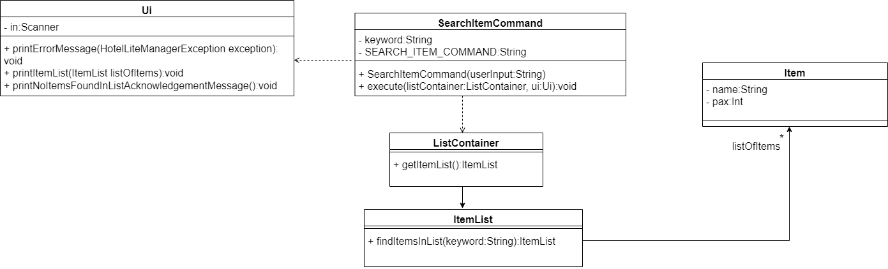
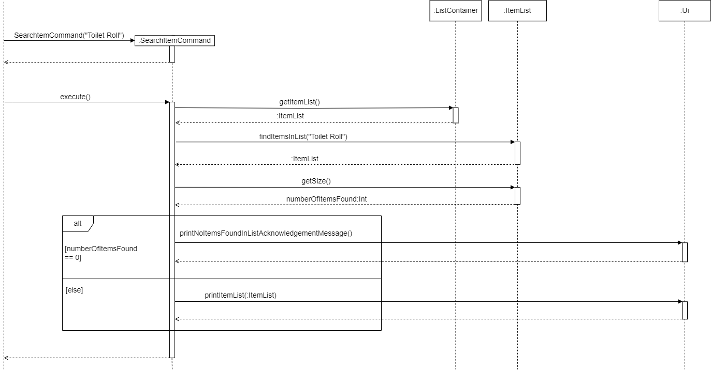
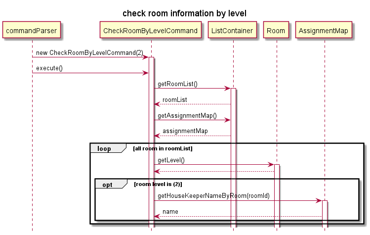

# Developer Guide
- [Architecture](#architecture)
- [Design and Implementation](#design-and-implementation)
  - [Design](#design)
    - [Logical Component](#logical-component)
  - [Implementation](#implementation)
    - [Assign a housekeeper to a room](#assign-a-housekeeper-to-a-room)
    - [Adding a customer's satisfaction rating](#adding-a-customers-satisfaction-rating)
    - [Add Housekeeper feature](#add-housekeeper-feature)
    - [Delete Housekeeper feature](#delete-housekeeper-feature)
    - [Item Related Commands](#item-related-commands)
    - [Check room information by level](#check-room-information-by-level)
- [Product Scope](#product-scope)
  - [Target user profile](#target-user-profile)
  - [Value proposition](#value-proposition)
- [User Stories](#user-stories)
- [Non-Functional Requirements](#non-functional-requirements)
- [Instructions for manual testing](#instructions-for-manual-testing)
- [Glossary](#glossary)

## Architecture
## Design & implementation

## Design

### Logical Component

### Add Housekeeper Command

The objective of the `AddHousekeeperCommand` is to take in user input and spilt it into two parts which is the name and 
age of a Housekeeper. These details make up parts of the Housekeeper profile. With the name and age derived, 
this information will be added into a new Housekeeper object, which will be recorded into the list of 
housekeeper. The class diagram below depicts how the `AddHousekeeperCommand` interacts with other classes.

PLEASE NOTE: This class diagram omits the details of some classes involved, like the `Duke`, `CommandParser` and `Command` class.
It also omits some unused methods.

Below is an example showing the usage of `AddHousekeeperCommand`.

Step 1: Command given from the user: `add housekeeper susan / 33`. This command meant to add a new housekeeper called susan who is 33 years old.

Step 2: The parse method from `CommandParser` will run parse to create `AddHousekeeperCommand` and would be return to Duke.

Step 3: The execute method in `AddHousekeeperCommand` will be performed. It would get the `housekeeperList` from `ListContainer`.

Step 4: The `addHousekeeperInList` method from `HousekeeperList` would be called to check if the housekeeper has been recorded.
name of the housekeeper to be added has been recorded into the list. 

Step 5: `addHousekeeperInList` will verify if housekeeper name is in the list by calling `hasNameAdded` and stores the 
result in boolean.
If it has not been recorded, housekeeperList would then add this new user into the records by calling `addHousekeeper`
method. 

Step 6: `printHousekeeperNoted` will be called to print a confirmation to show that the housekeeper 
has been entered into the list.

Step 7. Housekeeper file storing all profile will be updated by calling `writeHousekeeperToFile` method.
This method will then call method `save` from `HousekeeperFileManager`.

### Delete Housekeeper Command

The objective of the `DeleteHousekeeperCommand` is to take in the housekeeper's name to be deleted from the list. The 
housekeeper's profile would be completely removed from records in the `housekeeperList`. The class diagram below depicts how the `DeleteHousekeeperCommand` interacts with other classes.

PLEASE NOTE: This class diagram omits the details of some classes involved, like the `Duke`, `CommandParser` and `Command` class.
It also omits unused methods.

Below is an example showing the usage of `DeleteHousekeeperCommand`.

Step 1: Command given from the user: `delete housekeeper susan`. This command meant to delete housekeeper called susan.

Step 2: The parse method from `CommandParser` will run parse to create `DeleteHousekeeperCommand` and would be return to Duke.

Step 3: The execute method in `DeleteHousekeeperCommand` will be performed. It would get the `housekeeperList` from `ListContainer`.

Step 4: The `removeHousekeeperInList` method from `HousekeeperList` would be called to check if the housekeeper's name
is in the `housekeeperList`.

Step 5: `removeHousekeeperInList` will call `getHousekeeperRemove` method which will derive the index of the housekeeper
recorded in the list. It would return an integer. Assume housekeeper `susan` is recorded in the list and is in index `0`
of the list.

Step 6: With the index given, method `removeHousekeeper` will be called to remove housekeeper profile from the list.

Step 7: User will then be able to see a message notifying them that the housekeeper `susan` has been deleted and the total
number of housekeeper currently in working in the hotel.

Step 8: To update the current `housekeeperList` into housekeeper file, `writeHousekeeperToFile` method will be call in which
it calls `save` method from `HousekeeperFileManager` to reload housekeeper's information into the housekeeper file.

Below is the partial class diagram detailing the design of the Add Item Command Class as well as its interactions with 
the various other classes required to execute the Add Item Command.

PLEASE NOTE: This class diagram omits the details of some classes involved, like the Duke, CommandParser and Command class

### Delete Item Command

## Implementation

### Assign a housekeeper to a room
The assignment of housekeeper to a room is facilitated by `AssignHousekeeperCommand`. This command objects uses `AssignmentMap`, which keeps a `HashMap`, to help us map a `Room` object to a `Housekeeper` object. 

``
Map<Room, Housekeeper> map = new HashMap<>();
``

The following steps exhibit how `AssignHousekeeperCommand` 
and `AssignmentMap` fit together in the structure and how the mechanism for adding an assingment behaves at each step.

__Step 1.__ The user launches the application. In the `Duke` class, an empty instance of the `AssignmentMap` class,
called `assignmentMap`, is created.

__Step 2.__ The user types the command `Assign susan / 301`. In the `Duke` class, a `Command` object
is created by invoking the `CommandParser` class's constructor on the user input. The details of this
step are further described below.

__Step 3.__ The `CommandParser` class replaces the `assign susan / 301` in the user input with an empty string,
leaving just `susan / 301`. Then, an instance of `AssignHousekeeperCommand` is created which extends the class `Command`.

__Step 4.__ The `assignHousekeeperCommand` object parses the name of the housekeeper and the ID of the room and send both to the the `assignmentMap`.

__Step 5.__ The `assignmentMap` looks for the appropriate `Room` object for `301` in the `RoomList` and then looks for the appropriate `Housekeeper` object for `Susan`. It then adds both to the hashmap contained inside itself.

__Interaction__ To understand the interaction between objects of these classes in order to actually add an entry into the hash map inside an `AssignmentMap`, refer to the sequence diagram below.

The command object passes on the ID of the room and the name of the housekeeper to the `AssignmentMap` object after parsing the input appropriately. The `addAssignment` function first locates the appropriate `Room` object from `RoomList`, and then looks for the `Housekeeper` object in the `HousekeeperList` and finally adds the mapping to the hash map.

### Adding a customer's satisfaction rating

The mechanism for adding a customer satisfaction (represented by the Satisfaction class) is facilitated
by `AddSatisfactionCommand`. The constructor parses user input to create a `Satisfaction` object (which contains
attributes storing the customer's name and their satisfaction rating, represented as an integer from 1 to 5).
`AddSatisfactionCommand` extends `Command` and contains an override of the `Command` class's execute method.
This execute method adds the `Satisfaction` object created from parsing user command into `satisfactionList`, the
object of type `SatisfactionList` that stores the `Satisfaction` objects. This `SatisfactionList` is 
stored in a `ListContainer` object (the object that stores references to all of the data structures
that the application uses). Additionally, it implements the following operations:
* `AddSatisfactionCommand#extractCustomerName(String userInput)`: Extracts the customer's name (a string) from the
  provided string of user input.
* `AddSatisfactionCommand#extractSatisfactionValue(String userInput)`: Extracts the customer's satisfaction rating
  (an integer from 1 to 5) from the provided string of user input.
* `AddSatisfactionCommand#getSatisfaction()`: Grabs the value of the `satisfaction` instance variable.
* `AddSatisfactionCommand#setSatisfaction(Satisfaction satisfaction)`: Sets the `satisfaction` instance variable to the
  provided `Satisfaction` object.

Given below is an example usage scenario and how the mechanism for adding a satisfaction behaves at each step.

Step 1. The user launches the application. In the `Duke` class, a `ListContainer` object is instantiated. 

Step 2. The user types the command `add satisfaction bob 5`. In the `Duke` class, a `Command` object
is created by invoking the `CommandParser` class's constructor on the user input. The details of this
step are further described below.

Step 3. The `CommandParser` class replaces the `add satisfaction` in the user input with an empty string,
leaving just `bob 5`. Then, the `AddSatisfactionCommand` class's constructor is invoked with `bob 5`.

Step 4. The `AddSatisfactionCommand` class's constructor parses `bob 5`, extracting the customer name `Bob` using the
`AddSatisfactionCommand#extractCustomerName(String userInput)` method and extracting the customer satisfaction rating
`5`using the `AddSatisfactionCommand#extractSatisfactionValue(String userInput)` method. The `AddSatisfactionCommand`
class constructor then invokes the `Satisfaction` class's constructor to create a new `Satisfaction` object, passing in
customer name `bob` and satisfaction rating `5`.

Step 5. When the `AddSatisfactionCommand` object is executed in the `Duke` class, the `satisfactionList` object is 
obtained from the `ListContainer` object. Then, the `satisfaction` is added to the `satisfactionList`. 

The following sequence diagram shows what would happen if the user typed `add satisfaction bob 5`.

PLEASE NOTE: This sequence diagram omits the details of some behavior and classes involved, like the `Duke` and 
`CommandParser` classes.

### Add Housekeeper feature

PLEASE NOTE: This sequence diagram omits the details of some behavior and classes involved, like the `Duke` class.
It gives an overview of how the AddHousekeeperCommands runs.

The add housekeeper mechanism is facilitated by `AddHousekeeperCommand`. It extends command. Additionally, 
it implements the following operations:
* `AddHousekeeperCommand#extractName()`— Derive the name of the Housekeeper
* `AddHousekeeperCommand#extractAge()`— Derive the age of Housekeeper and cast it into an integer
* `AddHousekeeperCommand#execute()` — Executes the addition of new housekeeper into list
* `AddHousekeeperCommand#writeHousekeeperToFile()`— Executes the updating of housekeeper list to housekeeper file
* `HousekeeperList#addHousekeeperInList()` — Facilitates the adding of new housekeeper into the list
* `HousekeeperList#hasNameAdded()` — Checks if name of housekeeper has been recorded
* `HousekeeperList#addHousekeeper()` — Method to add housekeeper into the list
* `Ui#printHousekeeperNoted()`  — Prints a message to show user that housekeeper has been added into the list
* `HousekeeperFileManager#save()` — Updates the new housekeeper added into housekeeper file

Given below is an example usage scenario of how AddHousekeeperCommand behaves at each step.

Step 1: User launches the application for the first time. The list of housekeeper in records is empty.

Step 2: User give an add housekeeper command `add housekeeper susan / 33`. The input will be split by the delimiter
`/` to derive `susan` and `33`. The `CommandParser` runs parse which will return a new `AddHousekeeperCommand`.

Step 3: `AddHousekeeperCommand#extractName()`and `AddHousekeeperCommand#extractAge()` will derive `susan` and `33`.

Step 4: The `AddHousekeeperCommand` will now contain `susan` and `33`.

Step 5: The execute method will derive the housekeeper name, `susan` which would first get the list of housekeeper
from `ListContainer`. It will then call the `HousekeeperList#addHousekeeperInList()`.

Step 6: `HousekeeperList#hasNameAdded()` will be called to check if housekeeper name has already been recorded in list.

If housekeeper name has been recorded, `InavlidUserException()` will be thrown. 

If housekeeper name has not been recorded `HousekeeperList#addHousekeeper()` would be called to
add the housekeeper, `susan` and `33` into the housekeeperList.

Step 7: It will then call `Ui#printHousekeeperNoted()` to notify user that housekeeper has been added into the list.

Step 8: Since a housekeeper has been added, `AddHousekeeperCommand#writeHousekeeperToFile()` will be run. It then invoked
`HousekeeperFileManager#save()` method to save the contents of the `housekeeperlist` into housekeeper file.

### Delete Housekeeper feature 

PLEASE NOTE: This sequence diagram omits the details of some behavior and classes involved, like the `Duke` class.
It gives an overview of how the DeleteHousekeeperCommand runs.

The add housekeeper mechanism is facilitated by `DeleteHousekeeperCommand`. It extends command. Additionally, it 
implements the following operations:
* `DeleteHousekeeperCommand#execute()` — Executes the addition of new housekeeper into list
* `DeleteHousekeeperCommand#writeHousekeeperToFile()` — Update the housekeeper file after deletion of a housekeeper
* `HousekeeperList#hasNameAdded()` — Checks if name of housekeeper has been recorded
* `HousekeeperList#removeHousekeeperInlist()`  — Checks if housekeeper name exist and remove them from the list
* `HousekeeperList#getHousekeeperRemove()` — Derive the index of the housekeeper name in the list
* `HousekeeperList#removeHouseekeeper()` — Given housekeeper's index in the list, remove housekeeper from the list
* `Ui#printNotifiedDeletionOfHousekeeper()` — Prints all information to notify user on total pax of housekeeper left and
  housekeeper to be deleted has been deleted
* `Ui#printNoted()` — Prints noted line at the top of message
* `Ui#printBottomLine` — Prints bottom line to denote end of message
* `Ui#printMessage()` — Used to inform user total pax left in list as well as housekeeper's profile has already
been deleted
  
Given below is an example usage scenario of how DeleteHousekeeperCommand behaves at each step.

Step 1: User has already added a housekeeper called `susan`, age `33`. Sally is not keen in working as a housekeeper
anymore and resigns. User has to delete the records of `susan` form `housekeeperlist`.

Step 2: User gives a delete housekeeper command `delete housekeeper susan` The input will derive the name parameter of 
the delete command which is `susan`.

Step 3:  The `DeleteHousekeeperCommand` will now contain `susan`.

Step 4: The execute method will call `HousekeeperList#removeHousekeeperInlist()`. The remove method in housekeeper list
will then call `HousekeeperList#hasNameAdded()` where it would use streams to store the housekeeper name which matches
the name for the housekeeper to be deleted. Assuming `susan` exist, this method will then return true.

Step 5: Since `susan` is recorded in the list, the program can proceed to delete `susan` from `housekeeperList`. 
`HousekeeperList#getHousekeeperRemove()` will be called to derive the index of `susan` in the `housekeeperList`.
Assuming `susan` is in the front of the list, the method will return `0`. This index will then be pass to 
`HousekeeperList#removeHouseekeeper()` which removes `susan` from the list

Step 6: It will then proceed to invoked `Ui#printNotifiedDeletionOfHousekeeper()` to print noted message to inform user 
that the deletion has been completed and the total head count of housekeeper currently working in the hotel
by calling `Ui#printNoted()`, `Ui#printMessage()` and `Ui#printBottomLine`.

Step 7: Changes in the list will be updated to file by calling `DeleteHousekeeperCommand#writeHousekeeperToFile()` which
invokes the`HousekeeperFileManager#save()` method.

### Item Related Commands
This section showcases how some of the various item related commands such as Add, Search Item Commands are implemented.

#### Add Item, Delete Item, Update Item Pax, Update Item Name Command
The Add Item, Delete Item, Update Item Pax, Update Item Name Commands have similiar class and sequence diagrams with the exception of some differing methods for each  command.

Below is the class diagram showcasing how the class interact with each other when executing the Add Item Command.

:information_source: **Note:** : This class diagram omits the details of some classes involved, like the Duke, CommandParser and Command class

Below is the sequence diagram which illustrates the process when an `Add Item` Command `Add Item Toilet Roll` is executed.

Step 1: The user enters the `Add Item Toilet Roll / 15` command to add a new item which is `Toilet Roll` that has a pax of `15` into the item list. The `parse` method of `CommandParser` is called and the user input `Add Item Toilet Roll / 15` is passed to it.

Step 2: The `parse` method would identify the user input as an Add Item Command by searching for the keyword `Add Item` within the user input. It would then remove `Add Item` from the user input causing the user input to be just `Toilet Roll / 15`. The `parse` method would then call the constructor of `AddItemCommand` and pass it `Toilet Roll / 15`.

Step 3:  An `AddItemCommand` object would be created. The constructor of `AddItemCommand` would call the `extractItemPax` and `extractItemName` method of `AddItemCommand` to extract out `15` and `Toilet Roll` from the user input respectively. The constructor of `Item` would then be called and it would create an `Item` object containing `Toilet Roll` and `15`.

Step 4: The `Item` object would then be returned to the constructor of `AddItemCommand`. The `Item` object would be saved to the `AddItemCommand` object using the `setItem` method of `AddItemCommand`. The `AddItemCommand` object would be passed back to the `parse` method of `CommandParser`.

Step 5: The `parse` method would then call the `execute` method of `AddItemCommand` which would call the `getItem` method of `AddItemCommand` to extract out the `item` object currently saved within the `AddItemCommand` object.

Step 6: The `getName` method of `item` would be called and it would extract the item name of the `item` object.

Step 7: The `checkForItemDuplicates` method would then be called and it would check if there are any items within the item list with the same name as the item we are about to add.

Step 8: If there are is an item with a matching name found, we would then throw an `ItemAlreadyInListException` and the `ItemAlreadyInListException` would be thrown to the Duke class whereby the `printErrorMessage` method of the `UI` class would be called and the exception `ItemAlreadyInListException` would be passed to it.

Step 9: The `printErrorMessage` method would then print out  a message informing the user that the item to add is already found within the item list. Steps 10 to would then be skipped.

Step 10: If there are no items with a matching name found, we would then add the `Item` object to the ArrayList of `Item` objects called listOfItems. The  `printAddItemAcknowledgementMessage` method of `UI` would be executed. It would then print an acknowledgement message to the user informing him that the item has been added into the item list.

:information_source: **Note:** As the Add Item, Delete Item, Update Item Pax or Update Item Name Commands have similair class and sequence diagrams, we only require a few changes to be able to use the above class and sequence diagrams to represent the Delete Item, Update Item Pax or Update Item Name Commands. The changes would be mentioned below.

The `Delete Item` Command is similar to that of the `Add Item` Command with the difference being:
1. The `Delete Item` command uses the `Item(name:String)` constructor instead of `item(name:String,pax:Int)` constructor as the `Delete Item` command only uses the `name` variable.
2. The `writeItemListToFile` method is replaced with the `deleteItemInList` method and the `extractItemName(tokens:StringTokenizer)` and `extractItemPax(token:StringTokenizer)` methods are omitted.
3. The `addItemToList` method is replaced with the `deleteItemInList` method;
4. The `checkForItemDuplicates` method is removed.
5. The `printAddItemAcknowledgementMessage` method is replaced with the `printDeleteItemAcknowledgementMessage` method.

The `Update Item Pax` Command is similar to that of the `Add Item` Command with the difference being:
1. The `addItemToList` method is replaced with the `updateItemPaxInList` method.
2. The `checkForItemDuplicates` method is removed.
3. The `printAddItemAcknowledgementMessage` method is replaced with the `printUpdateItemPaxAcknowledgementMessage` method.

The `Update Item Name` Command is similar to that of the `Add Item` Command with the difference being:
1. The `extractItemName(tokens)` and `extractItemPax(tokens)` methods are replaced with `extractCurrentItemName(tokens)` and `extractNewItemName(tokens)`;
2. The `Item(name:String,pax:Int)` constructor is replaced with the `Item(oldItemName:String, newItemName:String)` constructor;
3. The `printAddItemAcknowledgementMessage` method is replaced with the `updateItemNameInList` method.
4. The `Update Item Name` throws an extra exception called `DuplicateItemNameException` if the `oldItemName` is equals to the `newItemName`.

#### Search Item Commands
Below is the class diagram showcasing how the classes interact with each other when executing the Search Item Command.

:information_source: **Note:** : This class diagram omits the details of some classes involved, like the Duke, CommandParser and Command class

Below is the sequence diagram which illustrates the process when an `Search Item` Command `Search Item Toilet Roll` is executed.

:information_source: **Note:** : This sequence diagram omits some of the more trivial details such as the getters and setters methods involved.

Step 1: The user enters the `Search Item Toilet Roll` command to search for an item in the item list whose item name contains the string `Toilet Roll`. The `parse` method of `CommandParser` is called and the user input `Search Item Toilet Roll` is passed to it.

Step 2: The `parse` method would identify the user input as a Search Item Command as the user input starts with `Search Item`. It would then remove `Search Item` from the user input causing the user input to be just `Toilet Roll`. The `parse` method would then call the constructor of `SearchItemCommand` and pass it `Toilet Roll`.

Step 3:  A `SearchItemCommand` object would be created and it would contain the keyword `Toilet Roll`. The `SearchItemCommand` object would be passed back to the `parse` method of `CommandParser`.

Step 5: The `parse` method would then call the `execute` method of `SearchItemCommand`. The `execute` method would then call the `getItemList` method of the `ListContainer` to get the `Item List` object stored within the `ListContainer`.

Step 6: The `execute` method of `SearchItemCommand` would then call the `findItemsInList` method of the `Item List` object which would return an `Item List` object called listOfMatchingItems to the execute method.

Step 7: The `execute` method would then call the `getSize` method of listOfMatchingItems.

Step 8: If the `getSize` method returns 0 then the `execute` method would call the `printNoItemsFoundInListAcknowledgementMessage` method of the `UI` class which would print a message informing the user that there is no item within the item list whose item name contains their keyword. Step 9 is skipped.

Step 9: If the `getSize` method returns an integer that is not zero then the `execute` method would call the `printItemList` method of the `UI` class which would print out the item name and pax of those items in the item list whose item name contains the keyword.

### check room information by level

The checking room information by level mechanism is facilitated `CheckRoomByLevelCommand`. It extends command. Additionally, it implements the following operations:
* `CheckRoomByLevelCommand#isValidLevel(int level, RoomList roomList)` - Checks if the level number is valid
* `CheckRoomByLevelCommand#printRoom(int level, RoomList roomlist)` - Prints all room information ar target level

Given below is an example usage scenario of how `CheckRoomByLevelCommand` behaves at each step.
Step 1: The user enters the `check level 2` command to check all room information at level 2. 

Step 2: The `CommandParser` runs phase which will return a new `CheckRoomByLevelCommand`,
and it will parse the parameter after replace command `check level` to ``.

Step 3: The `CheckRoomByLevelCommand` will now contain `2`.

Step 4: The `execute` method will call `isValidLevel(int level, RoomList roomList)` method to check if the level number is valid.

Step 5: The `excute` method will then call `ui.printTableHeader` method to print room table header.

Step 6. In the `CheckRoomByLevelCommand`, it will iterate for roomList and print information of all room at level 2.

## Product scope
### Target user profile

{Describe the target user profile}

### Value proposition

{Describe the value proposition: what problem does it solve?}

## User Stories

|Version| As a ... | I want to ... | So that I can ...|
|--------|----------|---------------|------------------|
|v1.0|Hotel Manager|Add the items inside the Inventory|record the items that are in the inventory|
|v1.0|Hotel Manager|Update the items details inside the inventory|ensure the information of items in the inventory are up to date|
|v1.0|Hotel Manager|View the items inside the inventory along with its paxs|know what are the items currently in the inventory|
|v1.0|Hotel Manager|View the items inside the inventory with a pax of 0|quickly identify the items that need to be replenish|
|v1.0|Hotel Manager|Add housekeeper profile|save a record of current housekeepers|
|v1.0|Hotel Manager|Add housekeeper availabilities|record the availability of the housekeepers|
|v1.0|Hotel Manager|View housekeeper availabilities|quickly allocate the shift times to each housekeepers|
|v1.0|Hotel Manager|Assign housekeeper to a room|keep a record of which housekeeper is currently assigned to which room|
|v1.0|Hotel Manager|View where the housekeeper is assigned to|ensure that there is a maximum of 2 housekeepers assigned to each floor|
|v1.0|Hotel Manager|Update room vacancy status|keep a record of which rooms are currently occupied |
|v1.0|Hotel Manager|View room vacancy status|identify how many rooms are vacant per floor inorder to determine how many housekeeper will be assigned to each floor|
|v1.0|Hotel Manager|View number of vacant rooms per category|quickly determine if the type of room a guest wants is available|
|v1.0|Hotel Manager|View housekeeper profile|know who are the current housekeepers as well as the total number of housekeepers to prevent over-hiring|
|v1.0|Hotel Manager|Add housekeeper performance|save a record of each housekeepers performance|
|v1.0|Hotel Manager|Add housekeeper performance|save a record of each housekeepers performance|
|v1.0|Hotel Manager|View housekeeper performance|know who are the under-performing employees |
|v1.0|Hotel Manager|Add each customer satisfaction|record the average satisfaction level of the customers|
|v1.0|Hotel Manager|View overall customer satisfaction|ensure that the customers are satisfied and improve hotel's service accordingly|
|v2.0|Hotel Manager|Add events happening |keep track of events happening in the hotel|
|v2.0|Hotel Manager|View the list of all events|know which events are happening where|
|v2.0|Hotel Manager|Delete an event| update the list of events as circumstances change|
|v2.0|Hotel Manager|Update every housekeeper age when a new year begins|easily determine which housekeeper is over the age limit and have an updated age list of the housekeeper|
|v2.0|Hotel Manager|Delete housekeeper's profile from list|keep track of active Housekeepers|
|v2.0|Hotel Manager|Reset the availability of housekeeper| re-enter every housekeeper's available at the start of each week|
|v2.0|Hotel Manager|View housekeepers available from Monday to Sunday|determine which days have no available housekeeper|
|v2.0|Hotel Manager|Search for the items inside the item list using a keyword|quickly find the items I want in the item list quickly and easily without having to scroll through the entire item list|
|v2.0|Hotel Manager|View overall customer satisfaction|ensure that the customers are satisfied and improve hotel's service accordingly|
|v2.0|Hotel Manager|View housekeeper performance| know who are the under-performing employees|

## Non-Functional Requirements

{Give non-functional requirements}

## Glossary

* *glossary item* - Definition

## Instructions for manual testing

{Give instructions on how to do a manual product testing e.g., how to load sample data to be used for testing}

