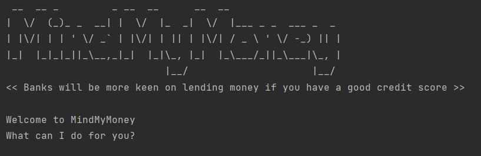

# MindMyMoney (M3)

MindMyMoney (M3) was proposed for users with multiple payment methods who wish to track their expenditures. Conducting
anecdotal interviews, we realized users face difficulty tracking their expenditures across different payment platforms 
on vastly different items. MindMyMoney was then conceptualized on the basis of tracking user’s expenditures. 

The technical goal for the MindMyMoney (M3) is to develop an app for managing your expenditures, optimized for use via
a Command Line Interface (CLI). M3 aims to be a one-stop shop for you to consolidate your expenditure across multiple 
platforms, set budget goals and track your spending.

# Quick Start

1. Ensure that you have Java 11 or above installed.
2. Down the latest version of `MindMyMoney` from [here](https://github.com/AY2122S2-CS2113T-T10-4/tp).

If the setup is correct, you should see something the following in your terminal:
 

Useful links:
* [User Guide](UserGuide.md)
* [Developer Guide](DeveloperGuide.md)
* [About Us](AboutUs.md)
