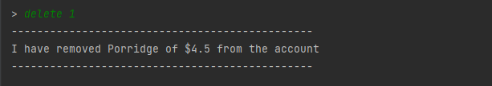
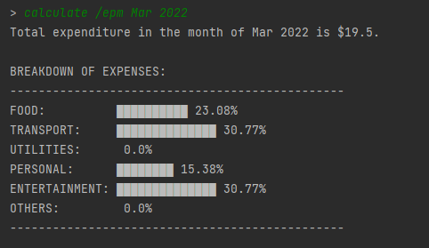
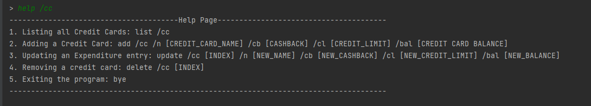
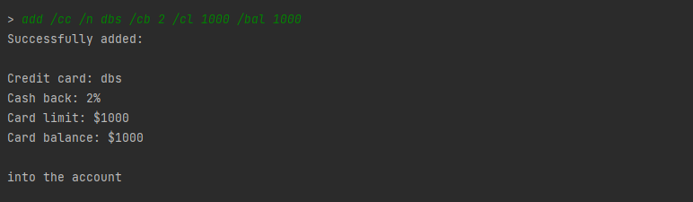
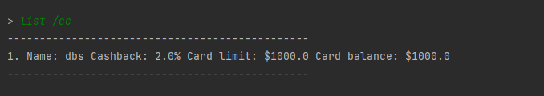
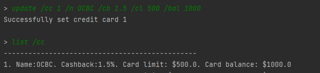
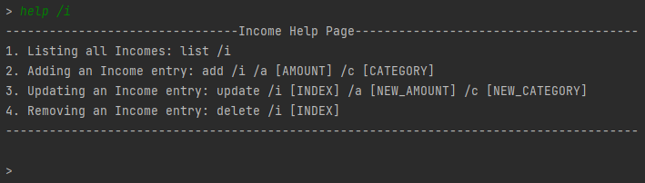
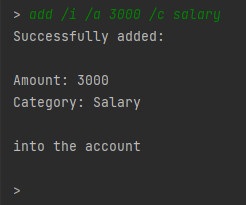
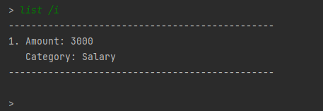
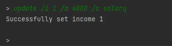

# MindMyMoney User Guide

## Content Page

* [Introduction](#introduction)
* [Quick start](#quick-start)
* [Command summary (Expenses)](#command-summary-expenses)
* [Command summary (Credit Card)](#command-summary-credit-card)
* [Command summary (Income)](#command-summary-income)
* [Features](#features)
    * [Expenses](#expenses)
        * [Display help page for expenses: `help`](#display-help-page-for-income-help)
        * [Add an expenditure: `add`](#add-an-expenditure-add)
        * [Display expenditures: `list` ](#display-expenditures-list)
        * [Modify an expenditure: `update`](#modify-an-expenditure-update)
        * [Remove an expenditure: `delete`](#remove-an-expenditure-delete)
        * [Calculations that MindMyMoney provide: `calculate`](#calculations-that-mindmymoney-provide-calculate)
          * [Expenditure per month: `calculate /epm`](#expenditure-per-month-calculate-epm)
        * [Exit MindMyMoney application: `bye`](#exit-mindmymoney-application-bye)
    * [Credit Card](#credit-card)
        * [Display help page for credit card: `help`](#display-help-page-for-credit-card-help)
        * [Add a credit card: `add`](#add-a-credit-card-add)
        * [Display credit cards: `list` ](#display-credit-cards-list)
        * [Modify a credit card: `update`](#modify-a-credit-card-update)
        * [Remove a credit card: `delete`](#remove-a-credit-card-delete)
    * [Income](#income)
        * [Display help page for income: `help`](#display-help-page-for-income-help)
        * [Add income entry: `add`](#add-income-entry-add)
        * [Display income entries: `list`](#display-income-entries-list)
        * [Modify an income entry: `update`](#modify-an-income-entry-update)
        * [Remove an income entry: `delete`](#remove-an-income-entry-delete)
    * [Save the data](#save-the-data)
* [FAQ](#faq)
  
## Introduction
### MindMyMoney

`MindMyMoney` (M<sup>3</sup>) is a desktop app for managing your personal finances, optimized for use via a
Command Line Interface (CLI). You can use it to track your expenses across multiple payment methods,
calculate monthly expenditure, and set financial goals. If you are a student looking to manage your personal finances, 
this app is for you!

### Using the User Guide
This guide aims to equip you with the knowledge on how to set up the application and to utilise its many features.
Click on the hyperlinks in the [content page](#content-page) to quickly navigate the user guide! Along the guide you may
 encounter several icons. These icons will provide several useful information. 
> **💡 Note:**
>- This tells you that there is additional information that is useful when you are using the application.

> **⚠️Warning⚠️**
> - This tells you that there is some **important** information you should take note of to prevent issues from arising 
when you are using the application.


<br/>

## Quick Start

1. Ensure that you have Java 11 or above installed. Click
   [here](https://docs.aws.amazon.com/corretto/latest/corretto-11-ug/downloads-list.html) for the link to the Java 11
   installer.
2. Download the latest version of `MindMyMoney.jar` from [here](https://github.com/AY2122S2-CS2113T-T10-4/tp/releases).
3. Copy the file to the folder you want to use as the _home folder_ for your MindMyMoney.
4. Open a command line terminal in your _home folder_ and run `java -jar MindMyMoney.jar`.
   The startup interface similar to the one below should appear in a few seconds.  

````
 __  __ _         _ __  __      __  __
|  \/  (_)_ _  __| |  \/  |_  _|  \/  |___ _ _  ___ _  _
| |\/| | | ' \/ _` | |\/| | || | |\/| / _ \ ' \/ -_) || |
|_|  |_|_|_||_\__,_|_|  |_|\_, |_|  |_\___/_||_\___|\_, |
                           |__/                     |__/
<< Set a budget and stick to it >>

Welcome to MindMyMoney
What can I do for you?
````
5. Type the command in the command box and press Enter to execute it. e.g. typing **`help`** and pressing Enter will
   show a help page. <br> Some example commands you can try: <br>
    * **`list`** : Lists all tasks.
    * **`add`**`/pm cash /c Food /d Porridge /a 3 /t 12/03/2022` :
      Adds a $3 expenditure of the description 'Porridge' that was paid in cash on 12 March 2022 to your list of expenditures.
    * **`calculate`**`/epm 03/2022` : Calculates total expenditure in the month of March 2022.
    * **`update`**`1 /pm cash /c Food /d Chicken Rice /a 4.50 /t 12/03/2022` :
      Updates the first expenditure on your expenditure list to reflect a $4.50 expenditure of the 
   description 'Chicken Rice' that was paid in cash on 12 March 2022.
    * **`delete`**`2` : Deletes the second expenditure in your expenditure list.
    * **`bye`** : Exits the app.
    
6. Refer to the [Features](#features) for details of each command.

<br/>

# Features
The following are features of the `MindMyMoney` application.
Please ensure that the format of commands given is accurate.  
Words in `[SQUARE_BRACKETS]` are the parameters.

## Expenses

### Display help page for expenses: `help`
Prints a list of currently available commands for storing expenditures.   

#### Format: `help /e`  

#### Expected Outcome:
````
> help /e
---------------------------------------Expenditure Help Page---------------------------------------
1. Listing all Expenditures: list /expenses
2. Adding an Expenditure entry: add /pm [PAYMENT_METHOD] /c [CATEGORY] /d [DESCRIPTION] /a [AMOUNT] /t [TIME]
3. Calculating the total expenditure in a month: calculate /epm [MONTH]
4. Updating an Expenditure: update [INDEX] /pm [PAYMENT_METHOD] /c [CATEGORY] /d [DESCRIPTION] /a [AMOUNT] /t [TIME]
5. Removing an Expenditure entry: delete [INDEX]
6. Exiting the program: bye
---------------------------------------------------------------------------------------------------
````

<br/>

### Add an expenditure: `add`
Adds an expenditure to your program. Only **one** expenditure can only be added per command.  

#### Format: `add /pm [PAYMENT_METHOD] /c [CATEGORY] /d [DESCRIPTION] /a [AMOUNT] /t [DATE]`
* `[PAYMENT_METHOD]` refers to the method of payment used.
    * Enter `cash` or the name of a credit card you have saved.
* `[CATEGORY]` refers to the category of the expenditure
    * Enter `Food`, `Transport`, `Utilities`, `Personal`, `Entertainment` or `Others`.
* `[DESCRIPTION]` refers to the description of the expenditure.
    * For example `Nike shoes`.
* `[AMOUNT]` refers to the cost of the expenditure.
    * Enter the amount in dollars, rounded off to the nearest cent.
    * For example, an item that cost $420 and 69 cents will be entered as `420.69`.
* `[DATE]` refers to the date of the purchase of the expenditure.
    * Format of the date is DD/MM/YYYY.
    * For example, `12 March 2022` will be entered as `12/03/2022`
    
For example:`add /pm cash /c Food /d Porridge /a 4.50 /t 12/03/2022`
Adds a $4.50 expenditure of the description 'Porridge' that was paid in cash in March 2022 to your expenditure list. <br>

#### Expected Output:
````
> add /pm cash /c Food /d Porridge /a 4.50 /t 12/03/2022
Successfully added: 

Description: Porridge
Amount: $4.5
Category: Food
Payment method: Cash
Date: 12/03/2022

into the account
````

> **💡 Note:**
>- `[CATEGORY]` and `[PAYMENT_METHOD]` are **case-insensitive**.
>-  Your credit card has to be [added](#add-a-credit-card-to-your-program-add) first before entering the name of the credit card as `[PAYMENT_METHOD]`.
>- `[AMOUNT]` only accepts numbers with 2 decimal places. Any additional decimals will be rounded off or ignored


> **⚠️Warning⚠️**
>- `[CATEGORY]`: Any input not in the list will be rejected.
>- All parameters are compulsory! Input the parameters in the order given, or the application will not be able to read your
   > input.

<br/>

### Display expenditures: `list`
Prints your current list of expenditures.  

#### Format:`list /e`  

#### Expected Output:  
```
list /e
-----------------------------------------------
1. $300.0 was spent on Nike Shoes(Personal) using Cash [30/03/2022]
2. $3000.0 was spent on Nike Shoes(Food) using Cash [30/03/2022]
3. $3.21 was spent on For(Food) using Cash [30/01/1999]
4. $4.5 was spent on Porridge(Food) using Cash [12/03/2022]
-----------------------------------------------
```

<br/>

### Modify an expenditure: `update`
Modifies an expenditure on your expenditure list by specifying its index. <br>
Use the `list /e` command to view the indices of your expenditures.   

Format:`update [INDEX] /pm [NEW_PAYMENT_METHOD] /c [NEW_CATEGORY] /d [NEW_DESCRIPTION] /a [NEW_AMOUNT] /t [NEW_DATE]`  
For example: `update 1 /pm cash /c food /d chicken rice /a 5 /t 12/03/2022`


<br/>

### Remove an expenditure: `delete`
Deletes an expenditure from your expenditure list by specifying its index. <br>
Use the `list /e` command to view the current indices of your expenditures.   

Format:`delete`  
For example: `delete 1` Deletes the first expenditure on your list.



<br/>

### Calculations that MindMyMoney provide: `calculate`
MindMyMoney provides a calculating feature. See below for more details of the feature.

#### Expenditure per month: `calculate /epm`
Shows the sum of the amounts of expenditures you have made in a month of a certain year. <br>
Shows the percentage spent on each category of expenditure, displayed in a horizontal bar chart. <br>

Format:`calculate /epm [DATE]`
* `[DATE]` can be of the format `DD/MM/YYYY`, `MM/YYYY` or `YYYY`, depending on the duration you are interested in.

For example: `calculate /epm 03/2022`

 <br>

> **💡 Note**
> - If you want to search for exact month in year, enter both month and year.
> - Month is **case-sensitive**.
> - However, you can also use this function to search for expenditures in the year by typing `calculate /epm 2022`.

<br/>

### Exit MindMyMoney application: `bye`
Shuts down the MindMyMoney application.
Format:`bye`


## Credit Card

### Display help page for credit card: `help`
Prints a list of commands for storing credit cards as a payment method.
Format 1:`help /cc` <br>


<br/>

### Add a credit card: `add`
Adds a credit card to your program. Only **one** credit card can only be added per command.  <br>
Format:`add /cc /n [CREDIT_CARD_NAME] /cb [CASH_BACK] /cl [CARD_LIMIT] /bal [CARD_BALANCE]`
* `[CREDIT_CARD_NAME]` refers to the name your Credit Card will be saved as
  * Use abbreviations for ease of adding expenditures to this credit card
     For example, storing `DBS Live Fresh Credit Card` as `DBS LV`
* `[CASH_BACK]` refers to the amount of cash back received when spending on the credit card
  * Enter the amount of cashback in percentage
  * For example, a credit card with `2% cashback` can be represented as `/cb 2`
* `[CARD_LIMIT]` refers to the maximum monthly expenditure on this credit card.
    * Enter the monthly maximum amount that can be spent on the credit card in dollars
* `[CARD_BALANCE]` refers to the amount of money left to be spent on the credit card
    * Enter the amount that is left in this card in dollars


Example:`add /cc /n dbs /cb 2 /cl 1000 /bal 1000` Adds a credit card of the name 'DBS' with a cashback of 2%, 
a monthly spending limit of $1000 and a card balance of $1000.


> **💡 Note**
>- `[CREDIT_CARD_NAME]` is **case-insensitive**.


> **⚠️Warning⚠️**
>- Input realistic values, any unrealistic values can crash the system and harm your save file!
>- All parameters are compulsory! Input the parameters in the order given, or the application will not be able to read your
   > input.

<br/>

### Display credit cards: `list`
Prints your current list of credit cards that you have added so far.   
Format:`list /cc`



<br/>

### Modify a credit card: `update`
Modifies a credit card on your credit card list by specifying its index. <br>
Use the `list /cc` command to view the current indices of your credit cards.   

Format:`update /cc [INDEX] /n [NEW_NAME] /cb [NEW_CASHBACK] /cl [NEW_CREDIT_LIMIT] /bal [NEW_BALANCE]`  
For example: `update /cc 1 /n OCBC /cb 1.5 /cl 500 /bal 1000` Updates the first credit card on your list to have a 
name of 'OCBC' with a cashback of 1.5%, a monthly spending limit of $500 and a card balance of $1000.



<br/>

### Remove a credit card: `delete`
Delete a credit card from your list, by specifying the credit card's index.  
Use the `list /cc` command to view the current indices of your credit cards.

Format:`delete /cc [INDEX]` 

For example: `delete /cc 1`<br/>
Deletes the first credit card on your credit card list.


<br/>

## Income
Income refers to the various sources of income you might have.

### Display help page for income: `help`
Prints a list of commands relating to income.<br/>

Format:`help /i`



<br/>

### Add income entry: `add`
Adds an income entry to your program.

Format: `add /i /a [AMOUNT] /c [CATEGORY]`
* `[AMOUNT]` refers to the monthly sum received, as a whole number.
* `[CATEGORY]` refers to the supported categories of income.
   * These categories include: `Salary`, `Allowance`, `Investment` and `Others`.
   * Categories are case-insensitive.

Example: `add /i /a 3000 /c salary`
<br/> Adds an income entry of '3000' under the 'Salary' category.



<br/>

### Display income entries: `list`
Prints your current list of income entries that you have added so far.

Format: `list /i`



<br/>

### Modify an income entry: `update`
Modifies an income entry in your income list by specifying its index.
<br/> Use the `list /i` command to view the current indices of your income entries.

Format: `update /i [INDEX] /a [NEW_AMOUNT] /c [NEW_CATEGORY]`

Example: `update /i 1 /a 4000 /c salary`
<br/> Updates the first income entry on your list to an amount of '4000' under the 'Salary' category.



<br/>

### Remove an income entry: `delete`
Deletes an income entry from your income list, by specifying its index.
<br/> Use the `list /i` command to view the current indices of your income entries.

Format: `delete /i [INDEX]`

Example: `delete /i 1`
<br/>Deletes the first income entry on your list.


<br/>

## Save the data
Your MindMyMoney data is saved in the hard disk automatically after any command that changes the data.
There is no need for you to save manually.

<br/>

## FAQ

**Q**: Why is my data not saved when I run MindMyMoney in different folders?

**A**: MindMyMoney saves data in the current directory. To ensure all the data is saved properly,
run MindMyMoney only in the _home folder_. 

<br/>

## Command Summary (Expenses)

| Command   | Format, examples                                                                                                                                                            |
|-----------|-----------------------------------------------------------------------------------------------------------------------------------------------------------------------------|
| Help      | `help /expenses` <br/> Prints a list of commands for storing expenses.                                                                                                      |
| Add       | `add /e [PAYMENT_METHOD] /c [CATEGORY] /d [DESCRIPTION] /a [AMOUNT] /t [DATE]`<br/>e.g `add /pm cash /c Food /d Porridge /a 3 /t 2022-03`                                   |
| List      | `list /expenses`<br/> Displays your current list of expenditures.                                                                                                           |
| Calculate | `calculate /epm mm yyyy` <br/> e.g `calculate /epm Mar 2022` <br/> Calculates the total expenses in March 2022 and prints the percentage of expenses grouped by categories. |
| Delete    | `delete [INDEX]`<br/>e.g `delete 1` <br/> Deletes the first expenditure from your list.                                                                                     | 
| Update    | `update [INDEX] [NEW_DESCRIPTION] [NEW_AMOUNT]`<br/>e.g `update 2 snacks 5` <br/> Updates the second expenditure in your list.                                              |

<br/>

## Command Summary (Credit Card)

| Command   | Format, examples                                                                                                                                                                                                 |
|-----------|------------------------------------------------------------------------------------------------------------------------------------------------------------------------------------------------------------------|
| Help      | `help /cc` <br/> Prints a list of commands for storing credit cards.                                                                                                                                             |
| Add       | `add /cc /n [NAME] /cb [CASH_BACK_AMOUNT] /cl [CASH_LIMIT_AMOUNT] /bal [CARD_BALANCE]`<br/>e.g `add /cc /n dbs /cb 2 /cl 1000 /bal 1000`                                                                         | 
| List      | `list /cc`<br/> Displays your current list of credit cards.                                                                                                                                                      |
| Delete    | `delete /cc [INDEX]`<br/>e.g `delete /cc 1` <br/> Deletes the first credit card from your list.                                                                                                                  | 
| Update    | `update /cc [INDEX] /n [NEW_CARD_NAME] /cb [NEW_CASHBACK] /cl [NEW_CREDIT_LIMIT] /bal [NEW_BALANCE]`<br/>e.g `update /cc 2 /n DBS /cb 3 /cl 10000 /bal 10000` <br/> Updates the second credit card in your list. |
| Exit      | `bye`<br/> Ends the `MindMyMoney` application                                                                                                                                                                    |

<br/>

## Command Summary (Income)

| Command   | Format, examples                                                                                                                              |
|-----------|-----------------------------------------------------------------------------------------------------------------------------------------------|
| Help      | `help /i` <br/> Prints a list of commands for storing income.                                                                                 |
| Add       | `add /i /a [AMOUNT] /c [CATEGORY]`<br/> e.g `add /i /a 3000 /c salary` <br/> Adds an income entry                                             | 
| List      | `list /i`<br/> Displays your current list of income entries.                                                                                  |
| Delete    | `delete /i [INDEX]`<br/> e.g `delete /i 1` <br/> Deletes the first income entry from your list.                                               | 
| Update    | `update /i [INDEX] /a [NEW_AMOUNT] /c [NEW_SALARY]`<br/> e.g `update /i /a 4000 /c salary` <br/> Updates the first income entry in your list. |
| Exit      | `bye`<br/> Ends the `MindMyMoney` application                                                                                                 |
