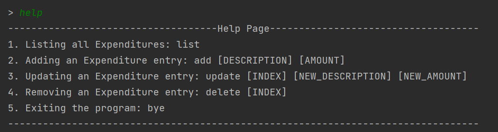
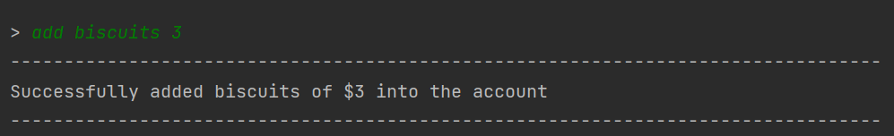
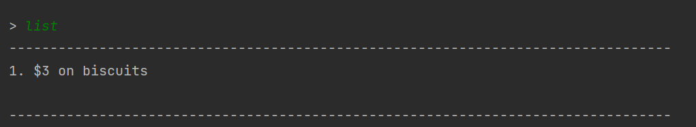
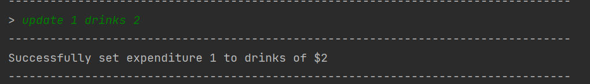
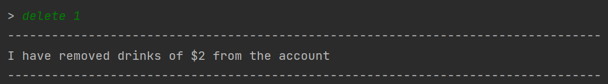

# User Guide

## Introduction

`MindMyMoney` (M3) was proposed for users with multiple payment methods who wish to track their expenditures. 
Conducting anecdotal interviews, we realized users face difficulty tracking their expenditures across different payment 
platforms on vastly different items. `MindMyMoney` was then conceptualized on the basis of tracking user’s expenditures.

## Quick Start

1. Ensure that you have Java 11 or above installed. 
2. Down the latest version of `MindMyMoney` from [here](https://github.com/AY2122S2-CS2113T-T10-4/tp).

## Commands Summary  

| Command | Format, examples                                                            |
|---------|-----------------------------------------------------------------------------|
| Help    | `help`   Prints a list of available commands                            |
| Add     | `add [DESCRIPTION] [AMOUNT]` e.g `add biscuits 3`                       |
| List    | `list`  Displays the current list of expenditures stored by the user    |
| Delete  | `delete [INDEX]` e.g `delete 1`                                         | 
| Update  | `update [INDEX] [NEW_DESCRIPTION] [NEW_AMOUNT]` e.g `update 2 snacks 5` |
| Exit    | `bye`  Shuts down `MindMyMoney` application                             |
|

## Features  
The following are features of the `MindMyMoney` application. Please ensure that the format of commands given is accurate 

### Display list of currently available commands:`help`  
Prints a list of currently available commands for users to track their expenditures  
Format:`help`  
 

### Add an expenditure to your program:`add` 
Adds an expenditure to your program. Only **one** expenditure can only be added per command. 
Format:`add [DESCRIPTION] [AMOUNT]`  
Example:`add biscuits 3` 

### Display current list of expenditures:`list`  
Prints in the terminal the current list of expenditures that you have logged so far  
Format:`list` 
 

### Modify an expenditure on your list:`update`  
Modify an expenditure on your list, by specifying the expenditure's index.  
Use the `list` command to view the current indices of your expenditures.  
Format:`update [INDEX] [NEW_DESCRIPTION] [NEW_AMOUNT]` 
For example: `update 1 drinks 2` 
 

### Removing an expenditure on your list:`list` 
Delete an expenditure from your list, by specifying the expenditure's index. 
Use the `list` command to view the current indices of your expenditures.  
Format:`delete` 
For example: `delete 1`
 

### Exiting MindMyMoney application:`bye` 
Shuts down the MindMyMoney application. 
Format:`bye` 
 

## FAQ

**Q**: How do I save my data for my next usage?  

**A**: We are currently working on implementing this feature and 
will update the User Guide once available! :)  

