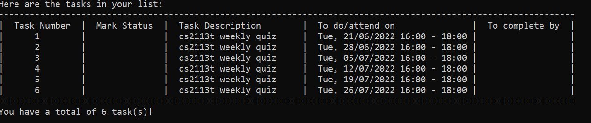
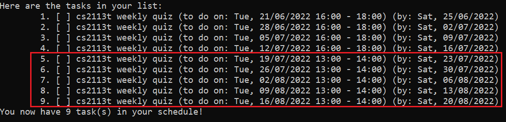

# Sherpass User Guide

## Introduction

Sherpass is a desktop application for students to manage their academic schedules.
Optimised for use via a Command Line Interface (CLI),
users who can type fast will be able to plan out their tasks in a much quicker fashion compared to traditional GUI apps.

## Table of Content
- [Quick Start](#quick-start)
- [Features](#features)
- [Command Guide](#command-guide)
  - Add tasks: [`add`]() or [`addrecurring`](#adding-a-recurring-task-addrecurring)
  - Delete tasks: [`delete`]() or [`deleterecurring`](#deleting-a-recurring-task-deleterecurring)
  - Edit tasks: [`edit`]() or [`editrecurring`](#editing-a-recurring-task-editrecurring)
  - List tasks: [`show`]()
  - Clear all tasks: [`clear`]()
  - Study session
    - Enter study session: [`study`]()
    - Start timer: [`start`]()
    - Pause timer: [`pause`]()
    - Resume timer: [`resume`]()
    - Stop timer: [`stop`]()
    - Exit study session: [`leave`]()
  - Exit program: [`exit`]()
  - [Saving your tasks](#saving-your-tasks)
- [Command Summary](#command-summary)
## Quick Start

1. Ensure that you have Java 11 or above installed.
2. Download the latest version of `Sherpass` 
from [here](https://github.com/AY2122S2-CS2113T-T09-1/tp/releases/tag/v1.0-Release).
3. Copy the jar file to the folder you want to use as the home folder for Sherpass.
4. Start the application from a terminal using `java -jar Sherpass.jar`

## Features 

{Give detailed description of each feature}
### Managing your time
You can add your tasks into Sherpass and get a detailed outline of your schedule. Using this schedule, you won't
have to worry ever again about forgetting tasks and missing deadlines!

Sherpass also allows you to easily add recurring tasks (e.g classes). Simply refer to the command details for
more information.

### Study sessions
TBD

## Command Guide

###Notes on command input format:
- Words in UPPER_CASE are the parameters to be supplied by the user.
- Items in square brackets are optional
- Extraneous parameters for commands that do not take in parameters (such as show, stop, exit) will be ignored
### Adding a recurring task: `addrecurring`
Adds a recurring task to your list of tasks.
- All tasks will have the same task description.
- For a **daily** recurring task, a **month's** worth of task will be added.
- For a **weekly** recurring task, **2 months'** worth of task will be added.
- For a **monthly** recurring task, a **year's** worth of task will be added.

Format: `add TASK_DESCRIPTION /do DATE /start START_TIME /end END_TIME /repeat FREQUENCY`

- `DATE` format is in `dd/MM/yyyy` - e.g. 3/10/2022 for 3 Oct 2022
- `TIME` format is in `HH:mm` - e.g. 23:00 for 11pm
- `FREQUENCY` can be either `DAILY`, `WEEKLY` or `MONTHLY`
- `START_TIME` must be after `END_TIME`

Example: `addrecurring attend cs2113t lecture /do 25/2/2022 /start 16:00 /end 18:00 /repeat WEEKLY`

### Deleting a recurring task: `deleterecurring`
Deletes a recurring task from your list of tasks.
- The specified task and all its future occurrence will be deleted.

Format: `deleterecurring TASK_NUMBER`

### Editing a recurring task: `editrecurring`
Edit a recurring task in your list of tasks.

- The specified task and all its future occurence will be edited.

Format: `editrecurring TASK_NUMBER [TASK_DESCRIPTION] [/do DATE /start TIME /end TIME]`

- To change the **frequency** of a recurring task, please delete and add the recurring task with the correct
frequency using the `deleterecurring `and `addrecurring` command respectively.
- At least one of the optional fields must be provided

Example: 

Before edit command:

After command: `editrecurring 1 /do 25/3/2022 /start 18:00 /end 20:00`

### Saving your tasks

All changes to your tasks are saved automatically into a JSON file at `[JAR FILE LOCATION]/data/Sherpass.json`.

There is no need to manually save your tasks.

_Note: Advanced users are welcome to manually edit the save file._

## FAQ

**Q**: My save file is corrupted, how do I resolve this?

**A**: Sherpass will print an error message 
containing details of the corruption (e.g missing fields, brackets). You can either modify the save file accordingly to
rectify the problem or allow Sherpass to create a new save file 
**(Caution: You will lose all previously saved tasks!)**

**Q**: How do I transfer my data to another computer? 

**A**: Transfer a copy of your save file to your other device and place it in `[JAR FILE LOCATION]/data/Sherpass.json`

## Command Summary

| Action                | Format,Examples                                                                                                                                                                                |
|-----------------------|------------------------------------------------------------------------------------------------------------------------------------------------------------------------------------------------|
|                       |                                                                                                                                                                                                |
|                       |                                                                                                                                                                                                |
|                       |                                                                                                                                                                                                |
| Add recurring task    | `addrecurring TASK_DESCRIPTION /do DATE /start START_TIME /end END_TIME /repeat FREQUENCY` e.g. `addrecurring attend cs2113t lecture /do 25/2/2022 /start 16:00 /end 18:00 /repeat WEEKLY` |
| Delete recurring task | `deleterecurring TASK_NUMBER`                                                                                                                                                                  |
| Edit recurring task   | `editrecurring TASK_NUMBER [TASK_DESCRIPTION] [/do DATE /start TIME /end TIME]` e.g.`editrecurring 1 /do 25/3/2022 /start 18:00 /end 20:00`                                                |
|                       |                                                                                                                                                                                                |
|                       |                                                                                                                                                                                                |
|                       |                                                                                                                                                                                                |

