# Sherpass User Guide

## Introduction

Sherpass is a desktop application for students to manage their academic schedules and also provide a platform for them
to focus on their academic tasks.
Optimised for use via a Command Line Interface (CLI),
users who can type fast will be able to plan out their tasks in a much quicker fashion compared to traditional GUI apps.

### Managing your time
You can add your tasks into Sherpass and get a detailed outline of your schedule. Using this schedule, you won't
have to worry ever again about forgetting tasks and missing deadlines!

Sherpass also allows you to easily add recurring tasks (e.g. classes). Simply refer to the command details for
more information.

### Study sessions
Having trouble focusing while studying? Sherpass's study sessions allow you to select study timers, inspired by the
increasingly popular [Pomodoro study sessions](https://examstudyexpert.com/pomodoro-study-method/), to help you keep track of the time whilst completing your tasks.

#### During Study sessions
Starting the study session will show you the tasks that you have planned to do for the day. You can then choose to
start one of a few default timers provided by us, or start your own custom timer. You can also choose to start a
stopwatch to keep track of how long you've been studying for, if you're unsure of how long you will need.

#### After Study sessions
After your study session, you will be prompted to mark the tasks you've completed as done. If you're still not done with
certain tasks, feel free to start another productive session!

### User Guide Target Audience
New and inexperienced users who want to use Sherpass, as well as non-users who want to know more about what Sherpass
can do.

### Using the User Guide

This guide aims to equip readers with the knowledge of the features of our application, such that they are able to use
it correctly and with ease. Here are some icons which we will use to convey important information.

> **💡 Note**
>- Additional information that is useful when you are using the application.

> **⚠️Important Notes / Warnings️**
>- **Essential** information you should take note of to be able to use the application correctly. 

## Table of Content
- [Quick Start](#quick-start)
- [Features](#features)
- [Command Guide](#command-guide)
  - Task Management
    - Add tasks: [`add`](#adding-your-tasks-add)
    - Delete tasks: [`delete`](#deleting-your-tasks-delete)
    - Edit tasks: [`edit`](#editing-your-tasks-edit)
    - Mark tasks [`mark`](#marking-your-tasksmark-task_number--unmark-task_number)
    - Show tasks: [`show`](#display-daily-schedule-show-today--show-tomorrow--show-date)
    - Clear all tasks: [`clear`](#clearing-all-tasks-clear)
  - Study session
    - Enter study session: [`study`](#enter-study-session-study)
    - Start timer: [`start`](#starting-a-default-timer-start-mode_number)     
    - Pause timer: [`pause`](#pausing-a-timerstopwatch-pause)
    - Resume timer: [`resume`](#resuming-a-timerstopwatch-resume)
    - Stop timer: [`stop`](#stopping-a-timerstopwatch-stop)
    - Show tasks: [`show`](#show-your-tasks-show)
    - Mark tasks as done:[`mark`](#mark-your-tasks-as-done-mark)
    - Exit study session: [`leave`](#leave-the-study-session-leave)
  - Exit program: [`exit`]()
  - [Saving your tasks](#saving-your-tasks)
- [FAQ](#faq)
- [Glossary](#faq)
- [Command Summary](#command-summary)

## Quick Start

1. Ensure that you have Java 11 or above installed.
2. Download the latest version of `Sherpass` 
from [here](https://github.com/AY2122S2-CS2113T-T09-1/tp/releases/tag/v1.0-Release).
3. Copy the jar file to the folder you want to use as the home folder for Sherpass.
4. Open a terminal and navigate to the folder containing the jar file.
5. Start the application on the terminal using `java -jar Sherpass.jar`

## Command Guide

> ### ⚠️Important notes on command input format
>- Words in UPPER_CASE are the [parameters](#glossary) to be supplied by the user.
>- Items in square brackets are optional.
>- [Extraneous](#glossary) parameters for commands that do not take in parameters (such as show, stop, exit) will be ignored.

>###  ⚠️Important notes on task number format
>- Each task added to your schedule is assigned a task number. You can see what number a task is assigned via
>the [show command](#show-your-tasks-show).
>- The task number will update accordingly as you add/edit/delete a task (with the
>earliest task assigned the first number, second earliest task the second number, and so on).

### Adding your tasks: `add` 
>⚠️Important note: When adding tasks, TASK_DESCRIPTION must be the first parameter provided.
Order of other parameters can be switched.

#### Adding a single task

<<<<<<< HEAD
Format: `add TASK_DESCRIPTION /do DATE /start START_TIME /end END_TIME [/bydate DUE_DATE /bytime END_TIME]`

|    Parameters    | Description                     | Accepted inputs                                                                     | Optional                |
|:----------------:|---------------------------------|-------------------------------------------------------------------------------------|-------------------------|
| TASK_DESCRIPTION | Description for the task        | Any phrases or sentences                                                            | No                      |
|     DO_DATE      | Date to work on the task        | d/M/yyyy format (e.g `25/3/2022` for 25 March 2022)                                 | No                      |
|    START_TIME    | Time to start working on a task | HH:mm format (e.g `18:00`)                                                          | No                      |
|     END_TIME     | Time to stop working on a task  | HH:mm format, must be after START_TIME                                              | No                      |
|     DUE_DATE     | Due date for the task           | d/M/yyyy format, must be equal to or after DUE_DATE                                 | Yes                     |
|     DUE_TIME     | Due time for the task           | HH:mm format, must be equal to or after END_TIME if DUE_DATE is the same as DO_DATE | No if DUE_DATE is given |

> **💡 Note**
> When using the optional parameter shown in `[]`, both the`DEADLINE` and `END_TIME` to need be used together.

**Examples**
- `add write final essay /do 25/6/2022 /start 20:00 /end 22:00 /bydate 27/6/2022 /bytime 23:59`
- `add revise chapter 3 /do 25/6/2022 /start 20:00 /end 22:00`

#### Adding a recurring task
- All tasks will have the same task description.
- You can easily add your lectures or tutorials into your schedule with this command.
- For a **daily** recurring task, a **month's** worth of task will be added.
- For a **weekly** recurring task, **2 months'** worth of task will be added.
- For a **monthly** recurring task, a **year's** worth of task will be added.

Format: `add TASK_DESCRIPTION /do DATE /start START_TIME /end END_TIME [/bydate DUE_DATE /bytime DUE_TIME] /repeat FREQUENCY`

|    Parameters    | Description                     | Accepted inputs                                                                     | Optional                |
|:----------------:|---------------------------------|-------------------------------------------------------------------------------------|-------------------------|
| TASK_DESCRIPTION | Description for the task        | Any phrases or sentences                                                            | No                      |
|       DATE       | Date to work on the task        | d/M/yyyy format (e.g `25/3/2022` for 25 March 2022)                                 | No                      |
|    START_TIME    | Time to start working on a task | HH:mm format (e.g `18:00`)                                                          | No                      |
|     END_TIME     | Time to stop working on a task  | HH:mm format, must be after START_TIME                                              | No                      |
|     DUE_DATE     | Due date for the task           | d/M/yyyy format, must be equal to or after DUE_DATE                                 | Yes                     |
|     DUE_TIME     | Due time for the task           | HH:mm format, must be equal to or after END_TIME if DUE_DATE is the same as DO_DATE | No if DUE_DATE is given |
|    FREQUENCY     | How often does the task repeat  | DAILY, WEEKLY, MONTHLY                                                              | No                      |

**Examples**
- `add cs2113t weekly quiz /do 21/6/2022 /start 16:00 /end 18:00 /bydate 25/6/2022 /bytime 16:00 /repeat WEEKLY`
- `add browse internship offers /do 27/6/2022 /start 21:00 /end 21:30 /repeat DAILY`

### Deleting your tasks: `delete`

Format: `delete TASK_NUMBER`

| Parameters  | Description                                         | Accepted inputs       | Optional |
|:-----------:|-----------------------------------------------------|-----------------------|----------|
| TASK_NUMBER | The index of the task as seen in the `show` command | Any valid task number | No       |

**Example**
- `delete 1`

### Deleting your recurring tasks
- The specified task and all its future occurrence will be deleted.
- Occurrences earlier than the specified task will not be affected.

Format: `delete TASK_NUMBER /repeat`

| Parameters  | Description                                         | Accepted inputs       | Optional |
|:-----------:|-----------------------------------------------------|-----------------------|----------|
| TASK_NUMBER | The index of the task as seen in the `show` command | Any valid task number | No       |

**Example**

Before delete command:

After command: `delete 3 /repeat`

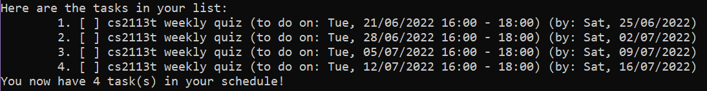

### Editing your tasks: `edit`

>⚠️Important note: When editing tasks, at least one optional [parameter](#glossary) must be provided.

> 💡 **Note:**
>- When editing a single occurrence of a recurring task, the edited task will detach from the others.
>- When editing some occurrences of a recurring task, the edited tasks will form a separate recurring task

#### Editing a single task

Format: `edit TASK_NUMBER [TASK_DESCRIPTION] [/do DATE /start START_TIME /end END_TIME] [/bydate DUE_DATE /bytime DUE_TIME]`

|    Parameters    | Description                                         | Accepted inputs                                                                      | Optional                |
|:----------------:|-----------------------------------------------------|--------------------------------------------------------------------------------------|-------------------------|
|   TASK_NUMBER    | The index of the task as seen in the `show` command | Any valid task number                                                                | No                      |
| TASK_DESCRIPTION | Description for the task                            | Any phrases or sentences   	                                             | Yes                     |
|       DATE       | Date to work on the task                            | d/M/yyyy format (e.g `25/3/2022` for 25 March 2022)                                         | Yes                     |
|    START_TIME    | Time to start working on a task                     | HH:mm format (e.g `18:00`)                                           | No if DO_DATE is given  |
|     END_TIME     | Time to start working on a task                     | HH:mm format, must be after START_TIME                                               | No if DO_DATE is given  |
|     DUE_DATE     | Due date for the task                               | d/M/yyyy format, must be equal to or after DUE_DATE                                  | Yes                     |
|     DUE_TIME     | Due time for the task                               | HH:mm format, must be equal to or after END_TIME if DUE_DATE is the same as DO_DATE  | No if DUE_DATE is given |

**Examples**
- `edit 2 write draft essay`
- `edit 3 submit draft essay /do 26/3/2022 /start 10:00 /end 13:00 /bydate 30/3/2022 /bytime 23:59`

#### Editing a recurring task
- The specified task and all its future occurrence will be edited.
- Occurrences earlier than the specified task will not be affected.
- To change frequency, delete and add the recurring task with the new frequency using the `delete` and `add` command respectively.

Format: `edit TASK_NUMBER [TASK_DESCRIPTION] [/do DATE] [/start START_TIME] [/end END_TIME] [/bydate DUE_DATE /bytime DUE_TIME] /repeat`

|    Parameters    | Description                                         | Accepted inputs                                                                     | Optional                |
|:----------------:|-----------------------------------------------------|-------------------------------------------------------------------------------------|-------------------------|
|   TASK_NUMBER    | The index of the task as seen in the `show` command | Any valid task number                                                               | No                      |
| TASK_DESCRIPTION | Description for the task                            | Any phrases or sentences                                                            | Yes                     |
|       DATE       | Date to work on the task                            | d/M/yyyy format(e.g 25/3/2022 for 25 March 2022)                                    | Yes                     |
|    START_TIME    | Time to start working on a task                     | HH:mm format (e.g 18:00)                                                            | Yes                     |
|     END_TIME     | Time to stop working on a task                      | HH:mm format, must be after START_TIME                                              | Yes                     |
|     DUE_DATE     | Due date for the task                               | d/M/yyyy format, must be equal to or after DUE_DATE                                 | Yes                     |
|     DUE_TIME     | Due time for the task                               | HH:mm format, must be equal to or after END_TIME if DUE_DATE is the same as DO_DATE | No if DUE_DATE is given |

Before edit command:

After command: `edit 4 /start 13:00 /end 15:00 /repeat`

### Marking your tasks`mark TASK_NUMBER` / `unmark TASK_NUMBER`

- Mark the tasks that you've done in the session with `mark`.
- You can also mark a task as undone with `unmark`.

Format: `mark TASK_NUMBER` or `unmark TASK_NUMBER`

| Parameters  | Description                                       | Accepted inputs                       | Optional |
|:-----------:|---------------------------------------------------|---------------------------------------|----------|
| TASK_NUMBER | The task number as seen in the `show all` command | Any valid task number in the schedule | No       |

**Example**

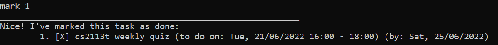

### Display Daily Schedule: `show today` / `show tomorrow` / `show DATE`

Displays your schedule for today, tomorrow or any specific date.

Upon startup, Sherpass also shows your schedule for the day.

Format:
- To see the schedule for the day: `show today`
- To see the schedule for tomorrow: `show tomorrow` or `show tmr`
- To see the schedule for a specific day: `show DATE`, where the date is in the format `d/M/YYYY`.
  
   E.g. `show 25/3/2022` shows the schedule for 25th March 2022

Below is an example of the schedule that is being displayed from the given date
25/3/2022:

### Display Weekly Schedule: `show week` / `show next week`

Displays your schedule for the week or the week after.

Format:
- To see the schedule for the week you are in: `show week`
- To see the schedule for the week after: `show next week` or `show nextweek`

Below is an example of the weekly schedule displayed:

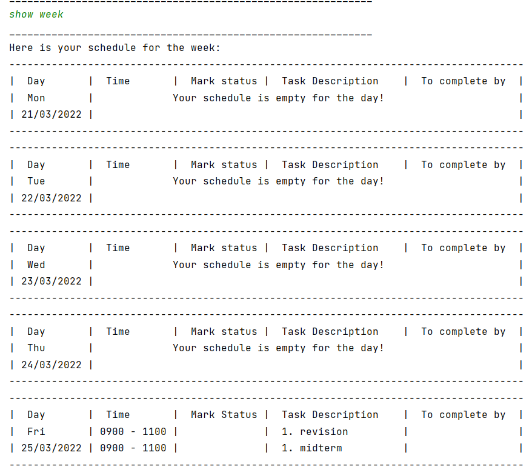
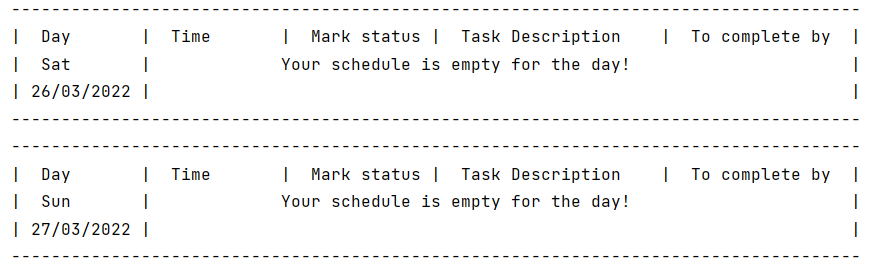

### Display Monthly Schedule: `show month` / `show MONTH`

Displays your schedule for the current month or any specific month

>**💡 Note**
>
> Monthly Schedule will only display task that are in the current Month or the upcoming Month.
>
> Please use `show all` method to see task from previous months. 
> 
> To show any specific Month, 2 type of input is accepted.
> - 3-letter abbreviation of the specific month.
> - The full spelling of the specific month.

Format:
- To see the schedule for the current month: `show month`
- To see the schedule for any specific month: `show MONTH`,

  E.g. `show sep` or `show september` is the same command 

  E.g. `show september` to display the schedule for **September**

Below is an example of the monthly schedule displayed:

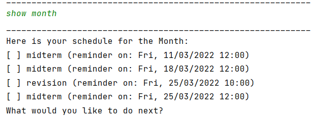

### Getting a detailed list: `show all` / `show todo`

Other than getting a timetable, Sherpass also allows you
to view all the tasks that have been added/edited/deleted.

Format:
- To view all the tasks that exist in your list: `show all`
- To view all the tasks that are yet to be completed: `show todo` 

Below are some sample outputs using `show all` and `show todo` respectively

Show all tasks:

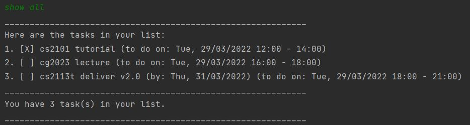

Show pending tasks:

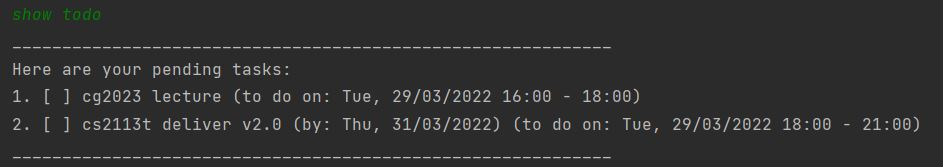

### Clearing multiple tasks: `clear all` / `clear expired` / `clear done`
Deletes a bunch of tasks with different levels of scope, saving the trouble of deleting them one by one.

Format:
- To clear all the tasks in your list: `clear all`
- To clear all the tasks that have expired `DO_DATE`: `clear expired`
- To clear all the tasks that have been marked as completed: `clear done`

### Saving your tasks

All changes to your tasks are saved automatically into a JSON file at `[JAR FILE LOCATION]/data/Sherpass.json`.

There is no need to manually save your tasks.

> 💡 **Note:** 
> 
>Advanced users are welcome to manually edit the save file.

The following fields are required to correctly load a task:

|    Fields     | Description                                                 | Accepted inputs                                            |
|:-------------:|-------------------------------------------------------------|------------------------------------------------------------|
|  identifier   | Tasks with the same identifier are recurrence of each other | Any number from 1-65535                                    |
|  description  | Description for the task                                    | Any phrases or sentences                                   |
| do_date_start | Date and time to start working on the task                  | d/M/yyyy HH:mm (e.g `25/5/2022 16:00` for 25 May 2022 4pm) |
|  do_date_end  | Date and time to stop working on the task                   | d/M/yyyy HH:mm, must be after DO_DATE_START                |
|    by_date    | Deadline for the task                                       | d/M/yyyy HH:mm, must be after DO_DATE_END                  |
|    status     | Status of the task                                          | `X` for completed, `-` for incomplete                      |

### Enter study session: `study`
Enter the study session where you can start timers to help finish your tasks.

Format: `study`

**Example**

### Starting a timer: `start`

#### Starting a default timer: `start MODE_NUMBER`

Jump right into a study session by starting a study timer from our list of default timers.

- Timer keeps track of time remaining and lets you know when time has run out.
- Timers can be paused, resumed and stopped while the timer is running.

Format: `start MODE_NUMBER`

|      Parameters      | Description                                             | Accepted inputs               | Optional  |
|:--------------------:|---------------------------------------------------------|-------------------------------|-----------|
|     MODE_NUMBER      | The default mode number of the study timer chosen (0-4) | Any valid default mode number | No        |

- You can choose from 3 default timers.
- `MODE_NUMBER` 0 starts a 30 second(s) timer for testing purposes.
- `MODE_NUMBER` 1 starts a 30 minute(s) timer
- `MODE_NUMBER` 2 starts a 1 hour(s) timer
- `MODE_NUMBER` 3 starts a 1.5 hour(s) timer

> 💡 **Note:**
>- Only one timer can be running at any given point of time.
>- Once you have entered the study session and have selected a timer,
   > a separate pop-up timer window will be shown to you.
>- It will show you the amount of time left or the elapsed time. Buttons are provided on the window for you
   >to pause/resume/stop the timer quickly.
>- You may also choose to enter the commands via the
   >command line interface instead.

**Examples**

- `start 1`

In the terminal:

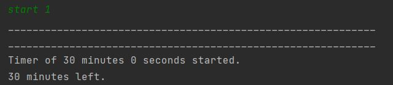

In the pop-up window:

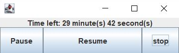

### Starting a custom timer: `start`
Need something else rather than what is provided by our default timers? You can start your own custom timer to suit 
your own needs.

- Start a custom timer with `DURATION` set by you

Format: `start /custom DURATION`

|    Parameters    | Description                                               | Accepted inputs   | Optional |
|:----------------:|-----------------------------------------------------------|-------------------|----------|
|     DURATION     | Duration of the timer (in seconds) that you wish to start | Any valid integer | No       |

- Timer `DURATION` is in seconds
- `/custom` flag is mandatory to start a custom timer

**Example**

- `start /custom 60`

In the terminal:

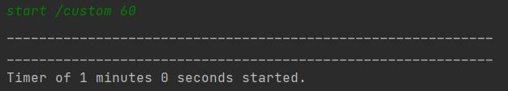

In the pop-up window:

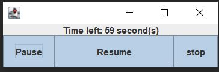

### Starting a stopwatch: `start stopwatch`
Not sure how long you'll need to complete your academic tasks? You can start a stopwatch to keep track of how long 
you've been studying.
- Stopwatch tracks and prints time elapsed.

Format: `start stopwatch`

**Example**

In the terminal:

In the pop-up window:

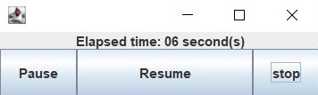

### Pausing a timer/stopwatch: `pause`
Pauses a study timer/stopwatch that is currently running. Useful for when you want a quick toilet break, double check
your tasks for the day, or mark a task as done.

Format: `pause` or clicking the pause button in the pop-up window.

**Example**

In the terminal:

In the pop-up window:

Time left in the window will not change until the user enters `resume`
in the terminal or clicks on the resume button.

### Resuming a timer/stopwatch: `resume`
You can resume a paused timer/stopwatch when you're ready to work on your tasks again.

- Resume a timer/stopwatch that has been paused.

Format: `resume` or clicking the resume button in the pop-up window.

**Example**

In the terminal:

In the pop-up window:

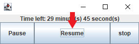

Time left/elapsed time will continue to run.

### Stopping a timer/stopwatch: `stop`
Finished your task earlier than expected, or something more urgent came up? You can stop a timer/stopwatch at any time.

- Stop a timer/stopwatch that has been started.

Format: 
- Entering `stop` in the terminal
- Clicking the stop button in the pop-up window
- Closing the pop-up window (Clicking the X button in the top right corner)

**Example**

In the terminal:

In the pop-up window:

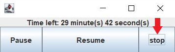

The window will disappear immediately after stopping the timer.

### Show your tasks: `show`
The show feature is supported in the study session, in case you need to remind yourselves of the tasks you have to 
complete. Simply follow the format from the [show feature](#show-your-tasks-show)
to show your tasks.

> 💡 **Note:**
>- You can only show tasks while the timer is paused or stopped.

**Example**

### Mark your tasks as done: `mark`

The mark feature also supported in the study session, so that you are able to mark tasks as done after you've completed
them in the study session.
Simply follow the format from the [mark feature](#marking-your-tasksmark-task_number--unmark-task_number)
to mark your task.

> 💡 **Note:**
>- You can only mark tasks while the timer is paused or stopped.
>- You can also use the unmark feature within the study session if you've marked a task wrongly.

**Example**

### Leave the study session: `leave`
Leave the study session to go back to the main session.

Format: `leave`

> 💡 **Note:** Your timer/stopwatch will be stopped if you leave the study session.

**Example**

## FAQ

**Q**: My save file is corrupted, how do I resolve this?

**A**: Sherpass will print an error message 

containing details of the corruption (e.g., missing fields, brackets). You can either modify the save file manually to
rectify the problem or allow Sherpass to create a new save file. 

> ⚠️ Caution: You will lose all previously saved tasks if you choose the latter!

**Q**: How do I transfer my data to another computer? 

**A**: Transfer a copy of your save file to your other device and place it in `[JAR FILE LOCATION]/data/Sherpass.json`

## Glossary

* *Parameter* - A parameter is the means by which a value is passed to the command processing program.
* *Extraneous* - Something that is unnecessary or irrelevant.
## Command Summary

| Action                        | Format, Examples                                                                                                                                                                                                                                 |
|-------------------------------|--------------------------------------------------------------------------------------------------------------------------------------------------------------------------------------------------------------------------------------------------|
| Generate timetable            | `show today` / `show DATE` / `show week` / `show MONTH`                                                                                                                                                                                          |
| List all tasks                | `show all`                                                                                                                                                                                                                                       |
| List all pending tasks        | `show todo`                                                                                                                                                                                                                                      |
| Clear multiple tasks          | `clear all` / `clear expired` / `clear done`                                                                                                                                                                                                     |
| Add single task               | `add TASK_DESCRIPTION /do DO_DATE /start START_TIME /end END_TIME [/bydate DUE_DATE /bytime DUE_TIME]` e.g. `add revise chapter 3 /do 25/6/2022 /start 20:00 /end 22:00`                                                                     |
| Edit single task              | `edit TASK_NUMBER [TASK_DESCRIPTION] [/do DO_DATE] [/start START_TIME] [/end END_TIME] [/bydate DUE_DATE /bytime DUE_TIME]` e.g. `edit 3 submit draft essay /start 10:00 /end 13:00`                                                         |
| Delete single task            | `delete TASK_NUMBER`                                                                                                                                                                                                                             |
| Add recurring task            | `add TASK_DESCRIPTION /do DO_DATE /start START_TIME /end END_TIME [/bydate DUE_DATE /bytime DUE_TIME] /repeat FREQUENCY` e.g. `add cs2113t weekly quiz /do 21/6/2022 /start 16:00 /end 18:00 /bydate 25/6/2022 /bytime 16:00 /repeat WEEKLY` |
| Edit recurring task           | `edit TASK_NUMBER [TASK_DESCRIPTION] [/do DO_DATE] [/start START_TIME] [/end END_TIME] [/bydate DUE_DATE /bytime DUE_TIME] /repeat` e.g.`edit 5 /start 13:00 /end 14:00 /repeat`                                                             |
| Delete recurring task         | `delete TASK_NUMBER /repeat`                                                                                                                                                                                                                     |
| Mark a task as done           | `mark TASK_NUMBER`                                                                                                                                                                                                                               |
| Mark a task as undone         | `unmark TASK_NUMBER`                                                                                                                                                                                                                             |
| Enter study session           | `study`                                                                                                                                                                                                                                          |
| Start default timer           | `start MODE_NUMBER`                                                                                                                                                                                                                              |
| Start custom timer            | `start /custom DURATION`                                                                                                                                                                                                                         |
| Start stopwatch               | `start stopwatch`                                                                                                                                                                                                                                |
| Pause timer/stopwatch         | `pause`                                                                                                                                                                                                                                          |
| Resume timer/stopwatch        | `resume`                                                                                                                                                                                                                                         |
| Stop timer/stopwatch          | `stop`                                                                                                                                                                                                                                           |
| Show tasks (in study session) | `show all`                                                                                                                                                                                                                                       |
| Leave study session           | `leave`                                                                                                                                                                                                                                          |
