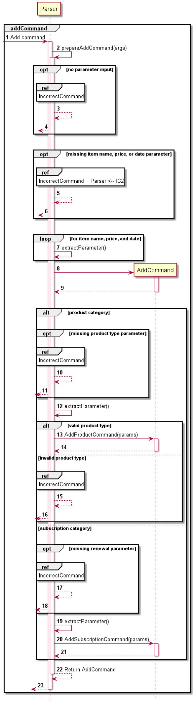

# Simplst User Guide

## Introduction

*Simplst* is a Warehouse Management System (WMS) for managing warehouse inventory and order management, optimzed for use 
via a Command Line Interface (CLI) for warehouse management workers and managers.

Simplst aims to improve efficiency and optimise standard warehouse tasks by having a CLI app which is simple to 
setup and quick to use. Simplst will mainly be used to add, remove, list and view goods and orders for the warehouse.

## Contents page
* [Explanation of Key Terms or Symbols](#explanation-of-key-terms-or-symbols)
* [Quick start](#quick-start)
* [Features](#features)
  * [Help Command](#help-command-help)
  * [Unit Good Commands](#unit-good-commands)
    * [Adding a Unit Good](#adding-a-unit-good-add-ug)
    * [Removing a Unit Good](#removing-a-unit-good-remove-ug)
    * [Listing Unit Goods](#listing-unit-goods-list-ug)
  * [Good Commands](#good-commands)
    * [Adding quantity of a Good](#adding-quantity-of-a-good-add-g)
    * [Removing quantity of a Good](#removing-quantity-of-a-good-remove-g)
    * [Listing available Goods](#listing-available-goods-list-g)
    * [Viewing a Good](#viewing-a-good-view-g)
    * [Finding a Good](#finding-a-good-find) 
  * [Order Commands](#order-commands)
    * [Adding an Order](#adding-an-order-add-o)
    * [Removing an Order](#removing-an-order-remove-o)
    * [Listing current Orders](#listing-current-orders-list-o)
    * [View Order](#view-order-view-o)
    * [Fulfill Order](#fulfill-order-fulfill)
  * [Orderline Commands](#orderline-commands)
    * [Adding an Orderline](#adding-an-orderline-add-og)
    * [Removing an Orderline by Quantity](#removing-a-quantity-of-an-orderline-remove-og)
    * [Listing Orderlines in an Order](#listing-orderlines-in-an-order-list-og)
  * [Exiting the Program](#exiting-the-program-bye)
  * [FAQ](#faq)
  * [Command Summary](#command-summary)

## Explanation of key terms or symbols

| Terms or Symbols used                              | Further Explanation                                                                                                                          |  
|----------------------------------------------------|----------------------------------------------------------------------------------------------------------------------------------------------|
| [Unit Good](#unit-good-commands)                   | A template containing details of a good.                                                                                                     |
| SKU                                                | Stands for Stock-Keeping Unit. It is the unique unit number for a specific warehouse item. It can contain characters and numbers (e.g WC01). |
| Capacity                                           | Size of the object defined as Small, Medium and Large.<br/>Small <br/>Medium <br/>Large                                                      |
| [Good](#good-commands)                             | A Good is the actual good that is currently in the warehouse inventory.                                                                      |
| [Order](#order-commands)                           | An order in Simplst is used to know who made the order and what goods to deliver to that shipping address.                                   |
| [Orderline](#orderline-commands)                   | An orderline is the goods required by the order.                                                                                             |
| [Fulfill](#fulfill-order-fulfill)                  | Used to check and indicate if an order is completed.                                                                                         |
| `Words in MarkUp`                                  | Used to highlight keywords used for commands and commands themselves.                                                                        |
|  | Used to denote features for warehouse managers.                                                                                              |
| `*Optional*`                                       | Fields in MarkUp bounded by asterisks (*) are optional to be filled in, but should be replaced with a space ' ' instead.                     |


This User Guide is meant for both warehouse workers and managers to learn how to use Simplst and the features to 
improve efficiency in managing warehouse inventory and orders. 

## Quick Start

1. Ensure that you have Java 11 or above installed.
If you do not, you can download it from [here](https://www.oracle.com/java/technologies/downloads/#java11).

2. Down the latest version of ***Simplst*** from [here](https://github.com/AY2122S2-CS2113T-T09-4/tp/releases/).
3. Copy the file to the folder you want to use as the home folder for Simplst
4. Open the terminal in the folder which contains Simplst.jar and run java -jar Simplst.jar. The Startup should look like below:
```
____________________________________________________________
New login.
Hello from
Simplst
What would you like to do?
____________________________________________________________
```
5. Type the commands in the terminal and press `Enter` to execute them. For example: typing help and pressing `Enter` will show you the features
    available in Simplst and how to type the command into the command line.

## Features

### Help Command `help`
All the features can be viewed on the Command-Line Interface using the help command if you want to view the commands
there instead. This is done by using the `help` command. You can also use flags to indicate which specific set of commands
to view.

Help Commands:
* `help` - View all commands
* `help ug` - View commands related to Unit Goods
* `help g` - View commands related to Goods
* `help o` - View commands related to Orders and Orderlines

### ***Unit Good Commands***
A Unit Good is a template of a good. A unit good should be added to the warehouse to allow Simplst to know what kind goods will be added to the warehouse later.
Unit Goods can help Simplst to estimate storage capacity in the future and other predicitive features for future versions. 

A Unit Good contains:
* Unique SKU
* Name
* Description of unit good
* Capacity

### Adding a Unit Good `add ug/`
Add a new unit good to the warehouse, creating a Good with quantity 0 in the process.


Format: `add ug/ sku/[SKU] n/[NAME] d/*[DESCRIPTION]* size/[CAPACITY]`

Note: 
* Refer to the explanation on Key Terms and Symbols for what an SKU is
* Optional description field. If there are no descriptions, key in `d/` followed by a space before keying in the next parameter.
* If the size input is not either [SMALL / MEDIUM / LARGE], the capacity would be set to the default MEDIUM

Example of adding a unit good:<br/>
Adding a Unit Good with SKU being WC1, with name Wooden Chair, description as Chair made of oak from Europe, and a size of Medium<br/>

`add ug/ sku/WC1 n/Wooden Chair d/Chair made of oak from Europe size/Medium`

Expected Output
```
Unit Good of SKU: WC1 added to warehouse
Another command?
```

### Removing a Unit Good `remove ug/`
Removing a unit good from the warehouse.

Format: `remove ug/ sku/[SKU]`

Note:
* Usually used when there occurs a mistake when a Unit Good is added, or if the warehouse does not store the Unit Good
anymore

Example of removing a unit good:<br/>
Removing a Unit Good of SKU WC1<br/>

`remove ug/ sku/WC1`

Expected Output
```
Unit Good of SKU: WC1 has been removed from warehouse
Another command?
```

### Listing Unit Goods `list ug/`
Listing all Unit Goods already added to the warehouse.

Format: `list ug/`

Example of listing Unit Goods:<br/>
`list ug/`

Expected Output
```
List of unit goods (in no order):
	WC1 - Wooden Chair (chair made of oak from europe)
	WC2 - Wooden Table (Table made of oak from Italy)
Another command?
```
### ***Good Commands***
A Good is the actual good that is currently in the warehouse inventory. It will also have the same information as the Unit Good previously added into Simplst with the same SKU.
In addition to the details in the Unit Good, a Good will also contain:
- Quantity of good available in the warehouse

### Adding quantity of a Good `add g/`
Adding a quantity of a Unit Good to be available at the warehouse.

Format: `add g/ sku/[SKU] qty/[QUANTITY]`

Example of adding quantity to a specific Unit Good:<br/>
Adding 30 of a good with its SKU being WC1<br/>

`add g/ sku/WC1 qty/30`

Expected Output
```
30 of Good with SKU: WC1 added to warehouse
Another command?
```

### Removing quantity of a Good `remove g/`
Removing a quantity of a Unit Good available at the warehouse.

Format: `remove g/ sku/[SKU] qty/[QUANTITY]`

Note:
* Used when certain units of the good has been shipped out and thus quantity has to be decreased.

Example of removing quantity of a specific Unit Good:<br/>
Removing 10 of a good with its SKU being WC1<br/>

`remove g/ sku/WC1 qty/10`

Expected Output
```
10 of Good with SKU: WC1 has been removed from warehouse
Another command?
```

### Listing available Goods `list g/`
Listing all available goods in the warehouse.

Format: `list g/`

Example of listing all Goods (This will continue the above example [here](#adding-quantity-of-a-good-add-g)):<br/>

Note:
* If a unit good is added, but the good has yet to be added into the warehouse (There are currently 0 quantity of the good in the warehouse). It will not show up in the list of goods.

`list g/`

Expected Output
```
List of available goods with its quantity:
	WC1 - Wooden Chairs (chair made of oak from Europe) [Qty: 30]
Another command?
```

### Viewing a good `view g/`
View a good in the warehouse using its SKU. This will show more details of the specified good.

Format: `view g/ sku/[SKU]`

Example of finding a Good:<br/>
Viewing details of the Wooden Chair with SKU: WC1

`view g/ sku/WC1`

Expected Output
```
WC1 - Wooden Chair (chair made of oak from Europe) [Qty: 30]
Unit size of good: MEDIUM
Another command?
```

If there are no Unit Good in the warehouse with such SKU, Simplst will inform you accordingly.
Example of trying to view an SKU not in the warehouse.

`view g/ sku/fakeSKU`

Expected Output
```
Could not find good with given SKU! Please check input SKU!
Another command?
```

### Finding a Good `find`
Finding Goods in the warehouse through the name of the Unit Good. After finding the goods, it will show the details of all the goods found.

Format: `find n/[NAME]`

Example of finding a Good:<br/>
Finding if any Unit Good with "Wooden" in its name exists in the warehouse.

`find n/Wooden`

Expected Output
```
WC1 - Wooden Chair (chair made of oak from Europe) [Qty: 30]
Unit size of good: MEDIUM
WC2 - Wooden Table (Table made of oak from Italy) [Qty: 0]
Unit size of good: LARGE
Another command?
```

If there are no Unit Goods in the warehouse with its name containing any part of the input, Simplst will inform you accordingly.
Example of trying to find spoon in the warehouse.

`find n/spoon`

Expected Output
```
Could not find any item contining 'spoon' in the inventory!
Another command?
```

### ***Order Commands***
An order in Simplst is used to know who made the order and what goods to deliver to that shipping address.

An Order contains:
* Order ID which will be a unique positive number
* Receiver name
* Shipping address

### Adding an Order `add o/`


Adding a new order to be tracked in the warehouse.

Format: `add o/ oid/[ORDER_ID] r/[RECEIVER_NAME] addr/[SHIPPING_ADDRESS]`

Notes: 
* Order ID (oid) must be an unique non-negative number (i.e 0, 1, 2... etc)

Example of adding an order for Danny Phantom who lives at Amity Park:<br/>

`add o/ oid/1 r/Danny Phantom addr/Amity Park`

Expected Output
```
Order 1 added to the warehouse
Another command?
```

### Removing an Order `remove o/`


Removing the quantity of a Unit Good from its previous value.

Format: `remove o/ oid/[ORDER_ID]`

Example of removing order 1:<br/>

`remove o/ oid/1`

Expected Output
```
Order 1 has been removed
Another command?
```

### Listing Current Orders `list o/`


Listing all orders in the warehouse. This would show the order details such as:
* Order id
* Receiver Name
* Shipping address
* Fulfilled/Completion status

Format: `list o/`

Example of listing all Orders (This will continue the above example [here](#adding-an-order-add-o)):<br/>

`list o/`

Expected Output
```
List of orders:
	1 - Danny Phantom (Amity Park) : completed
Another command?
```

### View Order `view o/`


View a specific order in the warehouse. This would show the order details such as:
* Order id
* Receiver Name
* Shipping address
* Details of the orderlines relating to this order

Format: `view o/ oid/[ORDER_ID]`

Example of viewing order ID 1: `view o/ oid/1`

Expected Output
```
Viewing order with order ID 1
Receiver: Danny Phantom
Shipping address:Amity Park
Items in the order:
8 of WC1 - Wooden Chair needed (Not Done)
Another command?
```

If there are no such order in the warehouse with the specified order ID, Simplst will inform you accordingly.

Example of trying to find order ID 4: `view o/ oid/4`

Expected Output
```
Could not find order with given id!
Another command?
```

### Fulfill Order `fulfill`


Fulfill a currently unfulfilled order in the warehouse. To fulfill an order, Simplst will check if all the orderlines relating to the order have their required quantities met.<br/>
When all the orderlines quantities are fulfilled, the order will be considered as fulfilled.

Format: `fulfill oid/[ORDER_ID]`

Note: 
* If the current quantity in the warehouse is lesser than the required quantity to fulfill an orderline, Simplst will not fulfill that orderline and consequently not fulfill that order

Example of fulfilling order 1:<br/>

`fulfill oid/1`

Expected Output
```
Order 1 completed
Another command?
```

If there are no such order in the warehouse with the specified order ID, Simplst will inform you accordingly.
Example of trying to fulfill order ID 4.
`view o/ oid/4`

Expected Output
```
No order with oid: 4 found in the warehouse
Another command?
```

If the order in the warehouse with the specified order ID are already fulfilled, Simplst will inform you accordingly.
Example of trying to fulfill order ID 1 which is already fulfilled.
`fulfill oid/1`

Expected Output
```
Order 1 already completed
Another command?
```

### ***Orderline Commands***
An orderline is the goods required by the order. It is the same as a Good with the same SKU, and contains the quantity required to fulfill the good.

In addition to the details in a Good. An orderline will also contain:
- Quantity of Good required to fulfill the order

### Adding an Orderline `add og/`
This will add an orderline to a specific order.

Format: `add og/ oid/[ORDER_ID] sku/[SKU] qty/[QUANTITY_NEEDED_FOR_ORDER]`

Example of adding an orderline to order ID 1 for 10 Wooden Chairs:<br/>

`add og/ oid/1 sku/WC1 qty/10`

Expected Output
```
Wooden Chair is added to order. 8 required to fulfill
8 of WC1 is added to order number 1
Another command?
```

### Removing a quantity of an Orderline `remove og/`
Removing the quantity required in an orderline from a specific order.

Format: `remove og/ oid/[ORDER_ID] sku/[SKU] qty/[QUANTITY_TO_REMOVE]`

Example of removing 1 Wooden Chair orderline from order ID 1:<br/>

`remove og/ oid/1 sku/WC1 qty/1`

Expected Output
```
1 Wooden Chair is removed.
Another command?
```

### Listing Orderlines in an Order `list og/`
Listing the orderlines from a specific order.

Format: `list og/ oid/[ORDER_ID]`

Example of listing orderlines linked to order ID 1:<br/>

`list og/ oid/1`

Expected Output
```
9 of WC1 - Metal Chair needed (Not Done)
Another command?
```

## Exiting the Program `bye`
In order to properly exit the program and ensure the session is saved onto a file, we use the `bye` command.

Example of using the `bye` to exit the program and a successful save of the session:

`bye`

Expected Output
```
Warehouse information succesfully stored in output/WAREHOUSE.json
State saved!
Bye
```

## Saving Program State
The program uses a savefile to save all information before the program exits, and loads back everything when the program first starts up. 

All you have to do is ensure that the jar file and the savefile are in a specific file directory structure as shown below:

tp.main.jar
output/
	WAREHOUSE.json
	
You are strongly advised against editting the savefile structure. We did not design this system to handle manual edits to the savefile.

## FAQ
Q: How to use the program effectively as a new user?

A: Start by [adding Unit Goods](#adding-a-unit-good-add-ug) to your Warehouse. Once satisfied with the content,
begin [populating the available Goods](#adding-quantity-of-a-good-add-g) so that there are Goods available in the
warehouse. As orders for Goods come in, you can begin [adding Orders](#adding-an-order-add-o) and [goods to those Orders](#adding-an-orderline-add-og)
to simplify workflow for your Warehouse needs. Other features can be done as well including [listing available Goods](#listing-available-goods-list-g)
to enhance usage of this program.

## Command Summary

| Action                               | Command to be keyed into the terminal                             |
|--------------------------------------|-------------------------------------------------------------------|
| Add Unit Good                        | `add ug/ sku/[SKU] n/[NAME] d/*[DESCRIPTION]* size/[CAPACITY]`    |
| Remove Unit Good                     | `remove ug/ sku/[SKU]`                                            |
| List Unit Good                       | `list ug/`                                                        |
| Add Good quantity                    | `add g/ sku/[SKU] qty/[QUANTITY]`                                 |
| Remove Good quantity                 | `remove g/ sku/[SKU] qty/[QUANTITY]`                              |
| List Goods (with quantity displayed) | `list g/`                                                         |
| Viewing a Good                       | `view g/ sku/[SKU]`                                               |
| Find Good                            | `find n/[NAME]`                                                   |
| Add Order                            | `add o/ oid/[ORDER_ID] r/[RECEIVER_NAME] addr/[SHIPPING_ADDRESS]` |
| Remove Order                         | `remove o/ oid/[ORDER_ID]`                                        |
| List Orders                          | `list o/`                                                         |
| View Order                           | `view o/ oid/[ORDER_ID]`                                          |
| Fulfill Order                        | `fulfill oid/[ORDER_ID]`                                          |
| Add Orderline                        | `add og/ oid/[ORDER_ID] sku/[SKU] q/[QUANTITY_NEEDED]`            |
| Remove Orderline Quantity            | `remove og/ oid/[ORDER_ID] sku/[SKU] q/[QUANTITY_TO_REMOVE]`      |
| List Orderlines                      | `list og/ oid/[ORDER_ID]`                                         |

