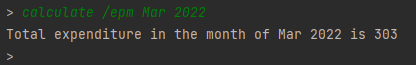

# MindMyMoney User Guide

* [Introduction](#introduction)
* [Quick start](#quick-start)
* [Command summary](#command-summary)
* [Features](#features)
   * [Display list of currently available commands: `help`](#display-list-of-currently-available-commands-help)
   * [Add an expenditure to your program: `add`](#add-an-expenditure-to-your-program-add)
   * [Display current list of expenditures: `list` ](#display-current-list-of-expenditures-list)
   * [Modify an expenditure on your list: `update`](#modify-an-expenditure-on-your-list-update)
   * [Removing an expenditure on your list: `delete`](#removing-an-expenditure-on-your-list-delete)
   * [Calculations that Mindmymoney provide: `calculate`](#calculations-that-mindmymoney-provide-calculate)
      * [Expenditure per month: `calculate /epm`](#expenditure-per-month-calculate-epm)
   * [Exiting MindMyMoney application: `bye`](#exiting-mindmymoney-application-bye)
   * [Saving the data](#saving-the-data)
* [FAQ](#faq)
## Introduction
### MindMyMoney
`MindMyMoney` (M3) is a desktop app for managing your financials, optimized for use via a 
Command Line Interface (CLI). You can use it to track your spending with multiple payment methods, 
calculate monthly expenditure, set financial goals and much more! If you are new to managing your finances, this app
is for you!

### User Guide
This guide aims to equip users with the knowledge on how to set up the application and to utilise its many features.
Click on the hyperlinks in the content page above to quick navigation on the page!

## Quick Start

1. Ensure that you have Java 11 or above installed. Click 
   [here](https://docs.aws.amazon.com/corretto/latest/corretto-11-ug/downloads-list.html) for the link to the Java 11
   installer.
2. Down the latest version of `MindMyMoney.jar` from [here](https://github.com/AY2122S2-CS2113T-T10-4/tp/releases)).
3. Copy the file to the folder you want to use as the _home folder_ for your MindMyMoney.
4. Open a command line terminal in your _home folder_ and run `java -jar MindMyMoney.jar`. 
   The startup interface similar to the one below should appear in a few seconds.  
   
5. Type the command in the command box and press Enter to execute it. e.g. typing **`help`** and pressing Enter will
   show a help page.  
   Some example commands you can try:

    * **`list`** : Lists all tasks.
    * **`add`**`/pm cash /c Food /d Porridge /a 3 /t 2022-03` :
      Adds $3 porridge that was paid by cash on March 2022 to the list.
    * **`calculate`**`/epm Mar 2022` : Calculates total expenditure in the month of March 2022.  
    * **`update`**`1 /pm cash /c Food /d Porridge /a 3 /t 2022-03` :
      Updates index 1 to reflect $3 porridge that was paid by cash on March 2022 to the list.
    * **`delete`**`2` : Deletes the 2nd expenditure shown in the expenditure list.
    * **`bye`** : Exits the app.

6. Refer to the [Features](#features) below for details of each command.  
## Command Summary  

| Command | Format, examples                                                                                                                           |
|---------|--------------------------------------------------------------------------------------------------------------------------------------------|
| Help    | `help`   Prints a list of available commands                                                                                           |
| Add     | `add /pm [PAYMENT_METHOD] /c [CATEGORY] /d [DESCRIPTION] /a [AMOUNT] /t [DATE]` e.g `add /pm cash /c Food /d Porridge /a 3 /t 2022-03` |
| List    | `list`  Displays the current list of expenditures stored by the user                                                                   |
| Delete  | `delete [INDEX]` e.g `delete 1`                                                                                                        | 
| Update  | `update [INDEX] [NEW_DESCRIPTION] [NEW_AMOUNT]` e.g `update 2 snacks 5`                                                                |
| Exit    | `bye`  Shuts down `MindMyMoney` application                                                                                            |
|

## Features  
The following are features of the `MindMyMoney` application. Please ensure that the your input follows the 
format of commands given is accurately.  
Words in `[SQUARE_BRACKETS]` are the parameters.  

### Display list of currently available commands: `help`  
Prints a list of currently available commands.   
Format:`help`   
  

### Add an expenditure to your program: `add`  
Adds an expenditure to your program. Only **one** expenditure can only be added per command.  
Format:`add /pm [PAYMENT_METHOD] /c [CATEGORY] /d [DESCRIPTION] /a [AMOUNT] /t [DATE]`   
* `[PAYMENT_METHOD]` refers to the method of payment used.
  * Enter `cash` or the name of a credit card you have saved.  
* `[CATEGORY]` refers to the category of the expenditure
  * Enter `Food`, `Transport`, `Utilities`, `Personal`, `Entertainment` or `Others`. Any input outside this list is rejected.  
* `[DESCRIPTION]` refers to the name of the expenditure. 
  * For example `Nike shoes`.
* `[AMOUNT]` refers to the cost of the expenditure.
  * Enter the amount in dollars rounded off to the nearest cent.
  * For example an item that cost $420 and 69 cents will be entered as `420.69`.
* `[DATE]` refers to the date of the purchase of the expenditure.
  * Format of the date is YYYY-MM.
  * For example `March 2022` will be entered as `2022-03`
  
Example:`add /pm cash /c Food /d Porridge /a 3 /t 2022-03`  

> **💡 Note:**
>- `[CATEGORY]` and `[PAYMENT_METHOD]` are **case-insensitive**.  
>- `[AMOUNT]` only excepts numbers with 2 decimal places. Any more decimal places will be rounded or ignored 
>- `[DATE]` does not require any day input.
  
> **⚠️Warning:**
>- Input realistic values, any unrealistic values can crash the system and harm your save file! 
>- All flags are compulsory! Input the flags in the order given, else the application will not be able to read your 
   > input.

### Display current list of expenditures: `list`   
Prints in the terminal the current list of expenditures that you have logged so far   
Format:`list`  
  

### Modify an expenditure on your list: `update`   
Modify an expenditure on your list, by specifying the expenditure's index.   
Use the `list` command to view the current indices of your expenditures.   
Format:`update [INDEX] [NEW_DESCRIPTION] [NEW_AMOUNT]`  
For example: `update 1 drinks 2`  
  

### Removing an expenditure on your list: `delete`  
Delete an expenditure from your list, by specifying the expenditure's index.  
Use the `list` command to view the current indices of your expenditures.   
Format:`delete`  
For example: `delete 1`
  

### Calculations that Mindmymoney provide: `calculate`
Mindmymoney provides a large suite of calculating features. See below for more details of each feature.

#### Expenditure per month: `calculate /epm`
Shows the sum of the amounts of expenditures you have made in a month of a certain year.  
Format:`calculate /epm MMM YYYY`  
* Enter Month in `MMM` format, with first letter capitalised. For example `Jan`.
* Enter Year in `YYYY` format. For example `2022`
* Enter Month and Year seperated by a space, `MMM YYYY`. For example `Dec 2021`
For example: `calculate /epm Mar 2022`  
  
> **💡 Note:**
> - If you want to search for exact month in year, enter both month and year.
>  - Month is **case-sensitive**.
> - However, you can also use this function to search for expenditures in the year by typing `calculate /epm 2022`.  

### Exiting MindMyMoney application: `bye`  
Shuts down the MindMyMoney application.  
Format:`bye`  
  

### Saving the data:
Mindmymoney data are saved in the hard disk automatically after any command that changes the data. 
There is no need to save manually.

## FAQ

**Q**: Why is my data not saved when I run Mindmymoney in different folders?

**A**: Mindmymoney saves data in the current directory. To ensure all data is saved properly,
run Mindmymoney only in the _home folder_. 

