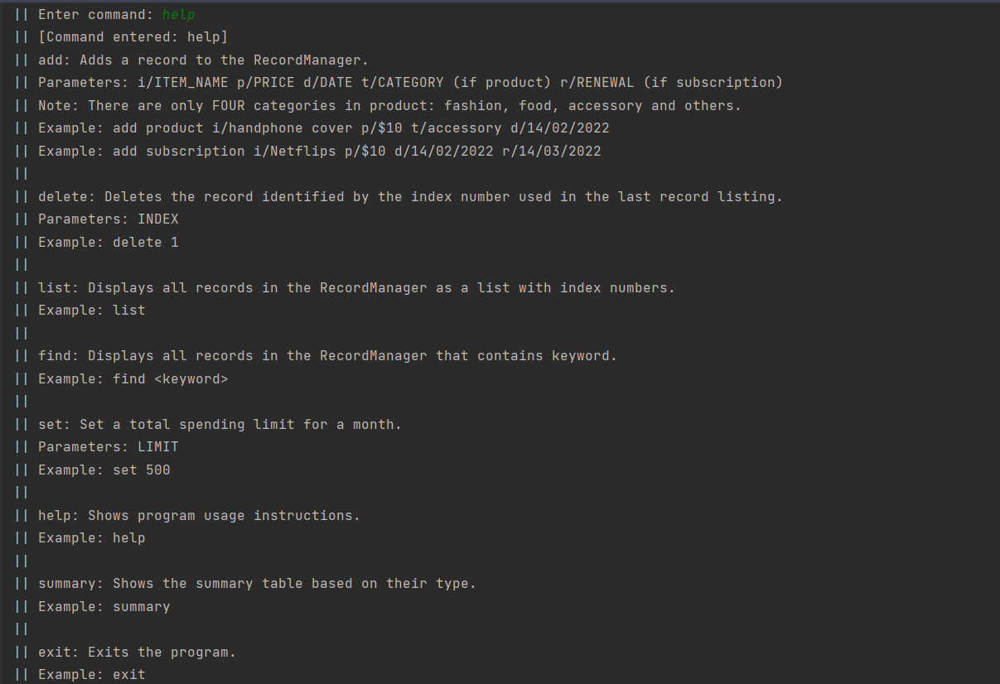
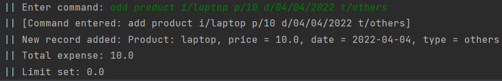
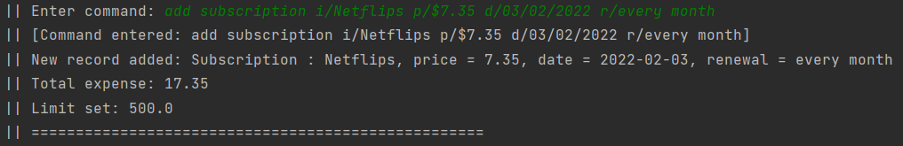
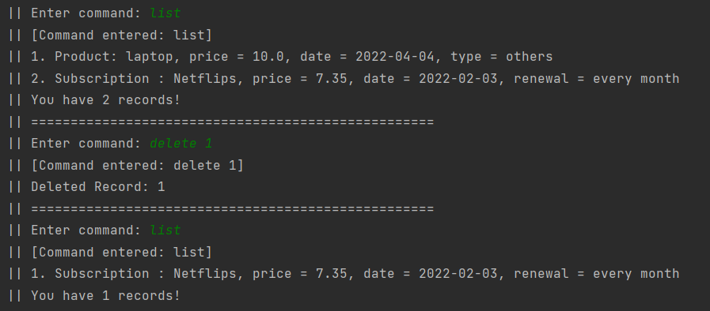
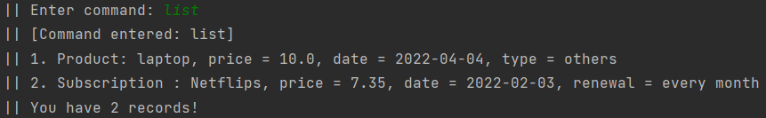
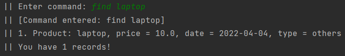
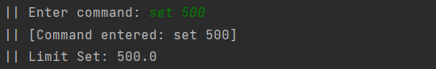
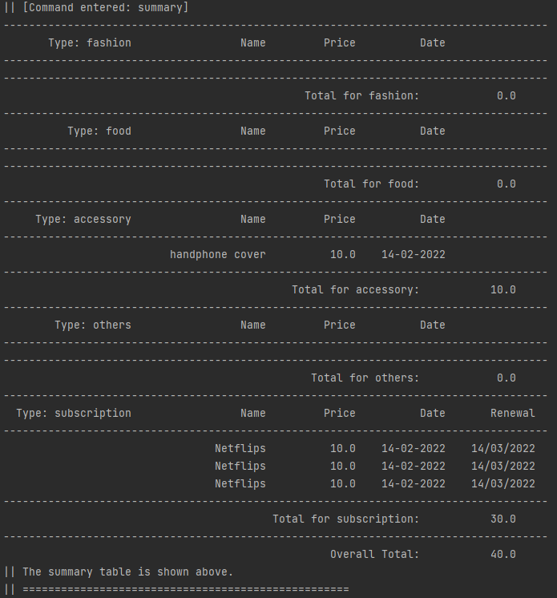

# User Guide
- [Introduction](#introduction)
- [Quick Start](#quick-start)
- [Features](#features)
  - [Get help message](#get-help-message-help)
  - [Add a record](#add-a-record-add)
    - [Add product record](#adding-product-record-add-product)
    - [Add subscription record](#adding-subscription-record-add-subscription)
  - [Delete a record](#delete-a-record-delete)
  - [Show record list](#show-record-list-list)
  - [Find records](#find-records-find)
  - [Setting limit](#setting-limit-set)
  - [Showing summary](#showing-summary-summary)
  - [Exit the program](#exit-the-program-exit)
- [FAQ](#faq)
- [Command Summary](#command-summary)

## Introduction
As online shopping becomes more convenient and transactions become easier, people tend to overshoot their budget
because they are not aware of their accumulated expenditure.
Spendvelope is designed to regularly remind the buyer of their preset spending limit for each month.

## Quick Start

1. Ensure that you are running Java 11.
2. Download the latest version of `Spendvelope` from [here](https://github.com/AY2122S2-CS2113-F12-1/tp/releases/download/V2.1/Spendvelope.jar).
Place it in an empty folder.
3. Using Cmd Prompt, navigate to the folder where the `jar` file is stored. Run `Spendvelope` with 
`java -jar Spendvelope.jar`.

## Features 
1. Get help message
2. Add a record
   1. Add product record
   2. Add subscription record
3. Delete a record
4. Show record history list
5. Search for expenses by keyword
6. Set spending limits and give warnings
7. View order summary(classified by summary)
8. Closing the program
    
    
### Get help message: `help`
Shows program usage instructions.

Format: `help`

 
 
### Add a record: `add`
Adds a record to the RecordManager.
#### Adding product record: `add product`
Adds a product record to the record list.

Format: `add product i/ITEM_NAME p/PRICE d/DATE t/CATEGORY`

* The `ITEM_NAME` can be in a natural language format. Should not be left empty.
* The `PRICE` should be a double value, i.e "xx.yy" or "xx" where x and y are digits.
  * Default `PRICE` value is 0 if no double value is given.
  * The first double value is taken if multiple double values are given.
* The `DATE` must be of format "dd/mm/yyyy".
* The `CATEGORY` should be of fashion, food, accessory, or others.  
* avoid using `|` as your input

Examples of usage:

`add product i/laptop p/$10 t/others d/04/04/2022`

#### Adding subscription record: `add subscription`
Adds a subscription record to the record list.

Format: `add subscription i/ITEM_NAME p/PRICE d/DATE r/RENEWAL`

* The `ITEM_NAME` can be in a natural language format. Should not be left empty.
* The `PRICE` can be any double value, i.e "xx.yy" or "xx" where x and y are digits.
  * Default `PRICE` value is 0 if no double value is given.
  * The first double value is taken if multiple double values are given.
* The `DATE` must be of format "dd/mm/yyyy".
* The `RENEWAL` can be in a natural language format.
* avoid using `|` as your input

Examples of usage:

`add subscription i/Netflips p/$7.35 d/03/02/2022 r/every month`

 

### Delete a record: `delete`
Deletes the record identified by the record number used in the record list.

Format: `delete INDEX`

* `INDEX` is the record number in the record list. It may be obtained using [`list`](#show-record-list-list)

Examples of usage:

`delete 1` - deletes record #1

 
 
### Show record list: `list`
Displays all records in the RecordManager as a list with their index numbers.

Format: `list`

 
 
### Find records: `find`

filter all the records in the RecordManager and display it as a list.

Format: `find KEYWORD`

* The `KEYWORD` can be any String.
* The `KEYWORD` is used to filter the name of the records in RecordManager.

Example of usage: `find laptop`

 
 
### Setting limit: `set`
Set a total spending limit for a month and display the warning
if the total expenditure exceeds the limit.

Format: `set LIMIT`

* The `LIMIT` can be any number greater than zero.
* The `LIMIT` is initialized as zero.

Example of usage: `set 500`

 
 
### Showing summary: `summary`
Show the summary table based on the record type.

Example of usage: `summary`

* In the summary table, records are classified into 5 types:
fashion, food, accessory, others, and subscription with detailed record information.
* The summary table also shows expenses on each category and the overall expenses.
   
   
### Exit the program: `exit`
Closes the program.

Format: `exit`

## FAQ

**Q**: What is the Spendvelope for?

**A**: The spendvelope is create to help users to take note of their purchase

**----------------------------------------------------------------------------**

**Q**: Is it okay for user to manually change the file source?

**A**: The user shouldn't change the data file on their own as it could tamper with the functionality of Spendvelope
 
## Command Summary

* Add product record `add product i/ITEM_NAME p/PRICE d/DATE t/CATEGORY`
* Add subscription record `add subscription i/ITEM_NAME p/PRICE d/DATE r/RENEWAL`
* Delete record `delete INDEX`
* Display record list `list`
* Find record by keyword `find KEYWORD`
* Set limit `set LIMIT`
* Show help message `help`
* Show summary table based on types `summary`
* Exit the program `exit`