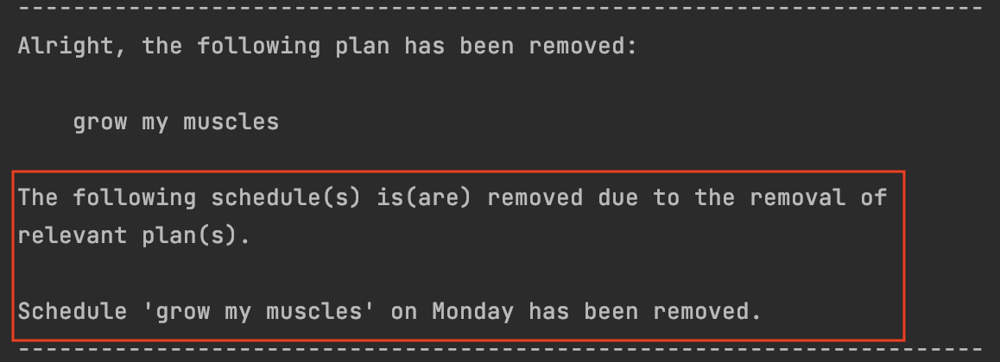

# WerkIt! User Guide

## Introduction

WerkIt! is an application for managing workout routines,
optimized for use via a Command Line Interface (CLI). This application is for you if you wish to
have an application to keep track of your workouts, plans and workout routines for a week.

You will be able to create, view, update and delete the workouts and plans you have created and store them in the application.
You will also be able to schedule your workout plans for a week (7 days). 

This user guide is designed to help you understand what WerkIt! can offer you. You can also follow this guide closely 
to understand how WerkIt! works, such as knowing the commands to perform the different functions 
that WerkIt! has. 

### Terminology 
Please take note of these few terms. It is explained as below:

| Term       | Description                                                                                                              |
|------------|--------------------------------------------------------------------------------------------------------------------------|
| Exercise   | A single unit of exercise. <br/>Example: "push up", "pull up", "sit up"                                                  |
| Repetition | The process of repeating an exercise. Often abbreviated to 'reps'.                                                       |
| Workout    | An exercise with a quantity/number of repetitions. <br/>Example: "5 push up", "5 pull up", "10 sit up"                   |
| Plan       | A set of workouts. <br/>Example: A plan named "arms" will contains "5 push up, 5 pull up"                                |
| Schedule   | Plan schedule for a day. The schedule is set for a week. <br/>Example: "arms" plan will be added to Monday in the schedule |

### Notations Used In This Guide
When reading this document, there are several icons that you may encounter.
Below are the icons and their meanings:


<span class="box warning">:warning: **Warning**: Information that you may want to pay attention to in order to prevent
possible issues from arising when using the application.</span>

<span class="box info">:memo: **Note**: Additional information that may be useful for you.</span>

---

## Table of Contents
* [Quick Start Guide](#quick-start-guide)
    * [Recommended Terminals](#recommended-terminals) 
* [Features](#features)
  * [Application Flow](#features) 
  * [Finding Your Way Around The Application](#finding-your-way-around-the-application)
  * [Exercise And Workout Features](#exercise-and-workout-features)
    * [Show All Exercises: `exercise /list`](#show-all-exercises-exercise-list)
    * [Create A Workout: `workout /new`](#create-a-workout-workout-new)
    * [Show All Workouts: `workout /list`](#show-all-workouts-workout-list)
    * [Delete A Workout: `workout /delete`](#delete-a-workout-workout-delete)
    * [Update A Workout: `workout /update`](#update-a-workout-workout-update)
  * [Plan Features](#plan-features)
    * [Create A Plan: `plan /new`](#create-a-plan-plan-new)
    * [List A Plan: `plan /list`](#list-a-plan-plan-list)
    * [List Details Of A Plan: `plan /details`](#list-details-of-a-plan-plan-details)
    * [Delete A Plan: `plan /delete`](#delete-a-plan-plan-delete)
  * [Schedule Features](#schedule-features)
    * [Update Schedule: `schedule /update`](#update-schedule-schedule-update)
    * [View Schedule: `schedule /list`](#view-schedule-schedule-list)
    * [Clear Schedule For A Day: `schedule /clear`](#clear-schedule-for-a-day-schedule-clear)
    * [Clear Schedule For The Week: `schedule /clearall`](#clear-schedule-for-the-week-schedule-clearall)
  * [Search Features](#search-features)
    * [Search For Exercise: `search /exercise`](#search-for-exercise-search-exercise)
    * [Search For Workout: `search /workout`](#search-for-workout-search-workout)
    * [Search For Plan: `search /plan`](#search-for-plan-search-plan)
    * [Search For All: `search /all`](#search-for-all-search-all)
  * [View Help: `help`](#view-help-help)
* [WerkIt!'s Local Storage Information](#werkits-local-storage-information)
* [Frequently Asked Questions (FAQ)](#frequently-asked-questions-faq)
* [Command Summary](#command-summary)

---

## Quick Start Guide

1. Ensure that you have [Java 11](https://www.oracle.com/java/technologies/downloads/) or above installed.
2. (For Microsoft Windows users) Download [Windows Terminal][1] from the Microsoft Store.
3. Download the latest version of WerkIt! from [here](https://github.com/AY2122S2-CS2113T-T09-2/tp/releases).
4. Create a new directory and move the WerkIt! JAR file to that directory.
5. Open Windows Terminal (for Microsoft Windows users) or the other recommended terminals as listed in 
['Recommended Terminals'](#recommended-terminals) based on your operating system.
6. Set your current working directory to the new directory.
7. Run the WerkIt! application with the command: `java -jar WerkIt.jar`.

### Recommended Terminals
The following table lists down the operating systems and their respective terminals that WerkIt! has been tested on to 
work.

| Operating System  | Version                        | Recommended Terminal                                                                                                |
|:------------------|:-------------------------------|:--------------------------------------------------------------------------------------------------------------------|
| Microsoft Windows | Windows 10 2004 and above      | Windows Terminal ([User Guide](https://docs.microsoft.com/en-us/windows/terminal/))                                 |
| Apple macOS       | macOS 10.15 Catalina and above | Terminal ([User Guide](https://support.apple.com/en-sg/guide/terminal/apd5265185d-f365-44cb-8b09-71a064a42125/mac)) |
| Ubuntu Linux      | Ubuntu 20.04.3 (LTS) and above | Bash Terminal ([User Guide](https://ubuntu.com/tutorials/command-line-for-beginners#3-opening-a-terminal))          |

<span class="box warning">:warning: If your operating system is not listed in the table above, it means our application has 
not been tested on it, and we cannot guarantee that the application will work as intended. We highly encourage you to 
use one of the recommended operating systems listed in the table above. 
We apologise for any inconvenience caused.</span>

<span class="box warning">:warning: (For Microsoft Windows users) In order for the application to display colours properly
on your screen, Windows Terminal needs to be used. The default Command Prompt and Powershell consoles will not be able
to display WerkIt!'s coloured texts properly, so it might show some weird symbols. See [this FAQ](#1-my-terminal-in-windows-is-displaying-weird-symbols-when-i-run-the-application) for more details.</span>

<div class="button-container"><a class="button" href="#table-of-contents">Back to Table of Contents</a></div>

---
## Features 
In this section, features of the application can be classified into 4 main categories. They are: <br>
* [Exercise and Workout Features](#exercise-and-workout-features)
* [Plan Features](#plan-features) 
* [Schedule Features](#schedule-features)
* [Search Features](#search-features)

Each feature is being run by a specific command format. When the command format is matched, 
the command will then be processed by the application and produce the intended outcome. The format of the commands
contains two types of formatting.

| Format           | Parameters                                                                                                                      |
|------------------|---------------------------------------------------------------------------------------------------------------------------------|
| `<condition>`    | Contents enclosed between "<>" are the inputs needed for the command to be valid. <br /> Not all commands needs input.          |
| `/commandAction` | Content after "/" is to classify the action of the command. <br/> Such as classifying it to be list / delete / update commands. |

<span class="box warning">:warning: **Heads Up!** Your inputs cannot contain the pipe character `|`!</span>

The following diagram gives you the general procedure on how to create your workout schedule:


### Finding Your Way Around The Application
* [Workout Commands](#workout-commands)
* [Plan Commands](#plan-commands)
* [Schedule Commands](#schedule-commands)
* [Search Commands](#search-commands)

<span class="box warning">:warning: **Heads Up!** Due to the design of WerkIt!, commands, `/commandAction`, and
`<condition>` must be separated by a single whitespace. Excessive whitespaces will not be accepted by the application.
However, plan names may have more than a single whitespace in between words.<br/><br/>
**Examples of Incorrect Usage**<br/>
:x: `workout /new     push up   /reps   1000`<br/>
:x: `plan    /list`<br/>
:x: `plan /new Leg Day    /workouts    1, 2, 3`
<br/><br/>
**Examples of Correct Usage**<br/>
:heavy_check_mark: `workout /new push up /reps 1000`<br/>
:heavy_check_mark: `plan /list`<br/>
:heavy_check_mark: `plan /new Leg Day /workouts 1, 2, 3`<br/>
:heavy_check_mark: `plan /new Leg     Day /workouts 1, 2, 3`
</span>

#### Workout Commands
A brief summary of all the workout commands is stated in this section. You can have a better understanding of each of the
command actions and the conditions that needs to be inputted for the command to be successfully processed.

| Purpose                                              | Command                                                                | `/commandAction` | `<condition>`                                                                                                                                                                       |
|------------------------------------------------------|------------------------------------------------------------------------|------------------|-------------------------------------------------------------------------------------------------------------------------------------------------------------------------------------|
| [Create new workout](#create-a-workout-workout-new)  | workout /new `<exercise name>`/reps `<number of repetitions>`          | new              | `<exercise name>`: Name of the exercise. <br/><br/>`<number of repetitions>`: Number of repetitions that should be carried out for the `<exercise name>`.                           |
| [Delete a workout](#delete-a-workout-workout-delete) | workout /delete `<workout index number>`                               | delete           | `<workout index number>`: The index number of the workout to be removed from the workout list.                                                                                      |
| [Update a workout](#update-a-workout-workout-update) | workout /update `<workout index number>` `<new number of repetitions>` | update           | `<workout index number>`: The index number of the workout to be updated from the workout list.<br/><br/> `<new number of repetitions>`: The number of repetitions to be changed to. |
| [View all workouts](#show-all-workouts-workout-list) | workout /list                                                          | list             | -                                                                                                                                                                                   |
 
Refer to the screenshot below to have a better understanding of what each of the condition refers to. 


You can enter `exercise /list` command to view all the exercise names that are pre-populated into WerkIt!. Upon knowing the 
exercise names, you can create workouts to suit your needs. 

#### Plan Commands
A brief summary of all the plan commands is stated in this section. You can have a better understanding of each of the
command actions and the conditions that needs to be inputted for the command to be successfully processed.

| Purpose                                                        | Command                                                                          | `/commandAction` | `<condition>`                                                                                                                                                                |
|----------------------------------------------------------------|----------------------------------------------------------------------------------|------------------|------------------------------------------------------------------------------------------------------------------------------------------------------------------------------|
| [Create a new plan](#create-a-plan-plan-new)                   | plan /new `<plan name>` /workouts `<workout index number(s) separated by comma>` | new              | `<plan name>`: The name of the plan. Plan name must be unique. <br/><br/>`<workout index number(s) separated by comma>`: The workout(s) that will be added in this new plan. |
| [Delete a plan](#delete-a-plan-plan-delete)                    | plan /delete `<plan index number>`                                               | delete           | `<plan index number>`: The index number of the plan to be removed from the plan list.                                                                                        |
| [View details of a plan](#list-details-of-a-plan-plan-details) | plan /details `<plan index number>`                                              | details          | `<plan index number>`: The index number of the plan to be viewed in detailed.                                                                                                |
| [View all plans](#list-a-plan-plan-list)                       | plan /list                                                                       | list             | -                                                                                                                                                                            |

Refer to the screenshot below to have a better understanding of what each of the condition refers to.


For the explanation on the condition, `<workout number(s) separated by comma>`, please refer [here](#workout-commands).

#### Schedule Commands
A brief summary of all the schedule commands is stated in this section. You can have a better understanding of each of the
command actions and the conditions that needs to be inputted for the command to be successfully processed.

| Purpose                                                                    | Command                                               | `/commandAction` | `<condition>`                                                                                                                                                      |
|----------------------------------------------------------------------------|-------------------------------------------------------|------------------|--------------------------------------------------------------------------------------------------------------------------------------------------------------------|
| [Schedule a plan for a day](#update-schedule-schedule-update)              | schedule /update `<day number>` `<plan index number>` | update           | `<day number>`: Number representing the day. <br/><br/>`<plan index number>`: Index of the plan stored in plan list. This is the plan to be scheduled for the day. |
| [View schedule](#view-schedule-schedule-list)                              | schedule /list                                        | list             | -                                                                                                                                                                  |
| [Remove plan scheduled on a day](#clear-schedule-for-a-day-schedule-clear) | schedule /clear `<day number>`                        | clear            | `<day number>`: Number representing the day.                                                                                                                       |
| [Reset the schedule](#clear-schedule-for-the-week-schedule-clearall)       | schedule /clearall                                    | clearall         | -                                                                                                                                                                  |

The `<day number>` ranges from 1 to 7. The meaning of each day number is explained in the table below.

| Day Number | Meaning   |
|------------|-----------|
| 1          | Monday    |
| 2          | Tuesday   |
| 3          | Wednesday |
| 4          | Thursday  |
| 5          | Friday    |
| 6          | Saturday  |
| 7          | Sunday    |

For the explanation on the condition, `<plan index number>`, please refer [here](#plan-commands).

#### Search Commands
A brief summary of all the search commands is stated in this section. You can have a better understanding of each of the
command actions and the conditions that needs to be inputted for the command to be successfully processed.

| Purpose                                                                 | Command                                                | `/commandAction` | `<condition>`                                                                                                        |
|-------------------------------------------------------------------------|--------------------------------------------------------|------------------|----------------------------------------------------------------------------------------------------------------------|
| [Search keyword in exercise list](#search-for-exercise-search-exercise) | search /exercise `<exercise keyword>`                  | exercise         | `<exercise keyword>`: The keyword to be matched when searching through the exercise list.                            |
| [Search keyword in workout list](#search-for-workout-search-workout)    | search /workout `<exercise keyword or number of reps>` | workout          | `<exercise keyword or number of reps>`: The keyword or number to be matched when searching through the workout list. |
| [Search keyword in plan list](#search-for-plan-search-plan)             | search /plan `<plan keyword>`                          | plan             | `<plan keyword>`: The keyword to be matched when searching through the plan list.                                    |
| [Search keyword in all 3 lists](#search-for-all-search-all)             | search /all `<keyword>`                                | all              | `<keyword>`: The keyword to be matched when searching through the exercise, workout and plan lists.                  |

`exercise keyword` will be used to search in the exercise list only. The screenshot below shows the 
possible `exercise keyword`. 


`workout keyword` will be used to search in the workout list only. The screenshot below shows the
possible `workout keyword`.


`plan keyword` will be used to search in the plan list only. The screenshot below shows the
possible `plan keyword`.


<div class="button-container"><a class="button" href="#table-of-contents">Back to Table of Contents</a></div>

---
## Exercise And Workout Features

### Show all Exercises: `exercise /list`
In this current implementation of WerkIt!, you are unable to customize the exercises you want into the application. However,
the feature of being able to add the exercises you want to the exercise list will be available in the future version of 
the application. Hence, to list down all exercises that are pre-populated into the list, enter the command
in the format stated below. After viewing the types of exercises available, you can then create workouts based on these
exercises. 

Format: `exercise /list`

**Example**
```
> exercise /list
```
**Expected Outcome**
```
------------------------------------------------------------
There are 13 exercises available.
Here is the list of exercises: 
------------------------------------------------------------
1. push up
2. bicep curl
3. pull up
4. squat
5. lunge
6. hip thrust
7. sit up
8. crunch
9. russian twist
10. running
11. swimming
12. jumping jack
13. burpee
------------------------------------------------------------
End of exercise list.
------------------------------------------------------------
```

In the current exercise list, there are 13 exercises available.

---
### Create a Workout: `workout /new`
Creates a new workout, which is an exercise with a specified number of repetitions. Newly created workouts are 
stored in the workouts list. You can create plans with the workouts you have created. 

Format: `workout /new <exercise name> /reps <number of repetitions>`

| Parameters                | Description                                                                                                                                           |
|---------------------------|-------------------------------------------------------------------------------------------------------------------------------------------------------|
| `<exercise name>`         | The name of the exercise. <br/>- Exercise name must be from the pre-defined list of exercises.<br/>- Type `exercise /list` for the list of exercises. |
| `<number of repetitions>` | The number of repetitions that should be carried out for `<exercise name>`. There needs to be at least 1 repetition.                                  |

<span class = "warning box">:warning: Due to the limitation of the system, the maximum number of repetitions you can set
is `2,147,483,647`.</span>

<span class = "warning box">:warning: You are not allowed to create another workout with the same exercise name and 
repetition value as existing workouts.</span>

Click [here](#workout-commands) to have a better understanding of the parameters stated.

**Example**
```
> workout /new russian twist /reps 50
```
**Expected Outcome**
```
----------------------------------------------------------------------
Alright, the following workout has been created:

	russian twist (50 reps)

----------------------------------------------------------------------
```
A new workout of carrying out Russian twists 50 times will be created and added to the application's list of workouts.

---
### Show all Workouts: `workout /list`
This command will list down all workouts that have been created and are stored in the workout list at the 
time the command is being performed.

Format: `workout /list`

**Example**
```
> workout /list
```
**Expected Outcome**
```
------------------------------------------------------------
Showing workouts 1-3 of 3:
1. push up (10 reps)
2. sit up (10 reps)
3. pull up (10 reps)
Showed all workouts in list
------------------------------------------------------------
```

In the current workout list, there are a total of 3 workouts. All the workouts have been listed. If there is nothing 
in the workout list, you can expect the outcome stated below.

**Expected Outcome**
```
----------------------------------------------------------------------
The workout list is empty
----------------------------------------------------------------------
```

---

### Delete a Workout: `workout /delete`
Removes an existing workout from the workout list. Deleting
a workout will also delete plans containing the deleted workout.

Format: `workout /delete <workout index number>`

| Parameters               | Description                                                          |
|--------------------------|----------------------------------------------------------------------|
| `<workout index number>` | The index number of the workout to be removed from the workout list. |

Click [here](#workout-commands) to have a better understanding of the parameters stated.

**Example**
<br/>Initially, the workout list contains the following workouts:
```
----------------------------------------------------------------------
Showing workouts 1-2 of 2:
1. russian twist (50 reps)
2. push up (20 reps)
Showed all workouts in list
----------------------------------------------------------------------
```
To remove workout number 2 from the list, the following command is entered:
```
> workout /delete 2
```
**Expected Outcome**
```
----------------------------------------------------------------------
Alright, the following workout has been removed:

	push up (20 reps)

----------------------------------------------------------------------
What's next?
----------------------------------------------------------------------
```
Workout number 2 (push up with 20 reps) is removed from the workout list. 
Running the `workout /list` command will show the workout list as follows:
```
----------------------------------------------------------------------
Showing workouts 1-1 of 1:

1. russian twist (50 reps)

Showed all workouts in list
----------------------------------------------------------------------
```
---
### Update a Workout: `workout /update`
Modifies an existing workout from the workout list. If the modified workout is included in
any plans, workout stored in these plan will also be modified. <br/>
*Noted: Only the number of repetition can be changed.*

Format: `workout /update <workout index number> <new number of repetitions>`

| Parameters                    | Description                                                                          |
|-------------------------------|--------------------------------------------------------------------------------------|
| `<workout index number >`     | The number index of the workout to be updated from the workout list.                 |
| `<new number of repetitions>` | The number of repetitions to be changed to. There needs to be at least 1 repetition. |

<span class = "warning box">:warning: Due to the limitation of the system, the maximum number of repetitions you can set
is `2,147,483,647`.</span>

<span class = "warning box">:warning: You are not allowed to update a workout's repetition value such that it will be
identical to an existing workout. .</span>

Click [here](#workout-commands) to have a better understanding of the parameters stated.

**Example**<br>
Initially, the workout list contains the following workouts:
```
----------------------------------------------------------------------
Showing workouts 1-3 of 3:
1. push up (10 reps)
2. sit up (10 reps)
3. pull up (10 reps)
Showed all workouts in list
----------------------------------------------------------------------
```
Plan 1 contains the following workouts:
```
----------------------------------------------------------------------
Here are the 3 workouts in [Plan 1].
1. push up (10 reps)
2. sit up (10 reps)
3. pull up (10 reps)
----------------------------------------------------------------------
```
Command to see the workouts in the plan is explained in [here](#list-details-of-a-plan-plan-details).

To update workout number 1 (push up with 10 reps) 
to 15 reps, enter the following command:
```
> workout /update 1 15
```
**Expected Outcome**

<br/>

Workout number 1 (push up with 10 reps) is updated to push up with 15 reps. 
If no plan contains the updated workout, content in the red box will not be displayed.

Now, running the `workout /list` command again will show the workout list as follows:
```
----------------------------------------------------------------------
Showing workouts 1-3 of 3:

1. push up (15 reps)
2. sit up (10 reps)
3. pull up (10 reps)

Showed all workouts in list
----------------------------------------------------------------------
```

<div class="button-container"><a class="button" href="#table-of-contents">Back to Table of Contents</a></div>

---
## Plan Features
### Create a Plan: `plan /new`
Creates a new plan, which consists of a plan name and the workout(s) added.

Format: `plan /new <plan name> /workouts <workout number(s) separated by comma>`

| Parameters                                     | Description                                                                                                                                                                            |
|------------------------------------------------|----------------------------------------------------------------------------------------------------------------------------------------------------------------------------------------|
| `<plan name>`                                  | The name of the plan. Plan name must be unique.                                                                                                                                        |
| `<workout index number(s) separated by comma>` | The workout(s) that will be added in this new plan. <br>- Maximum number of workouts per plan is 10.<br>- Workouts to be added can be repeated.<br>- `workout /list` to view workouts. |

Click [here](#plan-commands) to have a better understanding of the parameters stated.

<span class="warning box">:warning: No two plans can have the same workout order or name.</span>

<span class="info box">:memo: Plan names in WerkIt! will be stored in lowercase, regardless of whether you have entered
them in title casing.</span>

**Example**<br>
The workout list upon entering `workout /list`, contains the following workouts:
```
----------------------------------------------------------------------
Showing workouts 1-3 of 3:
1. push up (10 reps)
2. sit up (10 reps)
3. pull up (10 reps)
Showed all workouts in list
----------------------------------------------------------------------
```
To create a new plan, enter the following command:
```
> plan /new Grow My Muscles /workouts 1, 2, 3, 1
```
**Expected Outcome**
```
----------------------------------------------------------------------
Alright, the following plan has been created:

	grow my muscles

----------------------------------------------------------------------
```
A new plan containing the workouts you had specified earlier will be created and added to the application's list of plans.

---
### List a Plan: `plan /list`
Displays all available plan names in the application's plan list.

Format: `plan /list`

**Example**<br>
To list the plan names, enter the following command:
```
> plan /list
```
**Expected Outcome**
```
----------------------------------------------------------------------
Here are all your plan(s).
To view each plan in detail, enter
'plan /details <plan number in list>'.

1. plan a
2. plan b
3. grow my muscles
----------------------------------------------------------------------
```
In the current list of plans shown above, there are 3 plans available.

---
### List details of a Plan: `plan /details`
Lists all the workouts in a plan.

Format: `plan /details <plan index number>`


| Parameters                                     | Description                                                            |
|------------------------------------------------|------------------------------------------------------------------------|
| `<plan index number>`                          | The index number of the plan in the plan list to be viewed in details. |

Click [here](#plan-commands) to have a better understanding of the parameters stated.

**Example**<br/>
Now, the plan list contains the following plans:
```
----------------------------------------------------------------------
Here are all your plan(s).
To view each plan in detail, enter
'plan /details <plan number in list>'.

1. plan a
2. plan b
3. grow my muscles
----------------------------------------------------------------------
```
To view details of plan with index number 3 from the list, enter the following command:<br/>
```
> plan /details 3
```
**Expected Outcome**
```
----------------------------------------------------------------------
Here are the 4 workouts in [grow my muscles].
1. push up (10 reps)
2. sit up (10 reps)
3. pull up (10 reps)
4. push up (10 reps)
----------------------------------------------------------------------
```
All workouts in the "grow my muscles" plan will be displayed.

---
### Delete a Plan: `plan /delete`
Removes an existing plan from the plan list. Deleting a plan will also
remove it from the days that it has been assigned to in your 7-day workout schedule.

Format: `plan /delete <plan index number>`

| Parameters            | Description                                                  |
|-----------------------|--------------------------------------------------------------|
| `<plan index number>` | The index number of the plan in the plan list to be removed. |

Click [here](#plan-commands) to have a better understanding of the parameters stated.

**Example**<br/>
Initially, the plan list contains the following plans:
```
----------------------------------------------------------------------
Here are all your plan(s).
To view each plan in detail, enter
'plan /details <plan number in list>'.

1. plan a
2. plan b
3. grow my muscles
----------------------------------------------------------------------
```
Plan is scheduled as follows:
```
----------------------------------------------------------------------

                         WORKOUT SCHEDULE
----------------------------------------------------------------------
     Day       |            Plan Name
----------------------------------------------------------------------
      Monday   |        grow my muscles               
     Tuesday   |            rest day                      
   Wednesday   |            rest day                      
    Thursday   |            rest day                      
      Friday   |            rest day                      
    Saturday   |            rest day                      
      Sunday   |            rest day                      

----------------------------------------------------------------------
```
Command to see the schedule is explained in [here](#view-schedule-schedule-list).

To remove plan with index number 3 from the list, enter the following command:
```
> plan /delete 3
```
**Expected Outcome**

<br/>

Now, plan with index number 3 (grow my muscles) is removed from the plan list. If plan with index number 3
is not scheduled for any day, content in the red box will not be shown.

Now, running the `plan /list` command will show the plan list as follows:
```
----------------------------------------------------------------------
Here are all your plan(s).
To view each plan in detail, enter
'plan /details <plan number in list>'.

1. plan a
2. plan b
----------------------------------------------------------------------
```

<div class="button-container"><a class="button" href="#table-of-contents">Back to Table of Contents</a></div>

---
## Schedule Features
### Update Schedule: `schedule /update`
This feature allows you to schedule a plan for a particular day in the 7-day workout schedule. For example, if you have 
created a plan named "more muscles", you can schedule this plan on a Monday. 

One thing to take note of is that the current version of WerkIt! only allows you to schedule 1 plan for each day. If you 
want to have multiple plans, you can simply create a new plan using the `plan /new` command to include all the workouts
stated in those plans.

Format: `schedule /update <day number> <plan index number>`

| Parameters            | Description                                                                                                          |
|-----------------------|----------------------------------------------------------------------------------------------------------------------|
| `<day number>`        | Day number is within the range of 1 to 7. Day number 1 represents Monday, day number 2 represents Tuesday and so on. |
| `<plan index number>` | Plan index number indicates the plan in the plan list to be assigned to the stated day.                              |

Click [here](#schedule-commands) to have a better understanding of the parameters stated.

**Example**

Assume, the plan list contains the following plans:
```
----------------------------------------------------------------------
Here are all your plan(s).
To view each plan in detail, enter 'plan /details <plan number in list>'.

1.arms
2.stronger arms
----------------------------------------------------------------------
```
To update the plan schedule for Monday with plan 1, enter the following command:
```
> schedule /update 1 1
```
**Expected Outcome**
```
----------------------------------------------------------------------
Alright, the following plan schedule has been created:

	Monday -- arms

----------------------------------------------------------------------
```
---
### View Schedule: `schedule /list`
WerkIt! offers a 7-day workout plan schedule feature for you to schedule your desired plan for a particular day of the 
week. The schedule displayed shows the plans that have been scheduled by you starting from the first day of the week, 
Monday, to the last day of the week, Sunday. 

Format: `schedule /list`

**Example**

To view all the plans scheduled for the week, enter the following command:
```
> schedule /list
```
**Expected Outcome**
```
----------------------------------------------------------------------

                         WORKOUT SCHEDULE
----------------------------------------------------------------------
     Day       |            Plan Name
----------------------------------------------------------------------
      Monday   |              arms                          
     Tuesday   |            rest day                      
   Wednesday   |            rest day                      
    Thursday   |            rest day                      
      Friday   |            rest day                      
    Saturday   |            rest day                      
      Sunday   |            rest day                      

----------------------------------------------------------------------
```
By default, if no plan is being scheduled for the day, it is a rest day. From the expected outcome, 
only the "arms" plan is scheduled for Monday.

---

### Clear Schedule For A Day: `schedule /clear`
Remove a plan for a particular day of the week.

Format: `schedule /clear <day number>`

| Parameters      | Description                                                                                                          |
|-----------------|----------------------------------------------------------------------------------------------------------------------|
| `<day number>`  | Day number is within the range of 1 to 7. Day number 1 represents Monday, day number 2 represents Tuesday and so on. |

Click [here](#schedule-commands) to have a better understanding of the parameters stated.

**Example**

Assume, the schedule for the week contains the following plans:
```
----------------------------------------------------------------------

                         WORKOUT SCHEDULE
----------------------------------------------------------------------
     Day       |            Plan Name
----------------------------------------------------------------------
      Monday   |              arms                          
     Tuesday   |            rest day                      
   Wednesday   |            rest day                      
    Thursday   |            rest day                      
      Friday   |            rest day                      
    Saturday   |            rest day                      
      Sunday   |            rest day                      

----------------------------------------------------------------------
```
To clear the plan scheduled on Monday, enter the following command:
```
> schedule /clear 1
```
**Expected Outcome**
```
----------------------------------------------------------------------
Plan has been cleared for Monday.
----------------------------------------------------------------------
```
After a plan has been cleared for a particular day, the day will be shown as a rest day.
To view the changes enter command ```schedule /list```. 
```
----------------------------------------------------------------------

                         WORKOUT SCHEDULE
----------------------------------------------------------------------
     Day       |            Plan Name
----------------------------------------------------------------------
      Monday   |            rest day                      
     Tuesday   |            rest day                      
   Wednesday   |            rest day                      
    Thursday   |            rest day                      
      Friday   |            rest day                      
    Saturday   |            rest day                      
      Sunday   |            rest day                      

----------------------------------------------------------------------
```
---
### Clear Schedule For The Week: `schedule /clearall`
Remove all plans scheduled for the week.

Format: `schedule /clearall`

**Example**

Assume, the schedule for the week contains the following plans:
```
----------------------------------------------------------------------

                         WORKOUT SCHEDULE
----------------------------------------------------------------------
     Day       |            Plan Name
----------------------------------------------------------------------
      Monday   |              arms                          
     Tuesday   |            rest day                      
   Wednesday   |         stronger arms                 
    Thursday   |            rest day                      
      Friday   |            rest day                      
    Saturday   |         stronger arms                 
      Sunday   |            rest day                      

----------------------------------------------------------------------
```
To clear all plans scheduled for the week, enter the following command:
```
> schedule /clearall
```
**Expected Outcome**
```
----------------------------------------------------------------------
Schedule has been cleared and reset.
There is no plan scheduled for any day.
To add plan for any day, enter:
schedule /update <day number [1-7]> <plan number>
----------------------------------------------------------------------
```
After all the plans have been cleared, all days will be shown as rest days.
To view the changes enter command ```schedule /list```.
```
----------------------------------------------------------------------

                         WORKOUT SCHEDULE
----------------------------------------------------------------------
     Day       |            Plan Name
----------------------------------------------------------------------
      Monday   |            rest day                      
     Tuesday   |            rest day                      
   Wednesday   |            rest day                      
    Thursday   |            rest day                      
      Friday   |            rest day                      
    Saturday   |            rest day                      
      Sunday   |            rest day                      

----------------------------------------------------------------------
```

<div class="button-container"><a class="button" href="#table-of-contents">Back to Table of Contents</a></div>

---
## Search Features

<span class="info box">:memo: **Heads Up!** Your search keywords are case insensitive.</span>

### Search For Exercise: `search /exercise`
Find all exercises containing the specified keywords.

Format: `search /exercise <exercise keyword>`

| Parameters           | Description                                                         |
|----------------------|---------------------------------------------------------------------|
| `<exercise keyword>` | The keyword to be matched when searching through the exercise list. |

Click [here](#search-commands) to have a better understanding of the parameters stated.

**Example**

Assume, the exercise list contains the following exercises:
```
----------------------------------------------------------------------
1. push up
2. bicep curl
3. pull up
4. squat
5. lunge
6. hip thrust
7. sit up
8. crunch
9. russian twist
10. running
11. swimming
12. jumping jack
13. burpee
----------------------------------------------------------------------
```
To search for exercises containing keywords "up", enter the following command:
```
> search /exercise up
```
**Expected Outcome**
```
----------------------------------------------------------------------
The exercise(s) containing keywords [up] is(are) listed below.
----------------------------------------------------------------------
1. push up
2. pull up
3. sit up
----------------------------------------------------------------------
```

---

### Search For Workout: `search /workout`
Find all workouts containing the specified keywords or number of reps.

Format: `search /workout <exercise keyword or number of reps>`


| Parameters                             | Description                                                                  |
|----------------------------------------|------------------------------------------------------------------------------|
| `<exercise keyword or number of reps>` | The keyword or number to be matched when searching through the workout list. |

Click [here](#search-commands) to have a better understanding of the parameters stated.

**Example**

Assume, the workout list contains the following workouts:
```
----------------------------------------------------------------------
1. pull up (10 reps)
2. push up (1455 reps)
3. crunch (10 reps)
4. squat (25 reps)
----------------------------------------------------------------------
```
To search for workouts containing keywords "a", enter the following command:
```
> search /workout a
```
**Expected Outcome**
```
----------------------------------------------------------------------
The workout(s) containing keywords [a] is(are) listed below.
----------------------------------------------------------------------
1. squat (25 reps)
----------------------------------------------------------------------
```

To search for workouts with number of reps = 10, enter the following command:
```
> search /workout 10
```
**Expected Outcome**
```
----------------------------------------------------------------------
The workout(s) with reps = 10 is(are) listed below.
----------------------------------------------------------------------
1. pull up (10 reps)
2. crunch (10 reps)
----------------------------------------------------------------------

```
---

### Search For Plan: `search /plan`
Find all plans containing the specified keywords.

Format: `search /plan <plan keyword>`

| Parameters       | Description                                                     |
|------------------|-----------------------------------------------------------------|
| `<plan keyword>` | The keyword to be matched when searching through the plan list. |

Click [here](#search-commands) to have a better understanding of the parameters stated.

**Example**

Assume, the plan list contains the following plans:
```
----------------------------------------------------------------------
Here are all your plan(s).
To view each plan in detail, enter
'plan /details <plan number in list>'.

1. grow my muscles
2. arms
3. legs
----------------------------------------------------------------------
```
To search for plans containing keywords "e", enter the following command:
```
> search /plan e
```
**Expected Outcome**
```
----------------------------------------------------------------------
The plan(s) containing keywords [e] is(are) listed below.
----------------------------------------------------------------------
1. grow my muscles
2. legs
----------------------------------------------------------------------
```

---

### Search For All: `search /all`
Find all exercises, workouts and plans containing the specified keywords.

Format: `search /all <keyword>`

| Parameters  | Description                                                                            |
|-------------|----------------------------------------------------------------------------------------|
| `<keyword>` | The keyword to be matched when searching through the exercise, workout and plan lists. |

Click [here](#search-commands) to have a better understanding of the parameters stated.

**Example**

Assume, the exercise list contains the following exercises:
```
----------------------------------------------------------------------
1. push up
2. bicep curl
3. pull up
4. squat
5. lunge
6. hip thrust
7. sit up
8. crunch
9. russian twist
10. running
11. swimming
12. jumping jack
13. burpee
----------------------------------------------------------------------
```
and the workout list contains the following workouts:
```
----------------------------------------------------------------------
1. pull up (10 reps)
2. push up (1455 reps)
3. crunch (10 reps)
4. squat (25 reps)
----------------------------------------------------------------------
```
and the plan list contains the following plans:
```
----------------------------------------------------------------------
1. grow my muscles
2. arms
3. legs
----------------------------------------------------------------------
```
To search for everything containing keywords "a", enter the following
command:
```
> search /all a
```
**Expected Outcome**
```
----------------------------------------------------------------------
The exercise(s) containing keywords [a] is(are) listed below.
----------------------------------------------------------------------
1. squat
2. russian twist
3. jumping jack
----------------------------------------------------------------------
The workout(s) containing keywords [a] is(are) listed below.
----------------------------------------------------------------------
1. squat (25 reps)
----------------------------------------------------------------------
The plan(s) containing keywords [a] is(are) listed below.
----------------------------------------------------------------------
1. arms
----------------------------------------------------------------------
```

To search for everything containing keywords 10, enter the following
command:
```
> search /all 10
```
**Expected Outcome**
```
----------------------------------------------------------------------
Sorry, no matching exercise found.
----------------------------------------------------------------------
The workout(s) with reps = 10 is(are) listed below.
----------------------------------------------------------------------
1. pull up (10 reps)
2. crunch (10 reps)
----------------------------------------------------------------------
Sorry, no matching plan found.
----------------------------------------------------------------------
```

<div class="button-container"><a class="button" href="#table-of-contents">Back to Table of Contents</a></div>

---
## Help Feature
### View Help: `help`
Lists all the commands with examples.

Format: `help`

**Example**
```
> help
```
**Expected Outcome**
```
----------------------------------------------------------------------
	 To view all exercises available, please enter:
	 exercise /list
	 This will print all the exercises available.
----------------------------------------------------------------------
----------------------------------------------------------------------
	 To view all workouts, please enter:
	 workout /list
	 This will print all the existing workouts.
----------------------------------------------------------------------
	 To add a workout, please enter: 
	 workout /new <exercise name> /reps <no. of repetitions>
	 Example: 
	 workout /new push up /reps 10
	 This will add a workout with 10 reps of push up
----------------------------------------------------------------------
	 To delete a workout, please enter: 
	 workout /delete <index of workout>
	 Example: 
	 workout /delete 1
	 This will delete the workout with index 1 if exists.
----------------------------------------------------------------------
	 To update a workout, please enter: 
	 workout /update <index of workout> <quantity>
	 Example: 
	 workout /update 1 15
	 This will update the workout with index 1 to 15 reps if exists.
----------------------------------------------------------------------
----------------------------------------------------------------------
	 To view all plans, please enter:
	 plan /list
	 This will print all the existing plans.
----------------------------------------------------------------------
	 To view each plan in detail, please enter:
	 plan /details <plan index in list>
	 This will print all the workouts in the plan of given index.
----------------------------------------------------------------------
	 To add a plan, please enter: 
	 plan /new <plan name> /workouts <workout index(s) separated by ','>
	 Example: 
	 The workout list upon entering workout /list, contains the
 	 following workouts:
	 1. push up (10 reps)
	 2. sit up (10 reps)
	 3. pull up (10 reps)
	 To create a new plan, enter the following command:
	 plan /new Grow My Muscles /workouts 1, 2
	 A new plan named Grow My Muscles with workout index 1 and 2
	 will be created and added to the application's list of plans.
----------------------------------------------------------------------
	 To delete a plan, please enter: 
	 plan /delete <index of plan>
	 Example: 
	 plan /delete 1
	 This will delete the plan with index 1 if exists.
----------------------------------------------------------------------
----------------------------------------------------------------------
	 To view the schedule, please enter:
	 schedule /list
	 This will print the schedule.
----------------------------------------------------------------------
	 To update schedule, please enter: 
	 schedule /update <day index [1-7]> <plan index in the list>
	 Example: 
	 The plan list upon entering plan /list, contains the
 	 following plans:
	 1. arms
	 2. stronger arms
	 3. grow my muscles
	 To update the plan schedule for Monday with plan 1, enter the
 	 following command:
	 schedule /update 1 1
	 This will update the schedule of Monday with a plan named arms.
----------------------------------------------------------------------
	 To clear schedule, please enter: 
	 schedule /clear <day index [1-7]>
	 This will clear the schedule for the given day.
	 schedule /clearall
	 This will clear the schedule for everyday.
----------------------------------------------------------------------
----------------------------------------------------------------------
	 To search for exercise(s), please enter: 
	 search /exercise <exercise keyword>
	 Example: 
	 search /exercise up
	 This will show the exercise(s) containing keyword up if exist.
----------------------------------------------------------------------
	 To search for workout(s), please enter: 
	 search /workout <exercise keyword or number of reps>
	 Example: 
	 search /workout up
	 This will show the workout(s) containing exercise with keyword
	 up if exist.
	 search /workout 15
	 This will show the workout(s) with reps = 15 if exist.
----------------------------------------------------------------------
	 To search for plan(s), please enter: 
	 search /plan <plan keyword>
	 Example: 
	 search /plan grow
	 This will show the plan(s) containing keyword grow if exist.
----------------------------------------------------------------------
	 To search for everything related to the keyword, please enter: 
	 search /all <keyword>
	 Example: 
	 search /all a
	 This will show the exercise(s), workout(s) and plan(s) containing
	 keyword a if exist.
----------------------------------------------------------------------
----------------------------------------------------------------------
	 To exit werkIt, please enter: 
	 exit
	 This will exit werkIt.
----------------------------------------------------------------------
```

This will show a complete guide to use WerkIt.

<div class="button-container"><a class="button" href="#table-of-contents">Back to Table of Contents</a></div>

---

## WerkIt!'s Local Storage Information
When you start WerkIt! for the first time, the following directory and files are created:

```
werkItResources/        // Primary resource directory for WerkIt!
    ├── exercises.txt   // Text file containing a list of exercises
    ├── workouts.txt    // Text file containing a list of user-created workouts
    ├── plans.txt       // Text file containing a list of user-created plans
    └── schedule.txt    // Text file containing a 7-day schedule of user-assigned plans for each day
werkItLogs/
    └── logs.log        // Log file containing logs created by the application
```

Do note that the directory (and by extension, the files) will be created in your terminal's
**current working directory**. Thus, it is highly recommended for you to create a new directory
with the WerkIt! JAR file inside it, and run the application from the directory.

When you launch WerkIt! in subsequent sessions, please ensure that you run it from the same directory
that you did when starting WerkIt! for the first time.

<span class="box warning">:warning: **Important:** Please **do not** directly modify these files on your own as it will lead
to instabilities in the application and possible loss of your data.</span>

Do make regular backups of the `werkItResources` directory. In the event of data loss, please replace the
`werkItResources` directory with your most recent backup copy. In the worst case scenario (i.e. if you don't have a 
proper backup copy), delete the `werkItResources` directory and restart WerkIt! to recreate the directory and files from 
fresh.

<div class="button-container"><a class="button" href="#table-of-contents">Back to Table of Contents</a></div>

---

## Frequently Asked Questions (FAQ)

### 1. My terminal in Windows is displaying weird symbols when I run the application.

**Example of weird symbols:**<br/>
 <br/><br/>


**A**: Please ensure that you are running the application using **Windows Terminal**, as mentioned in
the [Quick Start Guide](#quick-start-guide). If you have not installed it, [click here][1] to install it via the
Microsoft Store.

<span class="box info">:memo: **Why are these symbols appearing?** Without being too technical, these symbols are appearing 
because the terminal you are using is unable to process a particular encoding scheme (i.e. ANSI escape codes). 
These symbols you see are actually colour codes to colour certain texts on the terminal. Terminals that can properly 
read these codes will not show you these symbols and instead show you something like this:<br/><br/>
 <br/><br/>
On Windows, the default terminals are unable to process these codes, but Windows Terminal is able to. </span>

### 2. How do I transfer my data to another computer? 

**A**: Locate your `werkItResources` directory and WerkIt! JAR file, copy and paste it in your other 
computer's desired location. Thereafter, you can run WerkIt! as per normal. 
(Please see [WerkIt's Local Storage Information](#werkits-local-storage-information) for recommended location).

### 3. I cannot see the workouts that I have created in previous sessions.

**A**: Please ensure that you launch WerkIt! from the same directory that you did when starting the application for the 
first time. Your saved data should be in that directory.

### 4. I keep getting file loading errors whenever I start WerkIt!

**A**: It is possible that your local file data is corrupted. If you have a backup copy of the `werkItResources`
directory, replace your existing `werkItResources` directory with the backup copy. Otherwise, you will need to
reset your local file data by deleting the `werkItResources` directory and starting up WerkIt! to recreate the
necessary files in their default numberings.

Do note that these suggestions will lead to a **loss of your saved application data** and you may need to re-enter the 
lost data.

<div class="button-container"><a class="button" href="#table-of-contents">Back to Table of Contents</a></div>

---

## Command Summary

Below is a summary of all the commands available in the WerkIt! application.

| Action                   | Format and Example                                                                                                                                             |
|:-------------------------|:---------------------------------------------------------------------------------------------------------------------------------------------------------------|
| List Exercise            | <br /> Format: `exercise /list` <br/>Example: `exercise /list` <br /> <br />                                                                                   |
| Create Workout           | <br /> Format: `workout /new <exercise name> /reps <number of repetitions>`<br/>Example: `workout /new bicep curl /reps 1`  <br /> <br />                      |
| Delete Workout           | <br /> Format: `workout /delete <workout index number>` <br />Example: `workout /delete 2`  <br /> <br />                                                      |
| Update Workout           | <br /> Format: `workout /update <workout index number> <new number of repetitions>`<br/>Example: `workout /update 1 15`   <br /> <br />                        |
| List Workouts            | <br /> Format: `workout /list` <br /> <br />                                                                                                                   |
| Create Plan              | <br /> Format: `plan /new <plan name> /workouts <workout index number(s) separated by comma>`<br />Example: `plan /new plan a /workouts 1, 2, 3` <br /> <br /> |
| List Plan                | <br /> Format: `plan /list` <br /> <br />                                                                                                                      |
| List Details Of Plan     | <br /> Format: `plan /details <plan index number>` <br />Example: `plan /details 3` <br /> <br />                                                              |
| Delete Plan              | <br /> Format: `plan /delete <plan index number>`<br />Example: `plan /delete 3`  <br /> <br />                                                                |
| Update Schedule          | <br /> Format: `schedule /update <day number [1-7]> <plan index number>`<br/>Example: `schedule /update 2 4` <br /> <br />                                     |
| List Schedule            | <br /> Format: `schedule /list` <br /> <br />                                                                                                                  |
| Clear Schedule For A Day | <br /> Format: `schedule /clear <day number [1-7]>`<br/>Example: `schedule /clear 3` <br /> <br />                                                             |
| Clear All Schedule       | <br /> Format: `schedule /clearall` <br /> <br />                                                                                                              |
| Search For Exercise      | <br /> Format: `search /exercise <exercise keyword>` <br/>Example: `search /exercise up` <br /> <br />                                                         |
| Search For Workout       | <br /> Format: `search /workout <exercise keyword or number of reps>`  <br/>Example: `search /workout push` <br /> <br />                                      |
| Search For Plan          | <br /> Format: `search /plan <plan keyword>` <br/>Example: `search /plan arms` <br /> <br />                                                                   |
| Search For ALL           | <br /> Format: `search /all <keyword>` <br/>Example: `search /all 10` <br /> <br />                                                                            |
| View Help                | <br /> Format: `help` <br /> <br />                                                                                                                            |

<br/>
<div class="button-container"><a class="button" href="#table-of-contents">Back to Table of Contents</a></div>

[1]:https://www.microsoft.com/en-us/p/windows-terminal/9n0dx20hk701