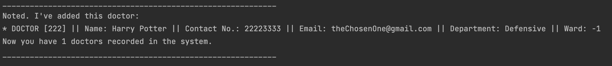

# User Guide

## Introduction

IHospital is a desktop application meant for staff in hospitals. 
Its main purpose is to manage patients, doctors, nurses, appointments and operation rooms data, 
and it’s optimised for use via a Command Line Interface (CLI). If you can type fast, 
this application allows you to access relevant hospital information faster than traditional GUI applications.

## Quick Start

1. Ensure that you have Java 11 or above installed.
1. Down the latest version of `IHospital` from [here](https://github.com/AY2122S2-CS2113-T11-2/tp/releases).

## Features 

### Viewing help: `help`
View the available commands.

Format: `help`

### Adding a doctor: `add doctor`
Adds a new doctor to the system.

Format: `add doctor /id ID /n NAME /ph PHONE /e EMAIL /dep DEPARTMENT`

Example of usage: 

`add doctor /id 222 /n Harry Potter /ph 22223333 /e theChosenOne@gmail.com /dep Defensive`

Expected output:

### Adding a patient: `add patient`
Adds a new patient to the system.

Format: `add patient /id ID /n NAME /ph PHONE /e EMAIL /s SYMPTOM /d DESCRIPTIONS`

Example of usage:

`add patient /id 333 /n Draco Malfoy /ph 88888888 /e poorPotter@gmail.com /s cough /d Allergic to Harry Potter`

### Adding an appointment: `add appointment`
Adds a new appointment to the system.

Format: `add appointment /t DATETIME /d DOCTOR_NO /p PATIENT_NO`

* The `DOCTOR_NO` and `PATIENT_NO` refer to their numbers in the list (not their IDs).

* Please make sure that the doctor/patient you're adding to the appointment exist.

Example of usage:

`add appointment /t 2007-12-03T10:15:30 /d 1 /p 1`

### Adding a nurse: `add nurse`
Adds a new nurse to the system.

Format: `add nurse /id ID /n NAME /ph PHONE /e EMAIL /t TITLE`

Example of usage:

`add nurse /id 001 /n Hermione Granger /ph 11111111 /e ministerForMagic@gmail.com /t Minister`

### Adding a ward: `add ward`
Adds a new ward to the system. 

Format: `add ward /d NO /p NO /n NO /id NO`

* The `NO` refers to the indexes of the respective doctors, patients or nurses. 
* Input can also take in an array of indexes

* Note that one doctor/nurse can only be assigned to one ward.

Example of usage:

`add ward /d 1 /p 4 /n 1 /id 5`

`add ward /d 1,2 /p 4,5 /n 1,3 /id 10`

### Sorting appointment list: 'sort'
Sorts existing appointments in the system (but does not print out) according to time (most recent to least recent).

Format: `sort appointment`

### Viewing doctor/patient/appointment/nurse/ward list: `list`
Lists existing doctors/patients/appointments/nurses/wards in the system.

Format: `list WHATYOUWANTTOLIST`

Example of usage:

`list doctor`

`list patient`

`list nurse`

`list ward`

`list appointment`

### Searching an entity: `search`
Searches existing doctors/patients/nurses/wards with their numbers in the list.

Format: `search ROLE NO`

Example of usage:

`search doctor 1`

`search patient 3`

`search nurse 2`

`search ward 4`

### Searching an appointment: `search`
Searches existing appointments with appointment time.

Format: `search appointment DATETIME`

Example of usage: 

`search appointment 2007-12-03T10:15:30`

### Editing a person's information
Editing an existing person's information.

Format: `edit /entity NO /field info`

* Note that you can only edit one information at a time.
* `NO` refers to the index of the object in the entity list
* `field` is the attribute to be changed with the new `info`

Example of usage:

`edit /d 1 /ph 12341234`

`edit /p 1 /n Mike`

`edit /d 1 /e 123489@gmail.com`

`edit /nu 1 /t Senior`

`edit /w 1 /id 2`

### Editing an appointment
Editing the details of an appointment.

Format: `edit /a APPOINTMENT_INDEX /doctor DOCTOR_INDEX` OR `edit /a APPOINTMENT_INDEX /patient PATIENT_INDEX` OR `edit /a APPOINTMENT_INDEX /time DATETIME`

* Note that you can only edit one information at a time.

### Deleting an entity: `delete`
Removes an entity from the system.

Format: `delete ENTITY ENTITY_NO`

* The `ENTITY` can refer to a doctor, patient, nurse, appointment or ward
* The `NO` here refers to the numbers in the list (not IDs).

Example of usage:

`delete doctor 1`

`delete patient 12`

`delete appointment 3`

`delete nurse 1`

`delete ward 4`

## FAQ

**Q**: How do I know the command format? 

**A**: You may refer to this User Guide or type `help` to view commands available.

## Command Summary

* View Help `help`
* Add Doctor `add doctor /id ID /n NAME /ph PHONE /e EMAIL`
* Add Patient `add patient /id ID /n NAME /ph PHONE /e EMAIL /s SYMPTOM /d DESCRIPTIONS`
* Add Appointment `add appointment /t 2022-03-19T15:16:00 /d DOCTOR_NO /p PATIENT_NO`
* Add Nurse `add nurse /id ID /n NAME /ph PHONE /e EMAIL /t TITLE /w WARD_NO`
* Add Ward `add ward /d NO /p NO /n NO /id NO`
* Delete Doctor `delete doctor DOCTOR_ID`
* Delete Patient `delete patient PATIENT_ID`
* Delete Appointment `delete appointment APPOINTMENT_NO.`
* Delete Nurse `delete nurse NURSE_ID`
* Delete Ward `delete ward WARD_ID`
* Sort Appointment List `sort appointment`
* View Doctor list `list doctor`
* View Patient list `list patient`
* View Appointment list `list appointment`
* View Nurse list `list nurse`
* View Ward list `list ward`
* Search Doctor `search doctor DOCTOR_NO`
* Search Patient `search patient PATIENT_NO`
* Search Appointment `search appointment DATETIME`
* Search Nurse `search nurse NURSE_NO`
* Search Ward `search ward WARD_NO`
* Edit Doctor Info `edit /d DOCTOR_NO /ph PHONE` OR `edit /d DOCTOR_NO /n NAME` OR `edit /d DOCTOR_NO /e EMAIL`
* Edit Patient Info `edit /p PATIENT_NO /ph PHONE` OR `edit /p PATIENT_NO /n NAME` OR `edit /p PATIENT_NO /e EMAIL`
* Edit Appointment `edit /a APPOINTMENT_NO /doctor DOCTOR_NO` OR `edit /a APPOINTMENT_NO /patient PATIENT_NO` OR `edit /a APPOINTMENT_NO /time TIME`
* Edit Nurse Info `edit /nu NURSE_NO /t TITLE`
* Edit Ward Info `edit /w WARD_NO /id ID`