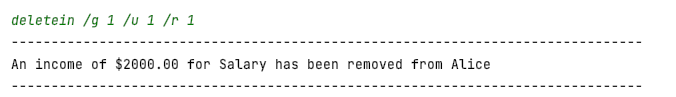
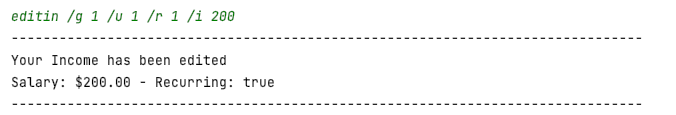
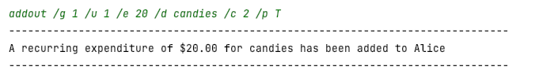
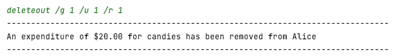
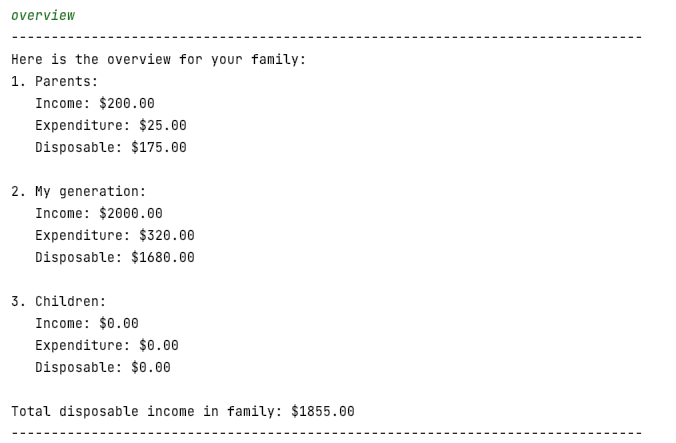

# PlanITarium User Guide

This document contains the User Guide to the **PlanITarium** application. It serves to describe the features of the
application and provide examples of its utilisation. Each feature, or also known as **commands**, are described in
detail in the [Features](#features) section below.

**PlanITarium** is a Command-Line Interface application that helps you and your family to track your finances. It allows
you to:

* add your family members and **track** their income and expenditure,
* get a monthly **view** on your financial status,
* **group** your loved ones for better management,
* **categorise** your expenses to assist with financial planning.

**Who this product is meant for:**

* Young adults who are looking for a **fast and easy** financial tracker.
* Individuals that needs a **monthly overview** on their financial status.
* Those who wish to track the **financial status** of their family members.
* **Experienced typists** who can operate the application on a terminal.

## Table of Contents

* [Quick Start](#quick-start)
* [Quick Notes](#quick-notes)
* [Features](#features)
    * [View all commands: `help`](#viewing-all-commands-codehelpcode)
    * [Add a person: `add`](#add-a-person-codeaddcode)
    * [Delete a person: `delete`](#delete-a-person-codedeletecode)
    * [Add an income: `addin`](#add-an-income-codeaddincode)
    * [Delete an income: `deletein`](#delete-an-income-codedeleteincode)
    * [Edit an income: `editin`](#edit-an-income-codeeditincode)
    * [Add an expenditure: `addout`](#add-an-expenditure-codeaddoutcode)
    * [Delete an expenditure: `deleteout`](#delete-an-expenditure-codedeleteoutcode)
    * [Edit an expenditure: `editout`](#edit-an-expenditure-codeeditoutcode)
    * [Show financial summary: `overview`](#show-financial-summary-codeoverviewcode)
    * [Show all records by group: `list`](#show-all-records-by-group-codelistcode)
    * [Show expenditure categories: `listcat`](#show-expenditure-categories-codelistcatcode)
    * [Searching for details: `find`](#searching-for-details-codefindcode)
    * [Exit the program: `bye`](#exit-codebyecode)
* [Frequently Asked Questions](#faq)
* [Command Summary](#command-summary)

 

## Quick Start

1. Ensure that you are running **Java 11** on your device.
2. Down the latest `PlanITarium.jar` from [releases](https://github.com/AY2122S2-CS2113T-T10-2/tp/releases).
3. Move the file into a folder that you want to use as the _home folder_.
4. Open a terminal in the _home folder_ and run `java -jar PlanITarium.jar`.
5. Type your commands into the terminal and press [Enter] to execute it.
6. Refer to [Features](#features) below for details on each command.

 

## Quick Notes

The following table describes the **formats** used in this User Guide.

| Format              | Description                                                                                                                                              |
|:--------------------|:---------------------------------------------------------------------------------------------------------------------------------------------------------|
| `/x`                | A forward slash that is appended by a letter denotes a delimiter that should be accompanied by a block term e.g. `/n NAME`.                              |
| `PARAMETER`         | The parameters in upper casing are placeholders parameters for details to be supplied by you e.g. `add /n Alice` instead of `add /n NAME`.               |
| `/x PARAMETER`      | The delimiter-parameter pairs not enclosed in any brackets are compulsory inputs to be supplied by you.                                                  |
| `[/x PARAMETER]`    | The delimiter-parameter pairs enclosed in square brackets are optional inputs that you may choose not to provide.                                        |
| <code>/p <T&#124;F> | The parameters enclosed in angle brackets indicates that they have fixed values. You may choose any of the values that are separated by a vertical pipe. |

Some additional points to take note of:

* You may provide delimiter-parameter pair in any preferred order.
    * Example: `add /n Alice /g 2`, `add /g 2 /n Alice`
* If you wish to use a forward slash `/` in any parameters, enclose them in whitespaces.
    * Example: `Bought on / off switch` as a description
* You need not include any currency symbols and monetary values are in at most 2 decimal places.
* You may provide duplicate entries such as when you have two family members with the same name. PlanITarium will track
  each of them as separate entries via indexing.

 

## Features

This section describes each command in detail.

**How to use this section:**

* The command formats and examples are provided in a `code block` so that you can **easily copy** them into PlanITarium.
* Each command is described on an **incremental basis from the previous command**, you may refer to a previous command
  for more information e.g. a `Delete` command using information from the `Add` command before it.
* Sub-points with :information_source: indicates details that you should take note of.
* Refer to the following table for more details on the parameters that you need to provide.

| Parameter Glossary                | Description                                                                                                                                                                                                                              |
|:----------------------------------|:-----------------------------------------------------------------------------------------------------------------------------------------------------------------------------------------------------------------------------------------|
| `/n NAME`                         | The name of someone you would like to track.                                                                                                                                                                                             |
| `/g GROUP_INDEX`                  | An index that helps you to categorise the individuals being tracked.  There are currently three group indexes, numbered from 1 to 3. You can find the group names from the [overview command](#show-financial-summary-overview). |
| `/u USER_INDEX`                   | An index that is tagged to someone you are tracking. You can find the user index from the [listing records command](#show-all-records-by-group-list).                                                                                |
| `/d DESCRIPTION`                  | The description (or name) of the income and expenditure you wish to track.                                                                                                                                                               |
| `/c CATEGORY_INDEX`               | An index that refers to a category label such as 'Food and Drinks`. You can find the category index from the [list categories command](#show-expenditure-categories-listcat).                                                        |
| `/i INCOME`                       | The monetary value of the income you wish to track.                                                                                                                                                                                      |
| `/e EXPENDITURE`                  | The monetary value of the expenditure that you have made.                                                                                                                                                                                |
| `/r (INCOME / EXPENDITURE)_INDEX` | An index that refers to an income or expenditure that you have recorded previously. You can find this index from the [listing records command](#show-all-records-by-group-list).                                                     |
| <code>/p <T&#124;(any)>           | `T` indicates that an income or expense that you are tracking in the application is recurrent on a monthly-basis while `(any)` refers to any other inputs which will indicate that it is non-recurrent.                                  |

---

### Viewing all commands: `help`

> Shows you a list of available commands that is described in this section.

Format: `help`

---

### Add a person: `add`

> Add yourself or a family member to start tracking.

Format: `add /n NAME /g GROUP_INDEX`

* **NAME** refers to your name.
* **GROUP_INDEX** refers to the group that you want to be assigned to.

> :information_source: Notes:
> * Each group will track persons assigned to it separately from one another.
> * The tracked persons will be indexed starting from 1 and incremented for every entry.
> * Each entry will be treated as a unique individual regardless of naming or grouping.

Example of usage:

* Add Alice to the Parents' category to be tracked.

  `add /n Alice /g 1`

* _Result_: Entry for Alice is added to Parents' tracking list with a user index (uid) of **1**.

   
  
   <!-- this is a placeholder -->

---

### Delete a person: `delete`

> Deletes a person from your family group.

Format: `delete /g GROUP_INDEX /u USER_INDEX`

* **GROUP_INDEX** refers to the index of the group that you belong to.
* **USER_INDEX** refers to the index of that is tagged to you.

> :information_source: Notes:
> * The user indexes that are higher than the deleted one will be **decremented** after 
    the deletion is completed.
>      * E.g. If index 1 is a target for deletion, index 2 and beyond will be decremented.

Example of usage:

* Delete the Alice (with uid = 1) from the Parents' group.

  `delete /g 1 /u 1`

* _Result_: Alice deleted from the Parents' group 
  
 

---

### Add an income: `addin`

> Adds an entry to your list of tracked incomes.

Format: `addin /g GROUP_INDEX /u USER_INDEX /d DESCRIPTION /i INCOME /p <T/(any)>`

* **GROUP_INDEX** refers to the index of the group that you belong to.
* **USER_INDEX** refers to the index of that is tagged to you.
* **DESCRIPTION** refers to the name or description of your income.
* **INCOME** refers to the monetary value of your income.
* **<T/(any)>** refers to whether your income is recurrent on a monthly-basis.

> :information_source: Notes:
> * Each person will have their incomes recorded separately from one another.
> * The income entries will be indexed starting from 1 and **incremented** for every entry.

Example of usage:

* Add a monthly-recurrent Salary of $2,000, to Alice's income.

  `addin /g 1 /u 1 /d Salary /i 2000 /p T`

* _Result_: Entry for Salary is added to Alice's income list with an income index of **1**.
  
   
  
   <!-- this is a placeholder -->

---

### Delete an income: `deletein`

> Deletes an entry from your list of tracked incomes.

Format: `deletein /g GROUP_INDEX /u USER_INDEX /r INCOME_INDEX`

* **GROUP_INDEX** refers to the index of the group that you belong to.
* **USER_INDEX** refers to the index of that is tagged to you.
* **INCOME_INDEX** refers to the index of the income you would like to delete.

> :information_source: Notes:
> * The income indexes that are higher than the deleted one will be **decremented** after
    the deletion is completed.
    >      * E.g. If index 1 is a target for deletion, index 2 and beyond will be decremented.

Example of usage:

* Delete the monthly-recurrent Salary of $2,000 from Alice's income.

  `deletein /g 1 /u 1 /r 1`

* _Result_: Income entry for Salary of $2,000 is deleted from Alice's income list.

   
  
   <!-- this is a placeholder -->

---

### Edit an income: `editin`

> Edits an entry in your list of tracked incomes.

Format: `editin /g GROUP_INDEX /u USER_INDEX /r INCOME_INDEX [/i INCOME /d DESCRIPTION /p <T|(any)>]`

* **GROUP_INDEX** refers to the index of the group that you belong to.
* **USER_INDEX** refers to the index of that is tagged to you.
* **INCOME_INDEX** refers to the index of the income you would like to edit.
* **INCOME** refers to the new monetary value of your income.
* **DESCRIPTION** refers to the new name or description of your income.
* **<T/(any)>** refers to whether your income is recurrent on a monthly-basis.

> :information_source: Notes:
> **DESCRIPTION**, **INCOME** and recurring setting (**<T|F>**) are optional in this case. You can just include the 
> part(s) that you are looking to modify.

Example of usage:

* Edits the monthly-recurrent Salary of $2,000, from Alice's income, to $200.

  `editin /g 1 /u 1 /r 1 /i 200`

* _Result_: Income entry in Alice's income list is edited.

   
  
   <!-- this is a placeholder -->

---

### Add an expenditure: `addout`

> Adds an entry to your list of tracked expenditures.

Format: `addout /g GROUP_INDEX /u USER_INDEX /e EXPENDITURE /d DESCRIPTION /c CATEGORY_INDEX /p <T|(any)>`

* **GROUP_INDEX** refers to the index of the group that you belong to.
* **USER_INDEX** refers to the index of that is tagged to you.
* **EXPENDITURE** refers to the monetary value of your expenditure.
* **DESCRIPTION** refers to the name or description of your expenditure.
* **CATEGORY_INDEX** refers to the category of your expenditure.
* **<T|(any)>** refers to whether your expenditure is recurrent on a monthly-basis.

> :information_source: Notes:
> * Each person will have their expenditures recorded separately from one another.
> * The expenditure entries will be indexed starting from 1 and **incremented** for every entry.

Example of usage:

* Add a monthly-recurrent expenditure of $20 for candies to Alice's expenditure. This expenditure is tagged under the 
  "Food and Drinks" category.

  `addout /g 1 /u 1 /e 20 /d candies /c 2 /p T`

* _Result_: Entry for candies is added to Alice's expenditure list with an expenditure index of **1**.

   
  
   <!-- this is a placeholder -->

---

### Delete an expenditure: `deleteout`

> Deletes an entry from your list of tracked expenditure.

Format: `deleteout /g GROUP_INDEX /u USER_INDEX /r EXPENDITURE_INDEX`

* **GROUP_INDEX** refers to the index of the group that you belong to.
* **USER_INDEX** refers to the index of that is tagged to you.
* **EXPENDITURE_INDEX** refers to the index of the expenditure you would like to delete.

> :information_source: Notes:
> * The expenditure indexes that are higher than the deleted one will be **decremented** after
    the deletion is completed.
    >      * E.g. If index 1 is a target for deletion, index 2 and beyond will be decremented.

Example of usage:

* Delete the monthly-recurrent candies of $20 from Alice's expenditure.

  `deleteout /g 1 /u 1 /r 1`

* _Result_: Expenditure entry for candies of $20 is deleted from Alice's expenditure list.

   
  
   <!-- this is a placeholder -->

---

### Edit an expenditure: `editout`

> Edits an entry from your list of tracked expenditures.

Format: `editout /g GROUP_INDEX /u USER_INDEX /r EXPENDITURE_INDEX [/e EXPENDITURE /d DESCRIPTION /c CATEGORY_INDEX /p <T|(any)>]`

* **GROUP_INDEX** refers to the index of the group that you belong to.
* **USER_INDEX** refers to the index of that is tagged to you.
* **EXPENDITURE_INDEX** refers to the index of the expenditure you would like to edit.
* **EXPENDITURE** refers to the monetary value of your expenditure.
* **DESCRIPTION** refers to the name or description of your expenditure.
* **CATEGORY_INDEX** refers to the category of your expenditure.
* **<T/(any)>** refers to whether your expenditure is recurrent on a monthly-basis.

> :information_source: Notes:
> **DESCRIPTION**, **EXPENDITURE**, **CATEGORY_INDEX** and recurring setting (**<T|F>**) are optional in this case. You
> can just include the part(s) that you are looking to modify.

Example of usage:

* Edits the monthly-recurrent candies expenditure of $20 from Alice's expenditure, to $25.

  `editout /g 1 /u 1 /r 1 /e 25`

* _Result_: Expenditure entry in Alice's expenditure list is edited.

   
  
   <!-- this is a placeholder -->

---

### Show financial summary: `overview`

> Shows a summary of the total income, expenditure and disposable income for each group.

Format: `overview`

 <!-- this is a placeholder -->

---

### Show all records by group: `list`

> Shows a list of incomes and expenditures for each person in a given group.

Format: `list /g GROUP_INDEX`

* **GROUP_INDEX** refers to the index of the group that you belong to.

Example of usage:

* List all the members from Parents' group.

  `list /g 1`
  
   
  
   <!-- this is a placeholder -->

---

### Show expenditure categories: `listcat`

> Shows a list of categories

Format: `listcat`

 <!-- this is a placeholder -->

---

### Searching for details: `find`

> Search for a string as provided by you throughout all your income and expenditure.

Format: `find /d USER_STRING [/c CATEGORY_INDEX]`

* **USER_STRING** refers to the keyword which you want to look for.
* **CATEGORY_INDEX** refers to the category of your expenditure.

> :information_source: Notes:
> * Keywords are case-sensitive and inclusive. So a search for `brush` will successfully look for `toothbrush`.
> * If you want to search for expenditures in all categories instead of specific ones, omit **CATEGORY_INDEX**.
> * While searching through incomes, PlanITarium ignores the **CATEGORY_INDEX** provided.

Example of usage:

Find records with category:
* Find all the records which descriptions include _candies_ from Category 1.

  `find /d candies /c 1`

* _Result_: The result of the search is returned and printed to the screen.

   <!-- this is a placeholder -->

Find records without category:
* Find all the records which descriptions include _candies_.
  
  `find /d candies`

* _Result_:

  

---

### Exit: `bye`

> Exits the program.

Format: `bye`

---

## FAQ

**Q**: How do I transfer my data to another computer?

**A**: After you exit the program, your application data will be automatically stored in a text file locally. You can
transfer the data by transferring the text file to another computer and put it in the same directory as the application
in the new computer. When the application starts up, it will automatically load the saved data in the text file. Do note
that the application running in the new computer should be the same version as the application in your previous
computer.

 

## Command Summary

To keep things simple, we will omit the parameter description for you. To view each command in detail, refer to
the [features](#features) section.

| Command                                                             | Format                                                                                                                                                              |
|---------------------------------------------------------------------|---------------------------------------------------------------------------------------------------------------------------------------------------------------------|
| [View all commands](#viewing-all-commands-help)                     | help                                                                                                                                                                |
| [Add a person](#add-a-person-add)                                   | add /n __ /g __  e.g.  `> add /n Alice /g 1`                                                                                                                |
| [Delete a person](#delete-a-person-delete)                          | delete /g __ /u __  e.g.  `> delete /g 1 /u 2`                                                                                                              |
| [Add an income](#add-an-income-addin)                               | addin /g__ /u __ /i __ /d __ /p __  e.g. f`> addin /g 2 /u 3 /i 2000 /d salary /p t`                                                                        |
| [Delete an income](#delete-an-income-deletein)                      | deletein /g __ /u __ /r __  e.g.  `> deletein /g 2 /u 1 /r 5`                                                                                               |
| [Edit an income](#edit-an-income-editin)                            | editin /g __ /u __ /r __ [ /i __ /d __ /p __ ]  e.g.  `> editin /g 3 /u 1 /r 5 /i 10 /d stationary`  f`> editin /g 2 /u 4 /r 1 /d red pack /p f`        |
| [Add an expenditure](#add-an-expenditure-addout)                    | addout /g__ /u __ /e __ /d __ /c __ /p __  e.g.  `> addout /g 2 /u 3 /e 400 /d books /c 1 /p f`                                                             |
| [Delete an expenditure](#delete-an-expenditure-deleteout)           | deleteout /g __ /u __ /r __  e.g.  `> deleteout /g 2 /u 1 /r 1`                                                                                             |
| [Edit an expenditure](#edit-an-expenditure-editout)                 | editout /g __ /u __ /r __ [ /e __ /d __ /c __ /p __ ]  e.g.  `> editout /g 2 /u 1 /r 2 /e 400 /d dinner /c 3`   `> editout /g 1 /u 2 /r 6 /d misc /p t` |
| [Show financial summary](#show-financial-summary-overview)          | overview                                                                                                                                                            |
| [Show all records by group](#show-all-records-by-group-list)        | list /g __  e.g.  `> list /g 1`                                                                                                                             | 
| [Show expenditure categories](#show-expenditure-categories-listcat) | listcat                                                                                                                                                             |
| [Searching for details](#searching-for-details-find)                | find /d __ [ /c __ ]  e.g.  `> find salary`   `> find sugar /c 4`                                                                                       |
| [Exit the program](#exit-bye)                                       | bye                                                                                                                                                                 |

[**Category Summary**](#show-expenditure-categories-listcat)

| Index | Name                  |
|-------|-----------------------|
| 0     | Others                |
| 1     | Food and Drinks       |
| 2     | Home and Utilities    |
| 3     | Health and Medical    |
| 4     | Transportation        |
| 5     | Fun and Entertainment |
