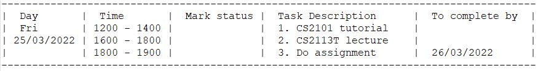
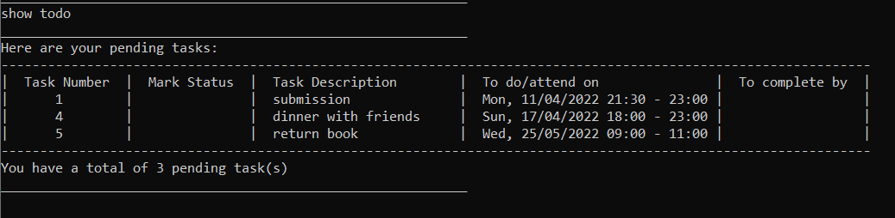

# Sherpass User Guide

## Introduction

Sherpass is a desktop application for students to manage their academic schedules.
Optimised for use via a Command Line Interface (CLI),
users who can type fast will be able to plan out their tasks in a much quicker fashion compared to traditional GUI apps.

## Table of Content
- [Quick Start](#quick-start)
- [Features](#features)
- [Command Guide](#command-guide)
  - Add tasks: [`add`]() or [`addrecurring`](#adding-a-recurring-task-addrecurring)
  - Delete tasks: [`delete`]() or [`deleterecurring`](#deleting-a-recurring-task-deleterecurring)
  - Edit tasks: [`edit`]() or [`editrecurring`](#editing-a-recurring-task-editrecurring)
  - Show tasks: [`show`](#generating-a-timetable-show-today--show-date--show-week)
  - Clear all tasks: [`clear`](#clearing-all-tasks-clear)
  - Study session
    - Enter study session: [`study`](#enter-study-session-study)
    - Start timer: [`start`](#starting-a-default-timer-start)     
    - Pause timer: [`pause`](#pausing-a-timerstopwatch-pause)
    - Resume timer: [`resume`](#resuming-a-timerstopwatch-resume)
    - Stop timer: [`stop`](#stopping-a-timerstopwatch-stop)
    - Show tasks: [`show`](#show-your-tasks-show)
    - Mark task as done:[`mark`](#mark-your-tasks-as-done-mark)
    - Exit study session: [`leave`](#leave-the-study-session-leave)
  - Exit program: [`exit`]()
  - [Saving your tasks](#saving-your-tasks)
- [Command Summary](#command-summary)
## Quick Start

1. Ensure that you have Java 11 or above installed.
2. Download the latest version of `Sherpass` 
from [here](https://github.com/AY2122S2-CS2113T-T09-1/tp/releases/tag/v1.0-Release).
3. Copy the jar file to the folder you want to use as the home folder for Sherpass.
4. Open a terminal and navigate to the folder containing the jar file.
5. Start the application on the terminal using `java -jar Sherpass.jar`

## Features 

### Managing your time
You can add your tasks into Sherpass and get a detailed outline of your schedule. Using this schedule, you won't
have to worry ever again about forgetting tasks and missing deadlines!

Sherpass also allows you to easily add recurring tasks (e.g. classes). Simply refer to the command details for
more information.

### Study sessions
Having trouble focusing while studying? Sherpass study sessions allow you to select study timers, inspired by the
increasingly popular Pomodoro study sessions, to help you keep track of the time whilst completing your tasks.

#### During Study sessions
Starting the study session will show you the tasks that you have planned to do for the day. You can then choose to
start one of a few default timers provided by us, or start your own custom timer. You can also choose to start a 
stopwatch to keep track of how long you've been studying for, if you're unsure of how long you will need.

#### After Study sessions
After your study session, you will be prompted to mark the tasks you've completed as done. If you're still not done with
certain tasks, feel free to start another productive session!

## Command Guide

### Notes on command input format:
- Words in UPPER_CASE are the parameters to be supplied by the user.
- Items in square brackets are optional
- Extraneous parameters for commands that do not take in parameters (such as show, stop, exit) will be ignored

### Adding a recurring task: `addrecurring`
Adds a recurring task to your list of tasks.
- All tasks will have the same task description.
- For a **daily** recurring task, a **month's** worth of task will be added.
- For a **weekly** recurring task, **2 months'** worth of task will be added.
- For a **monthly** recurring task, a **year's** worth of task will be added.

Format: `add TASK_DESCRIPTION /do DATE /start START_TIME /end END_TIME /repeat FREQUENCY`

- `DATE` format is in `dd/MM/yyyy` - e.g. 3/10/2022 for 3 Oct 2022
- `TIME` format is in `HH:mm` - e.g. 23:00 for 11pm
- `FREQUENCY` can be either `DAILY`, `WEEKLY` or `MONTHLY`
- `START_TIME` must be after `END_TIME`

Example: `addrecurring attend cs2113t lecture /do 25/2/2022 /start 16:00 /end 18:00 /repeat WEEKLY`

### Deleting a recurring task: `deleterecurring`
Deletes a recurring task from your list of tasks.
- The specified task and all its future occurrence will be deleted.

Format: `deleterecurring TASK_NUMBER`

### Editing a recurring task: `editrecurring`
Edit a recurring task in your list of tasks.

- The specified task and all its future occurrence will be edited.

Format: `editrecurring TASK_NUMBER [TASK_DESCRIPTION] [/do DATE /start TIME /end TIME]`

- To change the **frequency** of a recurring task, please delete and add the recurring task with the correct
frequency using the `deleterecurring `and `addrecurring` command respectively.
- At least one of the optional fields must be provided

Example: 

Before edit command:

After command: `editrecurring 1 /do 25/3/2022 /start 18:00 /end 20:00`

### Generating a timetable: `show today` / `show <date>` / `show week`
Creates a schedule listing out your tasks for the day or the week.

Upon startup, Sherpass also shows your schedule for the day.

Format:
- To see the timetable for the day: `show today`
- To see the timetable for a specific day: `show <date>`, where the date is in the format d/M/YYYY.
  E.g. `show 25/3/2022` shows the schedule for 25th March 2022
- To see the timetable for the week you are in: `show week`

Below is an example of the timetable that is being generated from the given date
25/3/2022:

### Getting a detailed list: `show all` / `show todo`

Other than getting a timetable, Sherpass also allows you
to view all the tasks that have been added/edited/deleted.

Format:
- To view all the tasks that exist in your list: `show all`
- To view all the tasks that are yet to be completed: `show todo` 

Below are some sample outputs using `show all` and `show todo` respectively

Show all tasks:

Show pending tasks:

### Clearing all tasks: `clear`
To save the trouble of deleting tasks one by one if you wish to delete all of them,
Sherpass allows you to do so using `clear`

Note: Be sure to use `clear` only when you want to remove all the tasks in your list.

### Saving your tasks

All changes to your tasks are saved automatically into a JSON file at `[JAR FILE LOCATION]/data/Sherpass.json`.

There is no need to manually save your tasks.

_Note: Advanced users are welcome to manually edit the save file._

### Enter study session: `study`
Enter the study session where you can start timers to help finish your tasks.

Format: `study`

### Starting a default timer: `start`
_Note: To be improved with study and rest timers - similar to pomodoro sessions._

Start a study timer from our list of default timers.
- Only 1 timer can be running at any 1 time.
- Timer keeps track of time remaining and prints time remaining at regular intervals.
- All our timers can be paused, resumed and stopped.

Format: `start MODE_NUMBER`

- You can choose from 3 default timers.
- `MODE_NUMBER` 0 starts a 30 second timer for testing purposes.
- `MODE_NUMBER` 1 starts a 30 minutes timer
- `MODE_NUMBER` 2 starts a 1 hour timer
- `MODE_NUMBER` 3 starts a 1.5 hour timer

### Starting a custom timer: `start`
Start a custom study timer.

- Start a custom timer suited to your specific needs

Format: `start /custom DURATION`

- Timer `DURATION` is in seconds (To be improved to provide more options)
- `/custom` flag is mandatory to start a custom timer

### Starting a stopwatch: `start`
Start a stopwatch to track how long you've been studying.
- Stopwatch tracks time elapsed and prints time elapsed at regular intervals.
- Stopwatch can be paused, resumed and stopped.

Format: `start stopwatch`

### Pausing a timer/stopwatch: `pause`
Pauses a study timer/stopwatch that is currently running.

Format: `pause`

### Resuming a timer/stopwatch: `resume`
Resume a timer/stopwatch that has been paused.

Format: `resume`

### Stopping a timer/stopwatch: `stop`
Stop a timer/stopwatch that has been started.

Format: `stop`

### Show your tasks: `show`
Shows your list of tasks that you have planned to do for the day.
- `show` can only be called when timer is paused or stopped.

Format: `show all`

### Mark your tasks as done: `mark`
Mark the tasks that you've done in the session with `mark`.
- `mark` can only be called when timer is paused or stopped.

Format: `mark TASK_INDEX`
- `TASK_INDEX` corresponds to the index of the task when `show` is called.
- You can only mark 1 task as done at a time.

### Leave the study session: `leave`
Leave the study session to go back to the main session.

Format: `leave`

## FAQ

**Q**: My save file is corrupted, how do I resolve this?

**A**: Sherpass will print an error message 
containing details of the corruption (e.g missing fields, brackets). You can either modify the save file accordingly to
rectify the problem or allow Sherpass to create a new save file 
**(Caution: You will lose all previously saved tasks!)**

**Q**: How do I transfer my data to another computer? 

**A**: Transfer a copy of your save file to your other device and place it in `[JAR FILE LOCATION]/data/Sherpass.json`

## Command Summary

| Action                 | Format,Examples                                                                                                                                                                                |
|------------------------|------------------------------------------------------------------------------------------------------------------------------------------------------------------------------------------------|
| Generate timetable     | `show today` / `show <date>` / `show week`                                                                                                                                                     |
| List all tasks         | `show all`                                                                                                                                                                                     |
| List all pending tasks | `show todo`                                                                                                                                                                                    |
| Clear all tasks        | `clear`                                                                                                                                                                                        |
| Add recurring task     | `addrecurring TASK_DESCRIPTION /do DATE /start START_TIME /end END_TIME /repeat FREQUENCY` e.g. `addrecurring attend cs2113t lecture /do 25/2/2022 /start 16:00 /end 18:00 /repeat WEEKLY` |
| Delete recurring task  | `deleterecurring TASK_NUMBER`                                                                                                                                                                  |
| Edit recurring task    | `editrecurring TASK_NUMBER [TASK_DESCRIPTION] [/do DATE /start TIME /end TIME]` e.g.`editrecurring 1 /do 25/3/2022 /start 18:00 /end 20:00`                                                |
| Add recurring task     | `addrecurring TASK_DESCRIPTION /do DATE /start START_TIME /end END_TIME /repeat FREQUENCY` e.g. `addrecurring attend cs2113t lecture /do 25/2/2022 /start 16:00 /end 18:00 /repeat WEEKLY` |
| Delete recurring task  | `deleterecurring TASK_NUMBER`                                                                                                                                                                  |
| Edit recurring task    | `editrecurring TASK_NUMBER [TASK_DESCRIPTION] [/do DATE /start TIME /end TIME]` e.g.`editrecurring 1 /do 25/3/2022 /start 18:00 /end 20:00`                                                |
| Enter study session    | `study`                                                                                                                                                                                        |
| Start default timer    | `start MODE_NUMBER`                                                                                                                                                                            |
| Start custom timer     | `start /custom DURATION`                                                                                                                                                                       |
| Start stopwatch        | `start stopwatch`                                                                                                                                                                              |
| Pause timer/stopwatch  | `pause`                                                                                                                                                                                        |
| Resume timer/stopwatch | `resume`                                                                                                                                                                                       |
| Stop timer/stopwatch   | `stop`                                                                                                                                                                                         |
| Show tasks             | `show all`                                                                                                                                                                                     |
| Mark task as done      | `mark TASK_INDEX`                                                                                                                                                                              |
| Leave study session    | `leave`                                                                                                                                                                                        |

