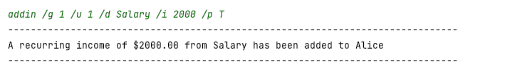
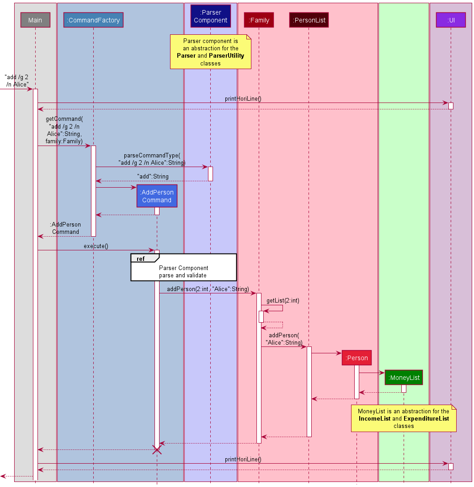

# Wan Si Zheng - Project Portfolio Page

## Project: PlanITarium

PlanITarium is an application that assists you and your family in managing your finances, optimized for use on the
Command Line Interface (CLI). You can use it to view your monthly financial status, logically group family members for
better management, and categorise your expenditures. PlanITarium is written in, and meant to be run on `Java 11`.

### Summary of Contributions

* **Code
  Contributed**: [RepoSense Link](https://nus-cs2113-ay2122s2.github.io/tp-dashboard/?search=T10&sort=groupTitle&sortWithin=title&timeframe=commit&mergegroup=&groupSelect=groupByRepos&breakdown=true&checkedFileTypes=docs~functional-code~test-code~other&since=2022-02-18&tabOpen=true&tabType=authorship&tabAuthor=1szheng&tabRepo=AY2122S2-CS2113T-T10-2%2Ftp%5Bmaster%5D&authorshipIsMergeGroup=false&authorshipFileTypes=docs~functional-code~test-code~other&authorshipIsBinaryFileTypeChecked=false)

* **New Feature**: Added user input parsing.
    * Functionality: The parser methods that retrieves the parameters from the user's input and assists in correcting
      incorrect input format by providing feedback messages and warnings.
    * Justification: This feature improves the product significantly as a user can make mistakes when entering commands.
      The application should provide understandable and descriptive messages to assist in the corrections.
    * Highlights: This feature required an in-depth analysis on the user's possible undesirable inputs and deciding if
      such input should be blocked or given a warning. Its implementation then required much research and testing as
      there exists methods provided by Java that are misleading in its description or usage.

* **New Feature**: Added user input validation.
    * Functionality: The parser methods that helps to ensure that the user's inputs are valid.
    * Justification: This feature improves the product as a user can make mistakes when entering commands. Such methods
      are consolidated in the Parser class for ease of access, modification and addition by developers.
    * Highlights: This feature requires information and cooperation from the various command implementations, and
      affects future implementations in the same manner.

* **New Feature**: Added category enumeration.
    * Functionality: The enumeration of expenditure categories that allow users to tag their expenditures through the
      usage of number labels that are assigned to each category.
    * Justification: This feature improves the product as it allows advanced users to better manage their expenditure by
      categorizing them. Enumeration is used over the alternatives as the application currently does not allow for
      customized categories.
    * Highlights: This enhancement affects future commands or features that wish to extend the categorising of
      expenditures.

* **Enhancements to Existing Features**:
    * Added JUnit tests for `Parser`, `ParserUtility` and `Category`:
      [#94](https://github.com/AY2122S2-CS2113T-T10-2/tp/pull/96/files),
      [#116](https://github.com/AY2122S2-CS2113T-T10-2/tp/pull/116/files),
      [131](https://github.com/AY2122S2-CS2113T-T10-2/tp/pull/131/files#diff-bbaf65121d975e9f0cc1284d06e75e12c83ff0f7b8291fd70888a08804575e88)
    * Researched and implemented method for testing prints via IO redirection:
      [#136](https://github.com/AY2122S2-CS2113T-T10-2/tp/pull/136/files#diff-caeba67935d0d3100de8785480552427170cb99b6af6c254616486b0bb870335)
    * Updated error messages to be more descriptive:
      [#231](https://github.com/AY2122S2-CS2113T-T10-2/tp/pull/231/files#diff-f409e5bd3cb2421cd456383eaacbf733bb6e8663452dacc719d717a7b809f240)
    * Suggested tests for features implemented by team members to increase test coverage.

* **Documentation**:
    * User Guide (UG):
        * Added documentation for `addin` and `deletein` beyond the base skeleton:
          [#136](https://github.com/AY2122S2-CS2113T-T10-2/tp/pull/136/files),
          [#161](https://github.com/AY2122S2-CS2113T-T10-2/tp/pull/161/files)
        * Added administrative descriptions: [#136](https://github.com/AY2122S2-CS2113T-T10-2/tp/pull/136/files)
        * Added aesthetic changes for format and styling:
          [#136](https://github.com/AY2122S2-CS2113T-T10-2/tp/pull/136/files),
          [#161](https://github.com/AY2122S2-CS2113T-T10-2/tp/pull/161/files),
          [#218](https://github.com/AY2122S2-CS2113T-T10-2/tp/pull/218/files#diff-b50feaf9240709b6b02fb9584696b012c2a69feeba89e409952cc2f401f373fb)
        * Added parameters glossary under the Features section:
          [#161](https://github.com/AY2122S2-CS2113T-T10-2/tp/pull/161/files)

    

    * Developer Guide (DG):
        * Added base format for `Design` and `Implementation` sections:
          [#109](https://github.com/AY2122S2-CS2113T-T10-2/tp/pull/109/files),
          [#111](https://github.com/AY2122S2-CS2113T-T10-2/tp/pull/111/files)
        * Added administrative descriptions:
          [#218](https://github.com/AY2122S2-CS2113T-T10-2/tp/pull/218/files),
          [#222](https://github.com/AY2122S2-CS2113T-T10-2/tp/pull/222/files)
        * Added documentation and diagrams for the
          [Architecture Design](https://ay2122s2-cs2113t-t10-2.github.io/tp/DeveloperGuide.html#architecture) section:
          [#109](https://github.com/AY2122S2-CS2113T-T10-2/tp/pull/109/files),
          [#131](https://github.com/AY2122S2-CS2113T-T10-2/tp/pull/131/files),
          [#231](https://github.com/AY2122S2-CS2113T-T10-2/tp/pull/231/files)
        * Added documentation and diagrams for the
          [Parser Design](https://ay2122s2-cs2113t-t10-2.github.io/tp/DeveloperGuide.html#parser-component) section:
          [#131](https://github.com/AY2122S2-CS2113T-T10-2/tp/pull/131/files),
          [#145](https://github.com/AY2122S2-CS2113T-T10-2/tp/pull/145/files),
          [#231](https://github.com/AY2122S2-CS2113T-T10-2/tp/pull/231/files)
        * Helped to standardize diagram themes:
          [#109](https://github.com/AY2122S2-CS2113T-T10-2/tp/pull/109/files),
          [#222](https://github.com/AY2122S2-CS2113T-T10-2/tp/pull/109/files)

* **Team-based Contribution**:
    * Finalized and released `v2.0` on GitHub during a Team Meeting.
    * Helped to tag milestones and labels for team on occasions.
    * Provided offline assistance to teammates.
    * Collated, summarised and categorised issues raised in PE-D for ease of fixing.
    * PRs reviewed (with non-trivial comments):
      [#52](https://github.com/AY2122S2-CS2113T-T10-2/tp/pull/51),
      [#79](https://github.com/AY2122S2-CS2113T-T10-2/tp/pull/79),
      [#112](https://github.com/AY2122S2-CS2113T-T10-2/tp/pull/112),
      [#124](https://github.com/AY2122S2-CS2113T-T10-2/tp/pull/124),
      [#237](https://github.com/AY2122S2-CS2113T-T10-2/tp/pull/237)

## Reproduced [User Guide](../UserGuide.md) Contribution

This section contains the reproduction of some of my contributions to the Developer Guide. The hyperlinks have been
reproduced for aesthetic purposes only and may not be operable.

### Features

This section describes each command in detail.

**How to use this section:**

* The command formats and examples are provided in a `code block` so that you can **easily copy** them into PlanITarium.
* Each command is described on an **incremental basis from the previous command**, you may refer to a previous command
  for more information e.g. a `Delete` command using information from the `Add` command before it.
* Sub-points with :information_source: indicates details that you should take note of.
* Refer to the following table for more details on the parameters that you need to provide.

| Parameter Glossary                | Description                                                                                                                                                                                                                                      |
|:----------------------------------|:-------------------------------------------------------------------------------------------------------------------------------------------------------------------------------------------------------------------------------------------------|
| `/n NAME`                         | The name of someone you would like to track.                                                                                                                                                                                                     |
| `/g GROUP_INDEX`                  | An index that helps you to categorise the individuals being tracked.  There are currently three group indexes, numbered from 1 to 3. You can find the group names from the [overview command](#show-financial-summary-codeoverviewcode). |
| `/u USER_INDEX`                   | An index that is tagged to someone you are tracking. You can find the user index from the [listing records command](#show-all-records-by-group-codelistcode).                                                                                |
| `/d DESCRIPTION`                  | The description (or name) of the income and expenditure you wish to track.                                                                                                                                                                       |
| `/c CATEGORY_INDEX`               | An index that refers to a category label such as "Food and Drinks". You can find the category index from the [list categories command](#show-expenditure-categories-codelistcatcode).                                                        |
| `/i INCOME`                       | The monetary value of the income you wish to track.                                                                                                                                                                                              |
| `/e EXPENDITURE`                  | The monetary value of the expenditure you wish to track.                                                                                                                                                                                         |
| `/r (INCOME / EXPENDITURE)_INDEX` | An index that refers to an income or expenditure that you have recorded previously. You can find this index from the [listing records command](#show-all-records-by-group-codelistcode).                                                     |
| <code>/p <T&#124;(any)>           | `T` indicates that an income or expense that you are tracking in the application is recurrent on a monthly-basis while `(any)` refers to any other inputs which will indicate that it is non-recurrent.                                          |

---

### Add an income: `addin`

> Adds an entry to your list of tracked incomes.

Format: `addin /g GROUP_INDEX /u USER_INDEX /d DESCRIPTION /i INCOME /p <T/(any)>`

* **GROUP_INDEX** refers to the index of the group that you belong to.
* **USER_INDEX** refers to the index of that is tagged to you.
* **DESCRIPTION** refers to the name or description of your income.
* **INCOME** refers to the monetary value of your income.
* **<T/(any)>** refers to whether your income is recurrent on a monthly-basis.

> :information_source: Notes:
> * Each person will have their incomes recorded separately from one another.
> * The income entries will be indexed starting from 1 and **incremented** for every entry.

Example of usage:

* Add a monthly-recurrent Salary of $2,000, to Alice's income.

  `addin /g 1 /u 1 /d Salary /i 2000 /p T`

* _Result_: Entry for Salary is added to Alice's income list with an income index of **1**.

  

---

### Delete an income: `deletein`

> Deletes an entry from your list of tracked incomes.

Format: `deletein /g GROUP_INDEX /u USER_INDEX /r INCOME_INDEX`

* **GROUP_INDEX** refers to the index of the group that you belong to.
* **USER_INDEX** refers to the index of that is tagged to you.
* **INCOME_INDEX** refers to the index of the income you would like to delete.

> :information_source: Notes:
> * The income indexes that are higher than the deleted one will be **decremented** after the deletion is completed.
    >     * E.g. If index 1 is a target for deletion, index 2 and beyond will be decremented.

Example of usage:

* Delete the monthly-recurrent Salary of $2,000 from Alice's income.

  `deletein /g 1 /u 1 /r 1`

* _Result_: Income entry for Salary of $2,000 is deleted from Alice's income list.

  

 

## Reproduced [Developer Guide](../DeveloperGuide.md) Contribution

This section contains the reproduction of some of my contributions to the Developer Guide. The hyperlinks have been
reproduced for aesthetic purposes only and may not be operable.

### Architecture

The ***Architecture Diagram*** given below shows the high-level design of PlanITarium.

> :information_source: **Note:** The that `.puml` files used to create diagrams in this document
> can be found in the diagrams folder. Refer to the above [PlantUML Tutorial](#acknowledgements)
> to learn how to create and edit these diagrams when necessary.

**Overview of components in the Architecture**

[`Main`](https://github.com/AY2122S2-CS2113T-T10-2/tp/blob/master/src/main/java/seedu/planitarium/PlanITarium.java)
is responsible for,

* At launch, initialize the components in an appropriate manner and calls Storage to read data if any.
* Read user's commands from standard input for command execution.
* At shut down, invokes shutdown sequence and calls Storage to save its current data.

[`UI`](#ui-component) is responsible for the UI of PlanITarium.

[`Commands`](#commands-component) is responsible for the handling and executing of commands.

[`Parser`](#parser-component) is responsible for the parsing and validating of user input.

[`Family`](#family-component) is responsible for holding the user data of PlanITarium in memory.

[`Money`](#money-component) is responsible for holding the monetary information in memory.

[`Storage`](#storage-component) is responsible for reading and writing data to the hard disk.

**How the components interact with each other**

The following Sequence Diagram shows a high-level view on how the components interact when the user enters the command
`add /g 2 /n Alice`.

> :information_source: **Note:** The lifeline for `AddPersonCommand` ends at the destroy marker :x:
> but due to the limitations of PlantUML, the lifeline reaches the end of the diagram.

Each of the components are defined and implemented as a class with the same name. The section below provides more
in-depth details on how the components interact with one another.

Each component may consist of several classes that are working seamlessly together to achieve their intended abstracted
representation. For example, the `Money` component contains an abstract class that is extended by `Income` and
`Expenditure` to represent the types of money that can be managed.

### Parser Component

**Class:** [`Parser.java`
](https://github.com/AY2122S2-CS2113T-T10-2/tp/blob/master/src/main/java/seedu/planitarium/parser/Parser.java)

The Class Diagram below shows the full structure of the `Parser` component and the components it interacts with.

The `Parser` component consists of the
[`Parser`](https://github.com/AY2122S2-CS2113T-T10-2/tp/blob/master/src/main/java/seedu/planitarium/parser/Parser.java)
class,
[`ParserUtility`](https://github.com/AY2122S2-CS2113T-T10-2/tp/blob/master/src/main/java/seedu/planitarium/parser/ParserUtility.java)
class and several `Exception` classes.

The `Parser` class provides the `parseXYZ()` and `getValidXYZ()` methods where `XYZ` is a placeholder for the type of
term (e.g. `parseCommandType()` and `getValidUserIndex`). The methods prepended by **parse** assists in parsing the user
input into its respective terms and the method prepended by **getValid** assists in validating the parsed terms and
returning an appropriately typed object to the `Commands` component. The `Parser` class interacts with the
`ParserUtility` class which provides supporting methods for parsing and validating. Both classes throws exceptions as
required.

How the `Parser` component is used:

1. When the `Commands` component receives a user input, `parseCommandType()` is called upon to parse the type of command
   to be executed.
2. This will result in the keyword of the command to be returned as a string.
3. When necessary, the `parseXYZ()` methods will be called upon to parse more terms for the `Commands`
   component to obtain the details required for the command execution (e.g. `parseGroupIndex("add /n Alice /g 2")`
   to get group 2). The `ParserUtility` assists the parsing during this process by providing utility methods.
4. The `getValidXYZ()` methods will also be called upon thereafter to check and return valid typecasted objects to be
   used for the command execution (e.g. `getValidGroupIndex(indexString)` to check that the index provided corresponds
   to an existing group). The `ParserUtility` is also called here to assist with the validation process.

The following Sequence Diagram shows how the classes of the `Parser` component interacts for each user command.

> :information_source: **Note:** The following are the range of indexes deemed valid:

| Index       | Range                                                                               |
|-------------|-------------------------------------------------------------------------------------|
| Group       | [1, ..., 3]                                                                         |
| User        | [1, ..., MAX_UID], where MAX_UID is the number of people in the given group         |
| Category    | [1, ..., 6]                                                                         |
| Income      | [1, ..., MAX_IID], where MAX_IID is the number of income entries for a given person |
| Expenditure | [1, ..., MAX_EID], where MAX_EID is the number of income entries for a given person |
