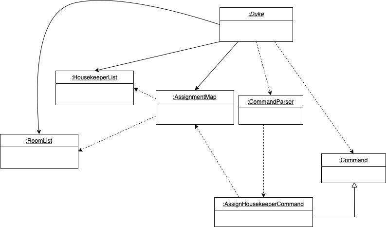
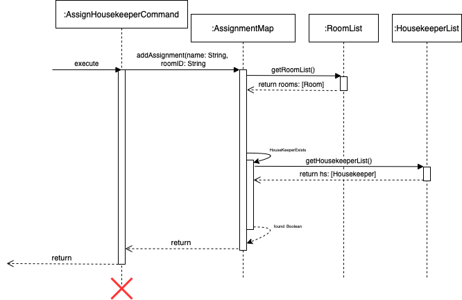

# Aiman Imtiaz - Project Portfolio Page

## Overview


I am one of the developers of Hotel Lite, a CLI application designed for hotel owners to keep track of multiple management tasks.
This application offers functionalities for keeping track of hotel inventory,
managing housekeeper staff records, recording customer satisfaction ratings,
assigning housekeepers to rooms,
adding, deleting, viewing events happening in the hotel,
and maintaining the state of checked-in/checked-out rooms.


### Summary of Contributions

My code contributions to the project can be viewed as here:

[Aiman Imtiaz - Reposense](https://nus-cs2113-ay2122s2.github.io/tp-dashboard/?search=&sort=groupTitle&sortWithin=title&timeframe=commit&mergegroup=&groupSelect=groupByRepos&breakdown=true&checkedFileTypes=docs~functional-code~test-code~other&since=2022-02-18&tabOpen=true&tabType=authorship&tabAuthor=aiman-imtiaz&tabRepo=AY2122S2-CS2113-T11-1%2Ftp%5Bmaster%5D&authorshipIsMergeGroup=false&authorshipFileTypes=docs~functional-code~test-code&authorshipIsBinaryFileTypeChecked=false)

#### Event-related functionalities

I added a suite of event-related commands in the application, allowing the user to add, delete and view events happening on the hotel premises. Events can be added using `add event DESCRIPTION / DATE` command where the `DATE` has to be in the `yyyy-mm-dd` format. I used the package `LocalDate` to accommodate the date format.

Using `LocalDate` presented a challenge while implementing the `FileManager` for `EventList`, as the our string conversion command converted a date to `mmm d yyyy` format, however while parsing lines from the file, we needed it in the `yyyy-mm-dd` format again for to be added to `EventList`. Some conversions here and there were required to work around this issue.

Another challenge while using `LocalDate` was adding a check to see whether the user used the correct format for date. I created an exception which gave out the message that the date needed to be in a certain format. In order to "catch" when I can throw this exception, I used the `try.. catch` around `LocalDate.parse()`. This way if parse did not succeed, I would be able to "catch" the case and throw an internal `HotelLiteManagerException`.

This suite allows the user to do the following:
* Create a new event happening in the hotel using `add event  DESCRIPTION / DATE` format. 
* Delete an event using `delete event INDEX`
* View all added events using `list events`.


#### Link between room-related functionalities and housekeeper-related functionalities
I added a command which links the functionalities added by my teammates __Xunyi__ and __Falicia__. The command I added to assign a houskeeper to a room is in the formal `assign NAME / ROOMID`. This required quite an interplay between my teammates code and mine. Some of the examples of this interplay are provided below:
* Every time the `assign` command is called, the housekeeper list maintained by __Falicia__ is referred to see whether a housekeeper by the given name even exists.
* The `RoomList` provided by __Xunyi__ is checked to see whether the room exists at all.
* After these checks pass, the information is stored in `AssignmentMap` which contains a `HashMap` to store which room (key) is attached to which housekeeper (value). The `AssignmentMap` class also has contributions from __Xunyi__.
* Once __Falicia__'s `delete housekeeper` command is called, I also use `AssignmentMap` to make sure that the given assignment entry is deleted from the program as well.
* The `FileManager` for `AssignmentMap` saves both the `ROOMID` and the `NAME` to ensure that correct information is restored from the files once the program is reloaded.

### General outlook
I made the greeting for our application that uses a function to print a pattern of `*`s. The size of the pattern was set at `5` rows and can be increased in the `Ui` class.

```
    *
   ***
  *****
 *******
*********
 *******
  *****
   ***
    *
Hi, I am Hotel Lite, and I will do the managing for you.
What shall we start with today?
(You may type 'help' to get a full list of commands.)
```

Incidentally, I implemented a generalised command to help the user. I collated all commands written by my teammates and me to be printed when user types `help`. It allowed me to thoroughly go through the User Guide and even test out the commands written by everyone. The `help` command returns the following message:

```
================ Noted! ===================
I am here to help!
Given below are the formats commands related to customer satisfaction:
1. add satisfaction CUSTOMER_NAME / SATISFACTION_RATING
2. view satisfactions
3. view average satisfaction
------------------------------------------
	 For commands related with housekeepers, use following formats: 
	 1. add housekeeper NAME / AGE 
	 2. availability NAME / DAY(S) 
	 3. view recorded housekeepers 
	 4. delete housekeeper NAME 
	 5. get available on DAY 
	 6. is a new week 
	 7. is a new year 
	 8. assign NAME / ROOM_NUMBER 
	 9. add performance HOUSEKEEPER_NAME / PERFORMANCE_RATING 
	 10. view performances 
------------------------------------------
For commands related with rooms, use following formats:
1. check in ROOM_NUMBER
2. check out ROOM_NUMBER
3. check room ROOM_NUMBER
4. check all room
5. check level LEVEL_NUMBER
6. check category CATEGORY
------------------------------------------
For commands related with inventory, use following formats:  
1. add item ITEM NAME / PAX
2. update item pax ITEM NAME / PAX
3. update item name OLD ITEM NAME / NEW ITEM NAME
4. delete item NAME
5. view all items
6. view items with zero pax
7. search item KEYWORD
------------------------------------------
For commands related with events happening in the hotel, use following formats:
1. add event DESCRIPTION / DATE
2. delete event INDEX
3. view events
===========================================
```
### Review Contributions

I reviewed my teammates PRs on many occasions. Some of them are linked below:

1. [https://github.com/AY2122S2-CS2113-T11-1/tp/pull/341](https://github.com/AY2122S2-CS2113-T11-1/tp/pull/341)
2. [https://github.com/AY2122S2-CS2113-T11-1/tp/pull/337](https://github.com/AY2122S2-CS2113-T11-1/tp/pull/337)
3. [https://github.com/AY2122S2-CS2113-T11-1/tp/pull/268](https://github.com/AY2122S2-CS2113-T11-1/tp/pull/268)
4. [https://github.com/AY2122S2-CS2113-T11-1/tp/pull/265](https://github.com/AY2122S2-CS2113-T11-1/tp/pull/265)
5. [https://github.com/AY2122S2-CS2113-T11-1/tp/pull/262](https://github.com/AY2122S2-CS2113-T11-1/tp/pull/262)
6. [https://github.com/AY2122S2-CS2113-T11-1/tp/pull/254](https://github.com/AY2122S2-CS2113-T11-1/tp/pull/254)
7. [https://github.com/AY2122S2-CS2113-T11-1/tp/pull/200](https://github.com/AY2122S2-CS2113-T11-1/tp/pull/200)
8. [https://github.com/AY2122S2-CS2113-T11-1/tp/pull/199](https://github.com/AY2122S2-CS2113-T11-1/tp/pull/199)
9. [https://github.com/AY2122S2-CS2113-T11-1/tp/pull/198](https://github.com/AY2122S2-CS2113-T11-1/tp/pull/198)
10. [https://github.com/AY2122S2-CS2113-T11-1/tp/pull/195](https://github.com/AY2122S2-CS2113-T11-1/tp/pull/195)
11. [https://github.com/AY2122S2-CS2113-T11-1/tp/pull/156](https://github.com/AY2122S2-CS2113-T11-1/tp/pull/156)
12. [https://github.com/AY2122S2-CS2113-T11-1/tp/pull/140](https://github.com/AY2122S2-CS2113-T11-1/tp/pull/140)
13. [https://github.com/AY2122S2-CS2113-T11-1/tp/pull/103](https://github.com/AY2122S2-CS2113-T11-1/tp/pull/103)
14. [https://github.com/AY2122S2-CS2113-T11-1/tp/pull/98](https://github.com/AY2122S2-CS2113-T11-1/tp/pull/98)

I made sure that all PRs by my teammates were added to the correct milestone and assigned to the correct person, such that their work would be detected and recognised.

### Contributions to the Developer Guide (Extracts)

#### Assign a housekeeper to a room
The assignment of housekeeper to a room is facilitated by `AssignHousekeeperCommand`. This command objects uses `AssignmentMap`, which keeps a `HashMap`, to help us map a `Room` object to a `Housekeeper` object.

``
Map<Room, Housekeeper> map = new HashMap<>();
``

The following steps exhibit how `AssignHousekeeperCommand`
and `AssignmentMap` fit together in the structure and how the mechanism for adding an assignment behaves at each step.

__Step 1.__ The user launches the application. In the `Duke` class, an empty instance of the `AssignmentMap` class,
called `assignmentMap`, is created.


__Step 2.__ The user types the command `assign susan / 301`. In the `Duke` class, a `Command` object
is created by invoking the `CommandParser` class's constructor on the user input. The details of this
step are further described below.


__Step 3.__ The `CommandParser` class replaces the `assign susan / 301` in the user input with an empty string,
leaving just `susan / 301`. Then, an instance of `AssignHousekeeperCommand` is created which extends the class `Command`.


__Step 4.__ The `assignHousekeeperCommand` object parses the name of the housekeeper and the ID of the room and send both to the the `assignmentMap`.


__Step 5.__ The `assignmentMap` looks for the appropriate `Room` object for `301` in the `RoomList` and then looks for the appropriate `Housekeeper` object for `Susan`. It then adds both to the hashmap contained inside itself.



__Interaction__ To understand the interaction between objects of these classes in order to actually add an entry into the hash map inside an `AssignmentMap`, refer to the sequence diagram below.



The command object passes on the ID of the room and the name of the housekeeper to the `AssignmentMap` object after parsing the input appropriately. The `addAssignment` function first locates the appropriate `Room` object from `RoomList`, and then looks for the `Housekeeper` object in the `HousekeeperList` and finally adds the mapping to the hash map.

## Manual Testing
#### Assign Housekeeper
* The format of the command is `assign NAME / ROOMID`.
* Prerequisites:
    - the housekeeper with this `NAME` should already exist in the system.
    - the room with this `ROOMID` should already exist in the system.

| **Test Case** | **Command** | **Expected Result** |
|:-------------:|:-------------|:-------------------|
| Assign `Susan` to room `301` |`assign susan / 301`  | Registers the assignment|
| Assign housekeeper that does not exist |`assign james / 301`  | Error message to the user|
| Add `susan` to invalid room  | `assign susan / 90` | Error message to the user|
| Add `susan` to non-integer room id | `assign susan / ioduf`  | Error message to the user|
| Fail to separate fields | `assign susan 301`  | Error message to the user|

### Event Related Functions
#### Add Event
* The format of the command is `add event DESCRIPTION / DATE`.
* Prerequisites:
    - date should be in `yyyy-mm-dd` format.
    - the description should only contain alphanumeric characters.
    - the event should not already exist in the system.

| **Test Case** | **Command** | **Expected Result** |
|:-------------:|:-------------|:-------------------|
| Add event `study` on 19 Nov 2022 |`add event study / 2022-11-19`  | Adds the event|
| Add event `study` with no date |`add event study`  | Error message to the user|
| Add event `st*&udy` |`add event st*&udy / 2022-11-21`  | Error message to the user|
| Add duplicate event | `add event study / 2022-11-19`  | Error message to the user|
| Add extra fields to the command | `add event submit TP / 2022-04-11 / blah`  | Error message to the user|
| Fail to separate fields | `add event submit TP 2022-04-11`  | Error message to the user|

#### Delete Event
* The format of the command is `delete event INDEX`.
* Prerequisites:
    - index should be an integer.
    - the event should exist in the system.

| **Test Case** | **Command** | **Expected Result** |
|:-------------:|:-------------|:-------------------|
| Delete event `study` from the list |`delete event 1`  | Deletes the event|
| Delete event with index out of bounds |`delete event 6`  | Error message to the user|
| Delete event with non-integer index |`delete event sf`  | Error message to the user|
| Delete event with no index |`delete event`  | Error message to the user|

## Product scope
### Target user profile


This application is designed for __hotel managers__ who:
* have a need to manage inventory of items in the hotel
* have a need to store and view the events happening in the hotel
* have a need to view and record the status of rooms (whether they've been checked into or checked out of)
* need to keep track of the information related to their housekeeping staff, including their available hours
  and performance ratings
* like to keep track of customer ratings
* prefer desktop apps over other types
* can type fast
* prefers typing to mouse interactions
* is reasonably comfortable using CLI apps

