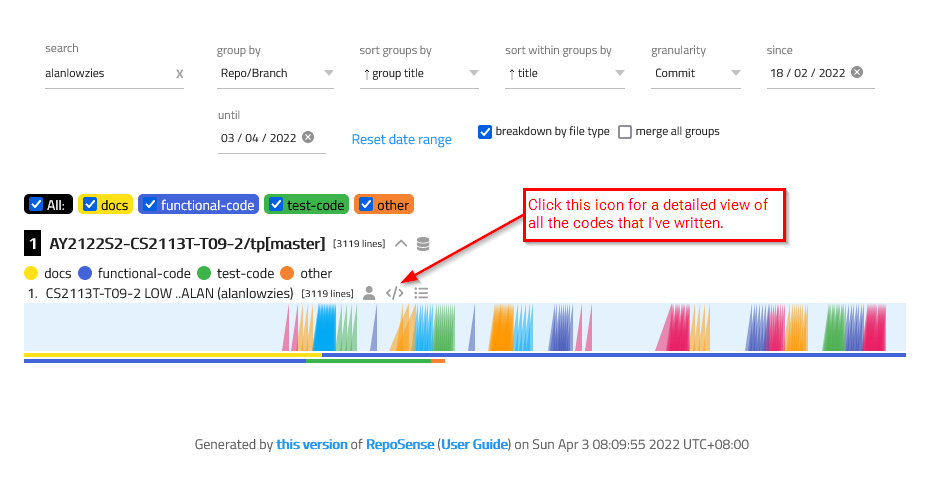
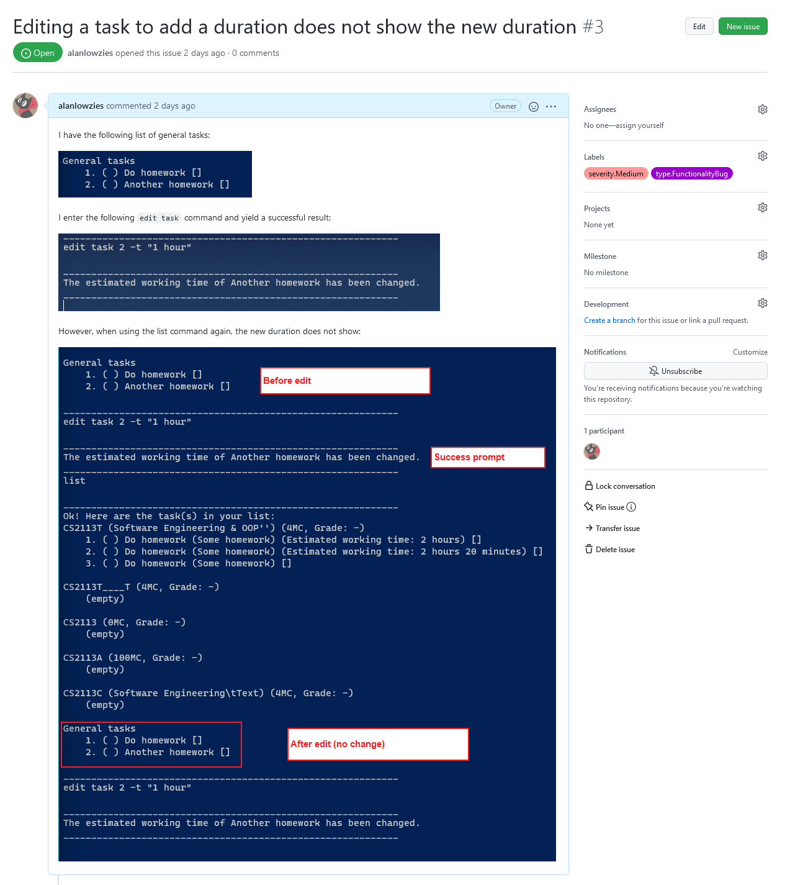

# Project Portfolio Page of Alan Low (alanlowzies)

## Overview
This page showcases my contributions to the development of WerkIt!, a team project (tP) in the CS2113T 
Software Engineering & Object-Oriented Programming module offered by the School of Computing, National University of 
Singapore.

### About the Project
WerkIt! is a command line interface (CLI) application written in Java that allows users to create a weekly workout 
schedule for them to refer to and follow. More details about the project can be found in the following locations:
* [GitHub Repository](../../)
* [WerkIt! User Guide](../UserGuide.md)
* [WerkIt! Developer Guide](../DeveloperGuide.md)

---

## Summary of Contributions
### Code Contributed
A detailed report of my code contributions to the tP can be found in the [tP Code Dashboard](https://nus-cs2113-ay2122s2.github.io/tp-dashboard/?search=alanlowzies&breakdown=true) 
hosted by the module coordinators of CS2113T.

A summary of my code contributions are as follows:
- Wrote most of the `FileManager` API, which allows WerkIt! to read and write application data
into text files stored on the user's local filesystem 
([[WIP] Developer Guide]()). 
- Implemented the functionality for users to create a new workout 
([User Guide](../UserGuide.md#create-a-workout-workout-new) | [Developer Guide](../DeveloperGuide.md#create-new-workout)).
- Wrote most of the `UI` API, which contains UI-related elements, including WerkIt!'s banner logo and response messages.
- Wrote most of the `WerkIt` API, which contains the code to start up WerkIt!, load its components, load saved file data
  (if any), and finally receive and process user inputs until the user exits the program.
- Wrote parts the `Parser` API, which parses user inputs into the appropriate `Command` class types as well
  as check for invalid characters in the user inputs ([Developer Guide](../DeveloperGuide.md#parsing-user-input-and-getting-the-right-command)).
- Implemented the HashMap data structure in the `WorkoutList` API to allow `PlanList` to reference
  workouts created by the user ([Developer Guide](../DeveloperGuide.md#design-considerations-for-creating-a-new-workout)).
- Wrote the `LogHandler` API, which allows the various components in WerkIt! to log into a file
  stored in the user's local filesystem ([[WIP] Developer Guide]()).
- Wrote the `Command` abstract class, which is a template class that sets out the main structure of all types
  of commands in WerkIt! (e.g. `WorkoutCommand`, `ExerciseCommand`, etc.)
- Wrote most of the `WorkoutCommand` API, which contains a workout-related command that the user has requested
  WerkIt! to carry out.
- Wrote some of the exception APIs for WerkIt!, including `InvalidWorkoutException`, `InvalidExerciseException`, and
  `UnknownFileException`.
- Contributed to the `ExerciseList` API, which is mainly done by my team member Haofeng, by adding
  additional functionality to the API such as populating the `exercise.txt` file with default exercises. The exercises
  were thought of by Haofeng :)
- Wrote JUnit test cases for WerkIt! APIs including (but not limited to) `WorkoutCommand`, `FileManager`, `Parser`, etc.
- Wrote JavaDocs for most of the classes and methods that I have created.
- Created skeleton codes and packages for the project.

### Enhancements Implemented
- (Developer and User Guides) Replaced Markdown quote blocks with custom CSS boxes for informational and warning boxes.
    **Sample:** 
:warning: This is an example of a warning box. Contains advice or instructions that users
should take note of to avoid issues in the application.
:memo: This is an example of an information box. Contains information that may be useful for
the users.
- (Developer and User Guides) Inserted 'buttons' throughout the guides to allow users to click and navigate back to the
  guides' tables of contents for easier navigation. 
    **Demo:** 
  

### Contributions to the User Guide (UG)
- Wrote the guide on [creating a new workout](../UserGuide.md#create-a-workout-workout-new).
- Wrote the informational section on [WerkIt!'s local storage structure](../UserGuide.md#werkits-local-storage-information).
- Wrote the [Quick Start Guide](../UserGuide.md#quick-start-guide) section, which guides the user on the necessary
prerequisites to download and the steps to get it running on the user's computer.
  - Includes a list of recommended OSes, their versions, and the terminals to use for each OS.
- Wrote the [frequently asked questions](../UserGuide.md#frequently-asked-questions-faq) section.

### Contributions to the Developer Guide (DG)
- Wrote the following contributions to the ['Implementation'](../DeveloperGuide.md#implementation) section:
    - How WerkIt! repeatedly waits and receives user inputs ([link to part](../DeveloperGuide.md#getting-user-input-continuously)).
    - How WerkIt! parses user inputs and determines the appropriate procedures to take 
      ([link to part](../DeveloperGuide.md#parsing-user-input-and-getting-the-right-command)).
    - How WerkIt! processes and creates a new workout when requested by the user
      ([link to part](../DeveloperGuide.md#create-new-workout)).
      - Includes sequence diagrams to visualise the process.
    - Most of the section on [File Management](../DeveloperGuide.md#file-management).
- Wrote the 'Design - Storage Component' section ([link to part](../DeveloperGuide.md#storage-component)).
- Wrote the instructions on 
[how to set up the development environment](../DeveloperGuide.md#setting-up-your-development-environment).
- Wrote the following ['Instructions for Manual Testing'](../DeveloperGuide.md#instructions-for-manual-testing):
  - [Creating workouts](../DeveloperGuide.md#creating-a-new-workout)
  - [Data saving](../DeveloperGuide.md#test-on-data-saving)
- Wrote the [target user profile](../DeveloperGuide.md#target-user-profile) of WerkIt!
- Wrote the [value proposition](../DeveloperGuide.md#value-proposition) of WerkIt!
- Wrote part of the [glossary](../DeveloperGuide.md#glossary)
- Wrote the [table of contents](../DeveloperGuide.md#table-of-contents).

### Contributions to Team-Based Tasks
- Set up the team's organisation and repository on GitHub
- Set up and maintained the team's Google Drive folder, which includes the team's project notebook
and other documents for the co-requsuite module CS2101 Effective Communication for Computing Professionals.
- Helped to maintain the team's GitHub repository issue tracker.

### Review/Mentoring Contributions
- Reviewed fellow team members' pull requests (PRs), including (but not limited to):
  - [PR #71 - Add logging and assertion for update workout](https://github.com/AY2122S2-CS2113T-T09-2/tp/pull/71#pullrequestreview-910244404)
  - [PR #97 - Add Create Plan Feature](https://github.com/AY2122S2-CS2113T-T09-2/tp/pull/97#pullrequestreview-914977219)
  - [PR #123 - Branch search workout](https://github.com/AY2122S2-CS2113T-T09-2/tp/pull/123#pullrequestreview-919593971)
  - [PR #134 - Improve delete workout](https://github.com/AY2122S2-CS2113T-T09-2/tp/pull/134#pullrequestreview-920276634)
  - [PR #218 - Branch file bug](https://github.com/AY2122S2-CS2113T-T09-2/tp/pull/218#pullrequestreview-929510891)

### Contributions Beyond the Project Team
- Provided feedback and potential bug reports to another team's project (CS2113T-T10-3's Mod Happy) as part
of the Practical Exam Dry-Run (PED).
  **Screenshot of One of the Bug Reports Given** 
  ([Link to the issue on GitHub](https://github.com/alanlowzies/ped/issues/3))

---

## Reflections on the Team Project (tP)
