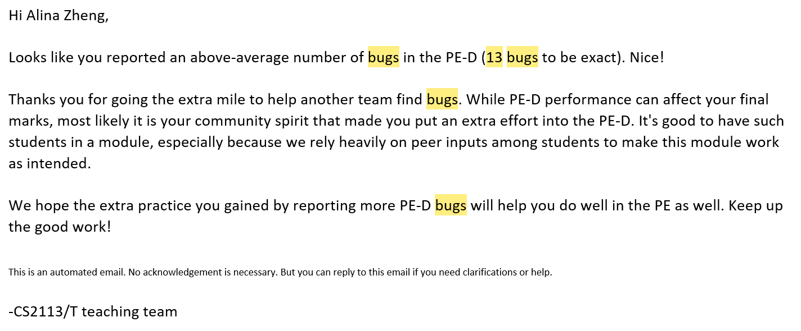

# Alina Zheng - Project Portfolio Page

## Overview
I was one of the developers of Hotel Lite, an application to help hotel managers easily
manage their businesses. This application offers functionalities for keeping track of hotel inventory,
managing housekeeper staff records, recording customer satisfaction ratings,
assigning housekeepers to rooms, adding, deleting, viewing events happening in the hotel,
and maintaining the state of checked-in/checked-out rooms.

### Summary of Contributions
#### Code contributed
[Alina Zheng: tP code dashboard](https://nus-cs2113-ay2122s2.github.io/tp-dashboard/?search=zhenster&breakdown=true&sort=groupTitle&sortWithin=title&since=2022-02-18&timeframe=commit&mergegroup=&groupSelect=groupByRepos&checkedFileTypes=docs~functional-code~test-code~other)
 
**New feature** Implemented functionality for managing customer satisfaction ratings, including adding, 
viewing, and calculating the average ratings.
 
 
The customer satisfaction ratings required the implementation of the following classes: a `Satisfaction` object 
representing a single customer satisfaction rating, and a `SatisfactionList` which stored the list of Satisfactions. 
The `AddSatisfactionCommand` class parses the user's input when they invoke the "add satisfaction" command, turns that 
input into a `Satisfaction` object, and adds the `Satisfaction` object to the `SatisfactionList`. When parsing user
input, I considered the following edge cases/possible user errors. 
* User inputs empty customer name and/or empty satisfaction value.
* User inputs customer name with non-alphabetical characters. We assume that names only contain alphabetical characters
and spaces. 
* User inputs an invalid satisfaction value (i.e. not an integer between 1 and 5, inclusive). We assume that
satisfaction ratings follow the conventional "5 star" rating system.
* User fails to include the "/" delimiter separating the customer's name from their satisfaction value. 
* User includes too many "/" delimiters in their command. 
* User types in duplicate commands, i.e. "add satisfaction add satisfaction Bob / 5".

Specific exception classes (that inherited from the parent exception class, `HotelLiteManagerException`) were created 
for most of the edge cases above. One edge case that did not have a specific corresponding exception class was the 
"too many '/' delimiters" case, which corresponded to the more general `InvalidCommandException` class.
 
 
The user may view all the satisfactions they've recorded with the "view satisfactions" command (implemented via 
the `ViewSatisfactionsCommand` class). The user can also calculate the average customer satisfaction, 
which is implemented via the `AverageSatisfactionCommand` class. 
 
 
**New feature**: Implemented functionality for managing housekeeper performance ratings, including adding and
viewing ratings. The housekeeper performance ratings were implemented similarly to the customer satisfaction ratings. 
Like the `Satisfaction`, `SatisfactionList`, and `AddSatisfactionCommand` classes, I created the 
`HousekeeperPerformance`, `HousekeeperPerformanceList`, and `AddHousekeeperPerformanceCommand` classes. 
A `HousekeeperPerformance` object contains the housekeeper's name and their corresponding performance rating, (like
how a `Satisfaction` object contains the customer's name and their satisfaction rating), so 
the structure of the "add performance" command is very similar to that of the "add satisfaction" command. 
As such, the edge cases for the "add satisfaction" command listed above are very similar to those implemented
for the "add performance" command as well. The additional special edge case for "add performance" was checking whether 
the housekeeper for which the user wants to add a rating for is in `HousekeeperList`; the user should not be able 
to record a performance for a housekeeper that does not exist in the records. 
 
 
Additionally, the "view performances" command (implemented via the `ViewHousekeeperPerformanceCommand` class)
allows the user to view all housekeeper performances, respectively, that they've recorded so
far. The housekeeper performances are sorted from highest to lowest rating. This helps the hotel 
manager easily distinguish the highest- and lowest-performing housekeepers. 
 
 
**New Feature**: Satisfactions and housekeeper performance ratings are automatically saved. This behavior is 
implemented through the `SatisfactionListFileManager` and `HousekeeperPerformanceFileManager` classes. 

#### Contributions to the UG
I wrote the instructions for the "Adding a customer satisfaction: `add satifaction`",
"View all customer satisfactions: `view satisfactions`", "Calculate average satisfaction: `average satisfaction`",
"Adding a housekeeper's performance: `add performance`", and "View all housekeeper performances: `view performances`"
sections.
#### Contributions to the DG
I wrote the documentation for how the `Add Satisfaction` command is executed (under the "Adding a customer's 
satisfaction rating" section. 
#### Contributions to team-based tasks
I helped maintain the issue tracker and also wrote the "Introduction" section of the User Guide. 
#### Reviewing/mentoring contributions
I often reviewed and approved the pull requests of other members of my team. Below is a list of these pull requests. 
* [Update room vacancy](https://github.com/AY2122S2-CS2113-T11-1/tp/pull/32)
* [View room by category](https://github.com/AY2122S2-CS2113-T11-1/tp/pull/36)
* [View room vacancy](https://github.com/AY2122S2-CS2113-T11-1/tp/pull/37)
* [fixes #84](https://github.com/AY2122S2-CS2113-T11-1/tp/pull/89)
* [Developer Guide - Aiman Imtiaz](https://github.com/AY2122S2-CS2113-T11-1/tp/pull/99)
* [transparent images issue resolved in DG](https://github.com/AY2122S2-CS2113-T11-1/tp/pull/101)
* [Zxy dg](https://github.com/AY2122S2-CS2113-T11-1/tp/pull/106)
* [Add reset availability function](https://github.com/AY2122S2-CS2113-T11-1/tp/pull/136)
* [fixes #172, fixes #173](https://github.com/AY2122S2-CS2113-T11-1/tp/pull/174)
* [Delete assignment](https://github.com/AY2122S2-CS2113-T11-1/tp/pull/178)
* [Add javadoc 3](https://github.com/AY2122S2-CS2113-T11-1/tp/pull/204)
* [Faliciaong fix slashes](https://github.com/AY2122S2-CS2113-T11-1/tp/pull/224)
* [Handling the case for no description in add event command](https://github.com/AY2122S2-CS2113-T11-1/tp/pull/232)
* [Bug fix](https://github.com/AY2122S2-CS2113-T11-1/tp/pull/326)
* [Update code to implement the item name constraint and add it in the UG](https://github.com/AY2122S2-CS2113-T11-1/tp/pull/330) 

During team meetings, I participated in the tasks at hand, whether it was brainstorming, bug-fixing, or resolving 
conflicting files. When not in meetings, 
#### Contributions beyond the project team 
During the practical exam dry run, I reported 13 bugs in another team's project, which I was later
informed was an above-average number of bugs. Indeed, I did try to be as thorough as possible, and I tried to 
think of as many edge cases and user errors as I could. My own project team was quite thorough in our implementation
of edge cases, and I wanted to make sure that other teams thought of the same possibilities for user error. 
